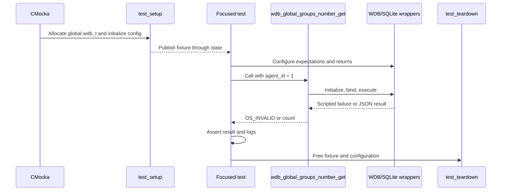
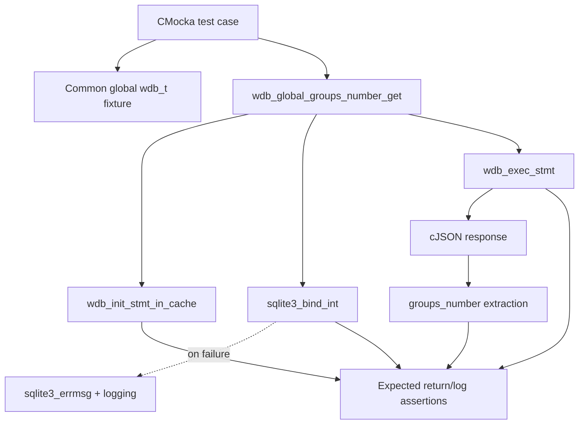

# `groups_number_get_tests`

## Introduction

`groups_number_get_tests` documents the focused CMocka coverage for `wdb_global_groups_number_get()`. This Wazuh DB operation retrieves the number of groups currently assigned to a single agent from the global SQLite database. The test module verifies the database statement lifecycle, agent-ID binding, error propagation, and extraction of the `groups_number` value from the JSON result.

The tests are implemented in [`test_wdb_global.c`](../../src/unit_tests/wazuh_db/test_wdb_global.c), alongside the broader agent, group, synchronization, and backup test cases. Shared fixture and wrapper conventions are described in [`test_wdb_global_test_infrastructure`](test_wdb_global_test_infrastructure.md), while the complete parent suite is described in [`test_wdb_global`](test_wdb_global.md).

## Position in the system

The operation belongs to the global-database portion of the `wazuh-db` daemon. It is used by higher-level group-management routines—especially group-limit validation—to determine whether assigning additional groups would exceed the configured maximum. The production architecture and external callers are documented in [`wazuh_db_global`](wazuh_db_global.md).

```mermaid
flowchart LR
    Caller[Group-management caller] --> Impl[wdb_global_groups_number_get]
    Impl --> Stmt[Cached prepared statement\nWDB_STMT_GLOBAL_AGENT_GROUPS_NUMBER_GET]
    Stmt --> DB[(global.db)]
    DB --> Json[cJSON array\n{"groups_number": N}]
    Json --> Impl
    Impl --> Count[Integer group count]

    Tests[groups_number_get_tests] -. invokes and asserts .-> Impl
    Tests -. scripts .-> Stmt
    Tests -. supplies .-> Json
```

The test module does not exercise the caller’s policy decision or the SQL text itself. It verifies the observable contract at the `wdb_global_groups_number_get()` boundary.

## Function contract

At a behavioral level, `wdb_global_groups_number_get(wdb, agent_id)` performs the following steps:

1. Initialize or retrieve the cached statement identified by `WDB_STMT_GLOBAL_AGENT_GROUPS_NUMBER_GET`.
2. Bind `agent_id` to SQLite parameter 1.
3. Execute the statement through `wdb_exec_stmt()`.
4. Read the `groups_number` property from the returned JSON array.
5. Delete the temporary cJSON response and return the integer count.

Failure at statement initialization, binding, or execution returns `OS_INVALID`. A successful query containing `{"groups_number":100}` returns `100`.

```mermaid
flowchart TD
    Start([wdb_global_groups_number_get(wdb, agent_id)]) --> Init{Initialize cached statement?}
    Init -- no --> InitErr[Return OS_INVALID]
    Init -- yes --> Bind[sqlite3_bind_int(parameter 1, agent_id)]
    Bind --> Bound{Bind succeeds?}
    Bound -- no --> BindErr[Log SQLite error\nReturn OS_INVALID]
    Bound -- yes --> Exec[wdb_exec_stmt]
    Exec --> Executed{JSON response returned?}
    Executed -- no --> ExecErr[Log execution error\nReturn OS_INVALID]
    Executed -- yes --> Parse[Read groups_number]
    Parse --> Cleanup[Delete cJSON response]
    Cleanup --> Return([Return count])
```

The exact SQL query and database schema remain production concerns; see [`wazuh_db_global`](wazuh_db_global.md) and [`wazuh_db_engine`](wazuh_db_engine.md) rather than duplicating them here.

## Test fixture and isolation

Each case uses `cmocka_unit_test_setup_teardown` with the common `test_setup` and `test_teardown` functions from `test_wdb_global.c`.

The setup creates a minimal `test_struct_t` containing:

- A synthetic `wdb_t` with database identifier `"global"`.
- Storage for a synthetic `sqlite3 *` member; no real SQLite connection is opened.
- A shared output buffer used by other tests in the source file.
- Initialized Wazuh DB configuration.

The teardown releases the fixture allocations and calls `wdb_free_conf()`. All database results and failures are deterministic values supplied by linker-wrapped functions.



See [`test_wdb_global_test_infrastructure`](test_wdb_global_test_infrastructure.md) for the reusable fixture lifecycle and wrapper behavior.

## Components and dependencies

| Component | Role |
|---|---|
| `test_wdb_global.c` | Defines and registers the four focused test cases. |
| `wdb_global_groups_number_get()` | Production operation under test. |
| `wdb.h` | Declares the Wazuh DB types, statement identifier, and return constants. |
| `wdb_init_stmt_in_cache` wrapper | Controls prepared-statement initialization and simulates an unavailable statement. |
| `sqlite3_bind_int` wrapper | Verifies parameter position 1 and the supplied agent ID; simulates binding failure. |
| `wdb_exec_stmt` wrapper | Supplies the JSON response or simulates query execution failure. |
| `sqlite3_errmsg` wrapper | Supplies deterministic SQLite error text for assertions. |
| cJSON | Represents the query response and is deleted by the production function on success. |
| CMocka | Records wrapper expectations and checks return values/log messages. |



## Test scenarios

| Test case | Stimulated condition | Expected behavior |
|---|---|---|
| `test_wdb_global_groups_number_get_stmt_error` | `wdb_init_stmt_in_cache()` returns `NULL` for `WDB_STMT_GLOBAL_AGENT_GROUPS_NUMBER_GET`. | Returns `OS_INVALID`; no bind or execution is attempted. |
| `test_wdb_global_groups_number_get_bind_fail` | Statement exists, but `sqlite3_bind_int()` for parameter 1 returns `SQLITE_ERROR`. | Supplies `ERROR MESSAGE`, expects `DB(global) sqlite3_bind_int(): ERROR MESSAGE`, and returns `OS_INVALID`. |
| `test_wdb_global_groups_number_get_exec_fail` | Binding succeeds, but `wdb_exec_stmt()` returns `NULL`. | Supplies `ERROR MESSAGE`, expects `wdb_exec_stmt(): ERROR MESSAGE`, and returns `OS_INVALID`. |
| `test_wdb_global_groups_number_get_success` | Binding succeeds and execution returns `[{"groups_number":100}]`. | Deletes the cJSON result and returns the integer `100`. |

The cases deliberately fail at one pipeline boundary at a time. This confirms short-circuit behavior and ensures that later operations are not attempted after an earlier database failure.

## Interaction flow

```mermaid
sequenceDiagram
    participant T as Test
    participant G as wdb_global_groups_number_get
    participant I as wdb_init_stmt_in_cache
    participant B as sqlite3_bind_int
    participant E as wdb_exec_stmt
    participant J as cJSON

    T->>G: agent_id = 1
    G->>I: WDB_STMT_GLOBAL_AGENT_GROUPS_NUMBER_GET
    I-->>G: sqlite3_stmt* / NULL
    alt statement initialization fails
        G-->>T: OS_INVALID
    else statement available
        G->>B: parameter 1 = 1
        B-->>G: SQLITE_OK / SQLITE_ERROR
        alt bind fails
            G-->>T: Log SQLite error; OS_INVALID
        else bind succeeds
            G->>E: Execute statement
            E-->>G: cJSON result / NULL
            alt execution fails
                G-->>T: Log execution error; OS_INVALID
            else execution succeeds
                G->>J: Read groups_number
                G->>J: Delete temporary response
                G-->>T: 100
            end
        end
    end
```

## Assertions and maintenance guidance

The tests capture these stable expectations:

- The statement identifier is `WDB_STMT_GLOBAL_AGENT_GROUPS_NUMBER_GET`.
- The agent ID is bound as SQLite parameter 1.
- Binding errors identify the `global` database and preserve SQLite’s error text.
- Execution errors are reported through the `wdb_exec_stmt()` diagnostic.
- Successful responses expose the `groups_number` field as the returned integer.

When changing the production implementation:

- Update the statement expectation if the statement-cache identifier changes.
- Update the bind expectation if the SQL parameter order changes.
- Preserve failure tests for initialization, binding, and execution so each boundary remains covered.
- Add response-shape tests if the JSON schema or fallback behavior changes.
- Keep group-limit policy tests in the parent [`test_wdb_global`](test_wdb_global.md) suite and document them there rather than expanding this leaf unnecessarily.

## Related documentation

- [`test_wdb_global`](test_wdb_global.md) — complete CMocka coverage for `wdb_global.c`.
- [`test_wdb_global_test_infrastructure`](test_wdb_global_test_infrastructure.md) — shared fixture and wrapper configuration.
- [`test_wdb_global_find_group_tests`](test_wdb_global_find_group_tests.md) — neighboring focused example for a global group lookup.
- [`wazuh_db_global`](wazuh_db_global.md) — production global database architecture and group-management responsibilities.
- [`wazuh_db_engine`](wazuh_db_engine.md) — transaction, statement-cache, and execution infrastructure.
- [`wazuh_db_command_parser`](wazuh_db_command_parser.md) — command dispatch into global database operations.

## Source references

- [`src/unit_tests/wazuh_db/test_wdb_global.c`](../../src/unit_tests/wazuh_db/test_wdb_global.c)
- [`src/wazuh_db/wdb_global.c`](../../src/wazuh_db/wdb_global.c)
- [`src/wazuh_db/wdb.h`](../../src/wazuh_db/wdb.h)
