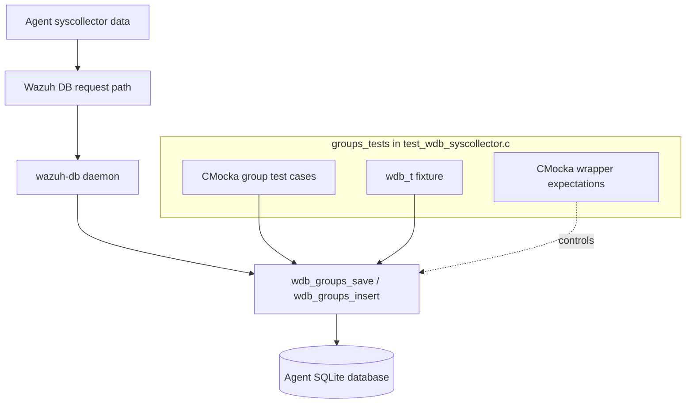
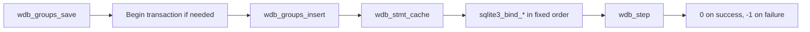
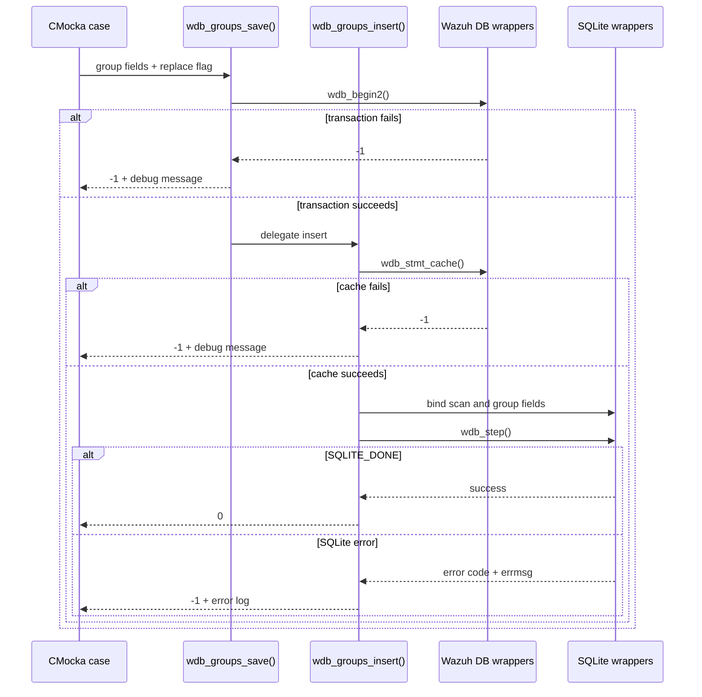
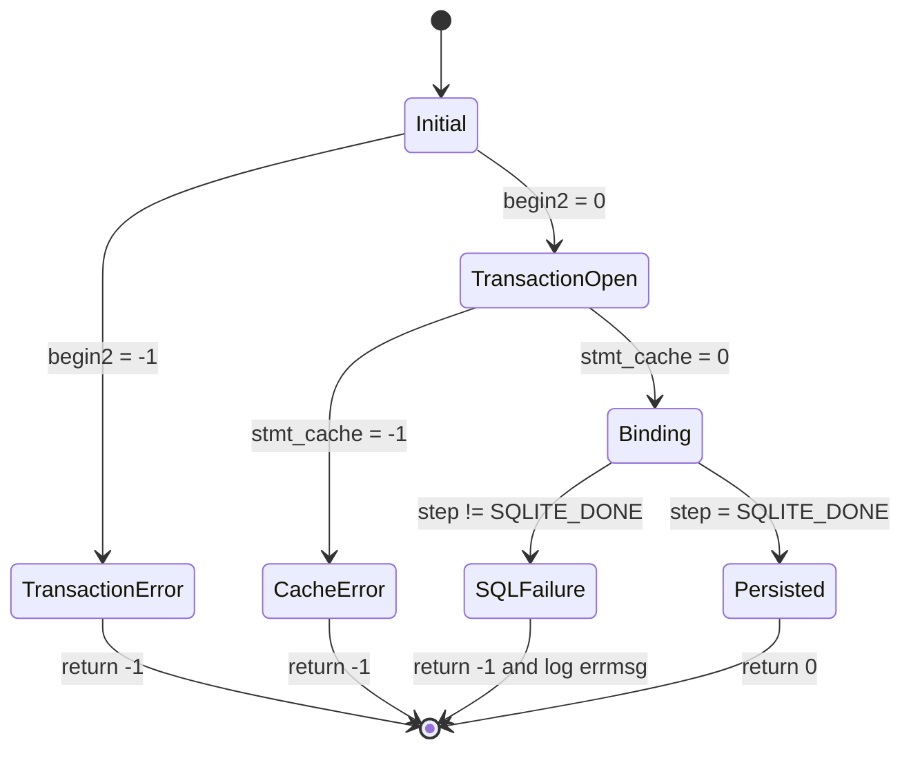
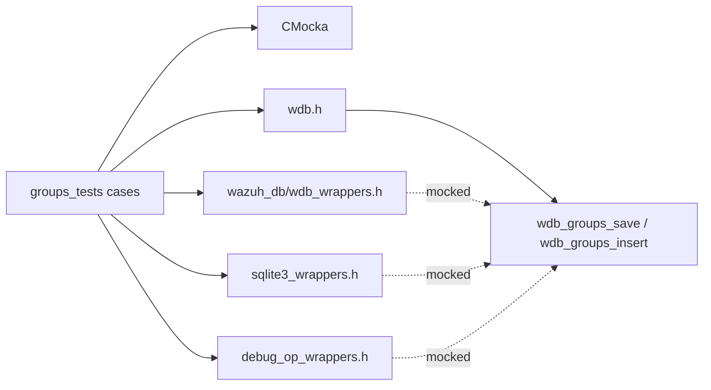

# `groups_tests`

## Introduction

`groups_tests` documents the group-inventory tests embedded in
`src/unit_tests/wazuh_db/test_wdb_syscollector.c`. The tests exercise the Wazuh DB
group persistence API, specifically `wdb_groups_save()` and `wdb_groups_insert()`.
They verify transaction startup, prepared-statement caching, ordered SQLite
parameter binding, successful insertion, and propagation of SQLite failures.

The module is a narrow view of the larger `test_wdb_syscollector.c` suite. The
complete suite-level scope, fixture implementation, and common wrapper contracts
are described in [`test_wdb_syscollector.md`](test_wdb_syscollector.md) and
[`test_wdb_syscollector_test_infrastructure.md`](test_wdb_syscollector_test_infrastructure.md).

## Position in the system

Group inventory is collected by syscollector and persisted by `wazuh-db` in an
agent's SQLite database. This test module sits below the syscollector persistence
logic and above CMocka-controlled wrapper seams; it does not open a real database
or parse production requests.



For the low-level connection, transaction, statement-cache, and SQLite engine
responsibilities, see [`wazuh_db_engine.md`](wazuh_db_engine.md). The production
syscollector persistence boundary is covered by
[`wazuh_db_fim_syscollector.md`](wazuh_db_fim_syscollector.md), when available in
the documentation set.

## Covered API and data model

The group tests use the following conceptual record:

| Field | Meaning | Test value or behavior |
|---|---|---|
| `scan_id` | Inventory scan identifier | `"scan_id"` |
| `scan_time` | Collection timestamp | `"scan_time"` |
| `group_id` | Unsigned/natural group identifier | `1` |
| `name` | Group name | `"name"` |
| `description` | Human-readable description | `"description"` |
| `group_id_signed` | Signed representation used by inventory schemas | `-1` |
| `uuid` | Group UUID | `"uuid"` |
| `is_hidden` | Visibility flag | `true` |
| `users` | Associated users or serialized membership | `"users"` |
| `checksum` | Inventory record checksum | `"checksum"` |
| `replace` | Replacement/update mode | `false` in the direct group tests |

The public operations have two layers:



`wdb_groups_save()` is the orchestration wrapper. `wdb_groups_insert()` performs
the statement-cache and binding work. The tests intentionally verify both layers:
save-level tests catch transaction and delegation failures, while insert-level
tests isolate SQL execution failure.

## Test cases

### `wdb_groups_save()`

The three registered group-save tests are:

- `test_wdb_groups_save_transaction_fail`: configures `wdb_begin2()` to fail and
  expects the diagnostic `at wdb_groups_save(): cannot begin transaction`.
- `test_wdb_groups_save_insert_fail`: starts with `transaction = 1`, makes
  `wdb_stmt_cache()` fail through the delegated insert operation, and expects
  `at wdb_groups_insert(): cannot cache statement`.
- `test_wdb_groups_save_success`: allows the transaction, verifies all ten
  parameters are bound in order, returns `SQLITE_DONE`, and expects `0`.

### `wdb_groups_insert()`

The direct insert test is:

- `test_wdb_groups_insert_sql_fail`: allows statement caching and binding, returns
  a non-success SQLite step code, supplies `"ERROR"` from `sqlite3_errmsg()`, and
  expects `wdb_groups_insert()` to return `-1` and log `SQLite: ERROR`.

The source also contains the shared fixture helpers and many neighboring
syscollector tests. Those are intentionally not duplicated here; see
[`test_wdb_syscollector_test_infrastructure.md`](test_wdb_syscollector_test_infrastructure.md)
for fixture ownership, binding policies, and test registration conventions.

## Interaction and failure flow



The group-specific test contract is therefore:



## SQLite binding contract

`test_wdb_groups_save_success` verifies the exact binding order expected by the
production insert statement:

```text
1  scan_id
2  scan_time
3  group_id              (int64)
4  name
5  description
6  group_id_signed       (int64)
7  uuid
8  hidden/visibility     (int)
9  users
10 checksum
```

Every wrapper is configured to return success. This makes the test sensitive to
argument reordering, accidental type changes, and omitted fields. The direct SQL
failure test uses the same binding contract before forcing `wdb_step()` to fail.

## Fixtures and mocking

The group cases use the minimal `test_setup`/`test_teardown` fixture. It allocates
a zeroed `wdb_t`, allowing the tests to control `transaction` and wrapper return
values without a live `sqlite3` connection. The broader file additionally defines
`setup_wdb()`/`teardown_wdb()` and typed inventory fixtures, but those are support
for the complete syscollector suite rather than unique group behavior.

Dependencies used by the group tests are:



The wrappers provide deterministic `will_return()` values and `expect_*()`
assertions. They are test seams, not alternate implementations of the database.
For their reusable design and ownership rules, refer to
[`test_wdb_syscollector_test_infrastructure.md`](test_wdb_syscollector_test_infrastructure.md).

## Result conventions and maintenance notes

- `0` / `OS_SUCCESS` means the group operation completed.
- `-1` / `OS_INVALID` means transaction setup, statement caching, or SQLite
  execution failed.
- Expected debug and error messages are part of the observable contract and should
  be updated if production diagnostics intentionally change.
- Binding positions are deliberately strict. A schema or function-signature
  change requires synchronized updates to the production statement, `wdb.h`,
  wrappers, and these expectations.

## Related documentation

- [`test_wdb_syscollector.md`](test_wdb_syscollector.md) — complete syscollector
  test-suite scope and high-level persistence flow.
- [`test_wdb_syscollector_test_infrastructure.md`](test_wdb_syscollector_test_infrastructure.md)
  — fixtures, typed records, binding helpers, and CMocka registration.
- [`wazuh_db_engine.md`](wazuh_db_engine.md) — Wazuh DB connection, transactions,
  statement caching, and SQLite engine behavior.
- [`wazuh_db_fim_syscollector.md`](wazuh_db_fim_syscollector.md) — production
  syscollector/FIM persistence integration, when present.

