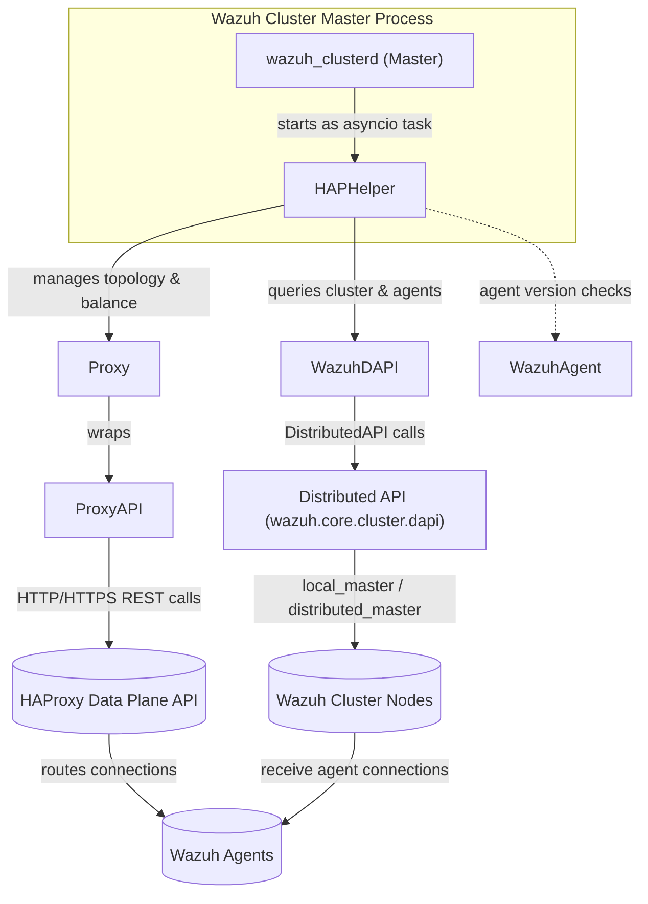
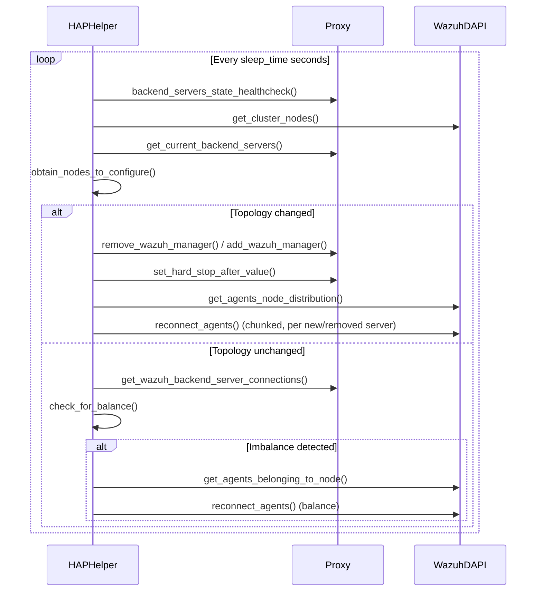
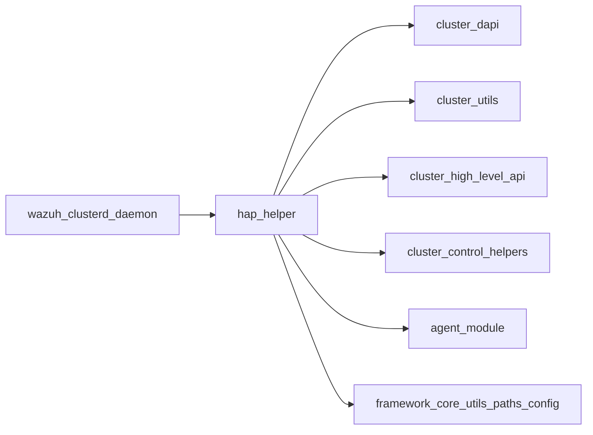

# HAP Helper Module

## 1. Introduction and Purpose

The **HAP Helper** (HAProxy Helper) is a Wazuh cluster component that automatically manages an external
[HAProxy](https://www.haproxy.org/) load balancer so that Wazuh agents are evenly distributed across the
manager nodes of a Wazuh cluster. It runs as an asynchronous background task on the cluster master node and
continuously:

- Keeps the HAProxy backend/frontend configuration in sync with the current Wazuh cluster topology (adding new
  master/worker nodes, removing nodes that have been disconnected for a configurable amount of time).
- Monitors agent connection distribution across cluster nodes and triggers agent reconnections to correct
  imbalances beyond a configurable tolerance.
- Safely migrates existing agent connections when the backend topology changes (nodes added/removed), including
  the calculation of a dynamic HAProxy `hard-stop-after` value to avoid abruptly dropping active connections.

This module is part of the broader Cluster module family — it depends heavily on the
Distributed API (DAPI) to query and act upon the Wazuh cluster, and on the HAProxy Runtime/Configuration REST
API to control the load balancer. It is typically started as a background asyncio task by the Wazuh cluster
master process (see [`wazuh_clusterd_daemon`](wazuh_clusterd_daemon.md)) when the `haproxy_helper` section is
enabled in `ossec.conf`.

## 2. Architecture Overview

The module is composed of three tightly-coupled components, each in its own file under
`framework/wazuh/core/cluster/hap_helper/`:

| Component | File | Responsibility |
|---|---|---|
| `HAPHelper` | `hap_helper.py` | Main orchestrator: initialization, main control loop, balancing logic, `hard-stop-after` calculation |
| `Proxy` / `ProxyAPI` | `proxy.py` | Abstraction over the HAProxy Data Plane REST API (backends, frontends, servers, stats, runtime settings) |
| `WazuhAgent` / `WazuhDAPI` | `wazuh.py` | Abstraction over Wazuh cluster/agent operations, implemented through calls to the Distributed API |

### High-level data flow (main control loop)

## 3. Sub-modules

The HAP Helper functionality is documented in the following focused sub-module pages:

- **[hap_helper_orchestrator.md](hap_helper_orchestrator.md)** — The `HAPHelper` class: startup/bootstrap logic
  (`start`), the main reconciliation loop (`manage_wazuh_cluster_nodes`), node topology detection
  (`obtain_nodes_to_configure`), agent balance calculation (`check_for_balance`, `balance_agents`), connection
  migration (`migrate_old_connections`, `force_agent_reconnection_to_server`), and the dynamic
  `hard-stop-after` computation (`set_hard_stop_after`).
- **[hap_helper_proxy_api.md](hap_helper_proxy_api.md)** — The `ProxyAPI` low-level HTTP client for the HAProxy
  Data Plane API and the `Proxy` higher-level wrapper used by `HAPHelper` to manage backends, frontends,
  servers and their runtime state (DRAIN/READY), plus the supporting enums (`ProxyAPIMethod`,
  `ProxyServerState`, `CommunicationProtocol`, `ProxyBalanceAlgorithm`).
- **[hap_helper_wazuh_integration.md](hap_helper_wazuh_integration.md)** — The `WazuhAgent` helper (agent version
  compatibility checks for reconnection) and `WazuhDAPI` (wrapper around Wazuh's Distributed API used to fetch
  cluster nodes, agent distribution, and trigger agent reconnections).

## 4. How it Fits into the Overall System

- **Parent module:** `cluster_module` is the overall Wazuh cluster subsystem; HAP Helper is a specialized
  helper focused solely on HAProxy-based load balancing of agent connections.
- **Depends on:**
  - [`cluster_dapi.md`](cluster_dapi.md) — `DistributedAPI` used by `WazuhDAPI` to run cluster/agent queries.
  - [`cluster_utils.md`](cluster_utils.md) — configuration constants/readers (`read_cluster_config`,
    `get_cluster_items`), the `ClusterFilter` logging filter and shared `context_tag`.
  - [`cluster_high_level_api.md`](cluster_high_level_api.md) — `wazuh.cluster.get_nodes_info` used to obtain
    cluster node names/addresses.
  - [`cluster_control_helpers.md`](cluster_control_helpers.md) — `get_system_nodes` used when requesting
    cluster node information.
  - [`agent_module_core.md`](agent_module_core.md) — `wazuh.agent.get_agents` / `reconnect_agents`, the
    framework functions actually invoked (through the DAPI) to list and reconnect agents.
  - [`framework_core_utils_paths_config.md`](framework_core_utils_paths_config.md) —
    `wazuh.core.configuration.get_ossec_conf`, used to read the configured agent connection port from
    `ossec.conf`.
- **Invoked by:** [`wazuh_clusterd_daemon.md`](wazuh_clusterd_daemon.md) — the cluster master daemon starts
  `HAPHelper.start()` as an asyncio task when the HAProxy Helper feature is enabled.

## 5. Configuration

HAP Helper is configured through the `<haproxy_helper>` section of `ossec.conf` (parsed via
`read_cluster_config` in the cluster utils module). Key parameters include HAProxy connection details
(address, port, protocol, credentials, TLS certificates), balancing tolerance, agent reconnection
chunking/timing, and the grace period before a disconnected node is removed from the backend. See
`hap_helper_orchestrator.md` for the full list of parameters consumed by `HAPHelper.start()`.
