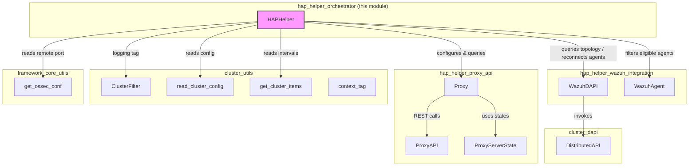
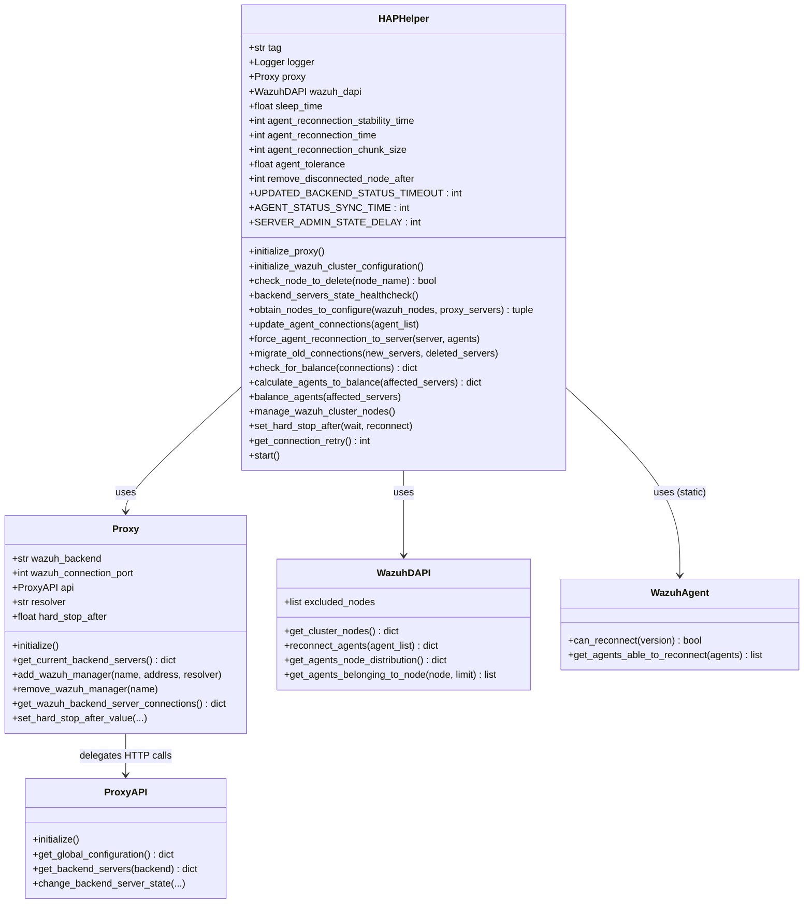
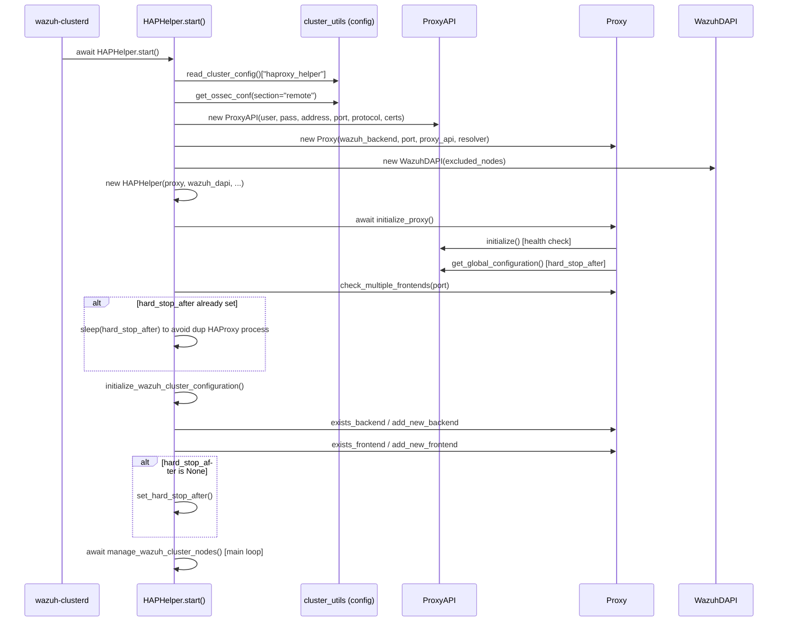
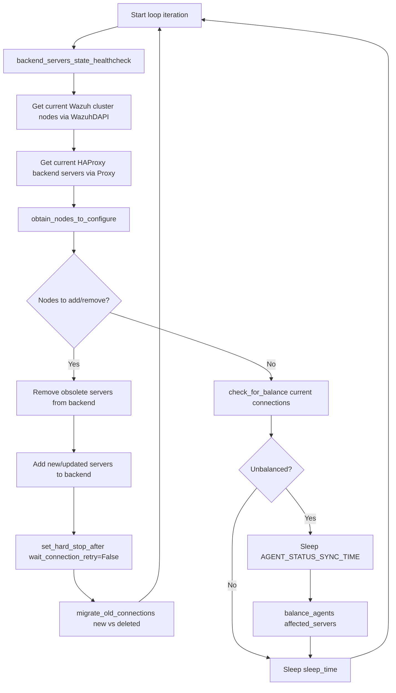
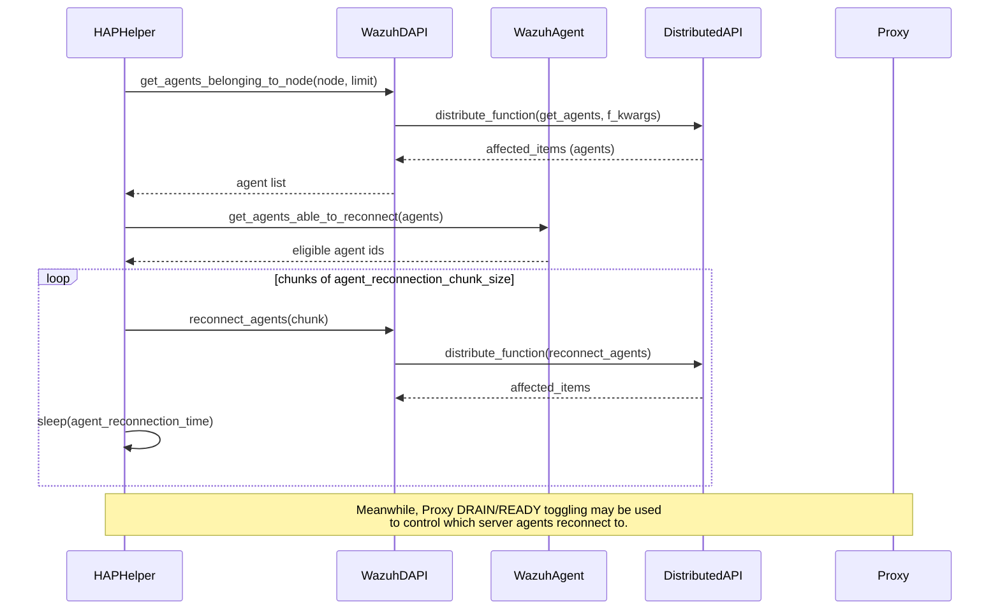

# HAP Helper Orchestrator

## Introduction

The **HAP Helper Orchestrator** module contains the `HAPHelper` class, the central orchestration engine of the Wazuh HAProxy Helper subsystem. Its purpose is to automatically keep an HAProxy load balancer in sync with the topology of a Wazuh cluster and to ensure that agent connections are evenly distributed across all available master/worker nodes.

The orchestrator continuously:

- Detects Wazuh cluster topology changes (nodes added, removed, or with changed addresses) and reflects them in the HAProxy backend configuration.
- Monitors the health of backend servers and repairs servers stuck in a `DRAIN` state.
- Calculates connection imbalances across cluster nodes and triggers agent reconnections to rebalance load.
- Manages the HAProxy `hard-stop-after` setting dynamically, based on the number of active agents, to avoid abrupt connection drops during reloads.
- Bootstraps the required HAProxy backend/frontend objects for the Wazuh cluster and starts the main supervision loop.

This module is a child of the [hap_helper](hap_helper.md) component group and depends heavily on two sibling modules for its operations:

- [hap_helper_proxy_api](hap_helper_proxy_api.md) – Low-level and high-level HAProxy Data Plane API clients (`ProxyAPI`, `Proxy`) used to inspect and mutate the HAProxy configuration/runtime state.
- [hap_helper_wazuh_integration](hap_helper_wazuh_integration.md) – Wazuh-side helpers (`WazuhDAPI`, `WazuhAgent`) used to query cluster topology, agent distribution, and trigger agent reconnections through the Distributed API.

It is a leaf/detail component under the broader [hap_helper](hap_helper.md) group, which itself belongs to the [cluster_module](cluster_module.md) subsystem documented as part of the overall Wazuh cluster management stack (see also [cluster_high_level_api](cluster_high_level_api.md), [cluster_dapi](cluster_dapi.md), and [cluster_utils](cluster_utils.md)).

## Purpose and Core Functionality

`HAPHelper` is designed to run as a long-lived asynchronous background task (typically started from `wazuh-clusterd` on the master node). Its responsibilities can be grouped into four functional areas:

1. **Bootstrap** – Initialize the connection to the HAProxy Data Plane API and ensure the Wazuh backend/frontend objects exist.
2. **Topology Reconciliation** – Continuously compare the live Wazuh cluster nodes (via `WazuhDAPI`) against the configured HAProxy backend servers (via `Proxy`), adding or removing servers as needed.
3. **Connection Balancing** – Calculate whether agent connections are unevenly distributed across nodes (within a configurable tolerance) and trigger agent reconnections in controlled chunks to rebalance them.
4. **Safety Controls** – Manage the `hard-stop-after` HAProxy setting to prevent connection storms, detect and fix servers stuck in `DRAIN` state, and safely remove nodes that have been disconnected for a sufficiently long time.

## Architecture Overview

## Class Diagram

## Component Interaction

`HAPHelper` never talks to HAProxy or Wazuh directly at the network level; it always goes through the two collaborator classes:

| Collaborator | Module | Responsibility |
|---|---|---|
| `Proxy` / `ProxyAPI` | [hap_helper_proxy_api](hap_helper_proxy_api.md) | Wraps the HAProxy Data Plane API (backends, frontends, servers, runtime state, stats, `hard-stop-after`). |
| `WazuhDAPI` | [hap_helper_wazuh_integration](hap_helper_wazuh_integration.md) | Wraps Wazuh's [Distributed API](cluster_dapi.md) (`DistributedAPI`) to fetch cluster nodes and agent distribution, and to trigger agent reconnections. |
| `WazuhAgent` | [hap_helper_wazuh_integration](hap_helper_wazuh_integration.md) | Stateless helper to determine which agent versions support the reconnection endpoint. |
| `ClusterFilter`, `read_cluster_config`, `get_cluster_items`, `context_tag` | [cluster_utils](cluster_utils.md) | Provide logging context and cluster/haproxy configuration values (`cluster.json`, `ossec.conf`). |
| `get_ossec_conf` | [framework_core_utils](framework_core_utils.md) | Reads the configured remote connection port used to talk to agents. |

## Initialization / Startup Flow

The class method `HAPHelper.start()` is the single entry point used to bootstrap and run the helper (usually invoked by `wazuh-clusterd` on the master node).

Key points:

- Certificate parameters (`HAPROXY_CERT`, `CLIENT_CERT*`) are only honored when the configured protocol is `https`; otherwise they are reset to defaults with a warning.
- The helper waits for `hard_stop_after` seconds before continuing if a previous HAProxy process is still shutting down, preventing duplicate process conflicts.
- All fatal configuration or connectivity errors during startup (`KeyError`, `WazuhHAPHelperError`) are logged, and the helper exits gracefully.

## Main Supervision Loop

The core, continuously running coroutine is `manage_wazuh_cluster_nodes()`. It performs one reconciliation/balancing pass per iteration and then sleeps for `sleep_time` seconds.

### Node Reconciliation (`obtain_nodes_to_configure`)

Compares the Wazuh cluster nodes (name → address) against the current HAProxy backend servers:

- A node present in Wazuh but missing (or with a different address) in HAProxy is scheduled to be **added** (and, if the address changed, the stale entry is scheduled to be **removed** first).
- A node present in HAProxy but absent from Wazuh's cluster is scheduled for **removal**, either immediately (if it was manually excluded via `excluded_nodes`) or after being confirmed as disconnected for longer than `remove_disconnected_node_after` minutes (`check_node_to_delete`).

### Connection Balancing (`check_for_balance` / `balance_agents`)

- `check_for_balance` computes the mean number of connections per server and flags servers exceeding `mean * (1 + agent_tolerance)` as having "exceeding" connections, unless the deltas are trivial (≤ 1 connection difference with a non-divisible agent count).
- `calculate_agents_to_balance` fetches candidate agents from each over-loaded node (filtered through `WazuhAgent.get_agents_able_to_reconnect` to skip agents whose version doesn't support the reconnection endpoint).
- `update_agent_connections` reconnects agents in configurable chunks (`agent_reconnection_chunk_size`), sleeping `agent_reconnection_time` seconds between chunks to avoid connection storms.

### Topology Change Migration (`migrate_old_connections`)

When backend servers are added/removed, the helper:

1. Waits (up to `UPDATED_BACKEND_STATUS_TIMEOUT` seconds) for all new servers to report `UP` status.
2. Computes the previous connection distribution, folding in the current distribution for nodes not part of the change.
3. Determines any already-unbalanced connections and adds them to the agents that must be moved.
4. For every deleted server, all of its agents are queued for reconnection.
5. For every remaining server, forces its exceeding agents to reconnect via `force_agent_reconnection_to_server`, which temporarily sets sibling servers to `DRAIN` to control the destination of the reconnecting agents.
6. Waits `agent_reconnection_stability_time` seconds for the cluster to stabilize.

### `hard-stop-after` Management (`set_hard_stop_after`)

To avoid abrupt connection termination during HAProxy reloads (which occur when the backend configuration changes), the helper dynamically calculates and pushes a `hard-stop-after` value based on:

- Total active agents.
- Reconnection chunk size and per-chunk delay.
- Number of cluster nodes.
- `SERVER_ADMIN_STATE_DELAY` (safety buffer for DRAIN/READY transitions).

This value is pushed to HAProxy through `Proxy.set_hard_stop_after_value`, which in turn calls the [ProxyAPI](hap_helper_proxy_api.md) global configuration endpoints.

## Data Flow: Agent Reconnection

## Error Handling

- All expected Wazuh-related failures (`WazuhException` and subclasses, including `WazuhHAPHelperError`) raised during the main loop are caught, logged, and followed by a `sleep_time` backoff before retrying — the loop never crashes on transient errors.
- Fatal configuration issues (missing keys in `cluster.json`, unreachable HAProxy API) abort `start()` with a clear log message.
- `KeyboardInterrupt` is handled silently to allow graceful shutdown (e.g., during daemon stop).
- Unexpected exceptions are logged at `critical` level with a full traceback for diagnostics.

## Configuration

`HAPHelper.start()` reads its configuration from the `haproxy_helper` section of `cluster.json` (accessed via `read_cluster_config()` in [cluster_utils](cluster_utils.md)), including:

| Key | Description |
|---|---|
| `HAPROXY_USER` / `HAPROXY_PASSWORD` | Credentials for the HAProxy Data Plane API. |
| `HAPROXY_ADDRESS` / `HAPROXY_PORT` / `HAPROXY_PROTOCOL` | Connection details for the Data Plane API. |
| `HAPROXY_CERT`, `CLIENT_CERT`, `CLIENT_CERT_KEY`, `CLIENT_CERT_PASSWORD` | TLS material, only used when `HAPROXY_PROTOCOL == "https"`. |
| `HAPROXY_BACKEND` | Name of the Wazuh backend to manage in HAProxy. |
| `HAPROXY_RESOLVER` | Optional DNS resolver name used when adding managers by hostname. |
| `EXCLUDED_NODES` | Cluster nodes to exclude from balancing/consideration. |
| `FREQUENCY` | Main loop sleep time (`sleep_time`). |
| `AGENT_RECONNECTION_STABILITY_TIME` / `AGENT_RECONNECTION_TIME` / `AGENT_CHUNK_SIZE` | Control the pace and chunking of agent reconnections. |
| `IMBALANCE_TOLERANCE` | Tolerance percentage before considering the cluster unbalanced. |
| `REMOVE_DISCONNECTED_NODE_AFTER` | Minutes a node must remain disconnected before being purged from the HAProxy backend. |

The Wazuh agent connection port is independently read from `ossec.conf`'s `<remote>` section via `get_ossec_conf` (see [framework_core_utils](framework_core_utils.md)).

## Related Documentation

- [hap_helper](hap_helper.md) – Parent grouping of the HAProxy Helper subsystem.
- [hap_helper_proxy_api](hap_helper_proxy_api.md) – HAProxy Data Plane API client details (`Proxy`, `ProxyAPI`, `ProxyServerState`, `ProxyBalanceAlgorithm`, `CommunicationProtocol`).
- [hap_helper_wazuh_integration](hap_helper_wazuh_integration.md) – Wazuh-side integration details (`WazuhDAPI`, `WazuhAgent`).
- [cluster_dapi](cluster_dapi.md) – Distributed API infrastructure used by `WazuhDAPI` to execute cluster-wide requests.
- [cluster_utils](cluster_utils.md) – Shared cluster configuration and logging utilities (`ClusterFilter`, `read_cluster_config`, `get_cluster_items`).
- [cluster_module](cluster_module.md) – Top-level cluster subsystem this module belongs to.
- [framework_core_utils](framework_core_utils.md) – Shared framework utilities, including `get_ossec_conf`.
- [wazuh_clusterd_daemon](wazuh_clusterd_daemon.md) – Daemon entry point expected to launch `HAPHelper.start()`.
