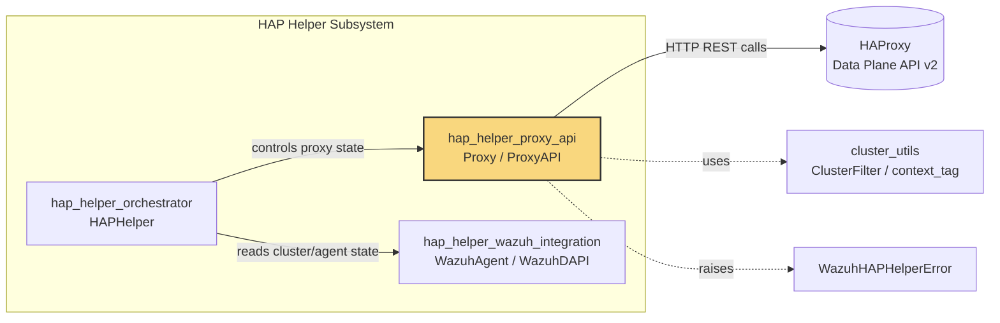
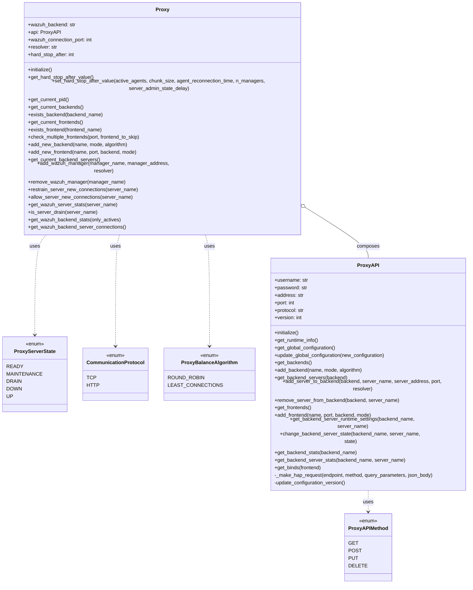
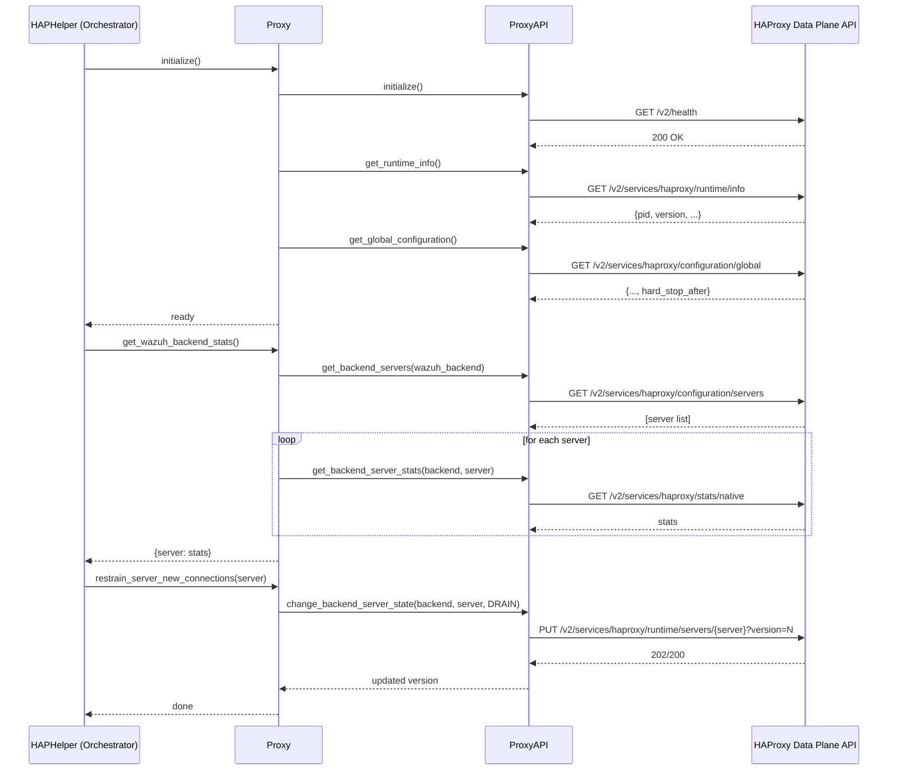
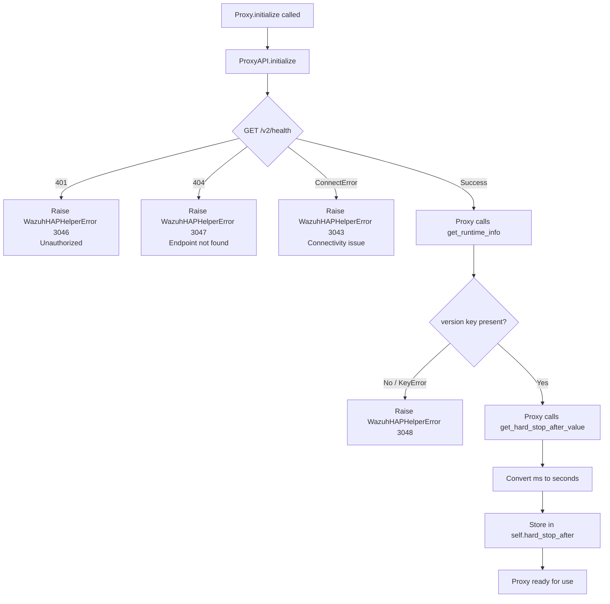

# HAP Helper Proxy API

## Introduction

The **HAP Helper Proxy API** module is the low-level abstraction layer that allows the Wazuh cluster to communicate with and control an [HAProxy](https://www.haproxy.org/) instance through its Data Plane API (v2). It is the foundational building block used by the [HAP Helper Orchestrator](hap_helper_orchestrator.md) to keep the load balancer's view of the Wazuh cluster in sync with the real state of the manager nodes (backends, frontends, servers, and their health).

This module does not make any decisions about *when* or *why* to reconfigure the proxy — that responsibility belongs to the orchestrator. Instead, it provides:

1. A thin, typed HTTP client (`ProxyAPI`) that wraps every HAProxy Data Plane API call needed by the helper (backends, frontends, servers, runtime settings, and statistics).
2. A higher-level façade (`Proxy`) that exposes Wazuh-cluster-oriented operations (add/remove manager, drain/allow connections, get server stats, calculate `hard-stop-after`, etc.) built on top of `ProxyAPI`.
3. A set of enums that model the vocabulary of the HAProxy configuration domain (HTTP methods, server states, communication protocols, and load-balancing algorithms).

Because this module encapsulates *all* direct HTTP interaction with HAProxy, it is the natural extension point if additional Data Plane API endpoints need to be supported in the future, and the natural place to look when diagnosing connectivity or authentication issues with the proxy.

---

## Position in the System

The module lives inside the broader **Wazuh Cluster** codebase, specifically under the **HAP Helper** sub-system:

```
cluster_module
└── hap_helper
    ├── hap_helper_orchestrator      (business logic / decision-making)
    ├── hap_helper_proxy_api         (THIS MODULE — HAProxy communication)
    └── hap_helper_wazuh_integration (Wazuh cluster/DAPI data source)
```

- The **Orchestrator** ([hap_helper_orchestrator.md](hap_helper_orchestrator.md)) is the only consumer of this module. It periodically compares the state reported by the [Wazuh Integration](hap_helper_wazuh_integration.md) module (real agents/managers) against the state reported by `Proxy`/`ProxyAPI`, and issues corrective calls (add server, drain server, etc.).
- The module reuses cluster-wide utilities such as `ClusterFilter` and `context_tag` from [cluster_utils](cluster_utils.md) for structured, tagged logging.
- Errors are raised using the shared `WazuhHAPHelperError` exception family, consistent with the rest of the [cluster_module](cluster_module.md) error handling strategy.



---

## Architecture

The module follows a **two-layer wrapper pattern**:

- **`ProxyAPI`** — a nearly 1:1 mapping to HAProxy Data Plane API v2 endpoints. It manages authentication, TLS/mTLS configuration, the API version handshake required by HAProxy for write operations, and JSON response handling.
- **`Proxy`** — a domain-specific façade that composes multiple `ProxyAPI` calls into meaningful cluster operations (e.g., "add a Wazuh manager" = add a server to the backend; "get backend server connections" = get stats filtered by a specific counter).



---

## Core Components

### Enumerations

| Enum | Purpose | Values |
|---|---|---|
| `ProxyAPIMethod` | HTTP verbs used for Data Plane API calls | `GET`, `POST`, `PUT`, `DELETE` |
| `ProxyServerState` | Administrative/operational state of a backend server | `READY`, `MAINTENANCE`, `DRAIN`, `DOWN`, `UP` |
| `CommunicationProtocol` | Mode configured for a backend/frontend | `TCP`, `HTTP` |
| `ProxyBalanceAlgorithm` | Load-balancing algorithm assigned to a backend | `ROUND_ROBIN`, `LEAST_CONNECTIONS` |

These enums prevent "magic string" usage throughout the orchestrator and make invalid states unrepresentable at the type level.

### `ProxyAPI`

Responsible for **all HTTP communication** with the HAProxy Data Plane API (`/v2` endpoint).

Key responsibilities:
- **Authentication & TLS**: Basic auth (username/password) plus optional HAProxy CA certificate verification and optional mTLS client certificate/key/password.
- **Version handshake**: HAProxy's Data Plane API requires each *write* request (POST/PUT/DELETE) to carry the current configuration `version` as a query parameter to avoid conflicting concurrent edits. `ProxyAPI` transparently tracks and refreshes `self.version` after every successful mutation.
- **Error normalization**: Network failures raise `WazuhHAPHelperError(3043)` or `3044`; unauthorized requests raise `3046`; missing endpoints raise `3047`; other API errors raise `3045` with the HAProxy error message embedded.
- **Endpoint coverage**:
  - Runtime info (`get_runtime_info`) — PID, version.
  - Global configuration (`get_global_configuration`, `update_global_configuration`) — used to read/write `hard-stop-after`.
  - Backends (`get_backends`, `add_backend`).
  - Backend servers (`get_backend_servers`, `add_server_to_backend`, `remove_server_from_backend`, `get_backend_server_runtime_settings`, `change_backend_server_state`).
  - Frontends and binds (`get_frontends`, `add_frontend`, `get_binds`).
  - Statistics (`get_backend_stats`, `get_backend_server_stats`).

### `Proxy`

A façade over `ProxyAPI` that speaks in **Wazuh cluster terms** rather than raw HAProxy concepts. It is the object actually instantiated and used by the [HAP Helper Orchestrator](hap_helper_orchestrator.md).

Key responsibilities:
- **Initialization & sanity check** (`initialize`): Verifies the HAProxy runtime is reachable and readable, and caches the current `hard-stop-after` value (converted from milliseconds to seconds).
- **Dynamic `hard-stop-after` tuning** (`get_hard_stop_after_value` / `set_hard_stop_after_value`): Computes a value proportional to the number of active agents, chunk size, reconnection time, and number of managers, so that graceful server shutdowns wait long enough for agents to reconnect elsewhere before forcibly closing connections.
- **Backend/Frontend discovery & management** (`get_current_backends`, `exists_backend`, `add_new_backend`, `get_current_frontends`, `exists_frontend`, `add_new_frontend`, `check_multiple_frontends`): Used by the orchestrator during first-time setup/validation of the proxy configuration.
- **Wazuh manager lifecycle** (`add_wazuh_manager`, `remove_wazuh_manager`, `get_current_backend_servers`): Keeps the backend server list synchronized with actual cluster nodes.
- **Connection draining** (`restrain_server_new_connections`, `allow_server_new_connections`, `is_server_drain`): Implements graceful maintenance workflows — a manager can be marked `DRAIN` to stop receiving new agent connections before being restarted or removed, then set back to `READY`.
- **Statistics retrieval** (`get_wazuh_server_stats`, `get_wazuh_backend_stats`, `get_wazuh_backend_server_connections`): Supplies the data the orchestrator uses to decide which manager is over/under-loaded and which agents should be redistributed.

---

## Data Flow

The typical call flow when the orchestrator wants to rebalance agents across managers:



---

## Process Flow: Initialization



---

## Error Handling

All failures surface as `WazuhHAPHelperError` with distinct codes so the orchestrator (and ultimately cluster logs/CLI) can distinguish the failure category:

| Code | Meaning | Raised From |
|---|---|---|
| 3043 | Connectivity issue reaching HAProxy | `ProxyAPI.initialize`, `_make_hap_request` |
| 3044 | Generic request error during a Data Plane API call | `ProxyAPI._make_hap_request` |
| 3045 | HAProxy returned a non-2xx / non-401 error | `ProxyAPI._make_hap_request` |
| 3046 | Authentication failure (401) | `ProxyAPI.initialize`, `_make_hap_request` |
| 3047 | Data Plane API endpoint not found (404) | `ProxyAPI.initialize` |
| 3048 | Runtime info missing expected keys during `Proxy.initialize` | `Proxy.initialize` |

---

## Configuration & Security Notes

- **TLS/mTLS support**: `ProxyAPI` accepts `haproxy_cert_file` (CA bundle or `True`/`False` to toggle verification) and an optional mutual-TLS triplet (`client_cert_file`, `client_key_file`, `client_password`) used only when `protocol == 'https'`.
- **Resolver support**: When adding a Wazuh manager (`Proxy.add_wazuh_manager`) with a DNS name (rather than a raw IP), a HAProxy `resolver` name can be supplied so HAProxy re-resolves the address periodically (`init-addr: last,libc,none`).
- **Logging**: `Proxy` attaches a `ClusterFilter` (from [cluster_utils](cluster_utils.md)) to its logger so that every log line is tagged with the current cluster context (`context_tag`), enabling consistent correlation with the rest of cluster logs.

---

## Related Documentation

- [hap_helper_orchestrator.md](hap_helper_orchestrator.md) — the `HAPHelper` class that drives all decisions using this module's `Proxy` object.
- [hap_helper_wazuh_integration.md](hap_helper_wazuh_integration.md) — supplies the "source of truth" cluster/agent data that is compared against the proxy state managed here.
- [cluster_utils.md](cluster_utils.md) — shared cluster logging utilities (`ClusterFilter`, `context_tag`) used by this module.
- [cluster_module.md](cluster_module.md) — parent module describing the overall Wazuh cluster architecture, of which HAP Helper is one component.
