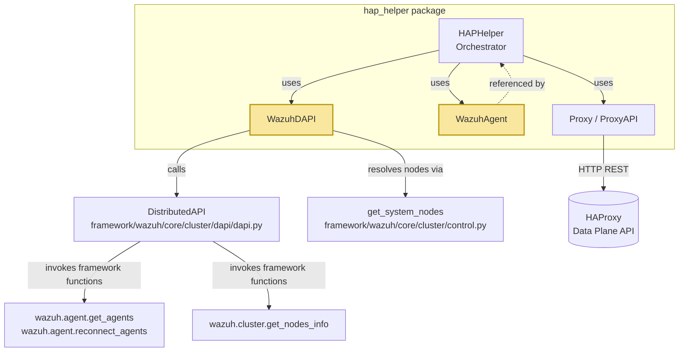
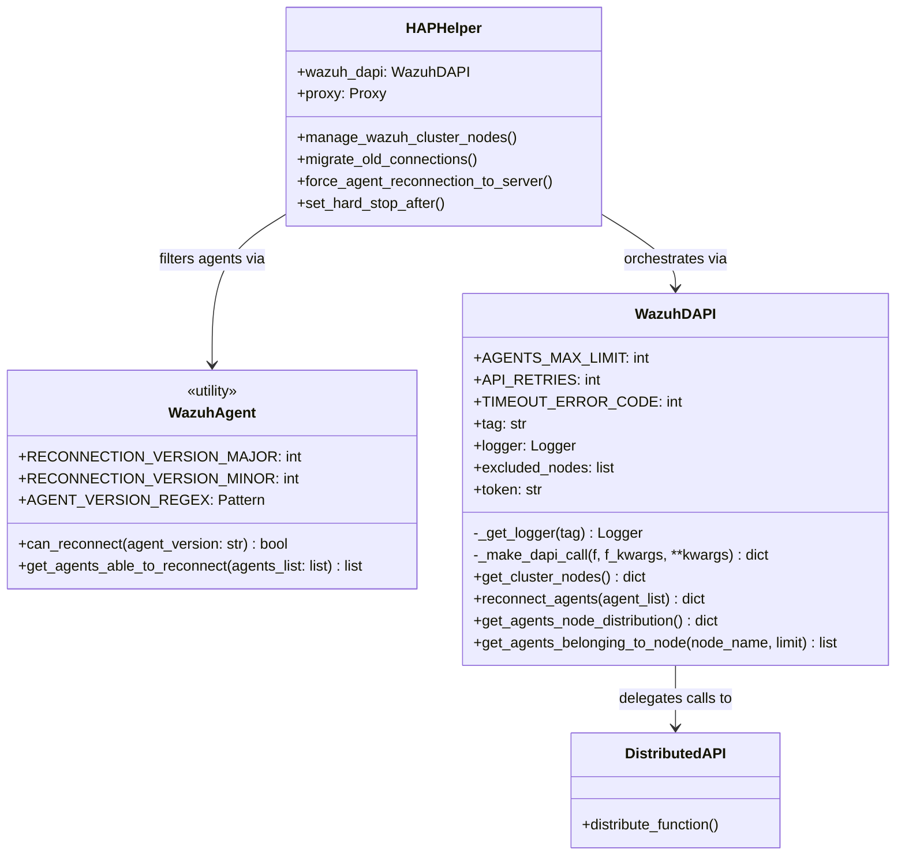
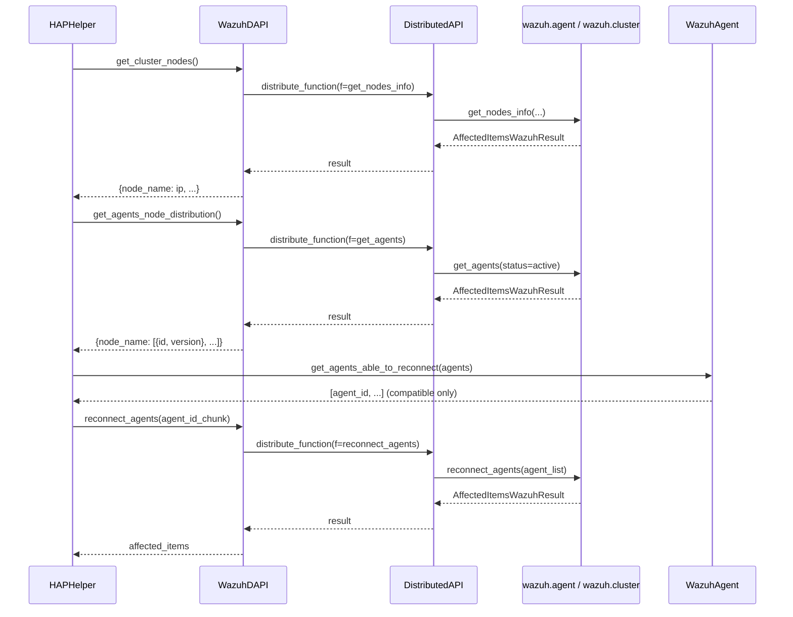
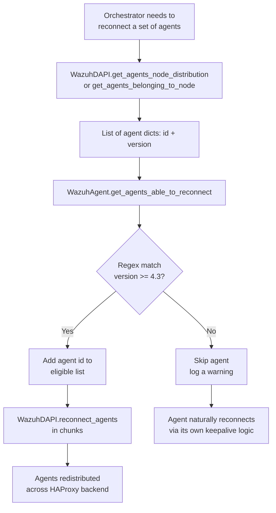
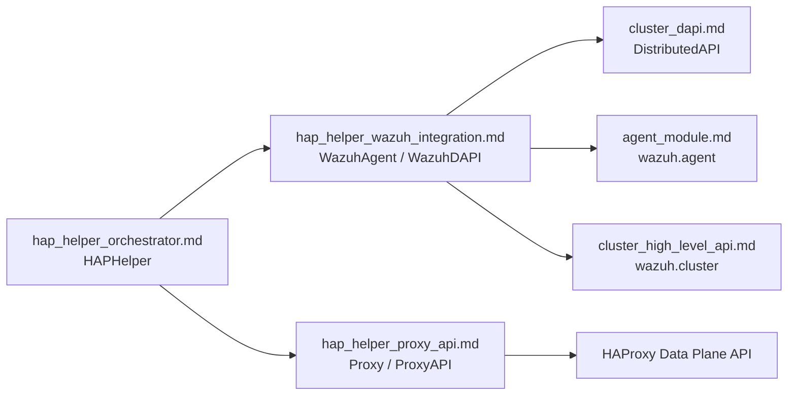

# HAP Helper Wazuh Integration

## Introduction

The **HAP Helper Wazuh Integration** module is the bridge between the [HAProxy Helper Orchestrator](hap_helper_orchestrator.md) and the Wazuh cluster's own management APIs. It is implemented entirely in `framework/wazuh/core/cluster/hap_helper/wazuh.py` and exposes two small, focused classes:

- **`WazuhAgent`** — a stateless helper with agent-version compatibility logic used to decide whether an agent can be safely force-reconnected through the DAPI.
- **`WazuhDAPI`** — an async wrapper around the Distributed API (DAPI) that the HAP Helper Orchestrator uses to query cluster topology, agent distribution, and to trigger agent reconnections.

This module does not implement any load-balancing logic itself; instead, it isolates all interaction with the Wazuh cluster (agents, nodes, DAPI) so that the [`HAPHelper` orchestrator](hap_helper_orchestrator.md) and the [Proxy/HAProxy API layer](hap_helper_proxy_api.md) can remain decoupled from Wazuh-specific implementation details. It is a small but critical part of the `hap_helper` module, which itself belongs to the broader [Cluster module](cluster_module.md) of the Wazuh manager.

## Purpose and Core Functionality

The HAProxy Helper is a cluster daemon component that keeps HAProxy's backend configuration synchronized with the live Wazuh cluster topology and rebalances agent connections across manager nodes. To do so, it needs to:

1. Discover the current Wazuh cluster nodes and their addresses.
2. Discover which agents are connected to which node.
3. Force specific agents to reconnect (e.g., to migrate them to a different node, or to rebalance load).
4. Understand agent version constraints, since only newer agent versions support the "force reconnect" DAPI endpoint.

The `wazuh.py` module fulfills points 1–4 by wrapping the framework-level DAPI functions (`wazuh.agent.get_agents`, `wazuh.agent.reconnect_agents`, `wazuh.cluster.get_nodes_info`) with a purpose-built async client (`WazuhDAPI`), and by providing static compatibility-checking utilities (`WazuhAgent`).

### Key Responsibilities

| Responsibility | Component |
|---|---|
| Determine if an agent's version supports forced reconnection | `WazuhAgent.can_reconnect` / `get_agents_able_to_reconnect` |
| Fetch the list of active cluster nodes (name → IP) | `WazuhDAPI.get_cluster_nodes` |
| Request reconnection of a set of agents | `WazuhDAPI.reconnect_agents` |
| Get the current agent-to-node distribution | `WazuhDAPI.get_agents_node_distribution` |
| Get the agents that belong to a specific node | `WazuhDAPI.get_agents_belonging_to_node` |
| Execute any DAPI function with unified error handling/logging | `WazuhDAPI._make_dapi_call` |

## Architecture

The module sits between the HAP Helper orchestrator and Wazuh's Distributed API infrastructure. It has no direct knowledge of HAProxy; all proxy-related state is handled by the sibling [`proxy.py`](hap_helper_proxy_api.md) module.



### Class Diagram



For details on `HAPHelper`'s orchestration logic (balancing algorithm, node lifecycle, hard-stop-after calculation), see [hap_helper_orchestrator.md](hap_helper_orchestrator.md). For the HAProxy REST client (`Proxy`, `ProxyAPI`), see [hap_helper_proxy_api.md](hap_helper_proxy_api.md).

## Component Details

### `WazuhAgent`

A stateless utility class (all methods are `classmethod`s) responsible for version-compatibility checks.

- **`AGENT_VERSION_REGEX`**: Regex `.*v(\d+)\.(\d+)\.\d+` used to extract major/minor version numbers from an agent version string (e.g., `"Wazuh v4.4.0"`).
- **`RECONNECTION_VERSION_MAJOR` / `RECONNECTION_VERSION_MINOR`**: The minimum agent version (4.3) that supports the forced-reconnect DAPI endpoint used by the helper.
- **`can_reconnect(agent_version)`**: Parses the version and returns `True` if `major >= 4` and `minor >= 3`.
- **`get_agents_able_to_reconnect(agents_list)`**: Filters a list of agent dicts (each with `id` and `version` keys) and returns only the IDs of agents eligible for reconnection.

This filtering is essential because the orchestrator (`HAPHelper.force_agent_reconnection_to_server`, `HAPHelper.calculate_agents_to_balance`) must not attempt to force-reconnect agents running incompatible (older) versions — those agents naturally reconnect based on their own keepalive/rotation logic instead.

### `WazuhDAPI`

An async façade around Wazuh's [Distributed API](cluster_dapi.md) (`DistributedAPI` from `framework/wazuh/core/cluster/dapi/dapi.py`), scoped to the specific needs of the HAP Helper.

**Constructor parameters:**
- `tag`: Used for log correlation (propagated to `ClusterFilter`, shared with the rest of the `hap_helper` package — see [Cluster Utilities](cluster_utils.md)).
- `excluded_nodes`: List of node names that should never be considered part of the load-balanced pool (e.g., nodes that must be manually managed).

**Key methods:**

- **`_make_dapi_call(f, f_kwargs, **kwargs)`**: Central wrapper that sets the async context tag, instantiates `DistributedAPI`, awaits `distribute_function()`, and raises the underlying `WazuhException` if the DAPI call itself returned an exception object. All public methods funnel through this method for consistent error handling and logging.
- **`get_cluster_nodes()`**: Calls `wazuh.cluster.get_nodes_info` (via DAPI, `request_type='local_master'`) and returns a `{node_name: ip}` mapping, excluding any node in `excluded_nodes`.
- **`reconnect_agents(agent_list)`**: Calls `wazuh.agent.reconnect_agents` (via DAPI, `request_type='distributed_master'`) to force the specified agents to reconnect.
- **`get_agents_node_distribution()`**: Calls `wazuh.agent.get_agents` filtering by `status=active` and grouping by `node_name`, producing a `{node_name: [{id, version}, ...]}` structure used by the balancing algorithm.
- **`get_agents_belonging_to_node(node_name, limit)`**: Same as above but scoped to a single node, with an optional result limit — used when the orchestrator needs to select a specific number of agents to redistribute from an overloaded node.

## Data Flow

The following sequence illustrates a typical interaction during a rebalance cycle initiated by `HAPHelper.manage_wazuh_cluster_nodes()`:



## Process Flow: Agent Reconnection Eligibility



## Error Handling

All DAPI interactions are centralized through `WazuhDAPI._make_dapi_call`, which:

1. Sets the async `context_tag` (from [`cluster.utils`](cluster_utils.md)) so nested log messages carry the correct correlation tag.
2. Awaits `DistributedAPI(...).distribute_function()`.
3. Checks whether the returned value is itself an `Exception` instance (a pattern used throughout the Wazuh DAPI layer to propagate remote errors without raising across the async boundary) and, if so, logs an error and re-raises it.

This means callers in `HAPHelper` (see [hap_helper_orchestrator.md](hap_helper_orchestrator.md)) can simply `try/except WazuhException` around calls to `WazuhDAPI` methods, as seen in `manage_wazuh_cluster_nodes()`'s main loop.

## Dependencies

| Dependency | Location | Purpose |
|---|---|---|
| `DistributedAPI` | `framework/wazuh/core/cluster/dapi/dapi.py` | Executes framework functions across the cluster (local or distributed). See [cluster_dapi.md](cluster_dapi.md). |
| `get_system_nodes` | `framework/wazuh/core/cluster/control.py` | Resolves the node list to target with DAPI calls. See [cluster_control_helpers.md](cluster_control_helpers.md). |
| `ClusterFilter`, `context_tag` | `framework/wazuh/core/cluster/utils.py` | Logging correlation infrastructure shared across cluster components. See [cluster_utils.md](cluster_utils.md). |
| `get_agents`, `reconnect_agents` | `framework/wazuh/agent.py` | Core agent-management business logic invoked indirectly via DAPI. See [agent_module.md](agent_module.md). |
| `get_nodes_info` | `framework/wazuh/cluster.py` | Core cluster-management business logic invoked indirectly via DAPI. See [cluster_high_level_api.md](cluster_high_level_api.md). |

## Relationship to Sibling Modules

The `hap_helper` package is split into three cooperating documentation units:

- **[hap_helper_orchestrator.md](hap_helper_orchestrator.md)** — `HAPHelper`, the main control loop that decides *when* and *how much* to rebalance, and drives both `WazuhDAPI` and `Proxy`.
- **[hap_helper_proxy_api.md](hap_helper_proxy_api.md)** — `Proxy` / `ProxyAPI`, the HAProxy Data Plane API client that applies the actual backend/frontend/server configuration changes.
- **hap_helper_wazuh_integration.md** (this document) — `WazuhAgent` / `WazuhDAPI`, the Wazuh-side data source and action executor (agents, nodes, reconnections).



## Usage Context

`WazuhDAPI` and `WazuhAgent` are instantiated once, at daemon startup, inside `HAPHelper.start()` (in `hap_helper.py`):

```python
wazuh_dapi = WazuhDAPI(
    tag=tag,
    excluded_nodes=helper_config[EXCLUDED_NODES],
)

helper = HAPHelper(
    proxy=proxy,
    wazuh_dapi=wazuh_dapi,
    tag=tag,
    ...
)
```

From that point on, the orchestrator's main loop (`manage_wazuh_cluster_nodes`) and its helper methods (`migrate_old_connections`, `force_agent_reconnection_to_server`, `balance_agents`, `set_hard_stop_after`) exclusively interact with the Wazuh cluster through this `WazuhDAPI` instance, keeping the rest of the helper's logic free of DAPI/agent-specific implementation details.

## Where This Module Fits in the Overall System

This module is part of the [Cluster module](cluster_module.md), which implements Wazuh's master/worker cluster architecture (see also [cluster_master.md](cluster_master.md), [cluster_worker.md](cluster_worker.md), [cluster_local_server.md](cluster_local_server.md)). The `hap_helper` sub-package specifically addresses environments where a load balancer (HAProxy) distributes agent connections across multiple manager nodes; this Wazuh-integration file is what allows the helper daemon (`framework/scripts/wazuh_clusterd.py`, see [wazuh_clusterd_daemon.md](wazuh_clusterd_daemon.md)) to speak the same language as the rest of the Wazuh API/framework layer ([api_core_infrastructure.md](api_core_infrastructure.md), [agent_module.md](agent_module.md)) while keeping HAProxy-specific logic completely separate.
