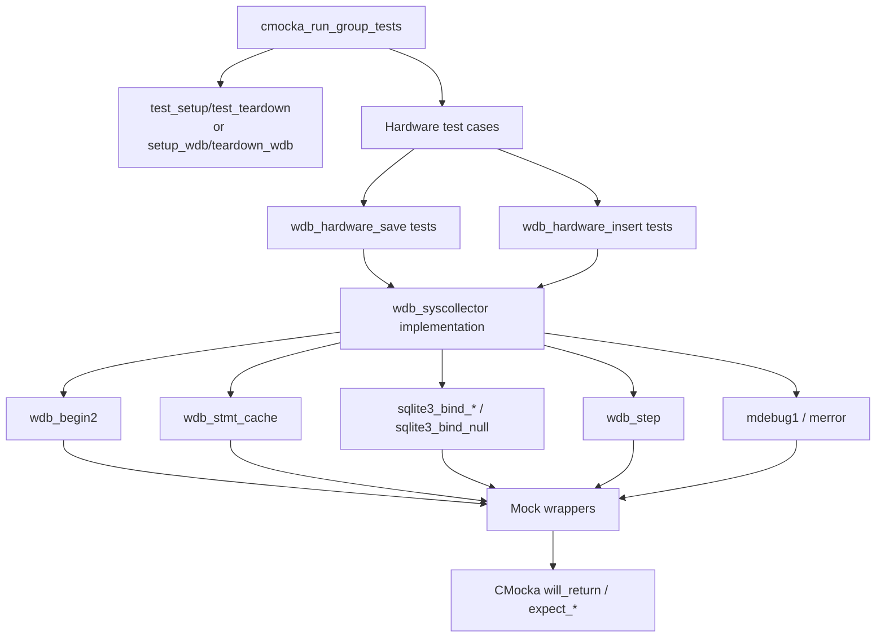
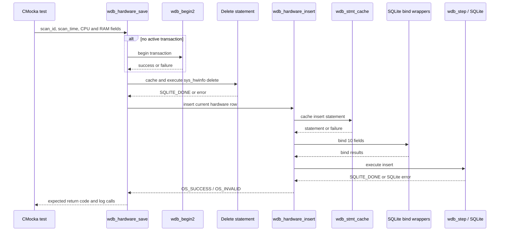
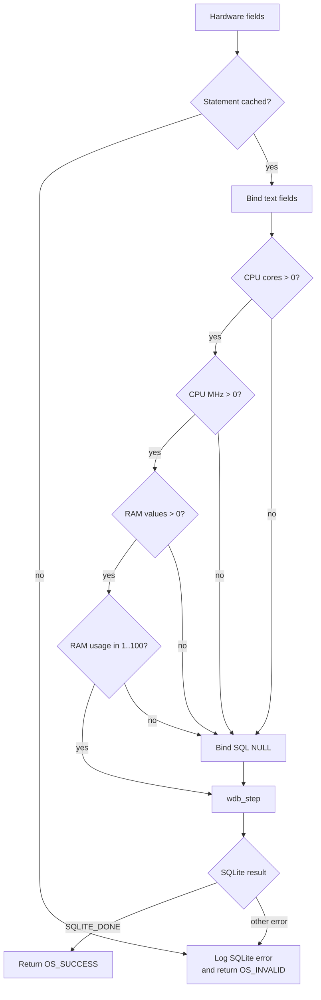

# `hardware_tests`

## Introduction

`hardware_tests` documents the hardware-focused portion of the Wazuh DB syscollector unit tests. The tests are implemented in [`src/unit_tests/wazuh_db/test_wdb_syscollector.c`](src/unit_tests/wazuh_db/test_wdb_syscollector.c), rather than in a separate source file. They exercise the persistence boundary for the `sys_hwinfo` inventory record through the public `wdb_hardware_save()` and `wdb_hardware_insert()` functions.

The module verifies that hardware inventory can be written using SQLite prepared statements, that an existing transaction is respected, and that statement-cache failures, SQL execution failures, and invalid or absent numeric values produce the expected result and diagnostics. The broader test harness and neighboring inventory domains are documented in [`test_wdb_syscollector.md`](test_wdb_syscollector.md) and [`Unit_Tests_-_Wazuh_DB.md`](Unit_Tests_-_Wazuh_DB.md).

## Scope and system position

Hardware information is collected by the system-information provider and eventually persisted by the Wazuh DB syscollector layer. This module does not collect hardware data or own the database schema; it tests the Wazuh DB persistence contract in isolation.

```mermaid
flowchart LR
    Provider[System information provider\n[data_provider_hardware.md](data_provider_hardware.md)]
    Collector[Syscollector inventory pipeline]
    WDB[Wazuh DB syscollector persistence\n[wazuh_db_fim_syscollector.md](wazuh_db_fim_syscollector.md)]
    DB[(Per-agent SQLite\nsys_hwinfo)]
    Tests[hardware_tests\n(test_wdb_syscollector.c)]
    Wrap[Wazuh DB / SQLite / logging wrappers\n[wazuh_db_wrappers.md](wazuh_db_wrappers.md)]

    Provider --> Collector --> WDB --> DB
    Tests -. mocks and assertions .-> WDB
    Tests --> Wrap
    Wrap -. replaces runtime boundaries .-> WDB
    Wrap -. replaces SQLite and logging .-> DB
```

## Components under test

### `wdb_hardware_save`

The save helper represents the normal inventory update path:

1. Begin a transaction when `wdb_t.transaction` indicates that no transaction is active.
2. Remove the previous `sys_hwinfo` row for the scan context.
3. Delegate insertion to `wdb_hardware_insert()`.
4. Return `OS_SUCCESS` only when the delete and insert stages succeed.

The tests cover transaction-start failure, failure to cache the delete statement, failure in the delete step, failure to cache the insert statement, and a successful delete-plus-insert sequence.

### `wdb_hardware_insert`

The insert helper binds ten logical values to a prepared statement:

| Position | Value | Binding/validation exercised |
|---:|---|---|
| 1 | `scan_id` | text |
| 2 | `scan_time` | text |
| 3 | `serial` | text |
| 4 | `cpu_name` | text |
| 5 | `cpu_cores` | integer; non-positive values become SQL `NULL` |
| 6 | `cpu_mhz` | real; non-positive values become SQL `NULL` |
| 7 | `ram_total` | 64-bit integer; non-positive values become SQL `NULL` |
| 8 | `ram_free` | 64-bit integer; non-positive values become SQL `NULL` |
| 9 | `ram_usage` | integer percentage; values outside `(0, 100]` become SQL `NULL` |
| 10 | `checksum` | text |

The helper first obtains a cached statement, binds each field, executes it with `wdb_step()`, and reports SQLite errors through Wazuh logging. The `replace` flag is passed through the API and is part of the production persistence contract; the tests primarily verify the resulting statement interaction and return code.

## Test architecture



Two fixture styles coexist in the source file:

- The older `test_setup()` fixture allocates a minimal `wdb_t` for direct failure-path tests.
- `setup_wdb()` creates a more realistic `test_struct_t`, including a Wazuh DB identifier, output buffer, database pointer, and statement slot. Its paired teardown releases all allocated members.

The hardware-specific tests use both styles: early tests validate direct helper behavior with the minimal fixture, while the later table-driven-style cases use the `hardware_object` fixture and `configure_wdb_hardware_insert()` helper.

## Main data and interaction flows

### Save flow



### Insert validation flow



## Test coverage

### Save-level behavior

| Test | Expected behavior |
|---|---|
| `test_wdb_hardware_save_transaction_fail` | Transaction begin failure returns `-1` and logs `cannot begin transaction`. |
| `test_wdb_hardware_save_cache_fail` | Delete statement-cache failure returns `-1`. |
| `test_wdb_hardware_save_sql_fail` | Delete execution failure logs the SQLite message and returns `-1`. |
| `test_wdb_hardware_save_insert_fail` | Insert statement-cache failure propagates as `-1`. |
| `test_wdb_hardware_save_success` | Delete and insert both complete with `SQLITE_DONE`; returns `0`. |

### Insert-level behavior

| Test | Expected behavior |
|---|---|
| `test_wdb_hardware_insert_stmt_cache_fail` | A cache failure is logged and returns `OS_INVALID`. |
| `test_wdb_hardware_insert_success` | All valid fields are bound with their expected SQLite types and the row is inserted. |
| `test_wdb_hardware_insert_step_error` | A non-success `wdb_step()` result logs `sqlite3_errmsg()` and returns `OS_INVALID`. |
| `test_wdb_hardware_insert_success_null_values` | Negative CPU values, zero RAM values, and 101% RAM usage are converted to SQL `NULL`; insertion still succeeds. |

The source also contains an earlier direct-test block with `test_wdb_hardware_save_*` and `test_wdb_hardware_insert_*` names. These cases provide explicit assertions for transaction, statement-cache, binding, and SQLite-step failure paths. The later fixture-based cases add realistic representative hardware data and boundary-value behavior.

## Error and return-code contract

The tests establish the following observable contract:

- `0` / `OS_SUCCESS` indicates a completed persistence operation.
- `-1` / `OS_INVALID` indicates transaction, statement-cache, binding, or SQL execution failure.
- SQLite constraint handling is tested extensively for sibling syscollector components; hardware-specific tests focus on cache, binding, and step errors.
- Diagnostics identify the failing operation, for example `at wdb_hardware_save(): cannot begin transaction`, `at wdb_hardware_insert(): cannot cache statement`, or `SQLite: ERROR`.

The tests use `OS_INVALID` values as sentinel inputs. They do not mean that every negative hardware value is rejected: the binding rules intentionally normalize several invalid numeric fields to SQL `NULL`, allowing the inventory row to remain usable while avoiding invalid measurements.

## Dependencies

| Dependency | Role | Reference |
|---|---|---|
| `wdb.h` | Declares `wdb_t`, hardware APIs, constants, and Wazuh DB types. | [`wazuh_db_engine.md`](wazuh_db_engine.md) |
| Wazuh DB syscollector implementation | Owns transaction, deletion, insertion, validation, and SQLite interaction. | [`wazuh_db_fim_syscollector.md`](wazuh_db_fim_syscollector.md) |
| SQLite | Prepared statements, typed bindings, execution status, and error messages. | [`wrappers_externals_sqlite.md`](wrappers_externals_sqlite.md) |
| cJSON | Used by the containing syscollector test file for JSON ingestion; not central to hardware direct calls. | [`wrappers_externals_cjson.md`](wrappers_externals_cjson.md) |
| Wazuh DB wrappers | Injects transaction, statement-cache, step, logging, and inventory-removal outcomes. | [`wazuh_db_wrappers.md`](wazuh_db_wrappers.md) |
| CMocka | Test registration, fixtures, expectations, mocked return values, and assertions. | [`Unit_Test_Wrappers_&_Mocks.md`](Unit_Test_Wrappers_&_Mocks.md) |
| Hardware provider | Upstream producer of CPU, memory, serial, and checksum data. | [`data_provider_hardware.md`](data_provider_hardware.md) |

## Maintenance guidance

When the hardware schema or `wdb_hardware_insert()` signature changes, update the following together:

1. The binding order and validation expectations in `configure_wdb_hardware_insert()`.
2. The representative `hardware_object` fixture.
3. Save and insert failure-path expectations, especially statement identifiers and diagnostics.
4. Any linked Wazuh DB schema or syscollector documentation.

New fields should have explicit tests for valid values, missing/invalid values, SQLite step failure, and statement-cache failure. Keep transaction and SQLite mechanics referenced from the shared Wazuh DB documentation so this module remains focused on the hardware contract.

## Source reference

- [`src/unit_tests/wazuh_db/test_wdb_syscollector.c`](src/unit_tests/wazuh_db/test_wdb_syscollector.c) — implementation of the documented tests and fixtures.
- [`test_wdb_syscollector.md`](test_wdb_syscollector.md) — parent module covering all syscollector persistence domains.
