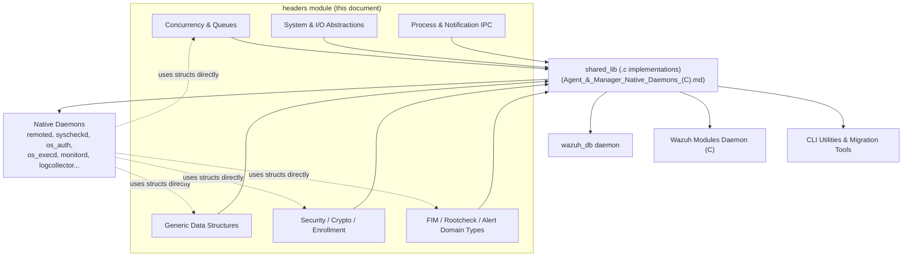
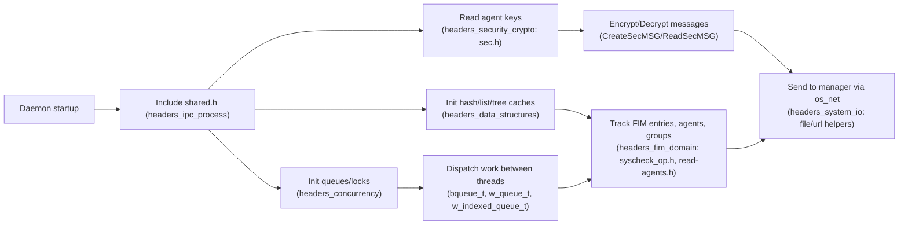

# Wazuh Shared Headers (`src/headers`)

## 1. Purpose

The `headers` module is the foundational C header library shared by every native
Wazuh daemon and utility written in C (agent daemons, manager daemons, `remoted`,
`syscheckd`, `wazuh-modulesd`, `wazuh_db`, CLI tools, etc — see
[Agent_&_Manager_Native_Daemons_(C)](Agent_&_Manager_Native_Daemons_(C).md) and
[wazuh_db](wazuh_db.md)). It does not implement a running process itself;
instead it declares the **data types, structures and function prototypes**
that are compiled into `libwazuhshared` and linked by nearly every other C
component in the codebase (their implementations mostly live under
`src/shared/*.c`, documented in the *shared_lib* sub-module of
[Agent_&_Manager_Native_Daemons_(C)](Agent_&_Manager_Native_Daemons_(C).md)).

Because almost all native-C modules `#include <shared.h>` (the umbrella header
that pulls in the rest of this directory), the `headers` module is the common
vocabulary of the whole C codebase: agent keys, FIM checksums, queues,
hash tables, red-black trees, locks, and OS abstractions are all defined here
exactly once.

## 2. Architectural Role

`shared.h` is the aggregator: it `#include`s almost every other file in this
directory (plus `os_xml`, `os_regex`, and the `dbsync` shared module), so any
`.c` file that includes it gains access to the entire type vocabulary
documented here.

## 3. Sub-modules

The 35 header files are grouped by functional purpose. Each sub-module below
is documented in its own file:

| Sub-module | Focus | Key headers |
|---|---|---|
| [headers_concurrency](headers_concurrency.md) | Thread-safe primitives and queue ADTs | `atomic.h`, `rwlock_op.h`, `bqueue_op.h`, `queue_op.h`, `queue_linked_op.h`, `indexed_queue_op.h` |
| [headers_data_structures](headers_data_structures.md) | Generic in-memory containers | `list_op.h`, `hash_op.h`, `rbtree_op.h`, `store_op.h`, `vector_op.h`, `buffer_op.h` |
| [headers_security_crypto](headers_security_crypto.md) | Agent keys, enrollment, audit rules, pattern matching | `sec.h`, `audit_op.h`, `enrollment_op.h`, `expression.h` |
| [headers_system_io](headers_system_io.md) | Filesystem, privilege separation, OS/time/sysinfo abstractions | `file_op.h`, `fs_op.h`, `privsep_op.h`, `os_utils.h`, `time_op.h`, `sysinfo_utils.h`, `utf8_winapi_wrapper.h`, `dll_load_notify.h`, `url.h` |
| [headers_fim_domain](headers_fim_domain.md) | FIM/Rootcheck checksums, alerts, agent info, report filters, labels, IP structs, scheduling | `syscheck_op.h`, `rootcheck_op.h`, `read-alert.h`, `read-agents.h`, `report_op.h`, `file-queue.h`, `labels_op.h`, `os_ip.h`, `schedule_scan.h` |
| [headers_ipc_process](headers_ipc_process.md) | Subprocess execution, event notification, remote requests, umbrella header | `exec_op.h`, `notify_op.h`, `request_op.h`, `shared.h` |

## 4. High-Level Data Flow

## 5. Relationship to Other Modules

* **Implementations**: The `.c` files that implement these headers live in
  `src/shared/*.c` and are documented as the *shared_lib* sub-module inside
  [Agent_&_Manager_Native_Daemons_(C)](Agent_&_Manager_Native_Daemons_(C).md).
* **Consumers**: Virtually every native daemon (`remoted`, `os_auth`,
  `os_execd`, `logcollector`, `monitord`, `rootcheck`) as well as
  [Syscheck___FIM_Daemon_(C_C++)](Syscheck___FIM_Daemon_(C_C++).md),
  [wazuh_db](wazuh_db.md) and
  [Wazuh_Modules_Daemon_(C)](Wazuh_Modules_Daemon_(C).md) depend on these
  structures.
* **Testing**: Unit tests exercising these headers' implementations are found
  in [Unit_Tests_-_Shared_Library](Unit_Tests_-_Shared_Library.md) and the
  wrapper mocks in [Unit_Test_Wrappers_&_Mocks](Unit_Test_Wrappers_&_Mocks.md).

## 6. Notes on Portability

Several headers contain `#ifdef WIN32` / `#ifndef WIN32` branches
(`file_op.h`, `privsep_op.h`, `syscheck_op.h`, `dll_load_notify.h`,
`utf8_winapi_wrapper.h`) because Wazuh agents run on Windows, Linux, macOS,
and various BSD/Unix variants. The header declares the superset of the API;
the corresponding `.c` implementation picks the correct platform-specific
code path at compile time.
