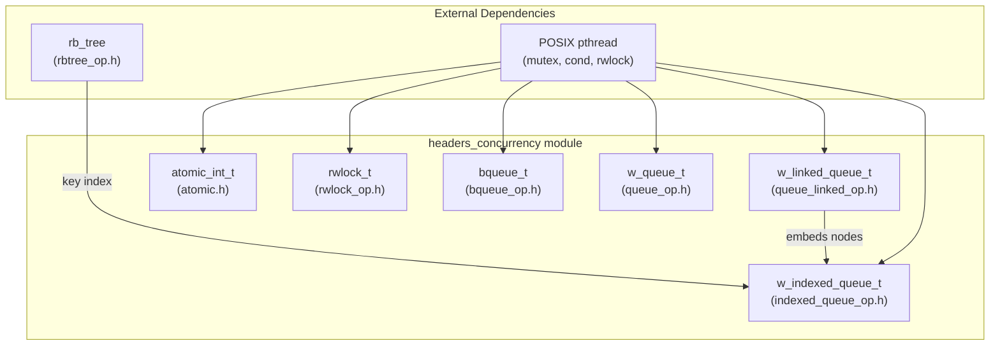
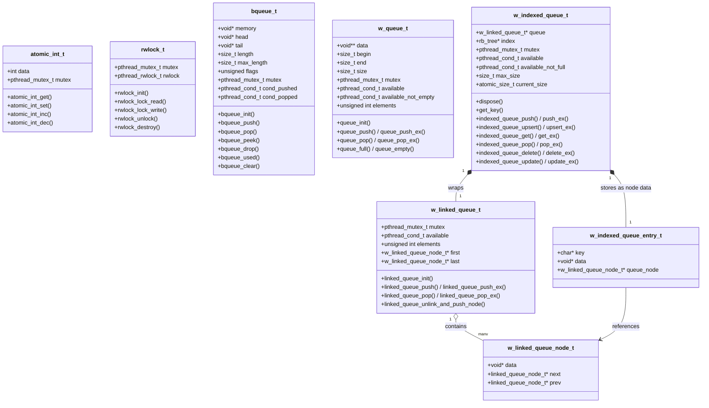
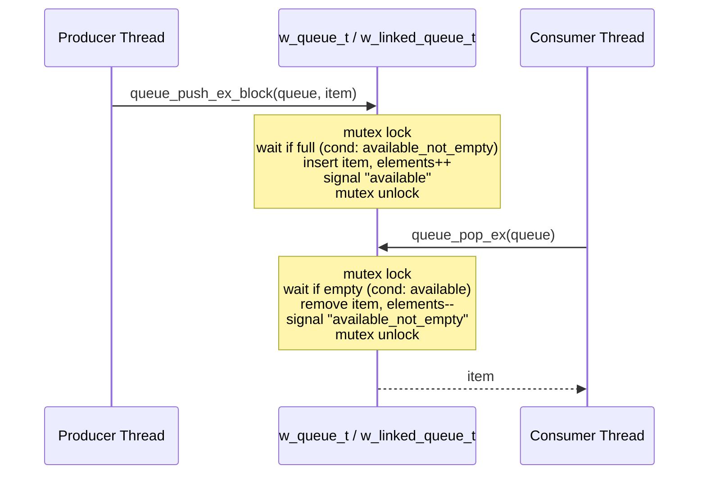
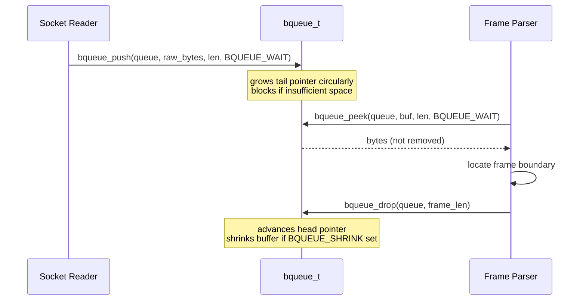
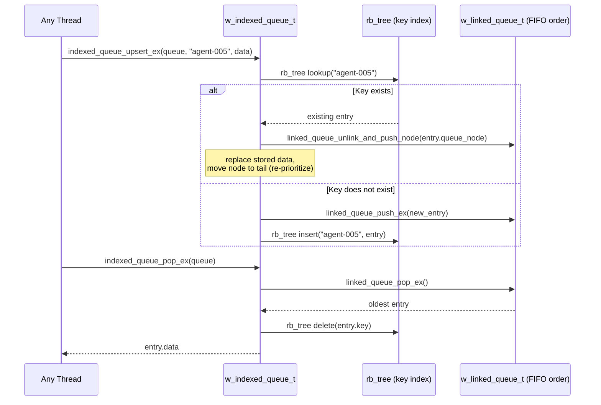
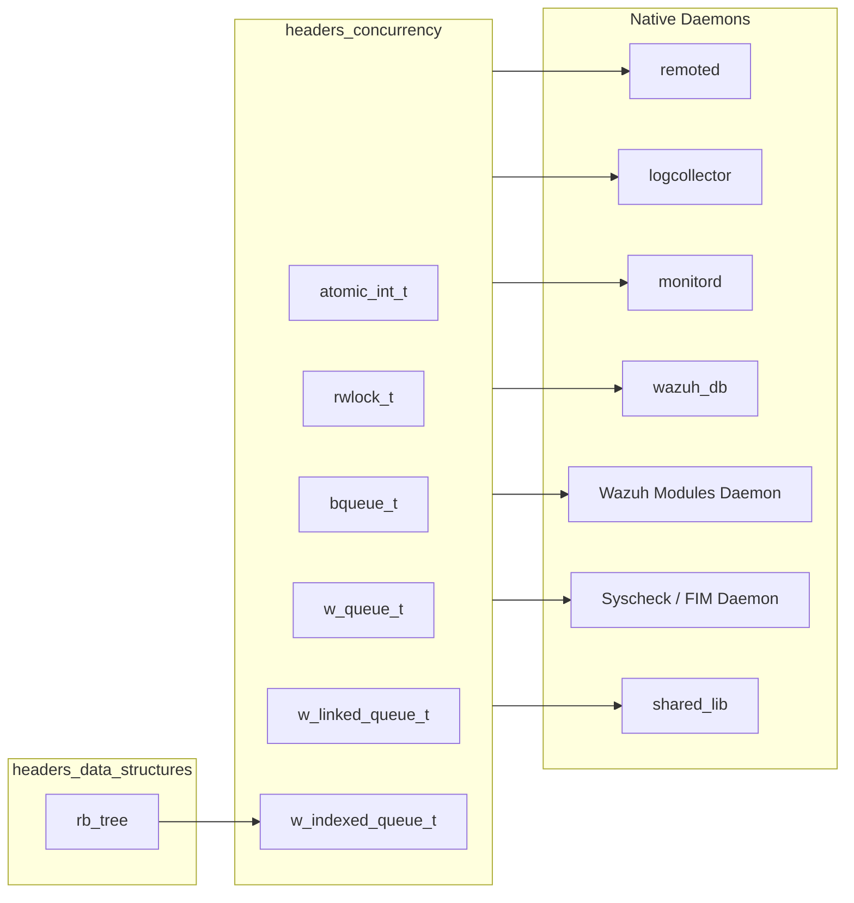

# Headers: Concurrency Primitives

## Introduction

The **`headers_concurrency`** module is a foundational C library within the Wazuh **Agent & Manager Native Daemons** codebase (`src/headers/`). It provides a small set of thread-safe, reusable **data structures and synchronization primitives** that are used throughout virtually every native Wazuh daemon (`remoted`, `logcollector`, `monitord`, `wazuh-db`, `wazuh-modulesd`, `wazuh-analysisd`, `syscheckd`, etc.) to coordinate work between producer and consumer threads, protect shared state, and implement bounded/unbounded work queues.

It contains five closely related building blocks:

| Component | Header | Purpose |
|---|---|---|
| `atomic_int_t` | `atomic.h` | Mutex-protected atomic integer counter |
| `rwlock_t` | `rwlock_op.h` | Read-write lock (multiple readers / single writer) |
| `bqueue_t` | `bqueue_op.h` | Circular byte-stream queue (binary/byte buffer, not item-based) |
| `w_queue_t` | `queue_op.h` | Fixed-capacity circular FIFO queue of generic pointers |
| `w_linked_queue_t` | `queue_linked_op.h` | Unbounded linked-list based FIFO queue of generic pointers |
| `w_indexed_queue_t` | `indexed_queue_op.h` | FIFO queue augmented with an O(log n) key index (built on `w_linked_queue_t` + red-black tree) |

These primitives are deliberately minimal and dependency-light (only `pthread.h` and, for the indexed queue, the red-black tree implementation from [headers_data_structures.md](headers_data_structures.md)). They form the low-level concurrency toolkit on top of which higher-level daemon components build their message pipelines, buffering, and state-sharing mechanisms.

This module belongs to the broader [`headers`](headers.md) collection, which is itself part of the [Agent & Manager Native Daemons (C)](Agent_%26_Manager_Native_Daemons_%28C%29.md) codebase. Related sibling header groups include [headers_data_structures](headers_data_structures.md) (lists, hashes, trees, vectors — a dependency of the indexed queue), [headers_system_io](headers_system_io.md), [headers_security_crypto](headers_security_crypto.md), [headers_fim_domain](headers_fim_domain.md), and [headers_ipc_process](headers_ipc_process.md).

---

## 1. Purpose and Core Functionality

Native Wazuh daemons are heavily multi-threaded: a receiver thread accepts network/file data while worker threads process, transform, and forward it. The `headers_concurrency` module exists to give every daemon a **common, battle-tested vocabulary** for:

1. **Atomic counters** — lock-protected increment/decrement/get/set of an `int`, used for statistics, reference counting, and flags shared across threads (e.g. `atomic_int_t` used in the [Remoted](Agent_%26_Manager_Native_Daemons_%28C%29.md) state module and `shared/wait_op.c`).
2. **Read-write locking** — allows many readers to proceed concurrently while a writer gets exclusive access (`rwlock_t`), used to protect configuration structures and lookup tables that are read far more often than modified.
3. **Byte-stream buffering** — `bqueue_t` implements a circular, growable/shrinkable *byte* buffer (not a list of discrete items) ideal for socket/stream I/O where messages have variable size and framing is done externally (e.g. `client-agent/buffer.c`, `remoted/netbuffer.c`).
4. **Bounded generic FIFO queue** — `w_queue_t` is a classic circular array of `void *` pointers with a fixed capacity, condition-variable-based blocking, and both blocking/non-blocking push/pop variants. It underlies most producer/consumer pipelines (e.g. `logcollector` input/output threads, `wazuh-db` request pools).
5. **Unbounded linked FIFO queue** — `w_linked_queue_t` avoids a fixed capacity by allocating a node per element; supports pushing, popping, and "unlink & re-push to the end" (useful for LRU-style re-ordering), used as the base of task queues (e.g. `wazuh_modules/task_manager`, agent-group processing).
6. **Indexed queue** — `w_indexed_queue_t` combines a `w_linked_queue_t` with a `rb_tree` index (see [headers_data_structures](headers_data_structures.md)) to give O(log n) **key-based lookup, update, delete, and upsert**, while preserving FIFO semantics for ordered draining. This is the newest addition (2025) and is designed for scenarios that need both ordered processing and random access by an agent ID / key (e.g. agent-state caches, rate-limited command dispatch).

All of these types are designed to be embedded by value or referenced by pointer inside larger daemon-specific structures, and none of them perform I/O or logging — they are pure, generic concurrency utilities.

---

## 2. Architecture Overview

### 2.1 Component Relationship Diagram

### 2.2 Struct-Level Composition

---

## 3. Detailed Component Documentation

### 3.1 `atomic_int_t` — Atomic Integer

A minimal wrapper around an `int` protected by a `pthread_mutex_t`. It provides four operations (`get`, `set`, `inc`, `dec`), all of which lock the mutex, perform the operation, and unlock. It is intended for simple shared counters (statistics, flags, sequence numbers) where a full queue or lock is overkill.

- **Initialization**: `ATOMIC_INT_INITIALIZER(v)` macro for static initialization, or manual assignment.
- **Typical consumers**: daemon state/statistics modules (e.g., `remoted` state counters, `wazuh_modules` running-thread counters) that need a cheap, contention-tolerant counter without introducing a full queue.

### 3.2 `rwlock_t` — Read-Write Lock

Wraps `pthread_rwlock_t` together with an auxiliary `pthread_mutex_t` to provide FIFO-fair read/write locking and to guard against double-initialization / use-after-free via critical-error assertions.

- **API**: `rwlock_init`, `rwlock_lock_read`, `rwlock_lock_write`, `rwlock_unlock`, `rwlock_destroy`.
- **Convenience macros**: `RWLOCK_LOCK_READ(rwlock, stmt)` / `RWLOCK_LOCK_WRITE(rwlock, stmt)` wrap a statement block with lock/unlock automatically.
- **Typical consumers**: configuration and lookup-table protection where reads vastly outnumber writes (e.g., group/agent caches).

### 3.3 `bqueue_t` — Binary (Byte-Stream) Queue

Unlike the other queues in this module, `bqueue_t` does **not** store discrete items — it is a circular **byte buffer** for un-delimited binary data, commonly used for network/stream I/O buffering where a variable-length message stream needs to be accumulated and drained.

- **Flags**: `BQUEUE_NOFLAG`, `BQUEUE_WAIT` (block on full/empty), `BQUEUE_SHRINK` (automatically shrink buffer when usage drops below half capacity).
- **Core operations**: `bqueue_push` (insert bytes), `bqueue_pop` (read + remove), `bqueue_peek` (read without removing), `bqueue_drop` (remove without reading), `bqueue_used`, `bqueue_clear`.
- **Typical consumers**: `client-agent/buffer.c` (agent message buffering), `remoted/netbuffer.c` style stream framing.

### 3.4 `w_queue_t` — Bounded Circular FIFO Queue

A classic fixed-capacity circular array of `void *` elements (capacity = `size - 1`), protected by a mutex and two condition variables (`available` for "not empty", `available_not_empty` for "not full").

- **Push variants**: `queue_push` (non-blocking, fails if full), `queue_push_ex` (thread-safe non-blocking), `queue_push_ex_block` (thread-safe, blocks until space is available).
- **Pop variants**: `queue_pop` (non-blocking), `queue_pop_ex` (thread-safe, blocks until an item is available), `queue_pop_ex_timedwait` (thread-safe with timeout).
- **Introspection**: `queue_full`, `queue_full_ex`, `queue_empty`, `queue_empty_ex`, `queue_get_percentage_ex` (fill ratio for backpressure/monitoring).
- **Typical consumers**: `logcollector` input/output thread pipelines, `wazuh-db` request pools, `pyDaemonModule` worker pools.

### 3.5 `w_linked_queue_t` — Unbounded Linked FIFO Queue

Implements the same FIFO semantics as `w_queue_t` but backed by a doubly linked list, so it has no fixed capacity (bounded only by available memory) and supports O(1) removal/re-insertion of a specific known node.

- **Core operations**: `linked_queue_push` / `linked_queue_push_ex` (returns the created `w_linked_queue_node_t *` so callers can retain a reference), `linked_queue_pop` / `linked_queue_pop_ex`.
- **Distinctive operation**: `linked_queue_unlink_and_push_node` — removes an existing node from wherever it is in the queue and re-appends it to the tail (used for LRU-style promotion patterns), which is exactly the mechanism the indexed queue below builds upon for its "upsert" semantics.
- **Typical consumers**: task queues in `wazuh_modules/task_manager`, `framework/scripts/agent_groups.py`-adjacent native processing, and as the foundation for `w_indexed_queue_t`.

### 3.6 `w_indexed_queue_t` — FIFO Queue + Key Index

The most sophisticated primitive in the module (added 2025-08). It composes a `w_linked_queue_t` (for ordering) with a `rb_tree` (for O(log n) key lookup — see [headers_data_structures](headers_data_structures.md)) via a `w_indexed_queue_entry_t` wrapper that stores the key, the user data pointer, and a reference back to the underlying linked-queue node.

- **Configuration**: `indexed_queue_init(max_size)` (0 = unlimited), with pluggable `dispose()` (element destructor) and `get_key()` (extracts key from arbitrary data) callbacks set via `indexed_queue_set_dispose` / `indexed_queue_set_get_key`.
- **FIFO operations**: `indexed_queue_push`/`_ex`, `indexed_queue_pop`/`_ex`/`_ex_timedwait`, `indexed_queue_peek`/`_ex`.
- **Key-indexed operations** (the core value-add over a plain linked queue): `indexed_queue_get`/`_ex` (O(log n) lookup without dequeuing), `indexed_queue_update`/`_ex` (replace value for an existing key), `indexed_queue_delete`/`_ex` (remove by key from anywhere in the queue, not just the head), and `indexed_queue_upsert`/`_ex` (insert-or-update in one call).
- **Concurrency controls**: separate condition variables `available` (not empty) and `available_not_full` (below `max_size`), plus an atomic `current_size` counter for lock-free size inspection.
- **Typical use case**: per-agent state or command dispatch tables where a daemon must both process work in arrival order **and** be able to instantly find/update/cancel an entry belonging to a specific agent ID — a pattern common to `remoted`, `wazuh-modulesd` agent-upgrade orchestration, and `wazuh-db` connection pooling patterns.

---

## 4. Data Flow & Interaction Patterns

### 4.1 Generic Producer/Consumer Flow (`w_queue_t` / `w_linked_queue_t`)

### 4.2 Byte-Stream Buffering Flow (`bqueue_t`)

### 4.3 Indexed Queue Upsert / Ordered Drain Flow

---

## 5. How This Module Fits Into the Overall System

`headers_concurrency` sits at the very bottom of the dependency stack for native C daemons. It has **no outgoing dependency** on daemon logic and only a single intra-`headers` dependency (the red-black tree from [headers_data_structures](headers_data_structures.md), used exclusively by `w_indexed_queue_t`). Every native daemon links against these primitives directly or indirectly through the shared library (`shared_lib` — see [Agent & Manager Native Daemons](Agent_%26_Manager_Native_Daemons_%28C%29.md)).

### Cross-Module References

- **[headers](headers.md)** — the parent module tree; siblings include `headers_data_structures`, `headers_security_crypto`, `headers_system_io`, `headers_fim_domain`, and `headers_ipc_process`.
- **[headers_data_structures](headers_data_structures.md)** — provides `rb_tree`, the only external dependency of `w_indexed_queue_t`.
- **[shared_lib](Agent_%26_Manager_Native_Daemons_%28C%29.md)** — the general-purpose C shared library (`src/shared/*`) that builds on top of these primitives (e.g. `queue_op.c`, `queue_linked_op.c`, `indexed_queue_op.c`, `rbtree_op.c` are implemented there, with the corresponding headers documented in this module).
- **[remoted](Agent_%26_Manager_Native_Daemons_%28C%29.md)**, **[logcollector](Agent_%26_Manager_Native_Daemons_%28C%29.md)**, **[monitord](Agent_%26_Manager_Native_Daemons_%28C%29.md)**, **[os_execd](Agent_%26_Manager_Native_Daemons_%28C%29.md)** — native daemons that use `w_queue_t`/`w_linked_queue_t` for internal message pipelines and `bqueue_t`/`rwlock_t` for stream buffering and configuration protection.
- **[wazuh_db](wazuh_db.md)** — uses bounded queues (`w_queue_t`) for connection/request pooling.
- **[Wazuh Modules Daemon (C)](Wazuh_Modules_Daemon_%28C%29.md)** and **[Unit Tests - Wazuh Modules (Cloud/Misc)](Unit_Tests_-_Wazuh_Modules_%28Cloud_Misc%29.md)** — modules such as `task_manager` and `agent_upgrade` rely on linked/indexed queues to track per-agent task state.
- **[Unit Tests - Shared Library](Unit_Tests_-_Shared_Library.md)** — contains the dedicated unit test suites (`test_atomic`, `test_rwlock_op`, `test_bqueue`, `test_queue_op`, `test_queue_linked_op`, `test_indexed_queue_op`) that validate every operation described in this document.

---

## 6. Concurrency & Thread-Safety Notes

- All structures use **internal mutexes**; callers do not need external locking for the documented public API, but non-`_ex` variants of `w_queue_t`/`w_linked_queue_t` operations are explicitly **not** thread-safe and are intended for use only when the caller already holds appropriate external synchronization (e.g., single-threaded initialization phases).
- Blocking calls (`_ex_block`, `BQUEUE_WAIT`, `pop_ex`) rely on `pthread_cond_wait`/`pthread_cond_timedwait` and are therefore subject to spurious wakeups internally handled by the implementation loops.
- `w_indexed_queue_t` uses a C11 `_Atomic size_t current_size` counter to allow lock-free size queries (`indexed_queue_size`) in addition to the mutex-protected structural operations, minimizing contention for monitoring/statistics code paths.
- None of the structures perform dynamic key comparison beyond exact string match (`w_indexed_queue_t` uses `rb_tree` with string keys) — callers are responsible for choosing a suitable, stable key (e.g., agent ID).

---

## 7. Summary

The `headers_concurrency` module is the concurrency backbone of Wazuh's native C daemons: a compact, dependency-light toolkit spanning atomic counters, read-write locks, byte-stream queues, bounded and unbounded FIFO queues, and a hybrid FIFO+indexed queue. Understanding these primitives is essential before reading the implementation of any multi-threaded native daemon (`remoted`, `logcollector`, `monitord`, `wazuh-db`, `wazuh-modulesd`, `syscheckd`), since virtually all of their internal message-passing and state-sharing mechanisms are built directly on top of these six data types.
