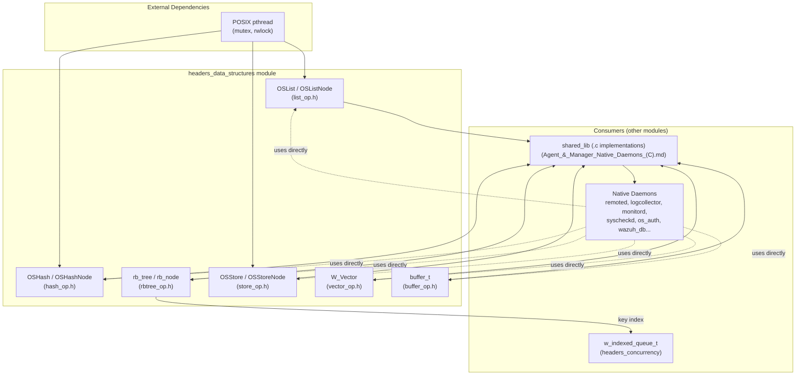
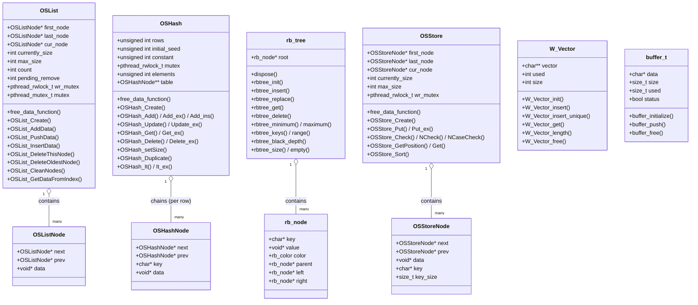
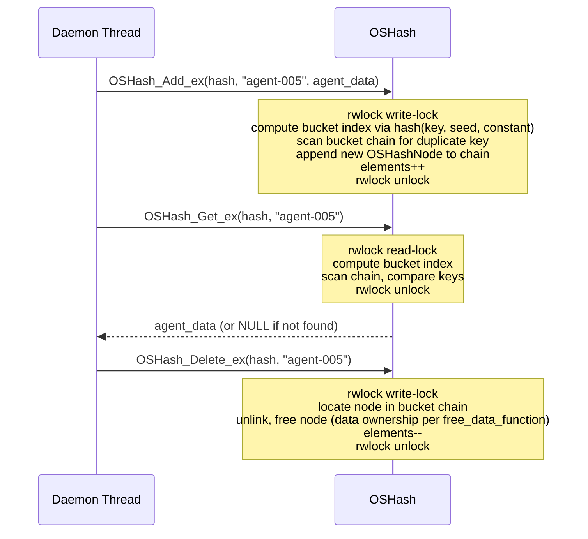
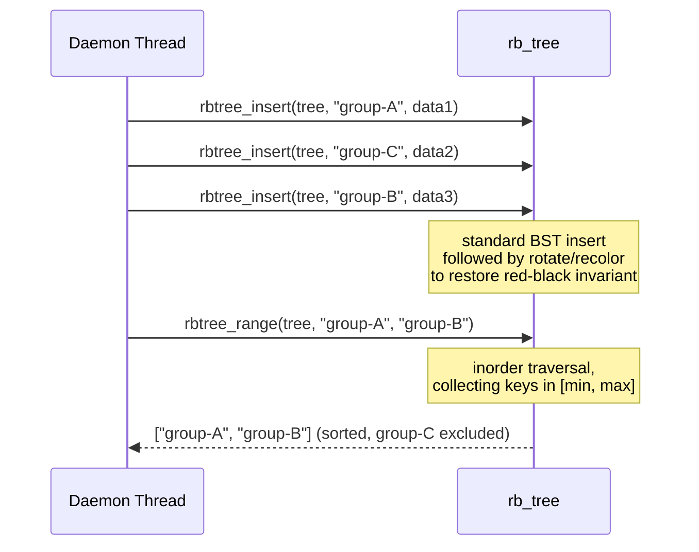
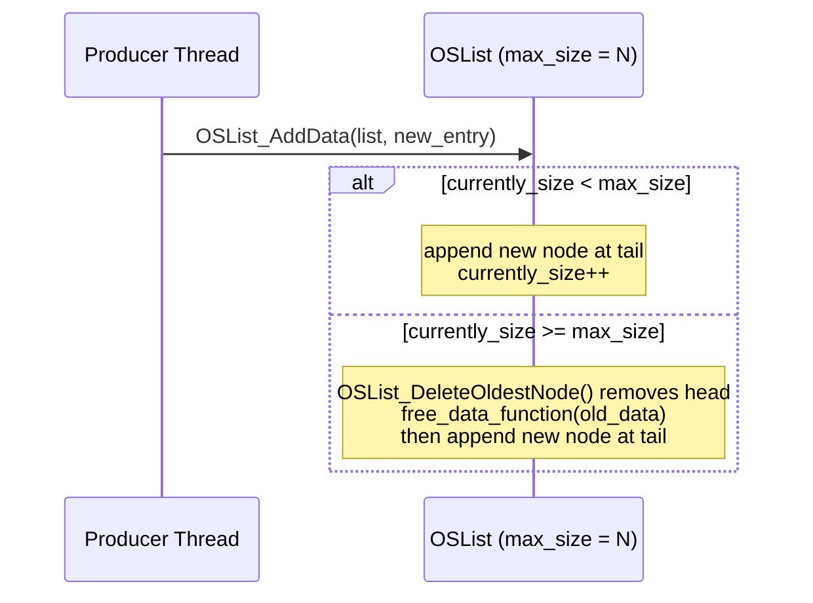
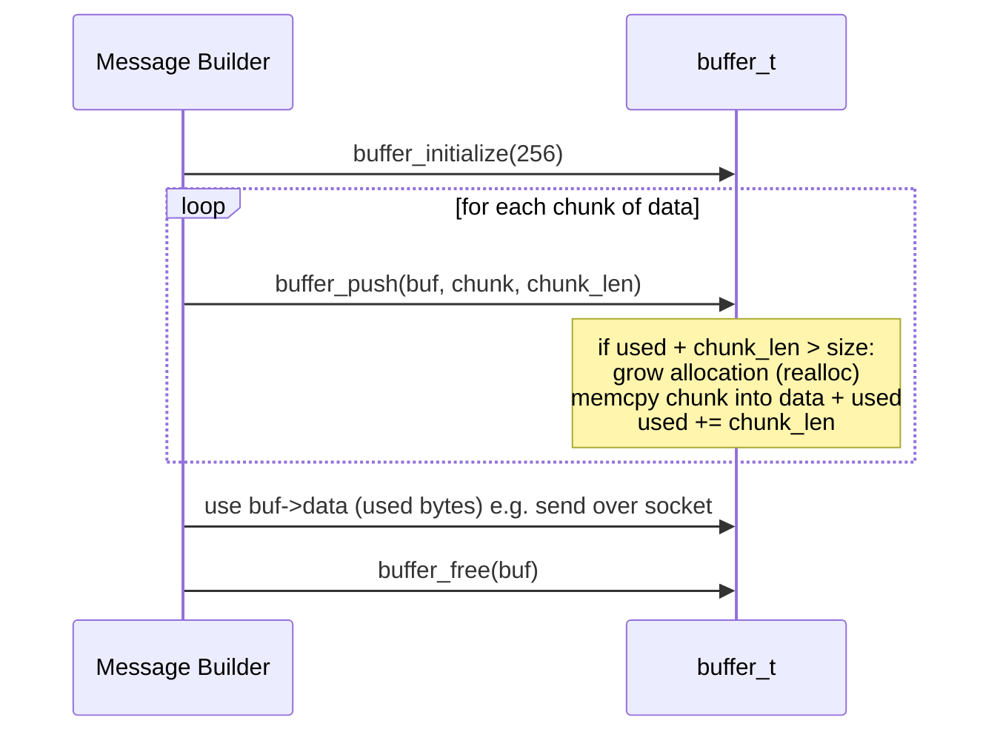
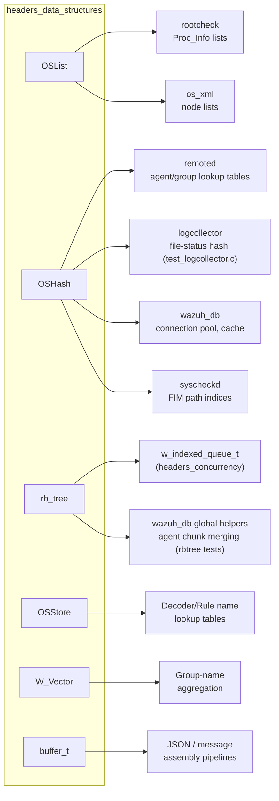

# Headers: Generic Data Structures

## Introduction

The **`headers_data_structures`** module is a foundational C library within the Wazuh **Agent & Manager Native Daemons** codebase (`src/headers/`). It provides a small set of **generic, reusable in-memory container types** — doubly linked lists, hash tables, red-black trees, a keyed store (hash-table-like ordered list), a dynamic string vector, and a growable byte buffer — that are used throughout virtually every native Wazuh daemon (`remoted`, `logcollector`, `monitord`, `wazuh-db`, `wazuh-modulesd`, `syscheckd`, `os_auth`, etc.) to hold agent records, configuration entries, FIM checksums, string collections, and byte-oriented protocol payloads.

It contains six closely related building blocks:

| Component | Header | Purpose |
|---|---|---|
| `OSList` / `OSListNode` | `list_op.h` | Generic doubly linked list with optional max-size eviction and its own RW/mutex locking |
| `OSHash` / `OSHashNode` | `hash_op.h` | Chained hash table (string-keyed) with configurable row count and free-data callback |
| `rb_tree` / `rb_node` | `rbtree_op.h` | Self-balanced red-black tree keyed by string, O(log n) insert/get/delete |
| `OSStore` / `OSStoreNode` | `store_op.h` | Ordered doubly linked list used as a lightweight key→data store (byte-key comparisons, not hashed) |
| `W_Vector` | `vector_op.h` | Dynamic array (vector) of `char *` strings with automatic growth and "insert unique" semantics |
| `buffer_t` | `buffer_op.h` | Simple growable byte buffer for accumulating binary/text data (`push`/`free`) |

These containers are deliberately generic (`void *data` payloads, except `W_Vector` and `buffer_t` which are specialized for strings/bytes) and mostly self-contained, using only `pthread.h` for their own internal locking (`OSList`, `OSHash`, `OSStore`). They form the low-level data-structure toolkit on top of which higher-level daemon components build caches, indices, registries, and message-assembly buffers.

This module belongs to the broader [`headers`](headers.md) collection, which is itself part of the [Agent & Manager Native Daemons (C)](Agent_%26_Manager_Native_Daemons_%28C%29.md) codebase. Related sibling header groups include [headers_concurrency](headers_concurrency.md) (whose `w_indexed_queue_t` is built directly on top of `rb_tree` from this module), [headers_system_io](headers_system_io.md), [headers_security_crypto](headers_security_crypto.md), [headers_fim_domain](headers_fim_domain.md), and [headers_ipc_process](headers_ipc_process.md). The `.c` implementations for all types declared here live in `src/shared/*.c` (`list_op.c`, `hash_op.c`, `rbtree_op.c`, `store_op.c`, `vector_op.c`) and are part of the *shared_lib* sub-module documented in [Agent_&_Manager_Native_Daemons_(C)](Agent_%26_Manager_Native_Daemons_%28C%29.md). Unit tests for these implementations are found in [Unit_Tests_-_Shared_Library](Unit_Tests_-_Shared_Library.md) (`test_list_op.c`, `test_rbtree_op.c`), with wrapper mocks in [Unit_Test_Wrappers_&_Mocks](Unit_Test_Wrappers_%26_Mocks.md) (`list_op_wrappers.c`, `hash_op_wrappers.c`).

---

## 1. Purpose and Core Functionality

Native Wazuh daemons frequently need to hold collections of records — agents, groups, FIM entries, configuration directives, log-collector file states — in memory with different access patterns: strict insertion order, fast key lookup, or sorted key traversal. Rather than every daemon re-implementing its own list/hash/tree, `headers_data_structures` centralizes six complementary containers:

1. **Doubly linked list (`OSList`)** — the most flexible container: supports appending, arbitrary-node deletion, an optional maximum size with automatic eviction of the oldest node (`OSList_DeleteOldestNode`), and a pluggable `free_data_function` for cleaning up node payloads. It embeds both a `pthread_rwlock_t` and a `pthread_mutex_t` for concurrent access, and is used wherever an ordered, size-bounded collection is required (e.g. rolling logs of recent events, FIFO caches).
2. **Chained hash table (`OSHash`)** — the workhorse key/value store used across the codebase for O(1) average-case lookup by string key. It supports numeric-key convenience wrappers (`OSHash_Numeric_*`), safe iteration modes (read-only, write, write-with-delay) via `OSHash_It_ex`, resizing (`OSHash_setSize`), and duplication (`OSHash_Duplicate`). Internally protected by a single `pthread_rwlock_t`. Used pervasively for agent tables, group caches, FIM path indices, and de-duplication sets.
3. **Red-black tree (`rb_tree`)** — a self-balancing binary search tree keyed by `char *` that guarantees O(log n) insert/get/delete and supports ordered operations not possible with a hash table: `rbtree_minimum`, `rbtree_maximum`, `rbtree_keys` (full sorted key dump), and `rbtree_range` (keys within `[min, max]`). It is the structure of choice whenever *sorted* iteration or range queries are needed (e.g. the indexed queue's key index in [headers_concurrency](headers_concurrency.md), or global-DB helper RB-trees for merging agent chunks).
4. **Keyed store (`OSStore`)** — a simpler alternative to `OSHash`: an ordered doubly linked list where keys are compared with byte-wise routines (`OSStore_Check`, `OSStore_NCheck` for prefix match, `OSStore_NCaseCheck` for case-insensitive match) rather than hashed. It preserves insertion order and supports position-based lookup (`OSStore_GetPosition`) and sorting (`OSStore_Sort`), making it suitable for small, ordered configuration lists (e.g. decoder/rule lookup tables) where insertion order or partial/case-insensitive key matching matters more than raw hash-table speed.
5. **String vector (`W_Vector`)** — a minimal dynamic array specialized for `char *` elements, offering `O(1)` amortized append (`W_Vector_insert`), duplicate-safe insertion (`W_Vector_insert_unique`), and index-based retrieval. Used for building growable lists of strings (e.g. accumulated group names, CSV tokens) without manual `realloc` bookkeeping.
6. **Byte buffer (`buffer_t`)** — the simplest structure in the module: a `char *data` block with `size`/`used` bookkeeping, supporting `buffer_push` (append bytes, growing the underlying allocation if needed) and `buffer_free`. It is a foundational utility for building up strings, JSON, or protocol payloads incrementally, notably in `logcollector` and JSON-serialization pipelines.

None of these types perform network or file I/O directly, nor do they impose a particular use case — they are pure, generic, in-memory data-structure utilities that higher-level modules compose into caches, registries, and buffers.

---

## 2. Architecture Overview

### 2.1 Component Relationship Diagram

### 2.2 Struct-Level Composition

---

## 3. Detailed Component Documentation

### 3.1 `OSList` — Doubly Linked List

`OSList` is a generic doubly linked list (`_OSList` / `_OSListNode`) that stores arbitrary `void *data` payloads. Each node (`OSListNode`) has `next`/`prev` pointers for O(1) traversal in both directions. The list structure itself carries:

- **Bounded/unbounded operation**: an optional `max_size`; when set and exceeded, the oldest node is evicted automatically (`OSList_DeleteOldestNode`), making `OSList` useful as a simple bounded ring/cache (e.g. recent-alerts buffers).
- **Cursor support**: `cur_node`/`OSList_GetCurrentlyNode`/`OSList_DeleteCurrentlyNode` allow stateful iteration and in-place deletion during a scan.
- **Cleanup control**: `free_data_function` is invoked by `OSList_CleanNodes`/`OSList_Destroy` to release payload memory; `OSList_CleanOnlyNodes` clears node structures **without** freeing the referenced data (for cases where ownership of `data` is external).
- **Concurrency**: embeds both a `pthread_rwlock_t wr_mutex` (list-structure protection) and a `pthread_mutex_t mutex` (auxiliary locking, e.g. for `pending_remove`/`count` bookkeeping), making it safe for concurrent producer/consumer usage without an external wrapper.
- **Key API**: `OSList_Create`, `OSList_AddData` (append), `OSList_PushData` (prepend), `OSList_InsertData` (insert relative to a given node), `OSList_GetDataFromIndex` (index-based random access), `OSList_GetNext`/`OSList_foreach` macro for forward iteration, `OSList_DeleteThisNode`, `OSList_Destroy`.

### 3.2 `OSHash` — Chained Hash Table

`OSHash` is the general-purpose string-keyed hash table used across nearly every daemon for O(1) average lookup. Internally it is an array of `rows` buckets (`OSHashNode **table`), each bucket being a linked list of `OSHashNode` entries (chaining collision resolution), combined with a random `initial_seed`/`constant` pair used by the hash function to reduce collision predictability.

- **Insertion variants**: `OSHash_Add` (fails on duplicate key), `OSHash_Add_ex`/`_ins` (alternate locking/insertion-order semantics), `OSHash_Numeric_Add_ex` (integer-key convenience wrapper that stringifies the key internally).
- **Update variants**: `OSHash_Update`/`_ex` (replace existing key's data), `OSHash_Set`/`_ex` (upsert: add if missing, update if present).
- **Retrieval**: `OSHash_Get`/`_ex` (by string key), `OSHash_Numeric_Get_ex` (by integer key), `OSHash_Get_ex_dup` (retrieve with a caller-supplied duplicator function for safe copy-out under lock).
- **Deletion**: `OSHash_Delete`/`_ex`/`_ins`, `OSHash_Numeric_Delete_ex`.
- **Maintenance**: `OSHash_setSize`/`_ex` (resize/rehash the bucket array), `OSHash_Duplicate`/`_ex` (deep-copy the table), `OSHash_Get_Elem_ex` (current element count), `OSHash_GetIndex` (expose the computed bucket index for a key).
- **Iteration**: `OSHash_Begin`/`_ex` + `OSHash_Next` for manual traversal, and the safer `OSHash_It`/`OSHash_It_ex(hash, mode, data, iterating_function)` which supports **mode 0 (read)**, **mode 1 (write)**, and **mode 2 (write with delay)** to allow callers to safely mutate the table (e.g. delete nodes) while iterating.
- **Cleanup**: `OSHash_SetFreeDataPointer` registers the destructor invoked by `OSHash_Free`/`OSHash_Clean` for each stored value.
- **Concurrency**: guarded by a single `pthread_rwlock_t mutex` shared by the whole table (not per-bucket).

### 3.3 `rb_tree` — Red-Black Tree

`rb_tree` implements a classic self-balanced binary search tree (red-black coloring invariant) keyed by `char *` strings, guaranteeing **O(log n)** worst-case time for insertion, lookup, and deletion — a stronger guarantee than the *average*-case O(1) of `OSHash`, at the cost of not being O(1). It is the structure of choice whenever ordered traversal or range queries are required.

- **Core operations**: `rbtree_init`, `rbtree_insert` (fails/returns `NULL` on duplicate key), `rbtree_replace` (update value for an existing key, disposing the old value if a `dispose` function is set), `rbtree_get`, `rbtree_delete`.
- **Ordered operations** (the key differentiator from a hash table): `rbtree_minimum`/`rbtree_maximum` (smallest/largest key), `rbtree_keys` (full null-terminated array of keys in alphabetical/inorder order), `rbtree_range(tree, min, max)` (all keys within a closed range, inorder).
- **Introspection/testing**: `rbtree_black_depth` (verifies the red-black invariant — used mainly in unit tests to catch balancing bugs), `rbtree_size`, `rbtree_empty`.
- **Memory ownership**: `rbtree_set_dispose` registers a value-destructor function invoked automatically by `rbtree_destroy` and `rbtree_delete`/`rbtree_replace` when values are removed or overwritten.
- **Notable consumer**: the `w_indexed_queue_t` structure in [headers_concurrency](headers_concurrency.md) embeds an `rb_tree` as its O(log n) key index layered on top of a `w_linked_queue_t` for FIFO ordering — see that module's documentation for the composed data structure and upsert/lookup sequence diagrams.

### 3.4 `OSStore` — Ordered Keyed Store

`OSStore` (`_OSStore` / `_OSStoreNode`) is a simpler, order-preserving alternative to `OSHash`: a doubly linked list where each node additionally carries a `char *key` and its `key_size`, and lookups are performed via **linear scan with byte-wise key comparison** rather than hashing. This trade-off makes `OSStore` appropriate for smaller collections where (a) insertion order must be preserved, (b) partial or case-insensitive key matching is needed, or (c) the collection needs to be explicitly sorted after being built.

- **Insertion**: `OSStore_Put`/`_ex` (append with a key).
- **Key matching variants**: `OSStore_Check` (exact match), `OSStore_NCheck` (prefix/length-bounded match), `OSStore_NCaseCheck` (case-insensitive match) — useful for rule/decoder name matching where flexible comparison semantics are required.
- **Positional access**: `OSStore_GetPosition`/`_ex` (index of a key in insertion/current order), `OSStore_GetFirstNode`.
- **Retrieval**: `OSStore_Get` (data by key).
- **Sorting**: `OSStore_Sort(list, sort_data_function)` reorders nodes according to a caller-supplied comparator — since the base structure preserves insertion order, explicit sorting is opt-in rather than automatic (unlike `rb_tree`, which is always ordered).
- **Bounding & cleanup**: `OSStore_SetMaxSize`, `OSStore_SetFreeDataPointer`, `OSStore_Free`.
- **Concurrency**: guarded by its own `pthread_rwlock_t wr_mutex` (protects the list structure, not necessarily the payload data).

### 3.5 `W_Vector` — Dynamic String Vector

`W_Vector` is a minimal growable array specialized for collections of `char *` strings (as opposed to the generic `void *` payloads of the other containers). It tracks `used` (current element count) and `size` (allocated capacity), doubling or otherwise growing the backing `vector` array transparently as elements are appended.

- **Lifecycle**: `W_Vector_init(initialSize)`, `W_Vector_free`.
- **Insertion**: `W_Vector_insert` (append, unconditional), `W_Vector_insert_unique` (append only if the element is not already present — returns 1 if it was a duplicate and thus skipped, 0 otherwise), useful for building deduplicated lists (e.g. accumulated group names) without a separate hash-based dedup structure.
- **Access**: `W_Vector_get(v, position)`, `W_Vector_length(v)`.
- **Typical consumers**: any code path that accumulates a variable number of string tokens (CSV parsing, group-name aggregation, glob-expansion results) before passing them on as a bounded array.

### 3.6 `buffer_t` — Growable Byte Buffer

`buffer_t` is the simplest structure in the module: a flat `char *data` allocation tracked by `size` (capacity) and `used` (bytes currently written), plus a `status` flag for reporting the outcome of the last operation (e.g. allocation failure).

- **Lifecycle**: `buffer_initialize(size)` allocates and zero-initializes a buffer of the given starting capacity.
- **Append**: `buffer_push(buffer, src, src_size)` copies `src_size` bytes from `src` into the buffer, transparently growing the underlying allocation if the remaining capacity (`size - used`) is insufficient.
- **Cleanup**: `buffer_free(buffer)`.
- **Typical consumers**: incremental message/JSON assembly pipelines (e.g. `logcollector` state serialization, `os_xml`/JSON writers) that need to build up a byte stream of unpredictable final length without repeated manual `realloc` calls.

---

## 4. Data Flow & Interaction Patterns

### 4.1 Hash Table Lookup / Insert Flow (`OSHash`)

### 4.2 Red-Black Tree Ordered Range Query (`rb_tree`)

### 4.3 Bounded List Eviction Flow (`OSList`)

### 4.4 Buffer Assembly Flow (`buffer_t`)

---

## 5. Usage Across the Codebase

The containers in this module are consumed directly (via `#include <shared.h>`, the umbrella header documented in [headers_ipc_process](headers_ipc_process.md)) by essentially every native daemon in [Agent_&_Manager_Native_Daemons_(C)](Agent_%26_Manager_Native_Daemons_%28C%29.md), as well as by [Syscheck___FIM_Daemon_(C_C++)](Syscheck___FIM_Daemon_(C_C++).md), [wazuh_db](wazuh_db.md), and [Wazuh_Modules_Daemon_(C)](Wazuh_Modules_Daemon_(C).md). Within the `headers` collection itself, the most notable internal dependency is the `w_indexed_queue_t` structure in [headers_concurrency](headers_concurrency.md), which composes an `rb_tree` from this module with a `w_linked_queue_t` to provide a FIFO queue with O(log n) key lookup — demonstrating how these generic containers are combined to build more specialized concurrent data structures elsewhere in the codebase.

---

## 6. Design Notes

* **No cross-container dependency by default**: `OSList`, `OSHash`, `OSStore`, `W_Vector`, and `buffer_t` are fully independent of one another and of `rb_tree` — each header can be included standalone. The only intra-`headers` composition occurs one level up, in [headers_concurrency](headers_concurrency.md)'s `w_indexed_queue_t`.
* **Ownership conventions**: all containers that hold `void *data` (`OSList`, `OSHash`, `OSStore`, `rb_tree`) support a registrable *dispose*/*free-data* callback (`free_data_function` or `dispose`) so that destroying the container can optionally free the payloads it references. Callers that manage payload lifetime externally can omit this callback (or use the `*_CleanOnlyNodes`/similar variants) to avoid double-frees.
* **Concurrency is opt-in per structure**: `OSList`, `OSHash`, and `OSStore` embed their own `pthread_rwlock_t`/`pthread_mutex_t` and are safe for concurrent multi-threaded access out of the box. `rb_tree`, `W_Vector`, and `buffer_t` are **not** internally synchronized — callers needing thread safety around these three must supply their own external locking (as the [headers_concurrency](headers_concurrency.md) module does when it wraps `rb_tree` inside the mutex-protected `w_indexed_queue_t`).
* **Choosing a container**: use `OSHash` for high-frequency key lookups where order doesn't matter; use `rb_tree` when sorted iteration or range queries are required; use `OSList` for bounded/unbounded ordered collections with eviction semantics; use `OSStore` for small, insertion-ordered collections needing flexible (prefix/case-insensitive) key matching; use `W_Vector` for simple growable string lists; use `buffer_t` for incremental byte/text assembly.
