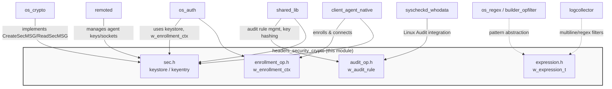
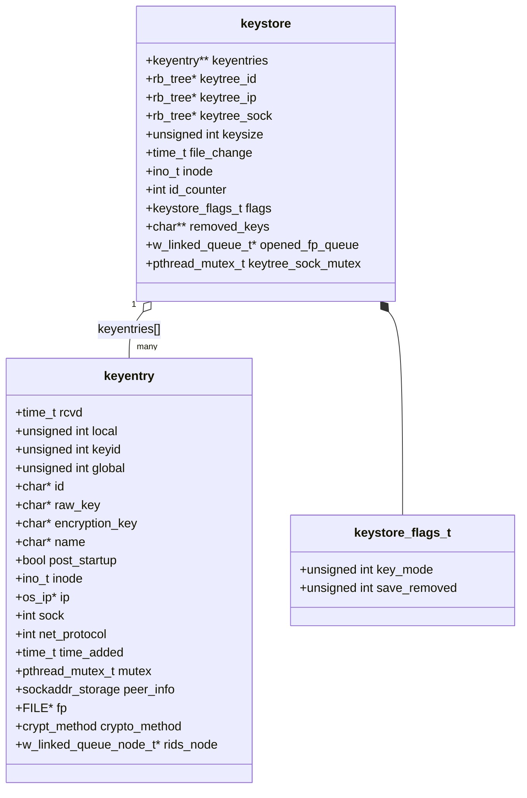
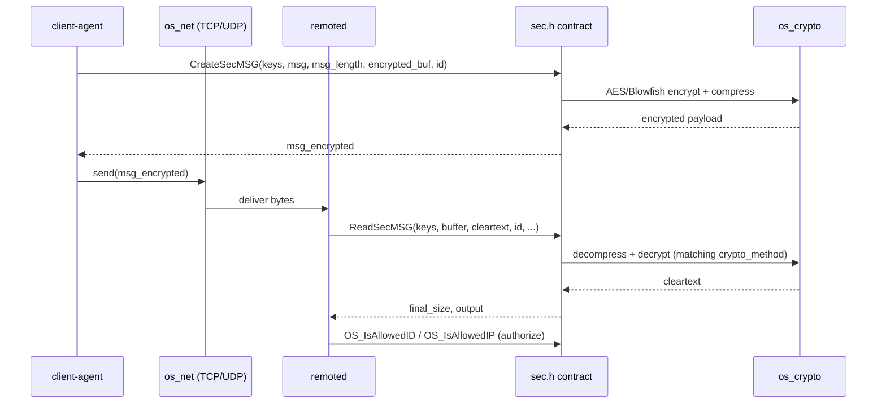
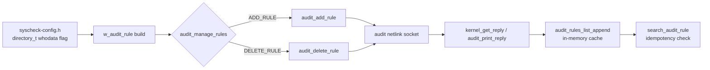
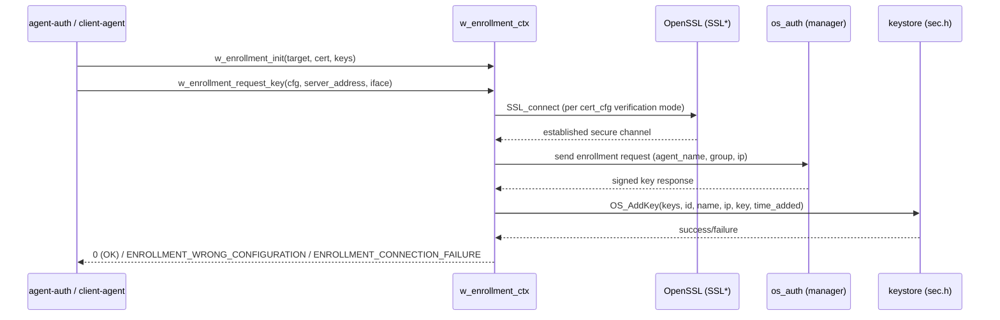
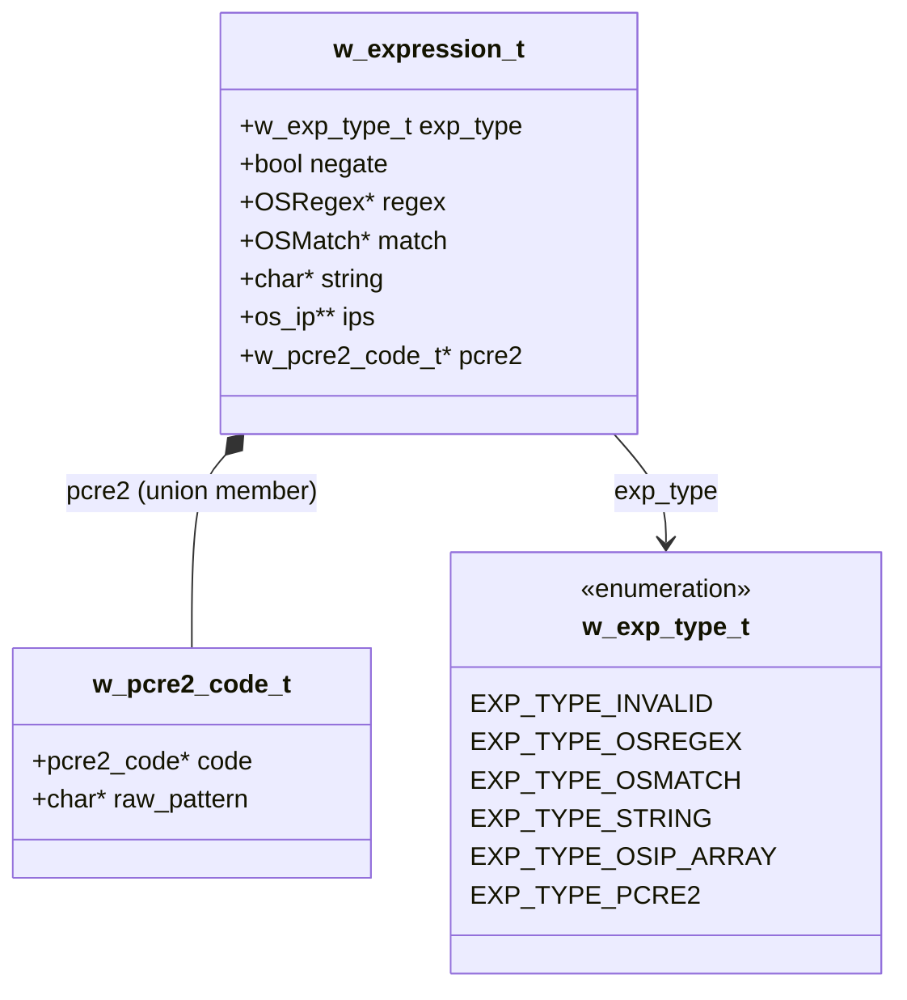
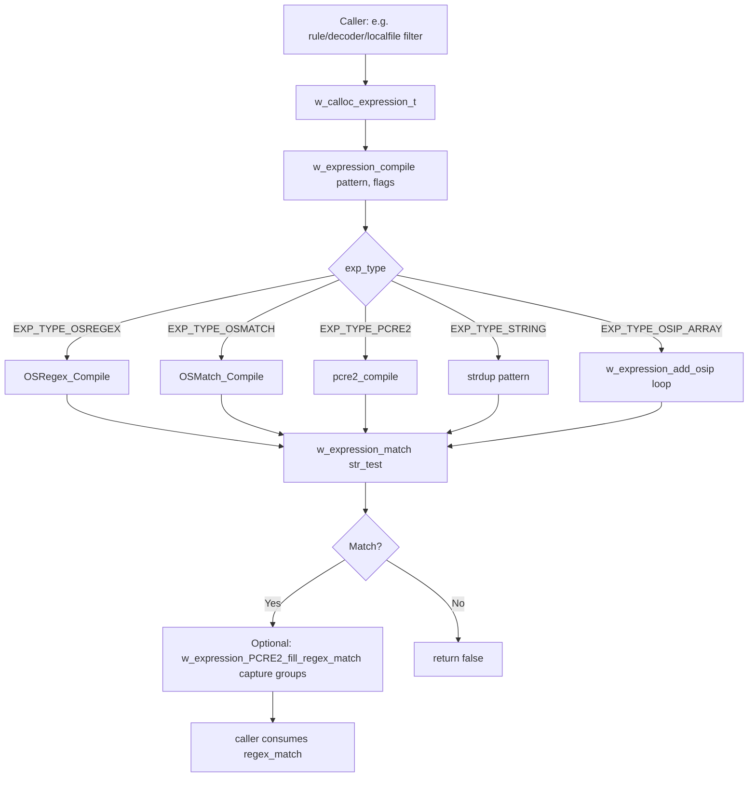

# Security & Crypto Headers (`headers_security_crypto`)

## Introduction

The **`headers_security_crypto`** module is a foundational C header collection that defines the core data structures and function contracts used throughout the Wazuh agent/manager native daemons for **agent authentication, key management, secure messaging, Linux audit-rule handling, agent enrollment, and pattern/regex matching**.

Unlike a runtime component, this module contains **no business logic implementation** — it is a set of interface/data-structure definitions (`.h` files) consumed by many native daemons (`remoted`, `os_auth`, `os_crypto`, `client-agent`, `syscheckd`, `shared` library, etc.) to guarantee a common, ABI-stable view of:

- The agent **keystore** (`keyentry`, `keystore`) used to authenticate and encrypt/decrypt traffic between agents and the manager.
- **Linux Audit** rule specifications (`w_audit_rule`) used by FIM's *whodata* mode.
- The **enrollment** context (`w_enrollment_ctx`) used by `agent-auth`/`os_auth` to register new agents against a manager.
- A unified **expression** abstraction (`w_expression_t`) that wraps `OSRegex`, `OSMatch`, PCRE2, plain strings, and IP-address arrays used by the rule/decoder engine and various validators.

Because these are pure headers, this document focuses on the **data model**, the **contracts** they establish, and **how other modules depend on and implement them**.

---

## Module Position in the System

This module is a child of [headers](headers.md) (part of the [Agent & Manager Native Daemons (C)](Agent_&_Manager_Native_Daemons_(C).md) domain), sitting alongside:

- [headers_concurrency](headers_concurrency.md) – threading/queue primitives
- [headers_data_structures](headers_data_structures.md) – generic containers (lists, hashes, trees)
- [headers_system_io](headers_system_io.md) – filesystem/process utilities
- [headers_fim_domain](headers_fim_domain.md) – FIM/rootcheck domain structures
- [headers_ipc_process](headers_ipc_process.md) – IPC and process execution primitives

It is directly consumed by:

- [os_auth](os_auth.md) – enrollment server/client (`auth.c`, `main-server.c`, `ssl.c`) and key-request daemon logic.
- [os_crypto](os_crypto.md) – SHA1/MD5/AES/Blowfish implementations that back `CreateSecMSG`/`ReadSecMSG`.
- [remoted](remoted.md) – manager-side connection handling, which owns and queries the `keystore`.
- [client_agent_native](client_agent_native.md) – agent-side connection/enrollment (`agentd.c`, `notify.c`).
- [shared_lib](shared_lib.md) – `agent_op.c`, `audit_op.c`, and other shared helpers that manipulate keys and audit rules.
- Rule/decoder related engines (`os_regex`, `logcollector`, `rootcheck`) that use `w_expression_t` as the common pattern-matching abstraction.



---

## Files in this Module

| File | Purpose |
|---|---|
| `src/headers/sec.h` | Defines the agent **keystore** (`keystore`, `keyentry`), crypto method enums, and the full function-prototype contract for key I/O, agent authorization, and secure message encode/decode (`CreateSecMSG`/`ReadSecMSG`). |
| `src/headers/audit_op.h` | Defines `w_audit_rule` and the Linux Audit (`libaudit`) rule-management contract (add/delete/list/restart), gated by `ENABLE_AUDIT`. |
| `src/headers/enrollment_op.h` | Defines the enrollment context (`w_enrollment_ctx`, `w_enrollment_target`, `w_enrollment_cert`) used to register an agent against a manager over TLS. |
| `src/headers/expression.h` | Defines `w_expression_t`, a tagged union abstracting `OSRegex`, `OSMatch`, PCRE2 compiled patterns, plain strings, and IP arrays, with a uniform compile/match API. |

---

## 1. Key Management & Secure Messaging (`sec.h`)

### Purpose
`sec.h` is the central contract for **agent identity and secure channel state** on both the manager (`remoted`, `os_auth`) and the agent (`client-agent`) sides. It defines how agent keys are stored, looked up, refreshed, and used to encrypt/decrypt the OSSEC/Wazuh wire protocol.

### Core Data Structures



- **`keystore`** is the in-memory, thread-safe registry of all known agents. It maintains three red-black trees (by ID, IP, and socket) for O(log n) lookups — these depend on [headers_data_structures](headers_data_structures.md)'s `rb_tree`.
- **`keyentry`** holds per-agent state: cryptographic keys (raw/AES), network identity (`os_ip`, `sockaddr_storage`), the TCP file descriptor, current protocol, and a per-entry mutex for concurrent access from multiple worker threads in `remoted`.
- Atomic fields (`_Atomic time_t rcvd`, `_Atomic bool post_startup`, `_Atomic int net_protocol`, `_Atomic crypt_method crypto_method`) allow lock-free reads from hot paths, coordinating with [headers_concurrency](headers_concurrency.md) primitives elsewhere in the codebase.

### Function Contract Highlights
- **Lifecycle**: `OS_ReadKeys`, `OS_UpdateKeys`, `OS_FreeKeys`, `OS_CheckUpdateKeys` — reload `client.keys` when the file changes on disk.
- **Mutation**: `OS_AddKey`, `OS_DeleteKey`, `OS_WriteKeys`, `OS_DupKeys`/`OS_DupKeyEntry`.
- **Authorization**: `OS_IsAllowedIP`, `OS_IsAllowedID`, `OS_IsAllowedName`, `OS_IsAllowedDynamicID`.
- **Socket association**: `OS_AddSocket`, `OS_DeleteSocket` — bridges `keyentry.sock` with `remoted`'s connection table (see [remoted](remoted.md) `manager.c`).
- **Secure messaging**: `CreateSecMSG` (encrypt + compress outbound) and `ReadSecMSG` (decrypt + decompress inbound), which internally rely on the encryption primitives implemented in [os_crypto](os_crypto.md) (AES/Blowfish/SHA1) and compression logic in [shared_lib](shared_lib.md).
- **Hashing helper**: `w_get_key_hash` produces a SHA1 digest of an agent key (uses `os_sha1` type from `os_crypto/sha1`).

### Message Encryption/Decryption Flow



---

## 2. Linux Audit Rule Management (`audit_op.h`)

### Purpose
Defines the structure and contract used to synchronize Wazuh's FIM **whodata** monitoring with the Linux Audit subsystem (`libaudit`). Only compiled when `ENABLE_AUDIT` is defined (Linux builds).

### Core Structure
```c
typedef struct {
    char *path; // Path of the monitored folder
    int perm;   // Permission access type (read/write/attrib/etc.)
    char *key;  // Filter key used to tag/search the audit rule
} w_audit_rule;
```

### Contract Highlights
- **Rule list management**: `init_audit_rule_list`, `audit_rules_list_append`, `audit_rules_list_free`, `search_audit_rule` — an in-memory cache of currently loaded rules (backed by [headers_data_structures](headers_data_structures.md)'s `OSList`).
- **Kernel interaction**: `audit_get_rule_list`, `kernel_get_reply`, `audit_print_reply` — netlink communication with the audit kernel subsystem.
- **Mutation**: `audit_add_rule`, `audit_delete_rule`, `audit_manage_rules` (generic add/delete dispatcher), and `audit_restart` to restart the `auditd` service.
- **Path normalization**: `audit_clean_path` converts Audit's relative `cwd + path` pairs into absolute paths for FIM correlation.

This structure is consumed primarily by [syscheckd_whodata](Syscheck___FIM_Daemon_(C_C++).md) (`syscheck_audit.c`, `audit_rule_handling`) and validated extensively in [Unit_Tests_-_Syscheck_FIM](Unit_Tests_-_Syscheck_FIM.md) (`test_audit_parse.c`, `test_audit_rule_handling.c`, `test_syscheck_audit.c`).



---

## 3. Agent Enrollment (`enrollment_op.h`)

### Purpose
Encapsulates the entire **enrollment/registration handshake** an agent performs against a manager (or `authd`) to obtain a valid key pair, supporting multiple verification levels (none, password, manager cert, mutual TLS).

### Core Data Structures

```mermaid
classDiagram
    class w_enrollment_ctx {
        +w_enrollment_target* target_cfg
        +w_enrollment_cert* cert_cfg
        +keystore* keys
        +SSL* ssl
        +bool enabled
        +bool allow_localhost
        +time_t delay_after_enrollment
        +char* agent_version
        +int recv_timeout
    }
    class w_enrollment_target {
        +char* manager_name
        +int port
        +uint32_t network_interface
        +char* agent_name
        +char* centralized_group
        +char* sender_ip
        +int use_src_ip
    }
    class w_enrollment_cert {
        +char* ciphers
        +char* authpass_file
        +char* authpass
        +char* agent_cert
        +char* agent_key
        +char* ca_cert
        +unsigned int auto_method
    }

    w_enrollment_ctx *-- w_enrollment_target : target_cfg
    w_enrollment_ctx *-- w_enrollment_cert : cert_cfg
    w_enrollment_ctx --> "sec.h" : keystore* keys
```

Note that `w_enrollment_ctx.keys` is a direct pointer to the same `keystore` structure defined in `sec.h`, tying the enrollment process directly to key persistence.

### Enrollment Verification Modes
1. **Simple** – only TLS ciphers negotiated.
2. **Password** – `authpass`/`authpass_file` shared secret.
3. **Manager verification** – `ca_cert` validates the manager's certificate.
4. **Mutual TLS** – `agent_cert` + `agent_key` for full mutual authentication.

### Contract Highlights
- Construction/destruction: `w_enrollment_target_init/destroy`, `w_enrollment_cert_init/destroy`, `w_enrollment_init/destroy`.
- Core operation: `w_enrollment_request_key(cfg, server_address, network_interface)` — performs the full TLS handshake, sends the enrollment request, and persists the returned key via the `keystore` contract from `sec.h`.

### Enrollment Sequence



This flow is implemented server-side in [os_auth](os_auth.md) (`main-server.c`, `ssl.c`) and exercised by [Unit_Tests_-_OS_Auth](Unit_Tests_-_OS_Auth.md) (`test_auth_add.c`, `test_generate_cert.c`) and [Unit_Tests_-_Shared_Library](Unit_Tests_-_Shared_Library.md) (`test_enrollment_op.c`).

---

## 4. Unified Expression / Pattern Matching (`expression.h`)

### Purpose
Provides a single abstraction, `w_expression_t`, so that rule/decoder/validator code does not need to know whether the underlying pattern is an `OSRegex`, `OSMatch`, a raw PCRE2 program, a literal string, or an array of IP CIDR ranges (`os_ip`). This directly supports [os_regex](os_regex.md) consumers across `logcollector`, `rootcheck`, and the analysis engine.

### Core Data Structures



The union nature (`regex`/`match`/`string`/`ips`/`pcre2` share storage) keeps memory usage low while `exp_type` acts as the discriminant tag — a classic tagged-union / variant pattern.

### Contract Highlights
- **Allocation**: `w_calloc_expression_t(var, type)` zero-initializes based on the desired type.
- **Compilation**: `w_expression_compile(expression, pattern, flags)` dispatches to the correct backend compiler (`OSRegex_Compile`, `OSMatch_Compile`, `pcre2_compile`, or plain string copy / `os_ip` parsing).
- **Matching**: `w_expression_match(expression, str_test, end_match, regex_match)` — uniform true/false matching regardless of backend, optionally returning capture groups via `regex_matching` (defined in [os_regex](os_regex.md)).
- **IP array support**: `w_expression_add_osip` appends parsed CIDR/IP entries when `exp_type == EXP_TYPE_OSIP_ARRAY`.
- **Introspection**: `w_expression_get_regex_pattern` / `w_expression_get_regex_type` for logging/debugging.
- **Cleanup**: `w_free_expression_t` / `w_free_expression` release the underlying backend resources based on `exp_type`.

### Matching Flow



This abstraction is validated by [Unit_Tests_-_Shared_Library](Unit_Tests_-_Shared_Library.md)'s `test_expression.c`, which covers every backend (`OSREGEX`, `OSMATCH`, `PCRE2`, `STRING`, `OSIP_ARRAY`) and both positive/negative match paths, including the `negate` flag.

---

## Cross-Cutting Design Notes

1. **Concurrency-safety**: Both `keystore` (via `pthread_mutex_t keytree_sock_mutex` and per-`keyentry` mutexes) and the `_Atomic` fields in `keyentry` are designed for `remoted`'s multi-threaded connection handling — see [headers_concurrency](headers_concurrency.md) for the underlying primitives (`rwlock_op.h`, `queue_op.h`) used alongside these structures.
2. **Dependency on data structures**: `keystore` relies on `rb_tree` (red-black tree) and `w_linked_queue_t`/`w_linked_queue_node_t`, both defined in [headers_data_structures](headers_data_structures.md).
3. **Dependency on I/O headers**: Socket-level types (`sockaddr_storage`) and file handles (`FILE *fp`) tie into [headers_system_io](headers_system_io.md) and [headers_ipc_process](headers_ipc_process.md) (e.g. `_socket_forwarder` in `shared.h`).
4. **No implementation here**: Actual encryption routines live in [os_crypto](os_crypto.md); actual audit netlink I/O and enrollment TLS handshakes are implemented in [os_auth](os_auth.md) and [shared_lib](shared_lib.md) (`audit_op.c`, `enrollment_op.c` is conceptually paired with this header but the `.c` counterpart lives under `shared/`).
5. **Testing**: Nearly every structure/function declared here has dedicated coverage under [Unit_Tests_-_Shared_Library](Unit_Tests_-_Shared_Library.md) (`test_audit_op.c`, `test_enrollment_op.c`, `test_expression.c`) and [Unit_Tests_-_OS_Auth](Unit_Tests_-_OS_Auth.md) / [Unit_Tests_-_OS_Crypto](Unit_Tests_-_OS_Crypto.md).

---

## Summary Table: Structure → Primary Consumers

| Structure | Defined In | Primary Consumers |
|---|---|---|
| `keystore`, `keyentry` | `sec.h` | [remoted](remoted.md), [os_auth](os_auth.md), [client_agent_native](client_agent_native.md), [shared_lib](shared_lib.md) |
| `w_audit_rule` | `audit_op.h` | [syscheckd_whodata](Syscheck___FIM_Daemon_(C_C++).md), [shared_lib](shared_lib.md) (`audit_op.c`) |
| `w_enrollment_ctx` / `w_enrollment_target` / `w_enrollment_cert` | `enrollment_op.h` | [os_auth](os_auth.md), [client_agent_native](client_agent_native.md) |
| `w_expression_t` / `w_pcre2_code_t` | `expression.h` | [os_regex](os_regex.md), [logcollector](logcollector.md), rule/decoder builders, [rootcheck](rootcheck.md) |

---

## Related Documentation
- [headers](headers.md) — parent module overview
- [headers_concurrency](headers_concurrency.md), [headers_data_structures](headers_data_structures.md), [headers_system_io](headers_system_io.md), [headers_fim_domain](headers_fim_domain.md), [headers_ipc_process](headers_ipc_process.md) — sibling header groups
- [os_auth](os_auth.md) — enrollment server/client implementation
- [os_crypto](os_crypto.md) — cryptographic primitive implementations (AES, Blowfish, SHA1, MD5)
- [remoted](remoted.md) — manager-side agent connection & keystore management
- [os_regex](os_regex.md) — underlying `OSRegex`/`OSMatch` implementation wrapped by `w_expression_t`
- [shared_lib](shared_lib.md) — shared utility implementations (`audit_op.c`, agent key hashing helpers)
- [Unit_Tests_-_Shared_Library](Unit_Tests_-_Shared_Library.md), [Unit_Tests_-_OS_Auth](Unit_Tests_-_OS_Auth.md), [Unit_Tests_-_OS_Crypto](Unit_Tests_-_OS_Crypto.md) — test coverage for these contracts
