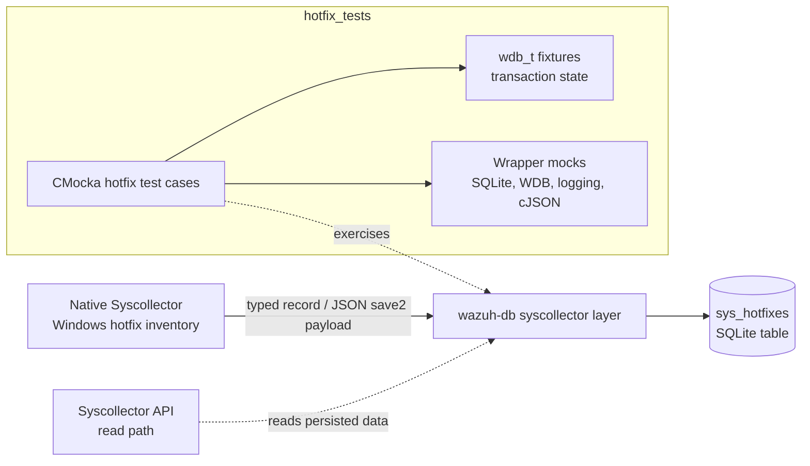
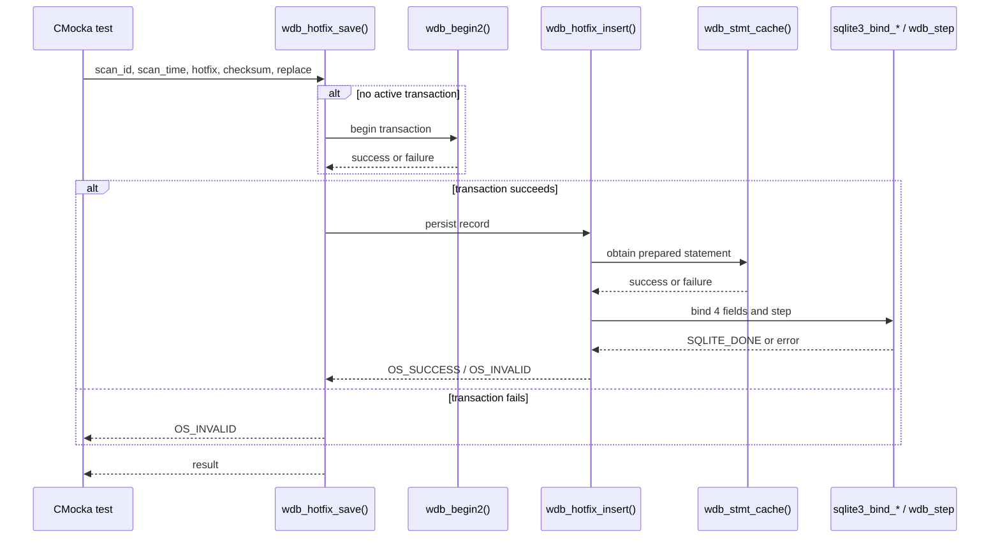
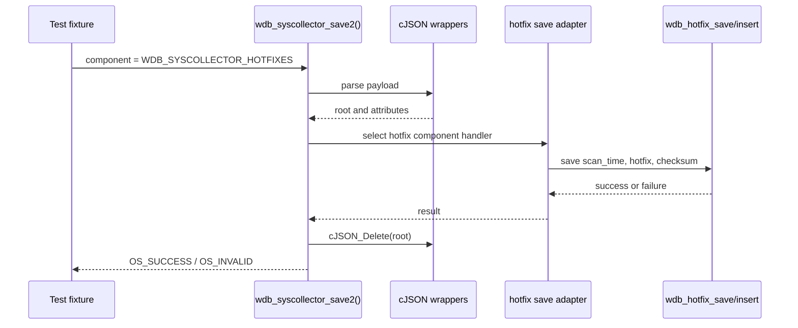
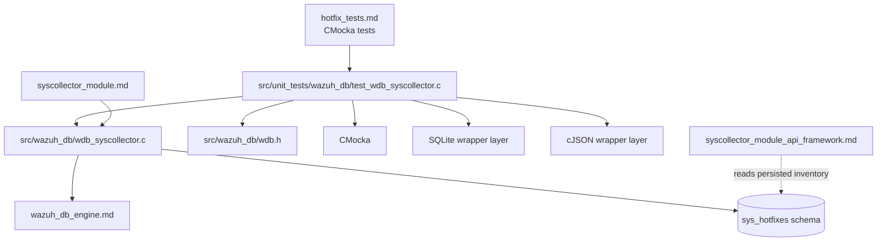

# `hotfix_tests`

## Introduction

`hotfix_tests` is the hotfix-focused unit-test slice of Wazuh's `wazuh-db` syscollector persistence tests. It verifies that Windows hotfix inventory records can be inserted, saved, and removed from an agent database while exercising the failure boundaries around transactions, prepared-statement caching, SQLite execution, null input, and duplicate/constraint handling.

The tests are implemented in [`src/unit_tests/wazuh_db/test_wdb_syscollector.c`](src/unit_tests/wazuh_db/test_wdb_syscollector.c). The source file also contains tests for other syscollector components; this document covers the hotfix-related tests only. For the shared CMocka fixtures, wrapper conventions, and the complete syscollector test suite, see [test_wdb_syscollector.md](test_wdb_syscollector.md).

## Role in the system

Hotfix data is collected by the native [syscollector_module.md](syscollector_module.md) and persisted by the `wazuh-db` syscollector implementation. The hotfix tests sit below the collection and API layers: they test the database-facing functions directly, with external dependencies replaced by CMocka wrappers.



The module is therefore a behavioral contract for the persistence boundary, not an end-to-end test of Windows update discovery or API serialization.

## Tested public behaviors

### Hotfix insertion

`wdb_hotfix_insert()` inserts one record using four logical fields:

| Bind position | Field | Meaning |
|---:|---|---|
| 1 | `scan_id` | Inventory scan identifier. |
| 2 | `scan_time` | Time at which the scan was collected. |
| 3 | `hotfix` | Hotfix identifier, for example `KB982573`. |
| 4 | `checksum` | Record checksum used by inventory synchronization. |

The tests cover:

- statement-cache failure, returning `OS_INVALID`;
- a missing hotfix identifier, returning `OS_INVALID` before a normal insert path;
- successful binding and `SQLITE_DONE`, returning `OS_SUCCESS`;
- generic SQLite step failure, logging the SQLite message and returning `OS_INVALID`.

The `replace` argument is passed through the production API and is part of the test record shape. The test expectations additionally verify that the four hotfix fields are bound in the expected order.

### Hotfix save orchestration

`wdb_hotfix_save()` is the higher-level operation used when a hotfix record arrives through the normal typed path. It begins a transaction when the `wdb_t` is not already in one, then delegates to `wdb_hotfix_insert()`.

The covered outcomes are:

- transaction begin failure;
- insert/statement-cache failure after a transaction is already active;
- successful transaction preparation followed by a successful insert.



### Hotfix deletion

`wdb_hotfix_delete()` removes existing hotfix rows for a scan identifier from `sys_hotfixes`. The tests verify the same three-stage failure model used by the other syscollector delete helpers:

1. begin a transaction;
2. cache the delete statement and bind `scan_id` at position 1;
3. execute the statement.

The expected results are `OS_INVALID` for transaction, statement-cache, or SQLite execution failure, and `OS_SUCCESS` for `SQLITE_DONE`.

```mermaid
flowchart TD
    Start[wdb_hotfix_delete(wdb, scan_id)] --> Tx{Transaction active?}
    Tx -->|no| Begin[wdb_begin2]
    Tx -->|yes| Cache[wdb_stmt_cache]
    Begin -->|failure| TxFail[Log cannot begin transaction\nreturn OS_INVALID]
    Begin -->|success| Cache
    Cache -->|failure| CacheFail[Log cannot cache statement\nreturn OS_INVALID]
    Cache -->|success| Bind[Bind scan_id]
    Bind --> Step[wdb_step]
    Step -->|SQLITE_DONE| Done[Return OS_SUCCESS]
    Step -->|other result| SqlFail[Log SQLite error\nreturn OS_INVALID]
```

## Test cases

The hotfix-specific cases are grouped in the source file as follows:

| Production function | Test cases | Main assertion |
|---|---|---|
| `wdb_hotfix_delete()` | `test_wdb_hotfix_delete_transaction_fail`, `test_wdb_hotfix_delete_cache_fail`, `test_wdb_hotfix_delete_sql_fail`, `test_wdb_hotfix_delete_success` | Transaction, cache, execution, and success behavior. |
| `wdb_hotfix_save()` | `test_wdb_hotfix_save_transaction_fail`, `test_wdb_hotfix_save_insert_fail`, `test_wdb_hotfix_save_success` | Save orchestration and delegation to insert. |
| `wdb_hotfix_insert()` | `test_wdb_hotfix_insert_stmt_cache_fail`, `test_wdb_hotfix_insert_hotfix_null`, `test_wdb_hotfix_insert_success`, `test_wdb_hotfix_insert_step_error` | Validation, statement caching, field binding, and SQLite errors. |
| `wdb_syscollector_save2()` | `test_wdb_syscollector_save2_hotfix_fail`, `test_wdb_syscollector_save2_hotfix_success` | JSON dispatch to the hotfix adapter and resource cleanup. |

The source also defines `hotfix_object` and `configure_wdb_hotfix_insert()`. The fixture uses representative values (`scan_id = "0"`, a timestamp, `KB982573`, and a SHA-1-like checksum), while `configure_wdb_hotfix_insert()` centralizes the expected statement-cache result, bind calls, and SQLite step result.

## JSON `save2` dispatch

`wdb_syscollector_save2()` is the JSON ingestion entry point. The hotfix tests configure a parsed JSON root and an attributes object, select `WDB_SYSCOLLECTOR_HOTFIXES`, and then assert either failure or success. The helper must delete the parsed cJSON object in both paths.



The hotfix-specific `save2` cases do not test malformed JSON parsing itself; those parser and component-selection cases are covered by neighboring tests in the parent `test_wdb_syscollector` module. Here they establish that a valid hotfix component reaches the correct persistence path and that an insertion failure propagates back to the dispatcher.

## Mocking and isolation strategy

The tests use CMocka `will_return`, `expect_value`, `expect_string`, and `expect_function_call` expectations. Production dependencies are wrapped through headers included by the source:

- Wazuh DB wrappers for transactions, statement caching, stepping, and inventory cleanup;
- SQLite wrappers for text/integer binding and error messages;
- cJSON wrappers for JSON parsing, attribute access, and deletion;
- logging wrappers for exact diagnostic messages.

This gives the tests deterministic control over each boundary without opening a real database. A failure is considered correct only when both the return code and the relevant diagnostic behavior match the production contract. For example, delete execution failures must report the `sys_hotfixes` table context, while insert step failures report the SQLite error text.

Two fixture styles exist in the containing C file:

- `test_setup()`/`test_teardown()` allocate a minimal `wdb_t` for focused low-level tests;
- `setup_wdb()`/`teardown_wdb()` allocate a more complete handle with ID, database pointer storage, statement slot, transaction flag, and output buffer for the later typed-record tests.

Neither fixture represents a live SQLite connection. The `wdb_t` state is only sufficient for exercising the selected control flow.

## Error and return-code contract

The hotfix tests use the Wazuh conventions shown below:

| Condition | Expected return | Expected side effect |
|---|---:|---|
| Transaction cannot begin | `OS_INVALID` / `-1` | Debug log identifies `wdb_hotfix_save()` or `wdb_hotfix_delete()`. |
| Statement cannot be cached | `OS_INVALID` / `-1` | Debug log identifies the hotfix operation. |
| Hotfix field is null | `OS_INVALID` / `-1` | Insert does not report a successful persistence result. |
| SQLite step returns `SQLITE_DONE` | `OS_SUCCESS` / `0` | Operation completes normally. |
| SQLite step returns a generic error | `OS_INVALID` / `-1` | Error log includes `sqlite3_errmsg()`. |
| SQLite constraint is treated as duplicate/replace-safe by production code | `OS_SUCCESS` / `0` | Diagnostic is debug-level where applicable. |

The exact duplicate-constraint behavior is exercised broadly by the neighboring syscollector insert tests; the hotfix-specific cases focus on the hotfix API's cache, null, success, and step-error boundaries.

## Dependencies and related documentation



- [test_wdb_syscollector.md](test_wdb_syscollector.md) — complete parent test module and shared fixture context.
- [wazuh_db_engine.md](wazuh_db_engine.md) — `wdb_t`, transactions, prepared-statement caching, and SQLite lifecycle.
- [syscollector_module.md](syscollector_module.md) — collection/write-path architecture and the API read path.
- [syscollector_module_api_framework.md](syscollector_module_api_framework.md) — management API access to persisted syscollector inventory.
- [wazuh_db.md](wazuh_db.md) — broader `wazuh-db` daemon role and database responsibilities.

## Maintenance guidance

When changing hotfix persistence code, update or add tests at the narrowest applicable layer:

1. Modify `wdb_hotfix_insert` tests when bind order, null handling, statement caching, or SQLite result handling changes.
2. Modify `wdb_hotfix_save` tests when transaction ownership or delegation changes.
3. Modify `wdb_hotfix_delete` tests when the delete SQL, binding, or error context changes.
4. Modify `wdb_syscollector_save2` hotfix tests when JSON field names, component dispatch, or cleanup behavior changes.

Keep wrapper expectations synchronized with the production bind order. A test that only checks the final return code can miss a schema/API regression where values are bound to the wrong columns.
