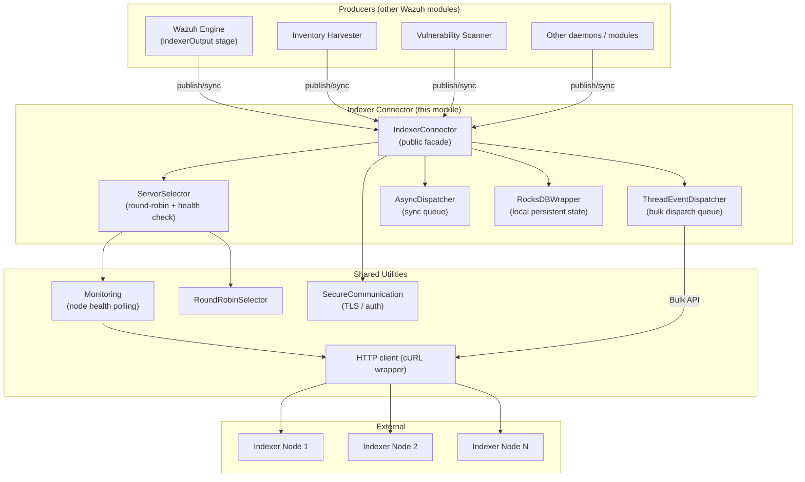
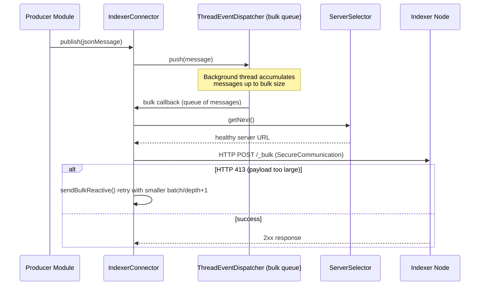
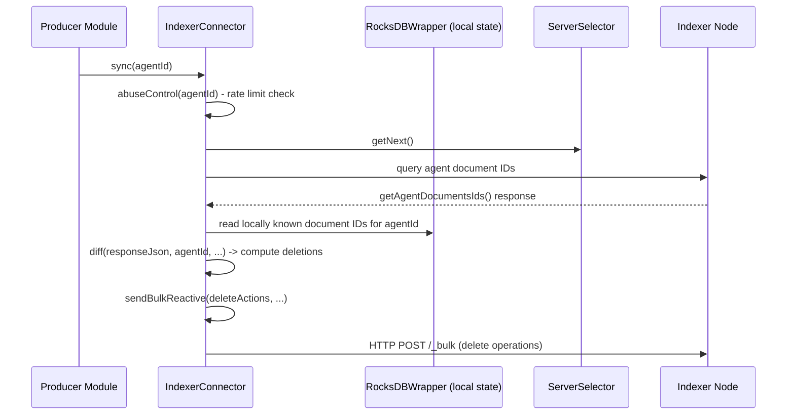

# Indexer Connector

## 1. Purpose

The **Indexer Connector** module is a small, self-contained C++ shared component that gives any Wazuh daemon or module (e.g. `wazuh-analysisd`, the [Wazuh Engine](Wazuh_Engine_Core_(C++).md), `inventory_harvester`, `vulnerability_scanner`) the ability to publish, index and synchronize JSON documents against a **Wazuh Indexer** (OpenSearch) cluster over its REST Bulk API.

It solves three recurring problems for every producer of indexer data:

1. **Reliable delivery** – documents are queued locally (backed by RocksDB) and dispatched asynchronously in bulk batches, surviving indexer downtime and process restarts.
2. **Cluster awareness / load balancing** – requests are distributed across the configured indexer nodes and unhealthy nodes are automatically skipped.
3. **State reconciliation ("diff")** – for inventory-style use cases, the connector can compare the local RocksDB-backed state against what is currently stored in the indexer and issue the corrective bulk operations (insertions/deletions) needed to bring them back in sync.

Because the class is used by many higher level modules (the [Wazuh Engine's `indexerconnector` sub-module](Wazuh_Engine_Core_(C++).md), the [inventory harvester](Advanced_Security_Modules_(C++_Inventory_&_Vulnerability).md) and the [vulnerability scanner](Advanced_Security_Modules_(C++_Inventory_&_Vulnerability).md)), it is packaged as part of [Shared Modules Infrastructure (C++)](Shared_Modules_Infrastructure_(C++).md), sitting next to sibling utilities such as `dbsync`, `rsync` and `router`.

> Note: there exists a near-identical, engine-scoped copy of this component under `src/engine/source/indexerconnector` (see `engine_indexerconnector` in the [Wazuh Engine](Wazuh_Engine_Core_(C++).md) module tree). This document covers the canonical **shared_modules** implementation; the engine copy shares the same design and API surface.

## 2. Architecture Overview

The module exposes a single public facade, `IndexerConnector`, and one internal helper, `ServerSelector`. Persistence, dispatch threading and cluster health-checking are delegated to shared utility building blocks documented in [shared_utils](shared_utils.md).



### Key responsibilities by component

| Component | File | Responsibility |
|---|---|---|
| `IndexerConnector` | `include/indexerConnector.hpp` | Public API: construction/initialization, `publish()`, `sync()`, bulk-sending, diff-based reconciliation, per-agent abuse control, error handling (e.g. HTTP 413 payload-too-large backoff). |
| `ServerSelector` | `src/serverSelector.hpp` | Picks the next healthy indexer node to target, built on top of `RoundRobinSelector` and `Monitoring`. |
| `Monitoring` *(shared utility, not owned by this module)* | `monitoring.hpp` | Periodically polls each configured server and tracks availability. |
| `SecureCommunication` *(shared utility)* | `secureCommunication.hpp` | Encapsulates TLS/basic-auth configuration used for every outgoing HTTP request. |
| `TRocksDBWrapper` | see [shared_utils → rocksdb_wrapper](shared_utils.md) | Local, on-disk key/value store used to remember what has already been published/synced, enabling recovery after restarts and diff computation. |
| `TThreadEventDispatcher` | see [shared_utils → threading_dispatch_queues](shared_utils.md) | Background thread(s) that pull queued documents and flush them to the indexer in bulk batches. |
| `RoundRobinSelector` | see [shared_utils → design_patterns](shared_utils.md) | Generic round-robin picker over a list of values (indexer URLs). |

## 3. Public API

### `IndexerConnector`

Two constructors are provided:

1. **Full mode** — `IndexerConnector(config, templatePath, updateMappingsPath, useSeekDelete, logFunction, timeout)`
   Loads an index template and mapping-update definition, creates/updates the target index on the indexer cluster, and starts the bulk-dispatch thread. Used by producers that actively index documents (e.g. inventory data, vulnerability alerts).

2. **Simplified / sync-only mode** — `IndexerConnector(config, useSeekDelete, logFunction)`
   Skips index/template management and only keeps the local RocksDB state synchronized — useful for components that only need to track what already exists in the indexer without pushing their own documents.

Core operations:

| Method | Purpose |
|---|---|
| `publish(const std::string& message)` | Enqueue a JSON bulk action/document for asynchronous delivery. |
| `sync(const std::string& agentId)` | Trigger a diff-based reconciliation for a given agent: compares local state vs. indexer state and issues corrective bulk operations. |
| *(private)* `initialize(...)` | Loads templates/mappings and creates index if needed; run in a dedicated startup thread (`m_initializeThread`). |
| *(private)* `diff(...)` | Computes the set of documents to delete based on `getAgentDocumentsIds()` vs. the local snapshot. |
| *(private)* `sendBulkReactive(...)` | Sends a batch of bulk actions, retrying with reduced payload / backoff on HTTP 413, recursing up to a depth limit. |
| *(private)* `abuseControl(...)` | Rate-limits how frequently a single agent can trigger expensive re-sync operations. |

### `ServerSelector`

```cpp
ServerSelector(const std::vector<std::string>& values,
               const uint32_t timeout = INTERVAL,
               const SecureCommunication& authentication = {});
std::string getNext(); // throws std::runtime_error("No available server") if none are healthy
```

`ServerSelector` privately inherits `RoundRobinSelector<std::string>` and layers a `Monitoring` instance on top: `getNext()` keeps cycling through the round-robin sequence until it finds a URL that `Monitoring::isAvailable()` reports as healthy, or gives up after a full cycle (throwing if no node is reachable).

## 4. Data Flow

### Publish (fire-and-forget indexing)



### Sync (diff-based reconciliation)



## 5. Dependencies and Related Modules

- **[Shared Modules Infrastructure (C++)](Shared_Modules_Infrastructure_(C++).md)** — parent module; sibling components include `dbsync`, `rsync`, `router`, and `content_manager`, all of which follow similar patterns (RocksDB-backed local state + async dispatch).
- **[shared_utils](shared_utils.md)** — supplies the generic building blocks used here: `TRocksDBWrapper` (rocksdb_wrapper), `TThreadEventDispatcher` / `TSafeQueue` (threading_dispatch_queues), `RoundRobinSelector` (design_patterns), and JSON helpers (json_utilities).
- **[Wazuh Engine Core (C++)](Wazuh_Engine_Core_(C++).md)** — the `engine_indexerconnector` sub-module and the `indexerOutput` builder stage (`builder_stage`) consume an equivalent connector to ship decoded/enriched events to the indexer; `engine_metrics`'s `IndexerMetricsExporter` also relies on the same connectivity pattern.
- **[Advanced Security Modules (C++ Inventory & Vulnerability)](Advanced_Security_Modules_(C++_Inventory_&_Vulnerability).md)** — `inventory_harvester_module` and `vulnerability_scanner_module` are the primary producers that call `publish()`/`sync()` to keep OpenSearch inventory/vulnerability indices up to date.

## 6. Design Notes

- **Two operating modes** let the connector be used both as a full indexing pipeline (template + mapping management, bulk publish) and as a lightweight state-tracking client (sync-only), avoiding code duplication across the many producers listed above.
- **Local durability first**: every important piece of state (pending bulk operations, last-known document IDs per agent) is written to RocksDB before being sent, so a crash or restart does not lose data — the dispatcher simply resumes draining the persisted queue.
- **Resilience to cluster issues** is handled at two levels: `ServerSelector`/`Monitoring` route around unhealthy nodes, while `sendBulkReactive`'s recursive backoff handles oversized-payload rejections (HTTP 413) from the receiving node.
- **Abuse control** (`abuseControl`) protects the indexer from being overwhelmed by frequent re-sync requests from the same agent, an important safeguard given that `sync()` can be triggered by external events (e.g. agent reconnection).
