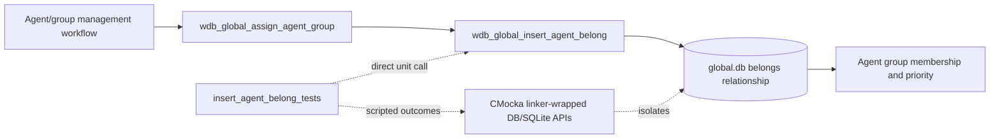
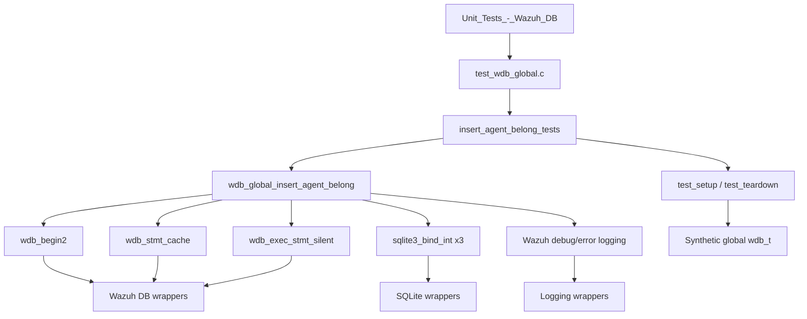
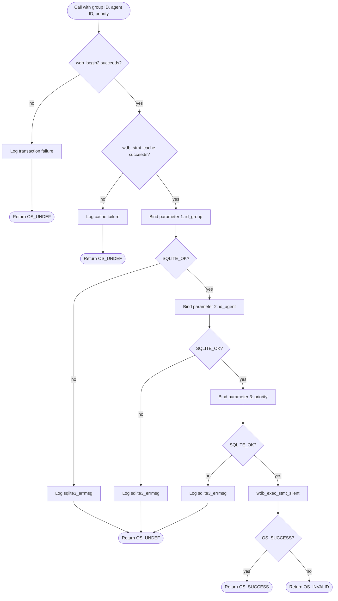
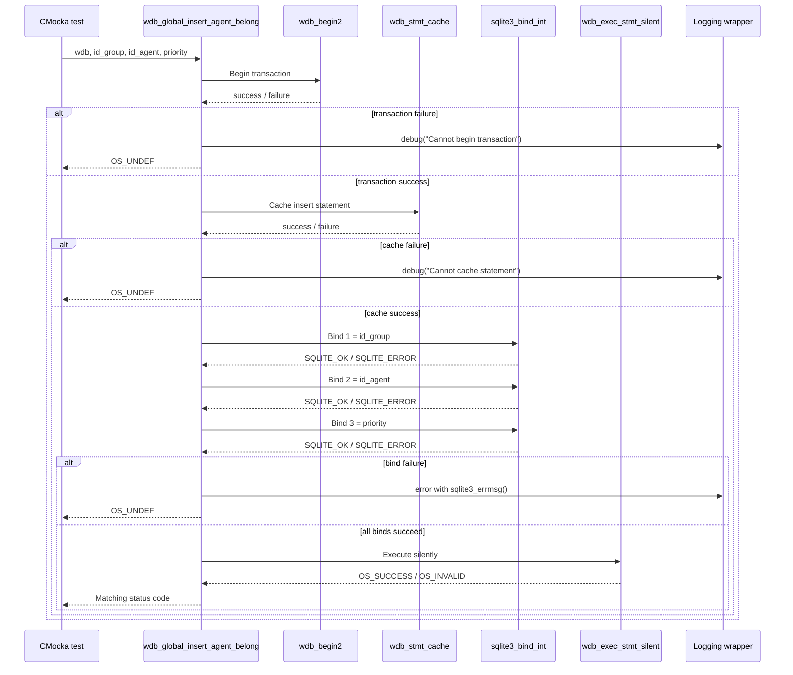
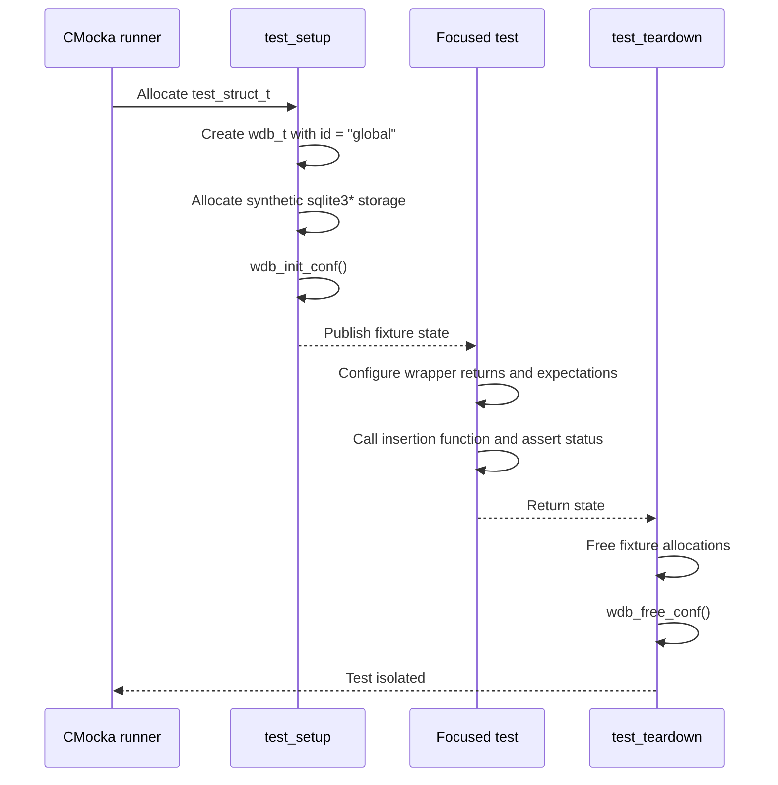

# `insert_agent_belong_tests`

## Introduction

`insert_agent_belong_tests` documents the focused CMocka tests for
`wdb_global_insert_agent_belong()`, the Wazuh DB operation that creates one
agent-to-group membership in the global database. The tests are defined in
`src/unit_tests/wazuh_db/test_wdb_global.c` and are registered in the global
Wazuh DB unit-test executable.

This is a leaf module within the broader [`test_wdb_global.md`](test_wdb_global.md)
suite. It verifies the database write path, parameter ordering, status-code
propagation, and short-circuit behavior for transaction, statement-cache,
SQLite binding, and statement-execution failures. The common fixture and
wrapper contracts are documented in
[`test_wdb_global_test_infrastructure.md`](test_wdb_global_test_infrastructure.md)
and [`wazuh_db_wrappers_global.md`](wazuh_db_wrappers_global.md).

## Purpose and system role

The target function inserts a row into the global database's agent/group
membership relationship, commonly called the `belongs` table. The row is
identified by a group ID and agent ID and carries a priority used when group
membership is ordered or recalculated.

In the wider system, this operation is composed by higher-level group
assignment workflows such as `wdb_global_assign_agent_group()` and
`wdb_global_set_agent_groups()`. Those workflows, including lookup,
validation, default-group handling, and group-context recalculation, are
covered by the broader global database documentation rather than repeated
here. The focused tests exercise only the primitive membership insertion.



## Architecture and dependencies



Relevant source-level dependencies are:

| Component | Role in this module |
|---|---|
| `src/wazuh_db/wdb_global.c` | Production implementation under test. |
| `src/wazuh_db/wdb.h` | Declares the database type, status constants, and target API. |
| `wdb_begin2()` | Starts the database transaction boundary. |
| `wdb_stmt_cache()` | Obtains/caches the prepared insert statement. |
| `sqlite3_bind_int()` | Binds group ID, agent ID, and priority in positions 1–3. |
| `wdb_exec_stmt_silent()` | Executes the write without a result-set payload. |
| `sqlite3_errmsg()` | Supplies deterministic text for bind-error assertions. |
| CMocka and linker wrappers | Script dependency outcomes and verify call arguments/order. |

The test does not open a real SQLite database. It supplies a structurally
valid `wdb_t` whose database pointer is synthetic, then controls each
dependency through wrappers.

## Operation contract

The tested call is:

```c
int wdb_global_insert_agent_belong(wdb_t *wdb,
                                   int id_group,
                                   int id_agent,
                                   int priority);
```

The expected prepared-statement parameter contract is:

| Parameter position | Value | Meaning |
|---:|---:|---|
| 1 | `id_group` | Existing group identifier. |
| 2 | `id_agent` | Existing agent identifier. |
| 3 | `priority` | Membership ordering priority. |

The operation returns `OS_SUCCESS` only after all three bindings and silent
statement execution succeed. Transaction setup, statement caching, and
binding failures return `OS_UNDEF` in the tested implementation path; a
silent execution failure returns `OS_INVALID`. These distinctions are part of
the current test contract and should be preserved unless the Wazuh DB status
API changes.

## Test cases

All cases use `id_group = 2`, `id_agent = 2`, and `priority = 0`, except where
the test name describes the injected failure stage.

| Test case | Injected condition | Expected result |
|---|---|---|
| `test_wdb_global_insert_agent_belong_transaction_fail` | `wdb_begin2()` returns `-1`. | Logs `Cannot begin transaction`; returns `OS_UNDEF`. |
| `test_wdb_global_insert_agent_belong_cache_fail` | `wdb_stmt_cache()` returns `-1`. | Logs `Cannot cache statement`; returns `OS_UNDEF`. |
| `test_wdb_global_insert_agent_belong_bind1_fail` | Binding parameter 1 (`id_group`) returns `SQLITE_ERROR`. | Logs the SQLite error; returns `OS_UNDEF`. |
| `test_wdb_global_insert_agent_belong_bind2_fail` | Binding parameter 2 (`id_agent`) returns `SQLITE_ERROR`. | Logs the SQLite error; returns `OS_UNDEF`. |
| `test_wdb_global_insert_agent_belong_bind3_fail` | Binding parameter 3 (`priority`) returns `SQLITE_ERROR`. | Logs the SQLite error; returns `OS_UNDEF`. |
| `test_wdb_global_insert_agent_belong_step_fail` | All binds succeed; silent execution returns `OS_INVALID`. | Returns `OS_INVALID`. |
| `test_wdb_global_insert_agent_belong_success` | Transaction, cache, all bindings, and execution succeed. | Returns `OS_SUCCESS`. |

The bind tests assert both the positional index and value. Consequently, they
detect accidental parameter reordering as well as failure propagation.

## Normal and failure flow



Each failure case stops at its injected boundary. CMocka expectations are
therefore also ordering checks: a failed transaction must not cache a
statement, a failed cache must not bind parameters, and a failed bind must
not execute the statement.

## Component interaction



The operation is a write-only database primitive. No cJSON result is
expected, and the test module deliberately asserts status codes and
diagnostics rather than a returned payload.

## Fixture and isolation

The cases are registered with `cmocka_unit_test_setup_teardown()`. The shared
fixture behavior is maintained in
[`test_wdb_global_test_infrastructure.md`](test_wdb_global_test_infrastructure.md);
the focused lifecycle is:



This prevents wrapper return values, configuration state, or fixture memory
from leaking between success and failure scenarios.

## Maintenance guidance

When changing the production insert path or its prepared SQL statement:

1. Keep coverage for transaction start, statement caching, all three bind
   positions, execution failure, and success.
2. Update the parameter-position assertions if the SQL statement changes.
3. Preserve the distinction between `OS_UNDEF` setup/bind failures and
   `OS_INVALID` execution failures unless the public status contract changes.
4. Add higher-level assignment behavior to the relevant group-management
   tests, not to this primitive leaf, to keep responsibilities separated.
5. Update links if the parent global-database or wrapper documentation is
   renamed.

## References

- [`test_wdb_global.md`](test_wdb_global.md) — complete global database test scope.
- [`test_wdb_global_test_infrastructure.md`](test_wdb_global_test_infrastructure.md) — fixture and composite wrapper helpers.
- [`wazuh_db_global.md`](wazuh_db_global.md) — production global database behavior and group-membership context.
- [`wazuh_db_wrappers_global.md`](wazuh_db_wrappers_global.md) — linker-wrapper contracts used by the tests.
- [`Unit_Tests_-_Wazuh_DB.md`](Unit_Tests_-_Wazuh_DB.md) — parent unit-test suite.
