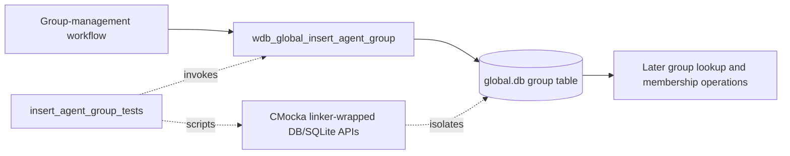
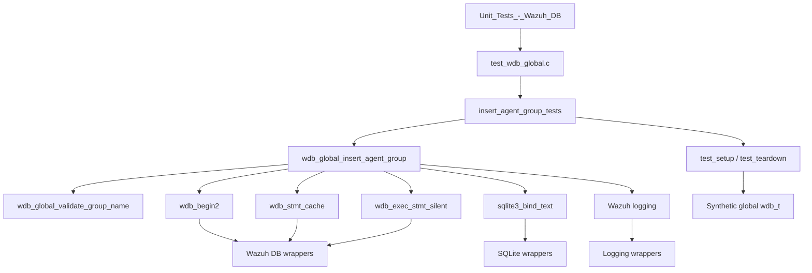
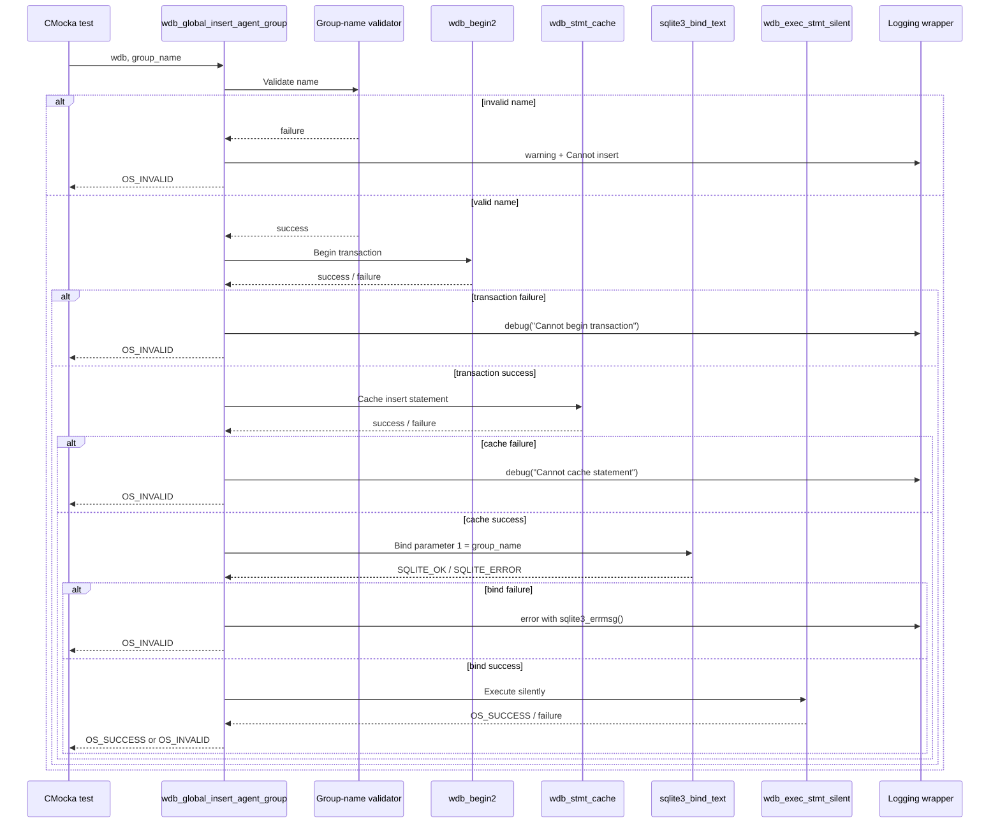
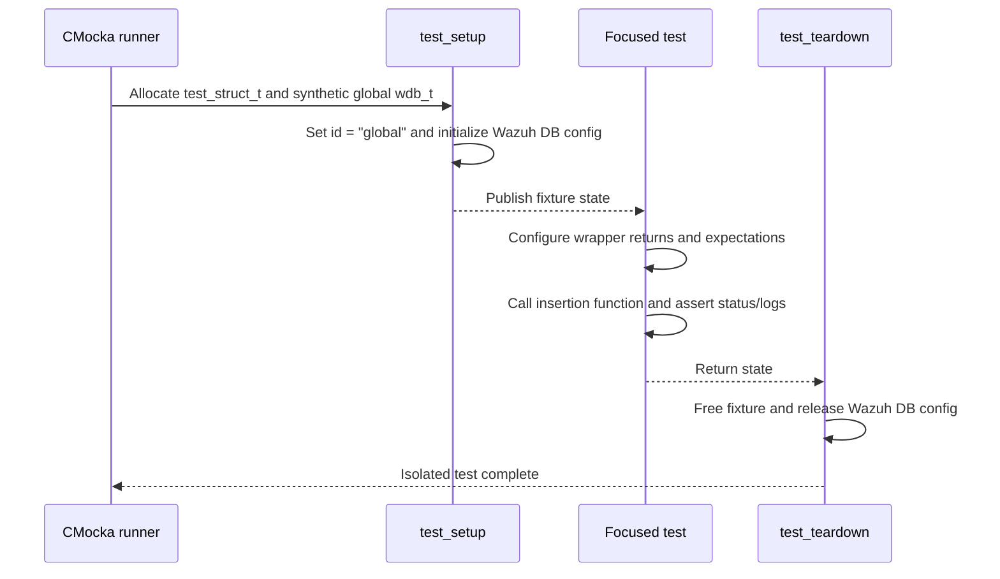

# `insert_agent_group_tests`

## Introduction

`insert_agent_group_tests` documents the focused CMocka coverage for
`wdb_global_insert_agent_group()`, the Wazuh DB operation that creates a group
record in the global SQLite database. The tests are defined in
`src/unit_tests/wazuh_db/test_wdb_global.c` and are registered in the shared
global-database unit-test executable.

This is a leaf module of [`test_wdb_global.md`](test_wdb_global.md). It tests
group-name validation and the write pipeline through transaction startup,
statement caching, SQLite parameter binding, and silent statement execution.
The common fixture and wrapper behavior are maintained in
[`test_wdb_global_test_infrastructure.md`](test_wdb_global_test_infrastructure.md).
Production group-management responsibilities are described in
[`wazuh_db_global.md`](wazuh_db_global.md).

## Purpose and system role

The target operation inserts one named group into the global database. Group
records are later resolved by higher-level assignment and synchronization
flows before rows are inserted into the agent/group relationship table. Those
composite workflows are outside this leaf; see
[`insert_agent_belong_tests.md`](insert_agent_belong_tests.md) for the adjacent
membership-insertion primitive.



## Architecture and dependencies



| Component | Role |
|---|---|
| `src/wazuh_db/wdb_global.c` | Production implementation under test. |
| `src/wazuh_db/wdb.h` | Declares the database context and operation-related status types. |
| `wdb_global_validate_group_name()` | Rejects invalid group names before any database write. |
| `wdb_begin2()` | Establishes the transaction boundary. |
| `wdb_stmt_cache()` | Retrieves or caches the prepared insert statement. |
| `sqlite3_bind_text()` | Binds the group name at statement position 1. |
| `wdb_exec_stmt_silent()` | Executes the write without returning a JSON result set. |
| CMocka/linker wrappers | Provide deterministic failures and verify call ordering and arguments. |

The tests do not open a real SQLite database. Each case receives the shared
synthetic `wdb_t` fixture and controls the database boundary through wrapped
functions.

## Operation contract

The tested call is:

```c
int wdb_global_insert_agent_group(wdb_t *wdb, char *group_name);
```

The expected write contract is:

| Stage | Input or condition | Expected behavior |
|---|---|---|
| Validation | `group_name` | Reject commas, slashes, `.`, `..`, and names longer than 255 characters. |
| Transaction | `wdb_begin2()` | Must succeed before statement setup. |
| Statement | `wdb_stmt_cache()` | Must return a usable cached statement. |
| Binding | SQLite parameter 1 | Bind the exact supplied group name with `sqlite3_bind_text()`. |
| Execution | `wdb_exec_stmt_silent()` | `OS_SUCCESS` completes the insert; failure is propagated as `OS_INVALID`. |

The invalid-name path returns before transaction setup. Database-stage failures
are short-circuited, so later dependencies must not be called after an earlier
failure.

## Test cases

The supplied core-component list identifies the database pipeline cases below;
the adjacent invalid-name test is included because it is part of the same
operation's public write guard and is registered alongside them.

| Test case | Injected condition | Expected result |
|---|---|---|
| `test_wdb_global_insert_agent_group_invalid_group_name` | Name contains a comma: `group_name,with_comma`. | Logs the validation warning and `Cannot insert 'group_name,with_comma'`; returns `OS_INVALID`. |
| `test_wdb_global_insert_agent_group_transaction_fail` | `wdb_begin2()` returns `-1`. | Logs `Cannot begin transaction`; returns `OS_INVALID`. |
| `test_wdb_global_insert_agent_group_cache_fail` | `wdb_stmt_cache()` returns `-1`. | Logs `Cannot cache statement`; returns `OS_INVALID`. |
| `test_wdb_global_insert_agent_group_bind_fail` | Binding parameter 1 returns `SQLITE_ERROR`. | Logs the SQLite error from `sqlite3_errmsg()`; returns `OS_INVALID`. |
| `test_wdb_global_insert_agent_group_step_fail` | Binding succeeds; silent execution returns `OS_INVALID`. | Returns `OS_INVALID`. |
| `test_wdb_global_insert_agent_group_success` | Validation, transaction, cache, binding, and execution succeed. | Returns `OS_SUCCESS`. |

The supplied core components identify the comma-containing name as the
invalid-name case. Broader validation rules—slash, reserved directory names,
and maximum length—are covered by sibling validation tests in the same source
file and are not part of this leaf's five core components.

## Normal and failure flow

```mermaid
flowchart TD
    Start([Call with group_name]) --> Valid{Group name valid?}
    Valid -- no --> Warn[Log validation warning]
    Warn --> InsertErr[Log Cannot insert message]
    InsertErr --> Invalid1([Return OS_INVALID])
    Valid -- yes --> Tx{wdb_begin2 succeeds?}
    Tx -- no --> TxLog[Log Cannot begin transaction]
    TxLog --> Invalid2([Return OS_INVALID])
    Tx -- yes --> Cache{wdb_stmt_cache succeeds?}
    Cache -- no --> CacheLog[Log Cannot cache statement]
    CacheLog --> Invalid3([Return OS_INVALID])
    Cache -- yes --> Bind[Bind parameter 1: group_name]
    Bind --> BindOK{SQLITE_OK?}
    BindOK -- no --> BindLog[Log sqlite3_errmsg()]
    BindLog --> Invalid4([Return OS_INVALID])
    BindOK -- yes --> Exec[wdb_exec_stmt_silent]
    Exec --> ExecOK{OS_SUCCESS?}
    ExecOK -- yes --> Success([Return OS_SUCCESS])
    ExecOK -- no --> Invalid5([Return OS_INVALID])
```

The CMocka expectations make the control-flow contract observable: a failed
validation must not begin a transaction, a failed transaction must not cache a
statement, and a failed bind must not execute the statement.

## Component interaction



## Fixture, isolation, and registration

Every case uses `cmocka_unit_test_setup_teardown()` with the shared
`test_setup` and `test_teardown` functions. The lifecycle details are owned by
[`test_wdb_global_test_infrastructure.md`](test_wdb_global_test_infrastructure.md):



## Maintenance guidance

- Preserve the parameter-position assertion for `sqlite3_bind_text()`; it
  detects prepared-statement reordering as well as binding failures.
- Keep validation tests separate from database-pipeline tests so a change to
  accepted group-name syntax does not obscure transaction or SQLite behavior.
- If the operation begins using a result payload, update this document and
  add cJSON ownership expectations; the current contract is write-only.
- When status constants or logging messages change, update the expected values
  in the table and flow descriptions together with the CMocka assertions.

## References

- [`test_wdb_global.md`](test_wdb_global.md) — complete global Wazuh DB test scope.
- [`test_wdb_global_test_infrastructure.md`](test_wdb_global_test_infrastructure.md) — fixture and wrapper helpers.
- [`wazuh_db_global.md`](wazuh_db_global.md) — production global database architecture and group-management workflows.
- [`insert_agent_belong_tests.md`](insert_agent_belong_tests.md) — adjacent agent/group relationship insertion tests.
- [`test_wdb_global.c`](../../src/unit_tests/wazuh_db/test_wdb_global.c) — source definitions and CMocka registration.
