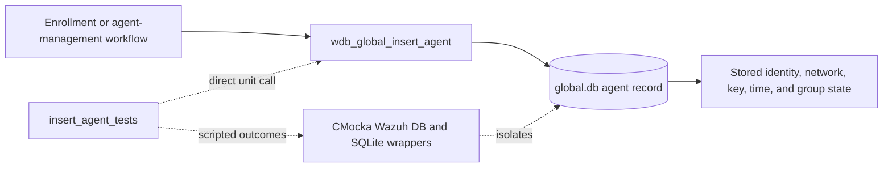
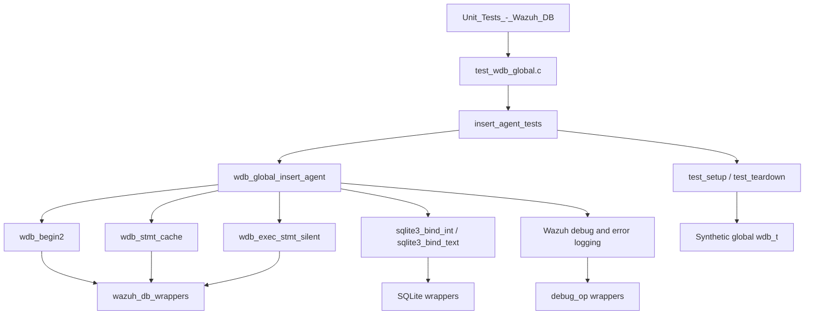
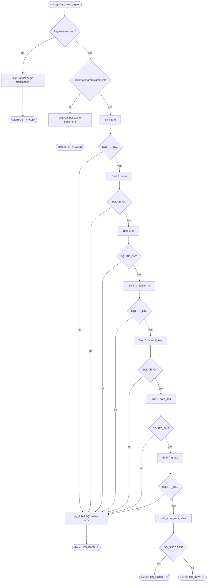
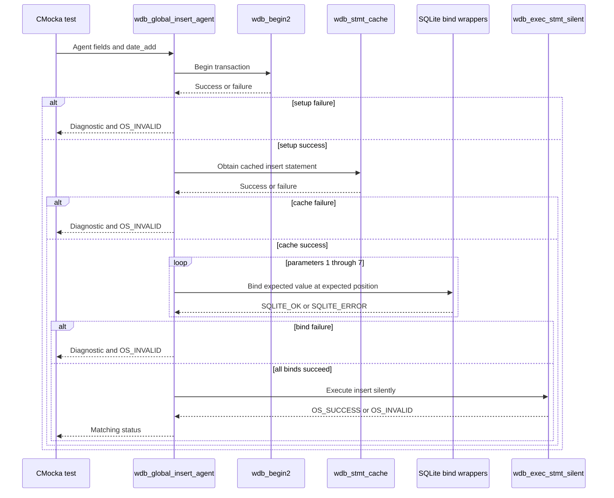
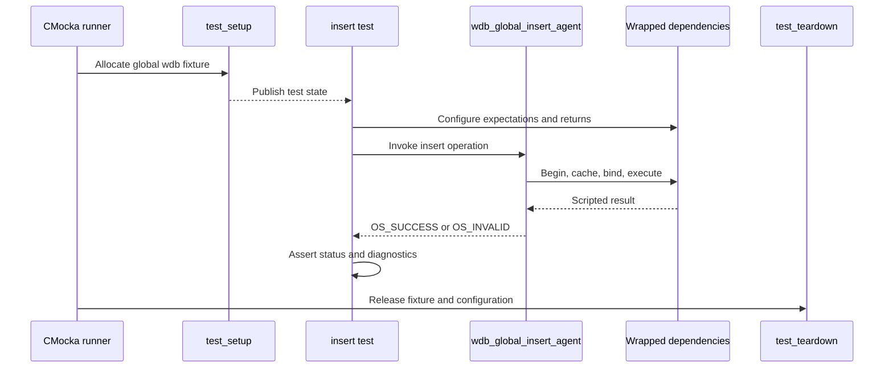

# `insert_agent_tests`

## Introduction

`insert_agent_tests` documents the CMocka tests for
`wdb_global_insert_agent()`, the Wazuh DB global-database operation that
creates or persists an agent record. The focused cases are defined in
`src/unit_tests/wazuh_db/test_wdb_global.c` and are registered in the global
Wazuh DB unit-test executable.

This is a leaf module of [`test_wdb_global.md`](test_wdb_global.md). It
concentrates on the insert write path: transaction startup, prepared-statement
caching, ordered SQLite parameter binding, silent statement execution, and
status-code propagation. The shared fixture and linker-wrapper behavior are
owned by the parent suite and are linked rather than duplicated here.

## Purpose and system role

The operation persists the manager's authoritative record for an agent in the
global database. The record includes identity and registration data, network
addresses, the agent key, registration time, and an initial group value. Agent
enrollment and manager-side agent administration use this persistence layer;
the broader database engine and command boundaries are described in
[`test_wdb.md`](test_wdb.md) and [`test_wdb_global.md`](test_wdb_global.md).



The tests do not open `global.db` or execute real SQL. They validate the
production function's observable contract at its database boundaries.

## Architecture



### Dependencies

| Dependency | Role in this module |
|---|---|
| `src/wazuh_db/wdb_global.c` | Production implementation under test. |
| `src/wazuh_db/wdb.h` | Declares `wdb_t`, status constants, and the target function. |
| `wdb_begin2()` | Controls transaction acquisition. |
| `wdb_stmt_cache()` | Controls prepared-statement lookup/caching. |
| `sqlite3_bind_int()` | Binds the numeric agent ID and registration timestamp. |
| `sqlite3_bind_text()` | Binds name, IP addresses, key, and group strings. |
| `wdb_exec_stmt_silent()` | Executes the insert without a result-set payload. |
| `sqlite3_errmsg()` | Supplies deterministic error text for bind failures. |
| CMocka/linker wrappers | Script outcomes, verify argument order, and capture diagnostics. |
| `wazuhdb_op.h` | Supplies Wazuh DB status and operation constants used by assertions. |

The wrapper catalog and maintenance guidance are documented in
[`wazuh_db_wrappers.md`](wazuh_db_wrappers.md). The common global-suite fixture
is described by [`test_wdb_global_test_infrastructure.md`](test_wdb_global_test_infrastructure.md)
when available.

## Operation contract

The tested call is:

```c
int wdb_global_insert_agent(wdb_t *wdb,
                            int id,
                            const char *name,
                            const char *ip,
                            const char *register_ip,
                            const char *internal_key,
                            const char *group,
                            int date_add);
```

The test expectations establish this prepared-statement parameter order:

| Position | Value | Meaning |
|---:|---|---|
| 1 | `id` | Numeric agent identifier. |
| 2 | `name` | Agent name. |
| 3 | `ip` | Current or configured agent IP. |
| 4 | `register_ip` | Registration-source IP. |
| 5 | `internal_key` | Agent authentication key. |
| 6 | `date_add` | Registration timestamp/value. |
| 7 | `group` | Initial group assignment value. |

The normal test input is `id = 1`, `name = "test_name"`, `ip = "test_ip"`,
`register_ip = "0.0.0.0"`, `internal_key = "test_key"`, `group =
"test_group"`, and `date_add = 100`. The transaction and statement wrappers
return success, every bind returns `SQLITE_OK`, and silent execution returns
`OS_SUCCESS`.

## Processing flow



The repeated bind cases are intentional: they prove that the function stops
at the first failed parameter and does not execute the statement afterward.
They also protect the positional SQL contract from accidental reordering.

## Test scenarios

| Test case | Injected condition | Expected behavior |
|---|---|---|
| `test_wdb_global_insert_agent_transaction_fail` | `wdb_begin2()` returns `-1`. | Expects `Cannot begin transaction`; returns `OS_INVALID`. |
| `test_wdb_global_insert_agent_cache_fail` | Transaction succeeds; `wdb_stmt_cache()` returns `-1`. | Expects `Cannot cache statement`; returns `OS_INVALID`. |
| `test_wdb_global_insert_agent_bind1_fail` | Binding `id` at position 1 returns `SQLITE_ERROR`. | Logs the SQLite error; returns `OS_INVALID`. |
| `test_wdb_global_insert_agent_bind2_fail` | Binding `name` at position 2 fails. | Logs the SQLite error; returns `OS_INVALID`. |
| `test_wdb_global_insert_agent_bind3_fail` | Binding `ip` at position 3 fails. | Logs the SQLite error; returns `OS_INVALID`. |
| `test_wdb_global_insert_agent_bind4_fail` | Binding `register_ip` at position 4 fails. | Logs the SQLite error; returns `OS_INVALID`. |
| `test_wdb_global_insert_agent_bind5_fail` | Binding `internal_key` at position 5 fails. | Logs the SQLite error; returns `OS_INVALID`. |
| `test_wdb_global_insert_agent_bind6_fail` | Binding `date_add` at position 6 fails. | Logs the SQLite error; returns `OS_INVALID`. |
| `test_wdb_global_insert_agent_bind7_fail` | Binding `group` at position 7 fails. | Logs the SQLite error; returns `OS_INVALID`. |
| `test_wdb_global_insert_agent_step_fail` | All binds succeed; silent execution returns `OS_INVALID`. | Returns `OS_INVALID`. |
| `test_wdb_global_insert_agent_success` | All dependencies succeed. | Returns `OS_SUCCESS`. |

Every bind-failure case supplies `"ERROR MESSAGE"` through
`sqlite3_errmsg()` and expects a diagnostic of the form
`DB(global) sqlite3_bind_*(): ERROR MESSAGE`.

## Component interaction



## Fixture and isolation

Each case is registered with `cmocka_unit_test_setup_teardown()`. The shared
`test_setup()` allocates a minimal `test_struct_t`, a synthetic `wdb_t` whose
ID is `"global"`, a placeholder database pointer, and an output buffer, then
initializes Wazuh DB configuration. No SQLite connection is opened.

`test_teardown()` releases the fixture allocations and frees the Wazuh DB
configuration. The insert tests do not need cJSON result ownership because
`wdb_exec_stmt_silent()` is a write-only operation.



## Relationship to neighboring modules

- [`test_wdb_global.md`](test_wdb_global.md) covers the complete global-database test family, including agent lifecycle, groups, synchronization, connection state, and backups.
- [`insert_agent_belong_tests.md`](insert_agent_belong_tests.md) covers the related membership-row primitive. Agent insertion may be followed by membership insertion in higher-level group workflows.
- [`get_agent_labels_tests.md`](get_agent_labels_tests.md) documents a representative read path using the same transaction, cache, bind, execute, and logging seams.
- [`wazuh_db_wrappers.md`](wazuh_db_wrappers.md) documents the reusable wrapper layer used to isolate SQLite and Wazuh DB calls.

## Maintenance guidance

When changing `wdb_global_insert_agent()` or its prepared statement:

1. Preserve coverage for transaction, cache, every bind position, execution, and success.
2. Update the parameter table and bind expectations if SQL parameter order changes.
3. Keep exact diagnostic assertions synchronized with intentional logging changes.
4. Retain the synthetic fixture and wrappers so tests remain independent of database files and daemon state.
5. Add integration coverage separately if validation, enrollment policy, or group assignment behavior changes; this leaf owns persistence-boundary behavior only.

## Source reference

- Production test source: `src/unit_tests/wazuh_db/test_wdb_global.c`
- Focused section: `/* Tests wdb_global_insert_agent */`
- Focused functions: `test_wdb_global_insert_agent_transaction_fail`, `..._cache_fail`, `..._bind1_fail` through `..._bind7_fail`, `..._step_fail`, and `..._success`
