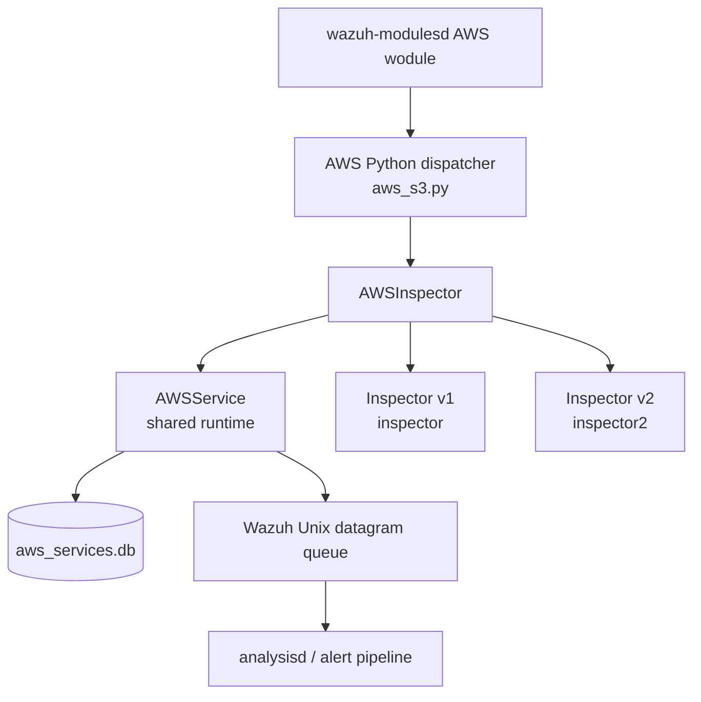
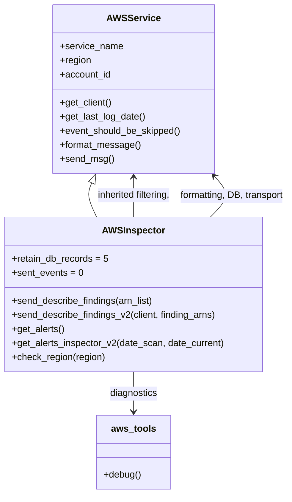
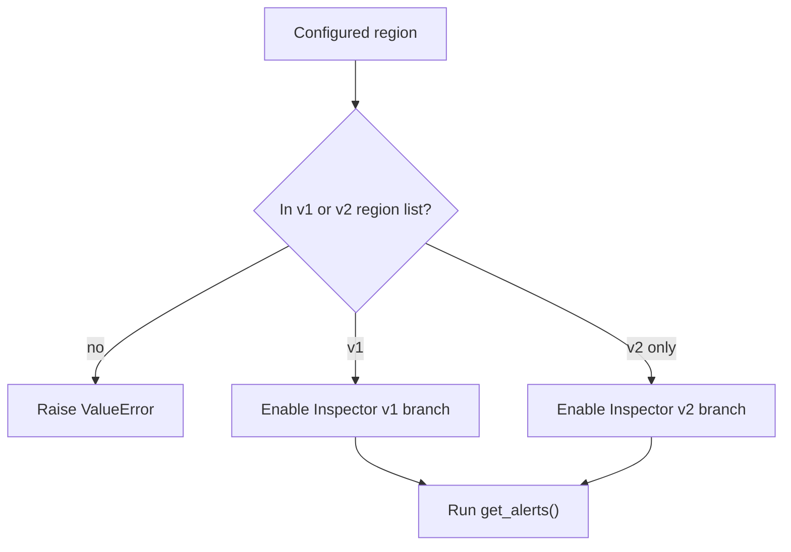
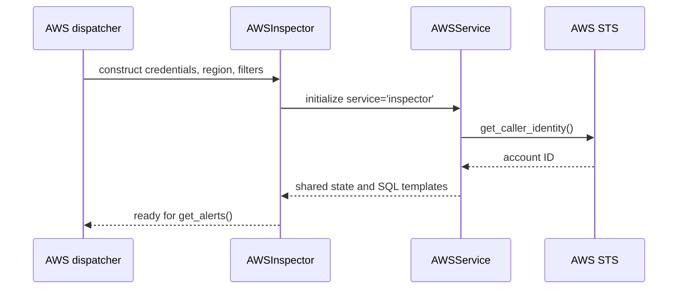
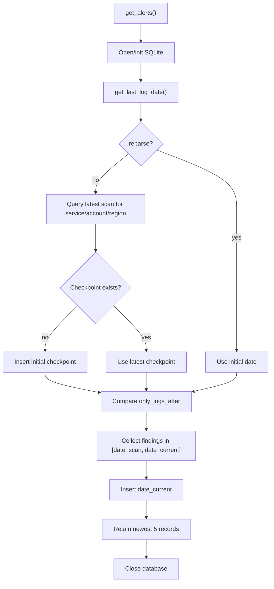
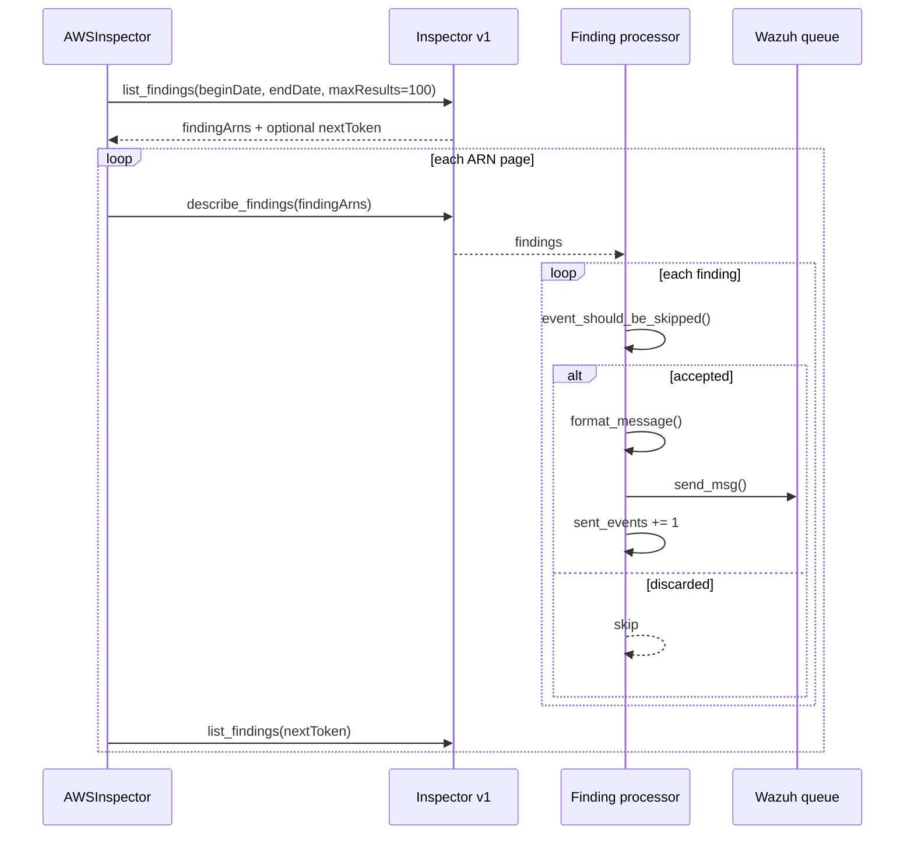
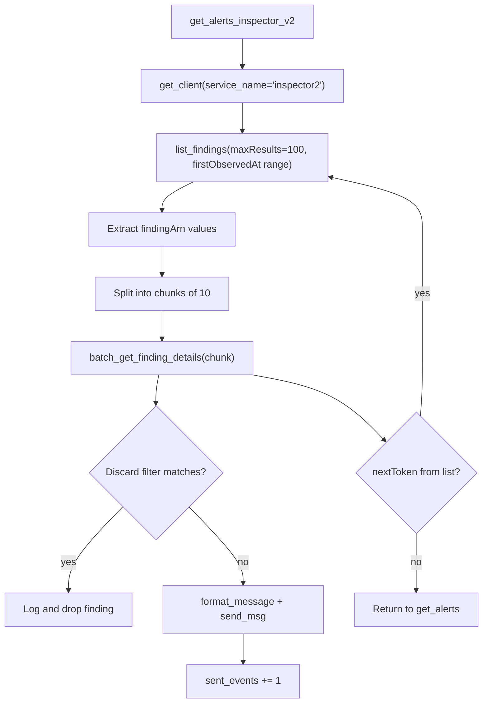
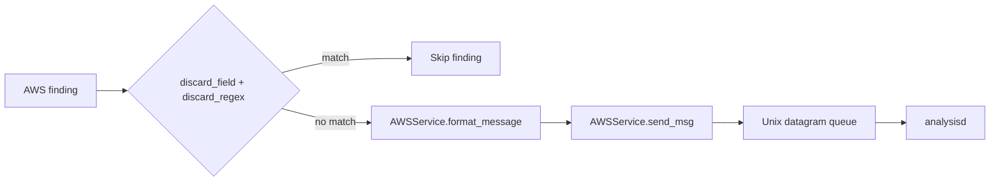

# AWS Inspector service

`AWSInspector` is the Python AWS-service adapter that retrieves Amazon Inspector findings and forwards them to Wazuh’s analysis pipeline. It supports both the original Inspector API (`inspector`) and Inspector v2 (`inspector2`), performs incremental collection using a shared SQLite checkpoint, applies the inherited discard filter, normalizes findings into Wazuh’s AWS event envelope, and sends accepted events through the common Wazuh queue.

The shared authentication, AWS client creation, event formatting, filtering, SQLite lifecycle, and queue transport are documented in [AWS service base](base_service.md) and [AWS core](aws_core.md). The native scheduler and service dispatch are documented in [AWS integration](aws.md).

## Position in the system

The adapter is selected by the AWS wodle when the configured service is `inspector`. The native module schedules the worker; `aws_s3.py` resolves regions and constructs one adapter per region; `AWSInspector` performs the AWS API calls and emits normalized events.

## Architecture and dependencies

The constructor calls the parent with `service_name='inspector'` and the default AWS service table. It then retains credentials, endpoint overrides, role duration, and region so that the v2 path can create a separate `inspector2` client. `account_id` is discovered by the parent through STS during construction.

## Supported regions

`INSPECTOR_V1_REGIONS` contains 12 regions. `INSPECTOR_V2_REGIONS` is that same tuple plus 19 additional regions, for 31 regions total in the supplied code. `check_region()` performs exact membership validation and raises `ValueError("Unsupported region '<region>'")` for any other value.

The two conditions in `get_alerts()` are independent `if` statements, not mutually exclusive branches. Since every v1 region is also in `INSPECTOR_V2_REGIONS`, a v1-supported region enters both the v1 and v2 collection paths. This is observable behavior of the current implementation and should be considered when changing region lists or deduplication logic.

## Initialization

Initialization is eager: failures in credentials, profile handling, IAM role assumption, or STS account discovery can prevent the adapter from being constructed. Those behaviors are inherited and should not be duplicated in this module; see [AWS core](aws_core.md#aws-client-and-authentication-flow).

## Incremental collection and persistence

`get_alerts()` opens or initializes the inherited AWS SQLite database using the parent’s default table name. It chooses the lower bound as follows:

1. Obtain the adapter’s initial date through `get_last_log_date()`.
2. If `reparse` is enabled, use that initial date directly.
3. Otherwise query the latest scan for `(service_name, account_id, region)`.
4. If no checkpoint exists, insert the initial date and use it as the first scan.
5. If `only_logs_after` is later than the checkpoint, use `only_logs_after`; otherwise use the checkpoint.
6. Use `datetime.utcnow()` as the exclusive operational end of the current run.

The adapter sets `retain_db_records = 5`. After processing it inserts the current scan date, runs inherited retention SQL for the service/account/region key, and closes the database. The database schema and transaction behavior are inherited from [AWS core](aws_core.md#sqlite-integration-and-progress-metadata).

## Inspector v1 flow

For a v1-enabled region, the adapter creates or uses the inherited `inspector` client and calls `list_findings` with `maxResults=100` and a `creationTimeRange`. It passes each returned ARN list to `send_describe_findings()`. Pagination continues while `nextToken` is present.

`send_describe_findings()` does nothing for an empty ARN list. Otherwise it requests full finding details, logs the number returned, filters each event, formats accepted records, and increments `sent_events` after sending.

## Inspector v2 flow

`get_alerts_inspector_v2()` creates a dedicated `inspector2` client through the inherited `get_client()` method. It calls v2 `list_findings` with a `firstObservedAt` range, extracts `findingArn` values, and follows `nextToken` pagination. Details are retrieved with `batch_get_finding_details`.

The chunk size is hard-coded to 10 to respect the v2 batch API limit. Exceptions from a v2 batch request are caught and logged at debug level 1; processing then continues with later chunks or the final checkpoint update. This is intentionally different from the v1 helper, which does not catch exceptions around `describe_findings`.

## Filtering, formatting, and delivery

Both API versions use the same inherited processing contract:

`format_message()` normalizes Inspector records. Findings with `findingArn` are tagged with `source='inspector2'`; date fields such as `createdAt` and `updatedAt` are converted by the parent formatter when they are datetime objects. The resulting record is placed under the standard `{integration: 'aws', aws: ...}` envelope. Filtering and serialization details are documented in [AWS core](aws_core.md#common-event-processing) and [AWS service base](base_service.md#event-formatting).

## Operational behavior

- `sent_events` is reset on construction and accumulates events sent during the current `get_alerts()` call.
- Empty result pages are valid; the run still advances the checkpoint to `date_current`.
- v1 uses creation-time filtering; v2 uses first-observed-time filtering.
- v1 pagination is performed with `list_findings` followed by `describe_findings`.
- v2 pagination is performed by repeated `list_findings`, while detail retrieval is batched in groups of ten.
- v2 detail retrieval catches broad exceptions and continues; v1 detail retrieval propagates failures to the caller.
- The final log reports either the number of processed events or that no new events were found for the region.
- Checkpoint maintenance occurs after collection, even when no findings were sent.

## Maintenance guidance

Changes to credentials, IAM role assumption, event filtering, message size, queue behavior, or SQLite metadata belong in the shared layers referenced below. Changes specific to Inspector should generally be limited to region support, API request construction, pagination, finding-detail retrieval, and service-specific field handling.

When adding a region, update both the validation tuple and the API branch intended for that region. Pay particular attention to the overlapping v1/v2 lists and test whether dual collection is desired. When changing date semantics, preserve the checkpoint key `(service, account, region)` and verify both `reparse` and `only_logs_after` behavior.

## References

- [AWS service base](base_service.md) — inheritance contract, event envelope, region/date helpers, and shared SQL templates.
- [AWS core](aws_core.md) — AWS clients, IAM roles, filtering, SQLite lifecycle, queue transport, and error handling.
- [AWS integration](aws.md) — native scheduling and Python service dispatch.
- [CloudWatch Logs service](cloudwatch_logs.md) — sibling service adapter using the same base class.
- `wodles/aws/services/inspector.py` — implementation documented here.
- `wodles/aws/services/aws_service.py` — inherited service runtime.
- `wodles/aws/aws_tools.py` — region diagnostics and shared validators.
