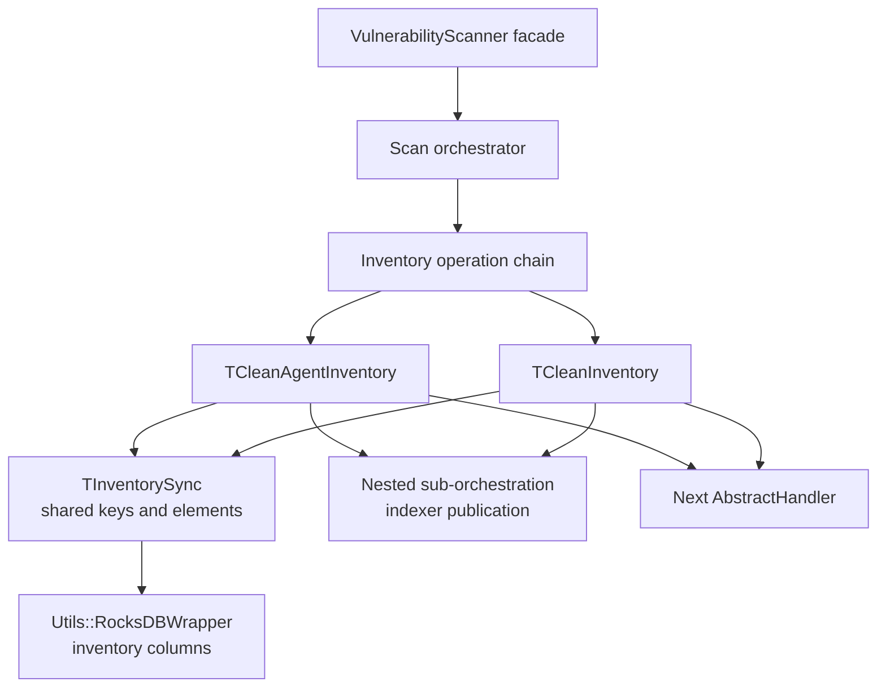
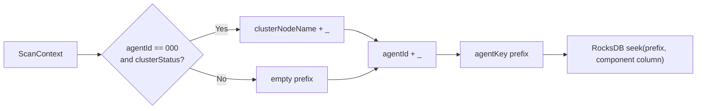
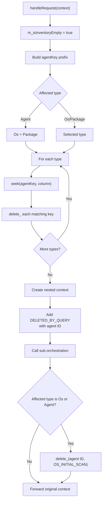
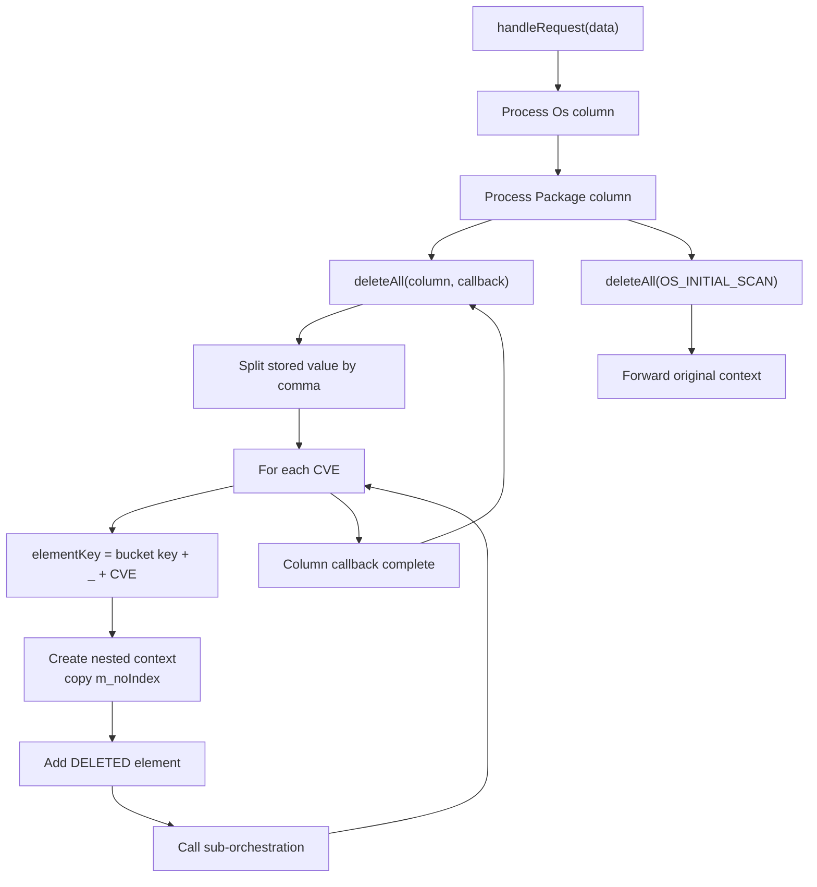
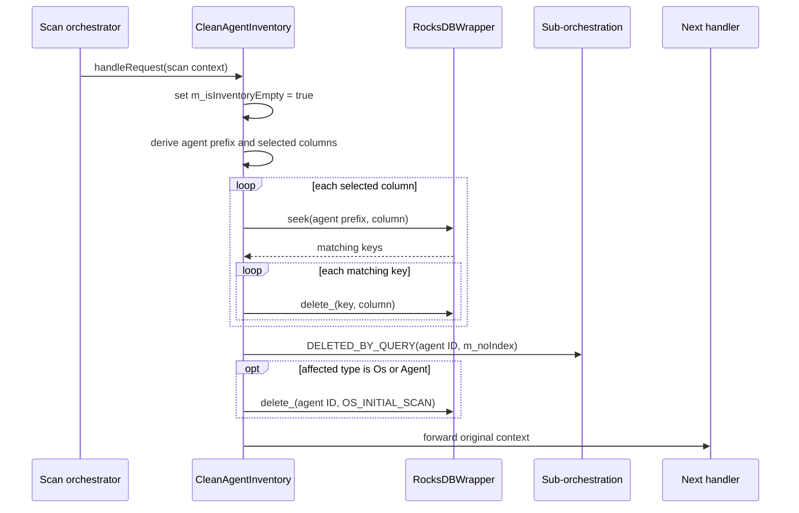
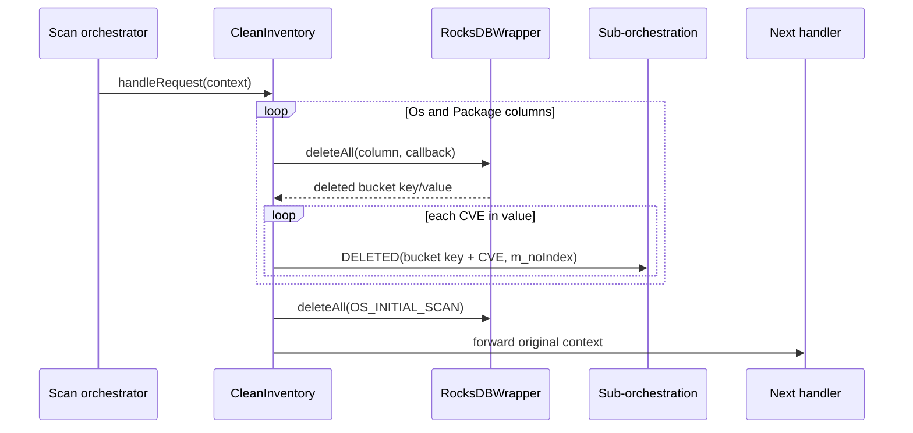
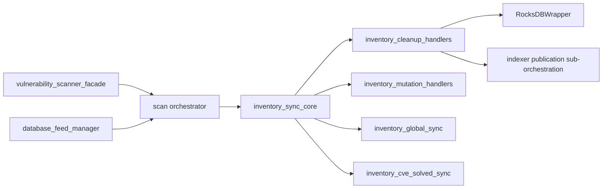

# Inventory Cleanup Handlers

## Introduction

`inventory_cleanup_handlers` contains the vulnerability scanner’s destructive inventory-cleanup stages. The handlers remove stale OS/package inventory from the local RocksDB-backed inventory database and emit deletion work to a nested orchestration that publishes the corresponding changes to the indexer.

The module contains two complementary scopes:

- `TCleanAgentInventory`: clears inventory for one agent and one affected component, with a special broader mode for an agent-level cleanup.
- `TCleanInventory`: clears OS and package inventory for every agent.

Both handlers are synchronous chain-of-responsibility stages. They perform local database deletion, invoke a sub-orchestration for indexer-facing delete events, and then forward the original scan context to the next handler. Shared key conventions, operation-element construction, and RocksDB column setup are defined in [`inventory_sync_core.md`](inventory_sync_core.md). The neighboring insert/delete handlers are documented in [`inventory_mutation_handlers.md`](inventory_mutation_handlers.md), while scanner lifecycle and upstream orchestration are covered by [`vulnerability_scanner_facade.md`](vulnerability_scanner_facade.md).

## Scope and source components

| Component | Source file | Production alias | Responsibility |
| --- | --- | --- | --- |
| `TCleanAgentInventory<TScanContext>` | `src/wazuh_modules/vulnerability_scanner/src/scanOrchestrator/cleanAgentInventory.hpp` | `CleanAgentInventory` | Deletes inventory buckets for one agent/component and emits one `DELETED_BY_QUERY` event. |
| `TCleanInventory<TScanContext>` | `src/wazuh_modules/vulnerability_scanner/src/scanOrchestrator/cleanInventory.hpp` | `CleanInventory` | Deletes all OS/package buckets and emits one `DELETED` event per stored CVE. |

The classes are templates so tests and specialized orchestrators can provide compatible scan-context and handler types. The default aliases use `ScanContext` and `AbstractHandler<std::shared_ptr<ScanContext>>`.

## Architectural position



Cleanup is an inventory-maintenance concern, not vulnerability matching. Feed management, scan matching, result indexing, and scanner lifecycle remain in the surrounding vulnerability-scanner components referenced above.

## Shared contracts

### Handler contract

Each class inherits `AbstractHandler<std::shared_ptr<TScanContext>>` and overrides:

```cpp
std::shared_ptr<TScanContext> handleRequest(std::shared_ptr<TScanContext> context)
```

The handler mutates database state and possibly `m_elements`, then calls the base handler with `std::move(context)`. The base implementation determines whether the context is passed to the next stage or returned at the end of the chain.

### Inventory synchronization contract

Both classes also inherit `TInventorySync<TScanContext>`. That base stores the RocksDB reference and prepares the inventory columns. It supplies `buildElement(operation, id)` and the affected-component mapping described in [`inventory_sync_core.md`](inventory_sync_core.md).

The cleanup handlers use these storage columns:

| Column or mapping | Use in this module |
| --- | --- |
| `AFFECTED_COMPONENT_COLUMNS[Os]` | Per-agent or global OS inventory cleanup. |
| `AFFECTED_COMPONENT_COLUMNS[Package]` | Per-agent or global package cleanup. |
| `OS_INITIAL_SCAN` | Initial OS-scan marker removed by both cleanup scopes. |

The implementation does not select a `Hotfix` column in either cleanup class, even though the shared synchronization layer supports hotfix-related keys.

### Sub-orchestration contract

The constructor receives a `std::shared_ptr<TAbstractHandler> subOrchestration`. The cleanup handler uses it as a nested chain for indexer-facing deletion events:

- `TCleanAgentInventory` sends one `DELETED_BY_QUERY` element per cleanup request.
- `TCleanInventory` sends one `DELETED` element for every stored CVE.

The nested context copies only `m_noIndex` from the parent. It does not reuse the parent’s complete `ScanContext`.

## Key construction

`TCleanAgentInventory` builds the lookup prefix directly from the context:

```text
agentKey = [clusterNodeName + _ when agentId == "000" and clusterStatus is true]
           + agentId
           + _
```

It then uses `RocksDBWrapper.seek(agentKey, column)` to find all matching keys in the selected component column. This is a prefix-oriented cleanup: the lookup can remove multiple inventory buckets belonging to the agent.



The special cluster prefix prevents manager-level data from different cluster nodes from being treated as one inventory namespace. The initial-scan deletion is different: the implementation deletes using the raw `context->agentId()` as the key, without applying the cluster-node prefix.

## `TCleanAgentInventory`

### Purpose and behavior

`TCleanAgentInventory` clears inventory associated with one agent. It sets `context->m_isInventoryEmpty = true` before deleting data.

The affected component controls the deletion set:

| `affectedComponentType()` | Columns searched | Meaning |
| --- | --- | --- |
| `Agent` | `Os` and `Package` | Remove all OS and package inventory buckets for the agent prefix. |
| Any other supported type, normally `Os` or `Package` | That one type | Remove only buckets in the selected component column. |

Although the class documentation describes agent cleanup as clearing all inventory, the implementation explicitly searches only the OS and Package columns in the `Agent` branch. It does not search a Hotfix column.

### Per-column deletion algorithm

For every selected component type:

1. Resolve its column with `AFFECTED_COMPONENT_COLUMNS.at(type)`.
2. Call `m_inventoryDatabase.seek(agentKey, column)`.
3. Delete every returned key with `delete_(key, column)`.
4. Log the affected column and key at debug level.
5. Build a new sub-orchestration context with the parent’s `m_noIndex`.
6. Add a single element whose ID is the agent ID and whose operation is `DELETED_BY_QUERY`.
7. Pass that nested context to `m_subOrchestration->handleRequest(...)`.

The sub-orchestration is called once per `deleteAll` invocation, not once per RocksDB key. Thus an agent-level cleanup emits one delete-by-query request covering the selected scope, even if many local buckets were removed.



### Initial OS scan cleanup

When the affected type is `Os` or `Agent`, the handler removes the initial scan marker:

```cpp
m_inventoryDatabase.delete_(context->agentId().data(), OS_INITIAL_SCAN);
```

This operation is independent of the selected component column and does not use the `agentKey` prefix. Callers that use cluster manager IDs should account for this distinction when interpreting the database layout.

## `TCleanInventory`

### Purpose and behavior

`TCleanInventory` performs a global cleanup. It always processes both the OS and Package columns, regardless of the affected component stored in the incoming context. It is therefore appropriate for a full inventory reset or a global integrity-clear path.

### Global deletion algorithm

For each of `Os` and `Package`:

1. Call `m_inventoryDatabase.deleteAll(column, callback)`.
2. For each deleted `(key, value)` pair, split `value` on commas to recover the stored CVE list.
3. For each CVE, construct the unique element ID `<bucket key>_<cve>`.
4. Create a fresh nested context and copy `m_noIndex` from the input context.
5. Add `buildElement("DELETED", elementKey)` to `m_elements`.
6. Invoke the sub-orchestration immediately.
7. Log the deleted key prefix.

After both columns are processed, it deletes all entries in `OS_INITIAL_SCAN` and forwards the original context.



The callback’s `value` is treated as a comma-separated list. Empty or malformed values are not explicitly validated in this class; splitting and event construction follow the utility/database behavior supplied by the surrounding implementation.

### Global event semantics

Unlike `TCleanAgentInventory`, the global handler emits one indexer deletion element per CVE. The bucket itself is removed by `deleteAll`, while each generated element ID preserves enough information for downstream deletion:

```text
<stored bucket key>_<stored CVE>
```

The original input context is not populated with these elements. Each event is dispatched in its own temporary context, which keeps the global cleanup stream granular while allowing the parent chain to continue with the unchanged original context.

## Component interaction

```mermaid
classDiagram
    class AbstractHandler~shared_ptr_TScanContext~~ {
        +handleRequest(context) shared_ptr_TScanContext
    }
    class TInventorySync~TScanContext~ {
        #RocksDBWrapper& m_inventoryDatabase
        +buildElement(operation, id) json
    }
    class TCleanAgentInventory~TScanContext~ {
        -shared_ptr<TAbstractHandler> m_subOrchestration
        +handleRequest(context) shared_ptr<TScanContext>
    }
    class TCleanInventory~TScanContext~ {
        -shared_ptr<TAbstractHandler> m_subOrchestration
        +handleRequest(context) shared_ptr<TScanContext>
    }
    class ScanContext {
        +agentId()
        +clusterStatus()
        +clusterNodeName()
        +affectedComponentType()
        +m_isInventoryEmpty
        +m_noIndex
        +m_elements
    }
    class RocksDBWrapper {
        +seek(prefix, column)
        +delete_(key, column)
        +deleteAll(column, callback)
    }
    AbstractHandler <|-- TCleanAgentInventory
    AbstractHandler <|-- TCleanInventory
    TInventorySync <|-- TCleanAgentInventory
    TInventorySync <|-- TCleanInventory
    TCleanAgentInventory --> RocksDBWrapper : prefix delete
    TCleanInventory --> RocksDBWrapper : global delete
    TCleanAgentInventory ..> ScanContext : reads/mutates
    TCleanInventory ..> ScanContext : reads
    TCleanAgentInventory --> AbstractHandler : nested publication chain
    TCleanInventory --> AbstractHandler : nested publication chain
```

## End-to-end process flows

### Agent-scoped cleanup



### Global cleanup



## Error and consistency considerations

- `AFFECTED_COMPONENT_COLUMNS.at(...)` can throw if a context contains an unsupported component type.
- The handlers do not catch RocksDB, JSON, or nested-handler exceptions; failures propagate to the owning scan orchestration.
- Local database mutation and indexer publication are separate actions. The code does not show a transaction spanning both stores, so a failure after RocksDB deletion may require reconciliation or a later cleanup retry.
- `TCleanAgentInventory` deletes matching keys before invoking its single delete-by-query publication request.
- `TCleanInventory` invokes the nested handler while iterating the `deleteAll` callback, so downstream processing must tolerate callback-time dispatch.
- Nested contexts copy `m_noIndex` but not agent/component metadata. The sub-orchestration must interpret the generated element IDs and operations without relying on the parent context’s other fields.
- Neither class explicitly checks `m_subOrchestration` for null before calling it; construction is therefore responsible for satisfying this dependency.

## Relationship to adjacent modules



Use the related documents instead of duplicating their implementation details:

- [`inventory_sync_core.md`](inventory_sync_core.md): inventory columns, component keys, operation JSON, and shared database conventions.
- [`inventory_mutation_handlers.md`](inventory_mutation_handlers.md): insertion and per-bucket mutation semantics.
- [`vulnerability_scanner_facade.md`](vulnerability_scanner_facade.md): scanner lifecycle, event ingress, and top-level orchestration.
- [`database_feed_manager.md`](database_feed_manager.md): vulnerability feed and database-feed responsibilities, which are distinct from cleanup.

