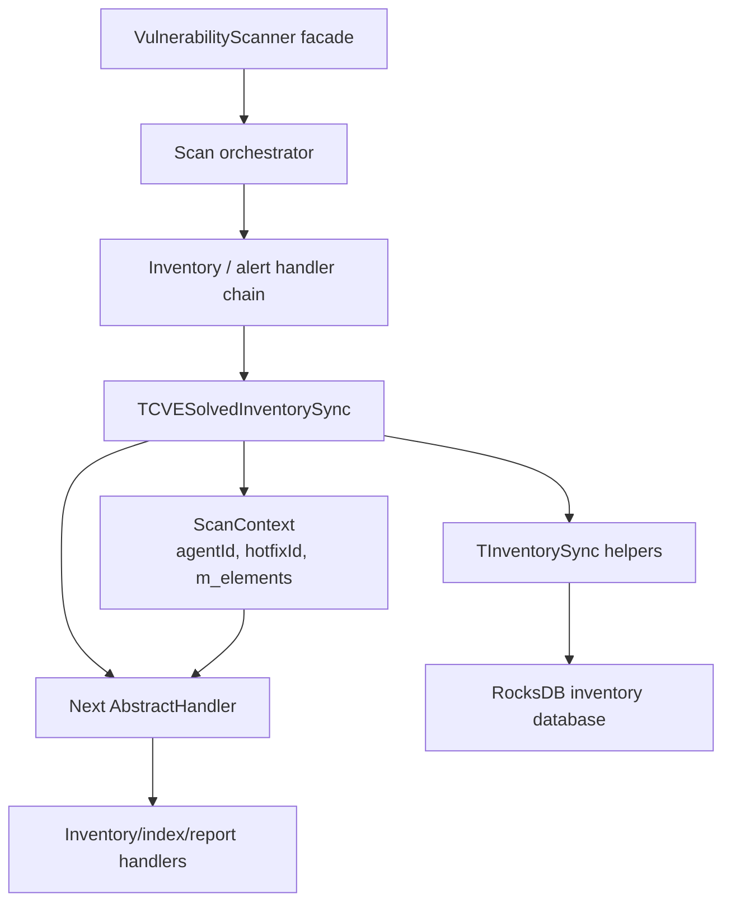
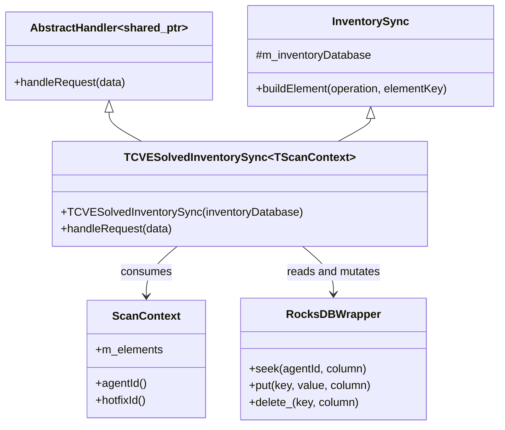
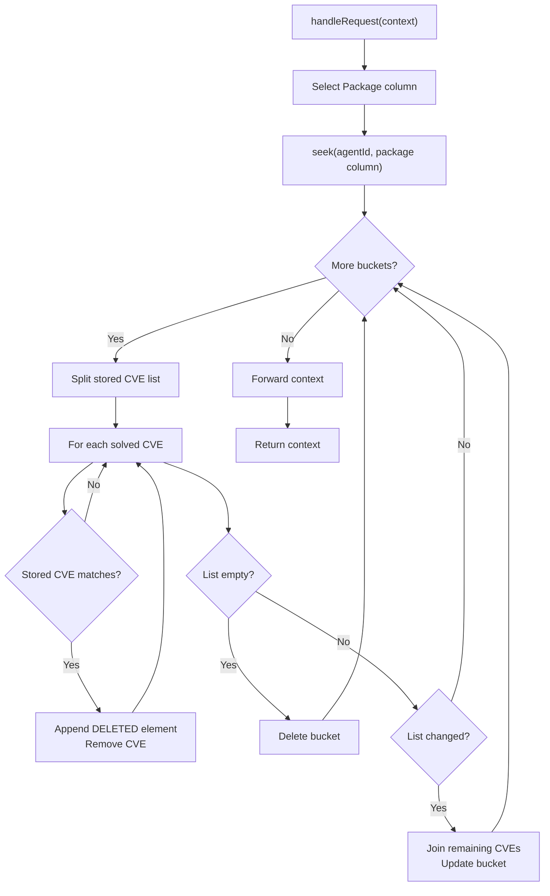
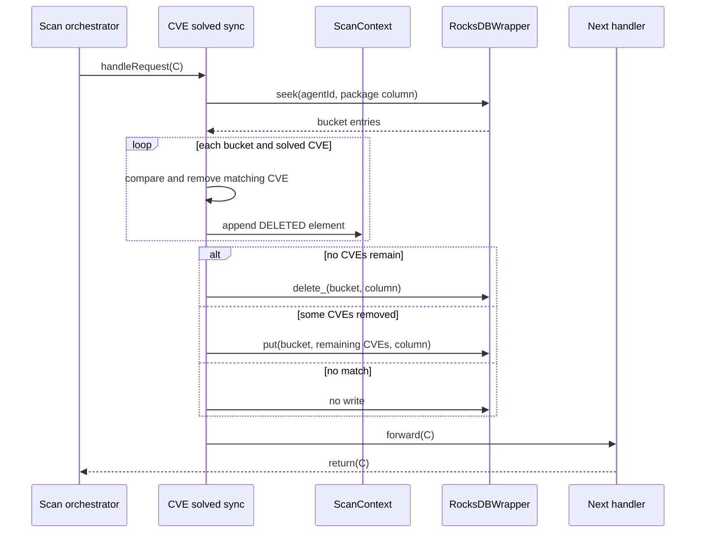
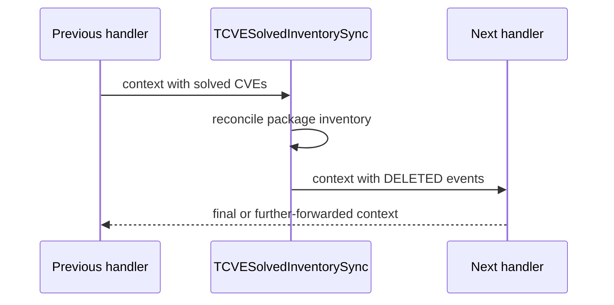
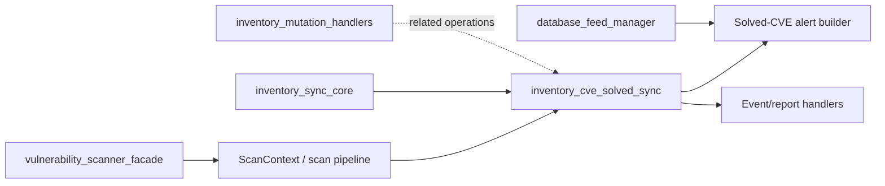

# Inventory CVE Solved Sync

## Introduction

`inventory_cve_solved_sync` is a scan-orchestrator handler in Wazuh's vulnerability scanner. It reconciles an agent's package-vulnerability inventory after one or more CVEs have been remediated by a hotfix.

For each package-inventory bucket belonging to the agent, it removes CVEs listed in `ScanContext::m_elements`. It deletes empty buckets or rewrites partially changed buckets in RocksDB. For every removed CVE it appends a `DELETED` inventory event to the scan context, allowing downstream alert and index handlers to report the remediation.

Shared inventory key, column, and element conventions are documented in [`inventory_sync_core.md`](inventory_sync_core.md). Scanner lifecycle and chain construction belong to [`vulnerability_scanner_facade.md`](vulnerability_scanner_facade.md); neighboring insert/delete operations are documented in [`inventory_mutation_handlers.md`](inventory_mutation_handlers.md).

## Module scope

| Component | Source | Responsibility |
| --- | --- | --- |
| `TCVESolvedInventorySync<TScanContext>` | `src/wazuh_modules/vulnerability_scanner/src/scanOrchestrator/cveSolvedInventorySync.hpp` | Removes remediated CVEs from package inventory and emits deletion elements. |
| `CVESolvedInventorySync` | Same file | Production alias for `TCVESolvedInventorySync<ScanContext>`. |

The implementation is a header-only template. The template parameter defaults to `ScanContext`, while tests or alternate integrations can provide a compatible context type.

## Architectural position

The handler participates in the vulnerability scanner's chain-of-responsibility pipeline. It runs after scan processing has identified solved CVEs and before later handlers publish or report the context.



At system level, the chain is owned and connected by the vulnerability scanner facade. This module does not open the scanner, subscribe to events, or create indexer connections.

## Type and dependency relationships

`TCVESolvedInventorySync` combines two contracts:

1. `AbstractHandler<std::shared_ptr<TScanContext>>` supplies the chain interface and forwarding behavior.
2. `InventorySync` supplies the injected RocksDB reference, inventory-column conventions, and `buildElement()` helper.



### Included dependencies

The header includes `chainOfResponsability.hpp` for the handler contract, `inventorySync.hpp` for storage and serialization helpers, and `scanContext.hpp` for scan data. It also uses `Utils::split`, `std::remove_if`, and the affected-component column map exposed through those dependencies.

## Construction and ownership

The constructor receives `Utils::RocksDBWrapper&` and forwards it to `InventorySync`.

```cpp
explicit TCVESolvedInventorySync(Utils::RocksDBWrapper& inventoryDatabase)
    : InventorySync(inventoryDatabase)
{
}
```

The database is externally owned. The handler does not open, close, or replace it. The wrapper must remain alive for the handler's entire use, normally under the scanner facade's component lifetime.

## Request contract

`handleRequest` accepts a non-null `std::shared_ptr<TScanContext>` and returns the same logical context after mutation. The context is expected to contain:

- `agentId()`: inventory owner used for the RocksDB lookup;
- `hotfixId()`: diagnostic identity for the remediation;
- `m_elements`: a CVE-keyed collection whose keys identify solved CVEs and whose values contain JSON output arrays;
- a valid package mapping in `AFFECTED_COMPONENT_COLUMNS`.

The method does not create a new context or clear `m_elements`; it appends generated deletion elements to existing JSON values.

## Processing algorithm

The handler always targets the package inventory column:

```cpp
const auto& column = AFFECTED_COMPONENT_COLUMNS.at(AffectedComponentType::Package);
```

It seeks all package buckets for the agent, splits each comma-separated value, compares stored CVEs with every key in `data->m_elements`, appends a `DELETED` element for each match, and removes the match from the in-memory list. An empty result deletes the bucket; a non-empty changed result rewrites the remaining comma-separated CVEs; an unchanged result is not written.



## Data flow and storage semantics

Inventory values are comma-separated CVE identifiers. The handler performs a read-modify-write operation per bucket:



| Existing bucket state | Match result | Database action | Context action |
| --- | --- | --- | --- |
| Contains solved CVEs, none remain | All removed | Delete bucket | One `DELETED` element per CVE |
| Contains solved and unsolved CVEs | Some removed | Rewrite remaining CVEs | Deletion elements for matches |
| Contains no solved CVE | No match | No write | No generated element |

The comparison is exact and case-sensitive because stored strings are compared directly with keys in `m_elements`.

## Generated deletion elements

For a matching CVE, the element key is:
```text
<bucket-key>_<cve-id>
```

The handler calls `buildElement("DELETED", elementKey)` and moves the result into the JSON vector associated with that CVE. The exact element schema and key conventions belong to [`inventory_sync_core.md`](inventory_sync_core.md). Downstream solved-vulnerability alert construction is documented in [`scan_orchestrator_alert_builders_handlers_solved_alerts.md`](scan_orchestrator_alert_builders_handlers_solved_alerts.md).

## Chain interaction

After local reconciliation, the implementation calls the base handler with `std::move(data)`. Later handlers therefore receive the same context, including generated deletion events. An unchanged context is still forwarded when no CVE matches; the base handler decides whether another handler exists.



## Logging and observability

The handler emits debug-level vulnerability-scanner messages when it identifies a remediated CVE, deletes an empty bucket, or updates a bucket. Messages use `WM_VULNSCAN_LOGTAG` and include the hotfix ID, generated element key, or remaining CVE list as applicable.

## Failure and edge-case behavior

The header defines no explicit error handling or rollback:

- `AFFECTED_COMPONENT_COLUMNS.at(AffectedComponentType::Package)` can throw if the package mapping is absent;
- a null context is invalid because `data` is immediately dereferenced;
- database failures are not caught here and depend on `RocksDBWrapper`;
- no write occurs when no stored CVE matches a solved CVE;
- empty stored values are processed according to `Utils::split`;
- a bucket is deleted only when its list is empty after processing.

Updates are bucket by bucket, so callers should treat the generated context and database state as authoritative only after `handleRequest` completes successfully.

## Relationship to neighboring modules



- [`inventory_sync_core.md`](inventory_sync_core.md): shared inventory columns, keys, element serialization, and RocksDB abstraction;
- [`inventory_mutation_handlers.md`](inventory_mutation_handlers.md): related insertion and general deletion handlers;
- [`scan_orchestrator_alert_builders_handlers_solved_alerts.md`](scan_orchestrator_alert_builders_handlers_solved_alerts.md): solved-CVE alert details;
- [`vulnerability_scanner_facade.md`](vulnerability_scanner_facade.md): scanner ownership, lifecycle, and subscriptions;
- [`database_feed_manager.md`](database_feed_manager.md): CVE metadata and remediation/feed lookup.

## Summary

`TCVESolvedInventorySync` is the remediation-side bridge between scan results and the package inventory index. It removes solved CVE identifiers from per-agent RocksDB buckets, deletes or updates those buckets, records `DELETED` events in `ScanContext`, and forwards the context through the scan-orchestrator chain.
