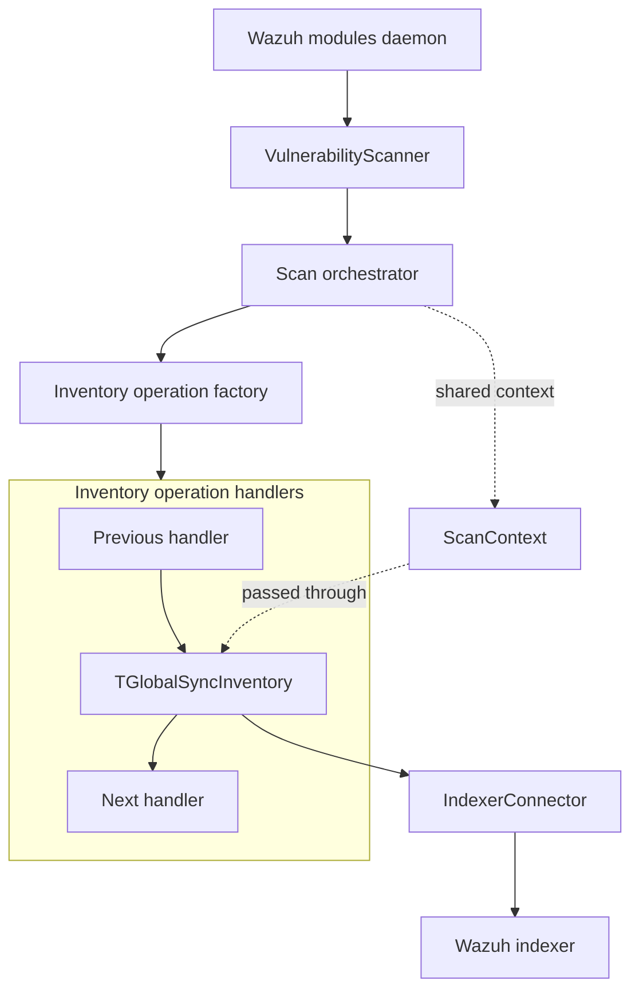
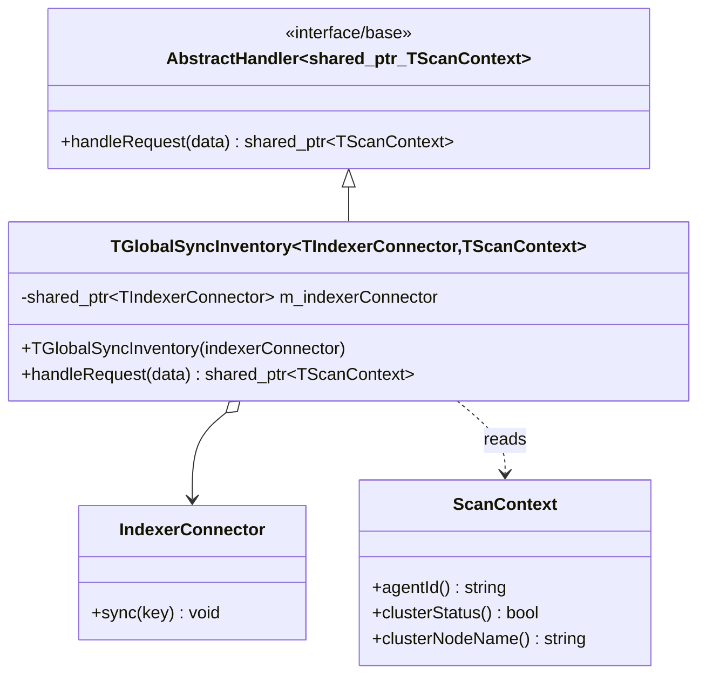
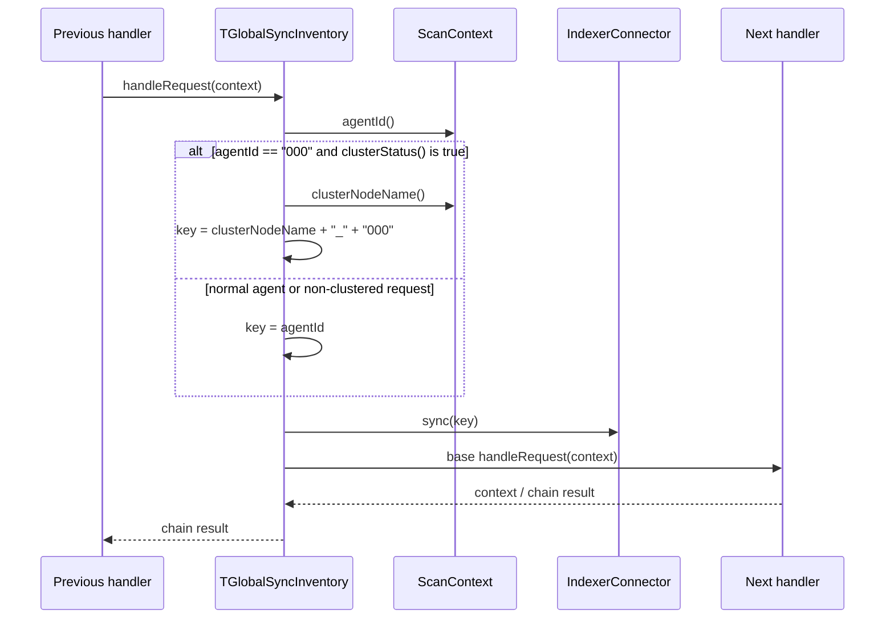
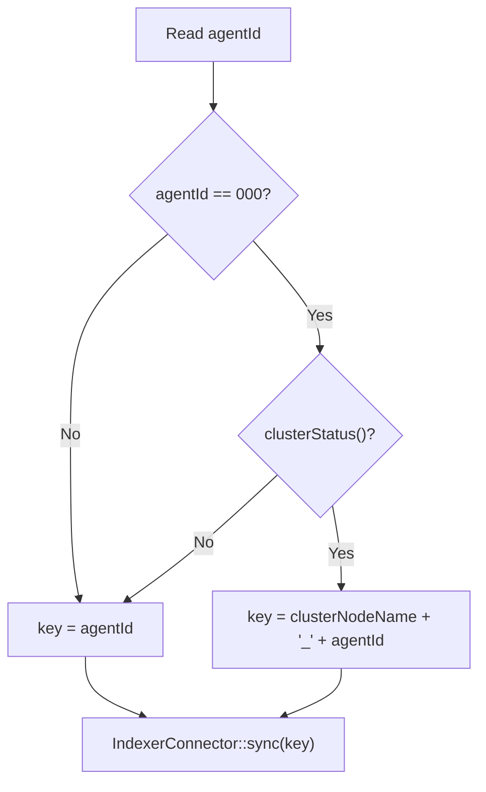
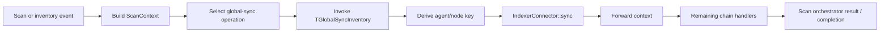
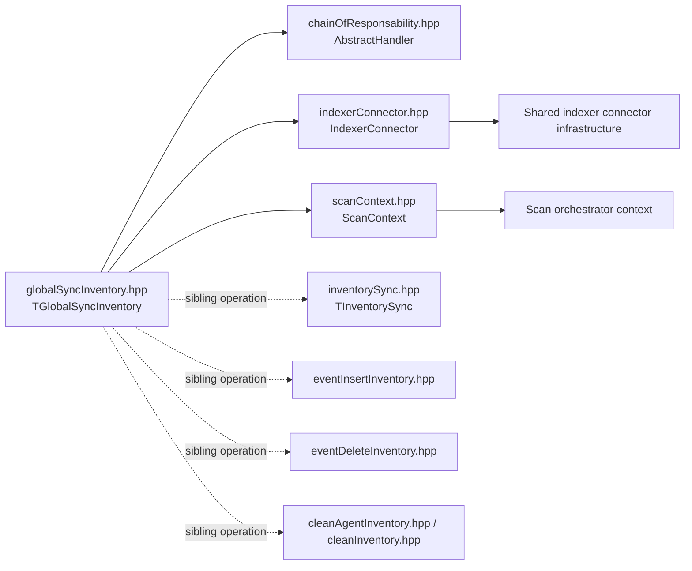

# Inventory Global Sync

## Introduction

The `inventory_global_sync` module implements the global inventory synchronization step in Wazuh's vulnerability-scanner scan-orchestrator pipeline. Its only production component, `TGlobalSyncInventory`, is a templated chain-of-responsibility handler that asks an `IndexerConnector` to synchronize the inventory index for the current agent and then forwards the scan context to the next handler.

The handler is intentionally small: it does not collect inventory, calculate vulnerabilities, mutate scan results, or construct index documents. Those responsibilities belong to the surrounding vulnerability-scanner and inventory components described in the [vulnerability scanner facade](vulnerability_scanner_facade.md), [inventory sync core](inventory_sync_core.md), and [indexer connector](indexer_connector.md) documentation.

## Scope and responsibilities

| Responsibility | Implementation | Notes |
|---|---|---|
| Receive a scan context | `handleRequest(std::shared_ptr<TScanContext>)` | Implements the common `AbstractHandler` contract. |
| Select the synchronization key | `agentId()` and cluster context | Uses a node prefix only for clustered manager-agent `000` synchronization. |
| Trigger index synchronization | `m_indexerConnector->sync(key)` | The connector owns the actual index operation. |
| Preserve pipeline execution | Base `handleRequest` call | Forwards the same context after synchronization. |
| Support test substitution | `TIndexerConnector` and `TScanContext` template parameters | Defaults are `IndexerConnector` and `ScanContext`. |

## Position in the system

The module is a leaf operation within the vulnerability scanner's inventory-operation family. A factory or orchestrator places it in a handler chain when an inventory synchronization operation is requested. The context is produced upstream by the scan pipeline and remains the unit of hand-off throughout the chain.



The daemon and scanner lifecycle are documented in the [vulnerability scanner facade](vulnerability_scanner_facade.md). This page focuses only on the synchronization handler.

## Architecture

`TGlobalSyncInventory` is `final` and derives from `AbstractHandler<std::shared_ptr<TScanContext>>`. Its connector is stored as a `std::shared_ptr`, so the handler shares connector lifetime with the orchestrator or factory that constructs it.



### Template parameters

The declaration provides dependency seams for unit tests and alternative implementations:

```cpp
template<typename TIndexerConnector = IndexerConnector,
         typename TScanContext = ScanContext>
class TGlobalSyncInventory final
```

The production alias is:

```cpp
using GlobalSyncInventory = TGlobalSyncInventory<>;
```

The supplied connector must provide `sync(std::string)`. The supplied context must provide `agentId()`, `clusterStatus()`, and `clusterNodeName()` with values compatible with the key-building expression.

## Request processing

The handler performs three operations in order:

1. It determines whether the request is a special clustered-manager synchronization.
2. It builds the synchronization key.
3. It calls the connector and forwards the context.



The context is moved into the base-handler call after `sync` returns. No new context is created and no fields are modified by this component.

## Synchronization-key rules

The key expression is equivalent to:

```cpp
std::string key = data->agentId().compare("000") == 0 && data->clusterStatus()
                      ? std::string(data->clusterNodeName()) + "_"
                      : "";
key.append(data->agentId());
```

| Context | Key passed to `sync` |
|---|---|
| Regular agent, for example `007` | `007` |
| Manager agent `000`, non-clustered | `000` |
| Manager agent `000`, clustered node `worker-1` | `worker-1_000` |

The node prefix is deliberately restricted to agent `000` while cluster status is enabled. This prevents ordinary agent synchronization keys from becoming node-qualified, while allowing clustered manager inventory to remain distinguishable per node.



## Component contract and boundaries

### `TGlobalSyncInventory`

File: `src/wazuh_modules/vulnerability_scanner/src/scanOrchestrator/globalSyncInventory.hpp`

The constructor takes ownership of the caller's shared-pointer reference by moving it into `m_indexerConnector`. The constructor contains no initialization beyond storing this dependency.

`handleRequest` assumes that the context and connector are valid. The file does not perform null checks, catch connector exceptions, or report synchronization status itself. Consequently:

- a null context would fail when `agentId()` is called;
- a null connector would fail when `sync` is called;
- an exception from `sync` prevents forwarding to the next handler unless handled by an outer layer;
- successful synchronization is followed by normal chain forwarding.

These are integration contracts for the factory/orchestrator and the shared connector layer, not policies implemented by this module.

### `AbstractHandler`

The base class supplies the chain linkage and the forwarding behavior. `TGlobalSyncInventory` delegates to `AbstractHandler<std::shared_ptr<TScanContext>>::handleRequest(std::move(data))` after its own work, so it composes with preceding and following inventory-operation handlers.

See [inventory sync core](inventory_sync_core.md) for the broader synchronization operation and neighboring mutation/cleanup handlers.

### `IndexerConnector`

`TGlobalSyncInventory` uses only the connector's `sync` operation. Index connection setup, request transport, retries, index naming, and synchronization semantics are outside this header and belong to the shared connector implementation. See [indexer connector](indexer_connector.md) for those details.

## End-to-end process flow



This handler is synchronous from the chain's perspective: the next handler is invoked only after the connector's `sync` call returns. Whether the connector performs asynchronous work internally is an implementation detail of the connector and does not change the handler's ordering guarantee.

## Dependencies



The direct source dependencies are the chain abstraction, indexer connector, and scan context. The sibling handlers are architectural neighbors, not direct includes in the supplied file.

## Maintenance and testing guidance

When changing this module, preserve these invariants:

- call `sync` exactly once per handled request;
- use the node-prefixed key only for clustered agent `000`;
- forward the context after synchronization succeeds;
- keep the production alias compatible with the default connector and context types;
- preserve template substitutability for connector/context test doubles.

Useful test cases are the three key forms in the table above, verification that the next handler receives the same context, and propagation of connector failures. Since the class is header-only and templated, tests can instantiate it with lightweight fake connector and context types without linking the full indexer implementation.

## Related documentation

- [Vulnerability scanner facade](vulnerability_scanner_facade.md) — scanner lifecycle and orchestration boundary.
- [Inventory sync core](inventory_sync_core.md) — neighboring inventory synchronization operation.
- [Indexer connector](indexer_connector.md) — indexer connection and synchronization infrastructure.
