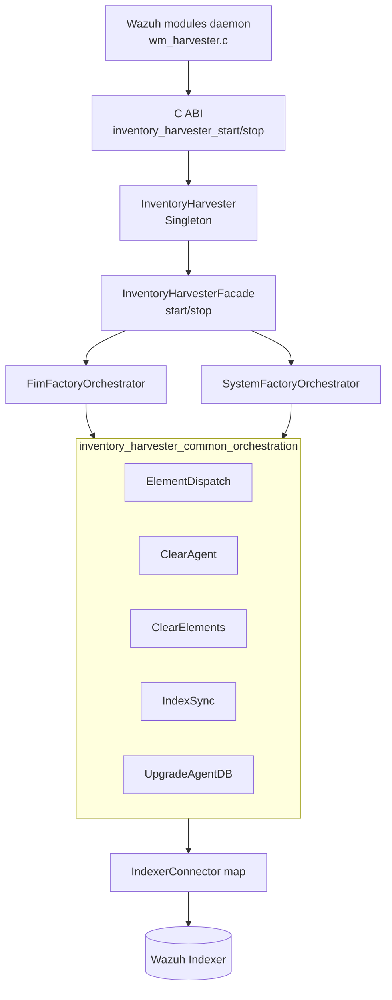
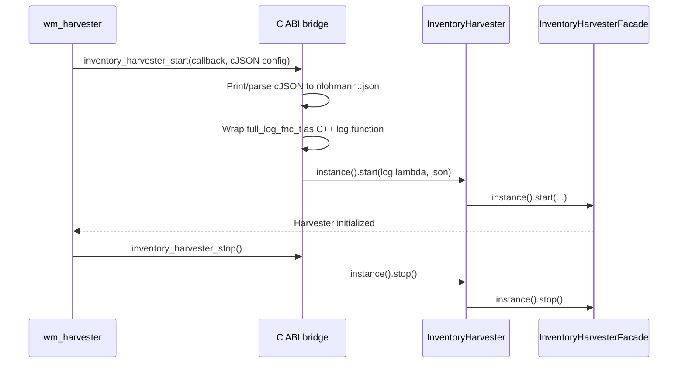
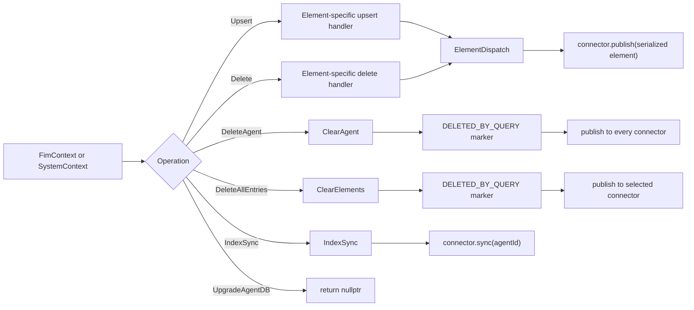

# Inventory Harvester Common Orchestration

## Introduction

The **Inventory Harvester Common Orchestration** module is the shared control layer for Wazuh's native inventory harvester. It exposes the harvester lifecycle to the C-based Wazuh modules daemon and provides reusable chain-of-responsibility handlers for publishing, deleting, and synchronizing inventory data.

The module is shared by the FIM inventory and system inventory pipelines. It does not collect host data itself; collection and inventory element construction belong to the sibling pipeline and data-model modules. Instead, this module selects the operation-specific orchestration and routes the resulting context to the appropriate Indexer connector.

Related documentation:

- [Syscollector Module](syscollector_module.md) — source inventory and its API/database consumers.
- [Wazuh Modules Daemon](Wazuh_Modules_Daemon_(C).md) — native module hosting and lifecycle.
- [Shared Modules Infrastructure](Shared_Modules_Infrastructure_(C++).md) — shared connectors and utility abstractions.
- [Inventory Harvester FIM Pipeline](inventory_harvester_fim_pipeline.md) and [Inventory Harvester System Pipeline](inventory_harvester_system_pipeline.md) — element-specific contexts, handlers, and harvesters.
- [Inventory Harvester Data Models](inventory_harvester_data_models.md) — serialized inventory schema and context data.

## Purpose and responsibilities

The module has four responsibilities:

1. Convert the native C ABI configuration and logging callback into the C++ types used by the harvester facade.
2. Start and stop the singleton `InventoryHarvester` through `InventoryHarvesterFacade`.
3. Build an operation-specific chain for FIM and system inventory contexts.
4. Route serialized elements, deletion markers, or index synchronization requests to Indexer connectors.

`UpgradeAgentDB` is intentionally a no-op: inventory harvester ignores agent database upgrade events and returns `nullptr` without forwarding the request.

## Architecture



The facade owns the broader harvester lifecycle and pipeline setup. The factory orchestrators in this module create only the final operation chain for a typed context (`FimContext` or `SystemContext`). This keeps routing policy independent from element-specific serialization and collection logic.

## Component relationships

```mermaid
classDiagram
    class InventoryHarvester {
        <<Singleton>>
        +start(logFunction, configuration) void
        +stop() void
    }
    class InventoryHarvesterFacade {
        +start(logFunction, configuration) void
        +stop() void
    }
    class FimFactoryOrchestrator {
        +create(operation, connectors) shared_ptr~Handler~
    }
    class SystemFactoryOrchestrator {
        +create(operation, connectors) shared_ptr~Handler~
    }
    class AbstractHandler~T~ {
        +handleRequest(data) T
        +setLast(handler) void
    }
    class ElementDispatch~TContext~ {
        -m_indexerConnectorInstances
        +handleRequest(data) shared_ptr~TContext~
    }
    class ClearAgent~TContext~ {
        -m_indexerConnectorInstances
        +handleRequest(data) shared_ptr~TContext~
    }
    class ClearElements~TContext~ {
        -m_indexerConnectorInstances
        +handleRequest(data) shared_ptr~TContext~
    }
    class IndexSync~TContext~ {
        -m_indexerConnectorInstances
        +handleRequest(data) shared_ptr~TContext~
    }
    class UpgradeAgentDB~TContext~ {
        +handleRequest(data) shared_ptr~TContext~
    }
    class IndexerConnector {
        +publish(json) void
        +sync(agentId) void
    }

    InventoryHarvester --> InventoryHarvesterFacade
    FimFactoryOrchestrator ..> AbstractHandler
    SystemFactoryOrchestrator ..> AbstractHandler
    ElementDispatch --|> AbstractHandler
    ClearAgent --|> AbstractHandler
    ClearElements --|> AbstractHandler
    IndexSync --|> AbstractHandler
    UpgradeAgentDB --|> AbstractHandler
    ElementDispatch --> IndexerConnector
    ClearAgent --> IndexerConnector
    ClearElements --> IndexerConnector
    IndexSync --> IndexerConnector
```



All common handlers are templates over a context type. The context supplies `AffectedComponentType`, `agentId()`, and, for element dispatch, `m_serializedElement`. Connector instances are passed by reference as a map keyed by affected component; handlers do not own the map or connector lifetime.

## Lifecycle and C ABI bridge

`InventoryHarvester::start` is a thin delegation to `InventoryHarvesterFacade::instance().start`. The exported `inventory_harvester_start` function performs the boundary conversion:

- A nullable `cJSON*` configuration is printed and parsed into `nlohmann::json`.
- The C `full_log_fnc_t` callback is wrapped in a C++ lambda, converting `std::string` values to C strings while preserving the variadic argument list.
- The singleton is started with the converted configuration and callback.

`inventory_harvester_stop` calls the singleton's `stop`, which delegates to the facade. The C++ implementation also defines the process-wide `Log::GLOBAL_LOG_FUNCTION` used by the shared logging infrastructure.



## Operation factories

Both factories support the same operation set. The difference is the context and element-specific upsert/delete handler.

| Operation | FIM chain | System chain | Effect |
|---|---|---|---|
| `Upsert` | `UpsertFimElement` → `ElementDispatch` | `UpsertSystemElement` → `ElementDispatch` | Publishes the serialized inventory element. |
| `Delete` | `DeleteFimElement` → `ElementDispatch` | `DeleteSystemElement` → `ElementDispatch` | Builds/decorates a deletion element, then publishes it. |
| `DeleteAgent` | `ClearAgent` | `ClearAgent` | Publishes `DELETED_BY_QUERY` for every registered component. |
| `DeleteAllEntries` | `ClearElements` | `ClearElements` | Publishes `DELETED_BY_QUERY` for the context's affected component. |
| `IndexSync` | `IndexSync` | `IndexSync` | Calls connector synchronization for the agent ID. |
| `UpgradeAgentDB` | `UpgradeAgentDB` | `UpgradeAgentDB` | Ignores the event and returns `nullptr`. |

Any other operation throws `std::runtime_error("Invalid orchestration operation")`.

## Handler behavior

### ElementDispatch

Looks up the connector using `data->affectedComponentType()` and publishes `data->m_serializedElement`. It then forwards the same context to the next handler in the chain. The map lookup uses `at`, so an absent component is treated as an exception rather than silently dropped.

### ClearAgent

Iterates over every connector in the map and publishes a `NoDataHarvester` record with:

```json
{"operation":"DELETED_BY_QUERY","id":"<agent-id>"}
```

This broadcasts agent deletion across all indexed inventory components. The handler then forwards the context according to the base chain implementation.

### ClearElements

Creates the same deletion marker but publishes it only through the connector associated with `affectedComponentType()`. It uses `map::at`, so an invalid component key raises an exception.

### IndexSync

Finds the connector for the affected component, validates that the key exists, and invokes `sync(std::string{data->agentId()})`. Missing keys produce `std::runtime_error("Invalid affectedComponentType for IndexSync")`.

### UpgradeAgentDB

Returns `nullptr` immediately. This is an explicit filtering decision: database upgrade notifications are outside the inventory harvester's indexing responsibilities.

## Data and control flow



The common layer therefore has two output forms:

- **Publish path:** JSON serialized inventory elements or deletion markers sent through `IndexerConnector::publish`.
- **Synchronization path:** agent-scoped synchronization invoked through `IndexerConnector::sync`.

## Error handling and invariants

- Factory creation rejects unknown operations with `std::runtime_error`.
- `ElementDispatch` and `ClearElements` rely on `map::at`; connector absence is exceptional.
- `IndexSync` explicitly checks `find` and throws a descriptive runtime error for an invalid component.
- The connector map and connector objects must outlive all handlers because handlers retain a const reference to the map.
- `ClearAgent` sends one deletion marker per connector; `ClearElements` sends one marker to one connector.
- `UpgradeAgentDB` intentionally terminates processing by returning `nullptr`; callers must tolerate this result.
- Configuration parsing at the C boundary assumes the printed JSON is valid. A malformed `cJSON` representation can cause the JSON parse to throw before the facade is started.

## Extension points

To add a new inventory operation, update both factory `create` methods and provide a handler compatible with the corresponding context. To add a new indexed component, register an `IndexerConnector` in the connector map and ensure the context's `AffectedComponentType` can select it. Element construction, serialization, and collection should remain in the [FIM pipeline](inventory_harvester_fim_pipeline.md), [system pipeline](inventory_harvester_system_pipeline.md), and [data models](inventory_harvester_data_models.md), rather than in these generic handlers.

