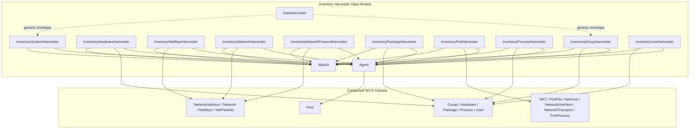
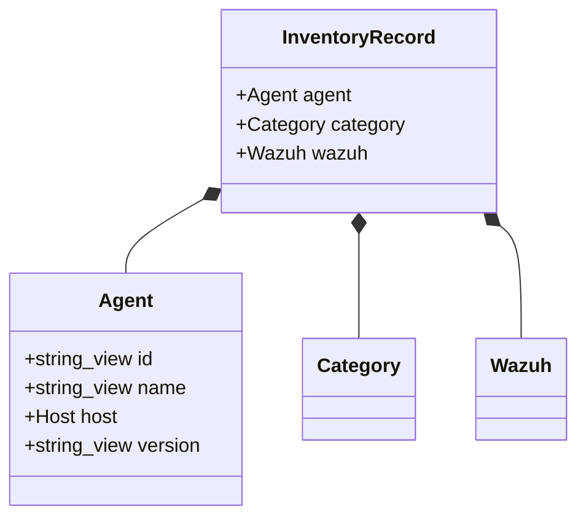
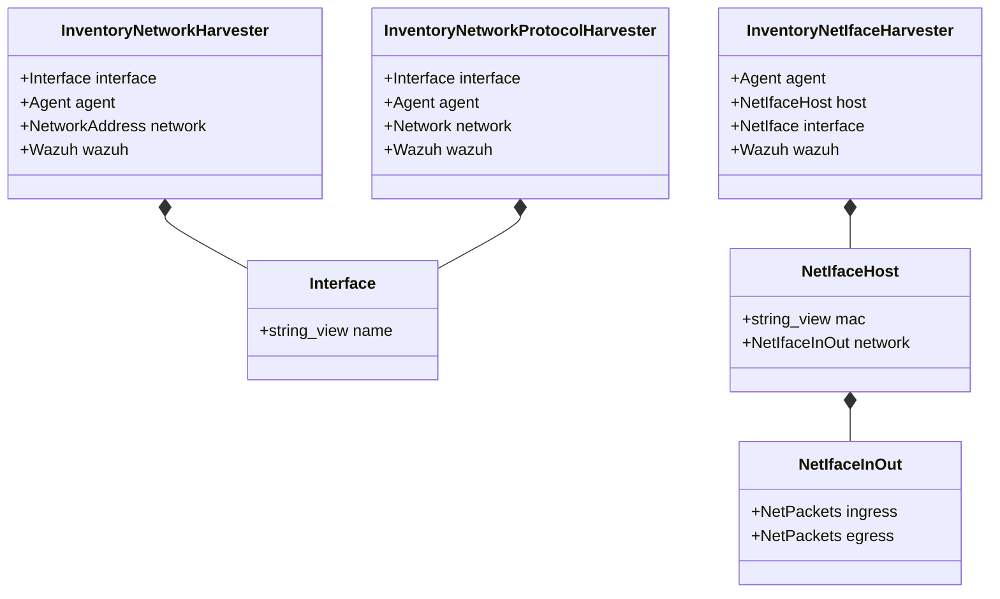
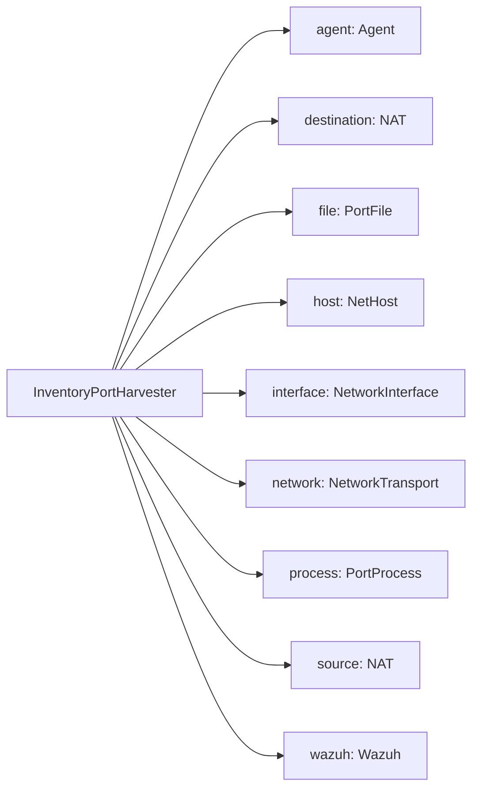
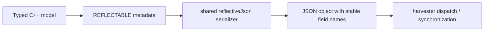
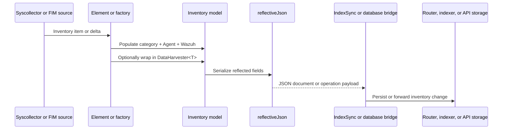
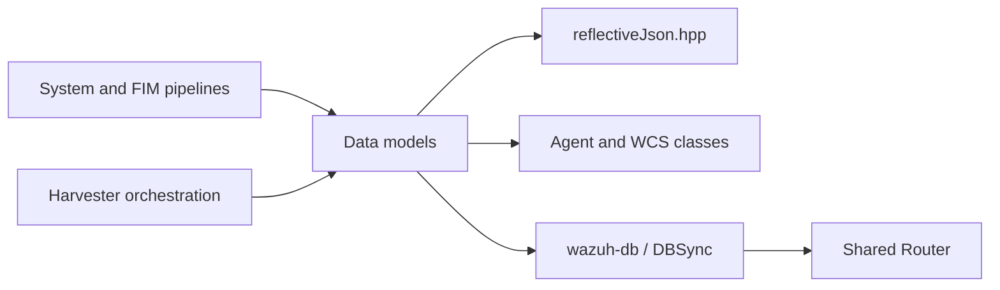

# Inventory Harvester Data Models

## Introduction

The **Inventory Harvester Data Models** module defines the C++ value types used to represent inventory records before they are serialized, synchronized, or forwarded by the Wazuh inventory harvester. The models live under `src/wazuh_modules/inventory_harvester/src/wcsModel` and compose Wazuh Common Schema (WCS)-style classes into typed documents.

This is a data-contract layer, not a scanner or persistence layer. Runtime orchestration and lifecycle are documented in [inventory_harvester_common_orchestration.md](inventory_harvester_common_orchestration.md); system and FIM pipelines are documented in [inventory_harvester_system_pipeline.md](inventory_harvester_system_pipeline.md) and [inventory_harvester_fim_pipeline.md](inventory_harvester_fim_pipeline.md). The parent module is described in [inventory_harvester_module.md](inventory_harvester_module.md).

## Purpose and Responsibilities

The module provides:

- **Reusable envelopes:** `DataHarvester<T>` adds an identifier, operation, and payload.
- **Typed records:** category-specific structures combine agent metadata, category data, and Wazuh metadata.
- **Nested relationships:** network-interface traffic and user host/login/process data remain structured.
- **Reflection metadata:** `REFLECTABLE` and `MAKE_FIELD` map C++ members to stable JSON names.
- **Schema composition:** shared classes such as `Agent`, `Host`, category types, and `Wazuh` are reused rather than duplicated.

## Module Architecture



## Component Inventory

| Component | Source | Serialized fields |
|---|---|---|
| `DataHarvester<T>` | `wcsModel/data.hpp` | `id`, `operation`, `data` |
| `Agent` | `wcsModel/wcsClasses/agent.hpp` | `id`, `name`, `host`, `version` |
| `InventoryGroupHarvester` | `inventoryGroupHarvester.hpp` | `group`, `agent`, `wazuh` |
| `InventoryHardwareHarvester` | `inventoryHardwareHarvester.hpp` | `host`, `agent`, `wazuh` |
| `InventoryNetIfaceHarvester` | `inventoryNetIfaceHarvester.hpp` | `agent`, `host`, `interface`, `wazuh` |
| `InventoryNetworkHarvester` | `inventoryNetworkHarvester.hpp` | `network`, `interface`, `agent`, `wazuh` |
| `InventoryNetworkProtocolHarvester` | `inventoryNetworkProtocolHarvester.hpp` | `network`, `interface`, `agent`, `wazuh` |
| `InventoryPackageHarvester` | `inventoryPackageHarvester.hpp` | `package`, `agent`, `wazuh` |
| `InventoryPortHarvester` | `inventoryPortHarvester.hpp` | `agent`, `destination`, `file`, `host`, `interface`, `network`, `process`, `source`, `wazuh` |
| `InventoryProcessHarvester` | `inventoryProcessHarvester.hpp` | `process`, `agent`, `wazuh` |
| `InventorySystemHarvester` | `inventorySystemHarvester.hpp` | `agent`, `host`, `wazuh` |
| `InventoryUserHarvester` | `inventoryUserHarvester.hpp` | `host`, `login`, `process`, `user`, `agent`, `wazuh` |

All records are `final` structs with value members. They define no constructors, validation, ownership policy, or business logic.

## Shared Building Blocks

### `Agent`

`Agent` is present in every category record:

| Field | Type | Meaning |
|---|---|---|
| `id` | `std::string_view` | Agent identifier |
| `name` | `std::string_view` | Agent name |
| `host` | `Host` | Host associated with the agent |
| `version` | `std::string_view` | Agent version |

The text fields are non-owning `std::string_view` values. Callers must keep the referenced storage alive while the model is being populated or serialized.

### `Wazuh` and category classes

Every concrete inventory document includes a `Wazuh` member. Its fields are defined in the source header `wcsClasses/wazuh.hpp` and are not duplicated here.

Category payload types are defined in the WCS class headers:

- group: `Group`
- hardware: `Hardware` from `hardware.hpp`
- network address: `NetworkAddress`
- network protocol: `Network`
- interface traffic: `NetIface` and `NetPackets`
- package: `Package`
- port: `NAT`, `PortFile`, `NetHost`, `NetworkInterface`, `NetworkTransport`, and `PortProcess`
- process: `Process`
- system: `Host`
- user: `User`, plus `User::Host`, `User::Login`, and `User::Process`

The exact fields of these payload classes belong to their own documentation and headers. This module only composes them into record shapes.

## Record Shapes

Most records follow the same composition:



Group, package, process, and user records use named category fields. Hardware and system records use `host` for their category payload while also retaining `agent.host` as part of agent identity.

### Network records



The address and protocol models each define a local `Interface` helper containing only `name`. The interface model instead defines `NetIfaceHost`, which contains `mac` and nested ingress/egress packet counters.

### Port records



Port inventory is the broadest record shape because it joins endpoint, process, file, interface, and transport information.

### User records

`InventoryUserHarvester` keeps three related perspectives alongside the primary `User` object: host context, login information, and process information. The nested types are exposed as `User::Host`, `User::Login`, and `User::Process`, preserving the relationships needed by downstream inventory consumers.

## Reflection and Serialization Contract

Every model invokes `REFLECTABLE` with `MAKE_FIELD` entries. These macros register member pointers under explicit JSON names.



Properties of this contract:

- JSON names are explicit and independent of C++ member names.
- Nested structs become nested JSON objects.
- Consumers should use field names rather than rely on macro declaration order.
- Null handling, string conversion, and nested-object behavior come from `reflectiveJson.hpp`.
- No model defines custom serialization code.

## Generic `DataHarvester<T>` Envelope

`DataHarvester<T>` is independent of concrete categories:

```cpp
template<typename T>
struct DataHarvester final
{
    std::string id;
    std::string_view operation;
    T data;
};
```

Its conceptual serialized form is:

```json
{
  "id": "record-or-agent-id",
  "operation": "insert|modify|delete",
  "data": { "...": "category-specific payload" }
}
```

The operation vocabulary and envelope usage are determined by harvester orchestration and synchronization code, not by this header. See [inventory_harvester_common_orchestration.md](inventory_harvester_common_orchestration.md).

## End-to-End Data Flow



The model layer is where source-specific inventory data becomes a stable WCS-shaped document. Collection and storage remain outside this module.

## Dependency Relationships



Related documentation:

- [inventory_harvester_module.md](inventory_harvester_module.md) — parent module and lifecycle.
- [inventory_harvester_common_orchestration.md](inventory_harvester_common_orchestration.md) — dispatch, cleanup, index synchronization, and database upgrades.
- [inventory_harvester_system_pipeline.md](inventory_harvester_system_pipeline.md) — system inventory elements and factories.
- [inventory_harvester_fim_pipeline.md](inventory_harvester_fim_pipeline.md) — file and registry inventory processing.
- [wazuh_db_fim_syscollector.md](wazuh_db_fim_syscollector.md) — Wazuh DB inventory persistence and translation.
- [router_core.md](router_core.md) and [router_pubsub.md](router_pubsub.md) — downstream message routing where applicable.
- [json_utilities_reflection.md](json_utilities_reflection.md) — shared reflective JSON infrastructure.

## Design Considerations

1. **Preserve field names.** `MAKE_FIELD("...")` names are part of the external document contract.
2. **Keep models compositional.** Add shared fields to the relevant WCS class instead of duplicating them across record types.
3. **Respect `string_view` lifetimes.** Agent text fields, operation labels, and interface names do not own their storage.
4. **Update downstream mappings together.** Model changes may require updates to element builders, Wazuh DB translation, router adapters, and tests.
5. **Keep serialization centralized.** These structs should remain declarative; conversion belongs in reflective JSON infrastructure or the pipeline that prepares the data.

## Scope and Non-Responsibilities

This module does not:

- collect hardware, OS, network, package, port, process, group, or user information;
- calculate inventory differences or synchronization state;
- manage threads, scheduling, startup, or shutdown;
- write SQLite/Wazuh DB records directly;
- expose REST API endpoints;
- implement business validation beyond its type structure and reflection metadata.

Those concerns belong to the neighboring orchestration, native collector, database, and API modules.
