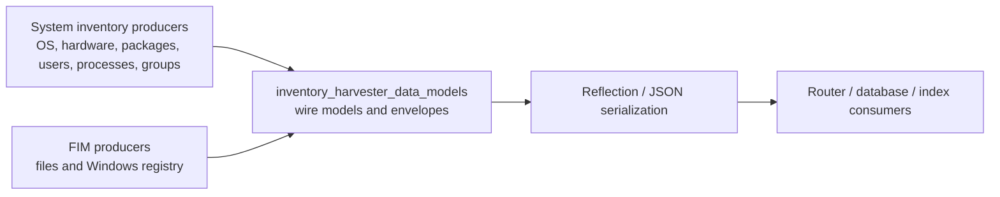
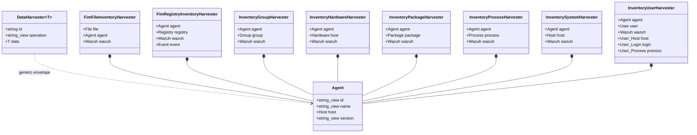
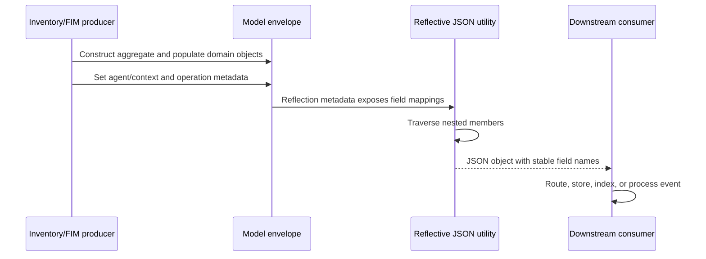
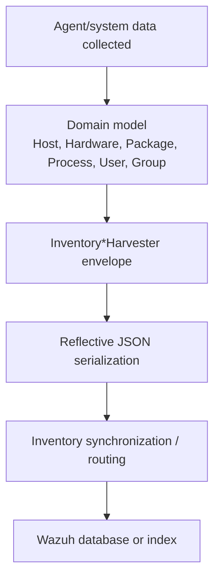
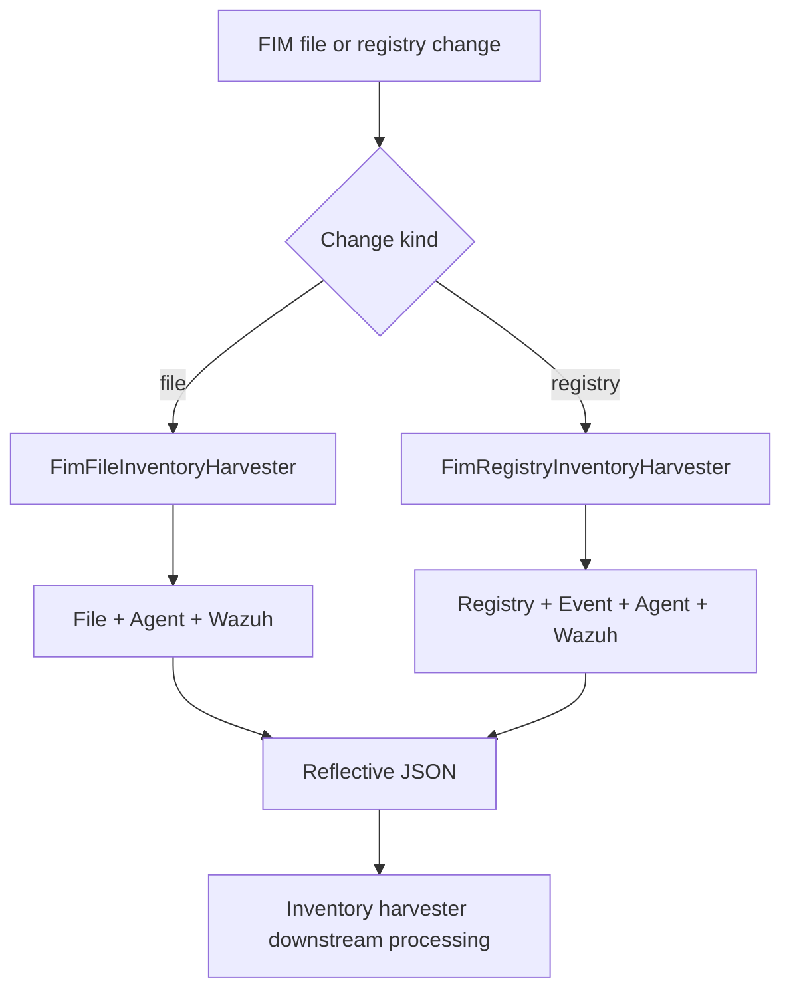
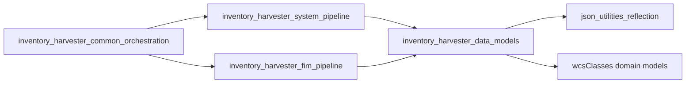

# Inventory Harvester Data Models

The `inventory_harvester_data_models_inventory_harvester_data_models` module defines the C++ value objects used to represent inventory and file-integrity events before they are serialized as JSON. It is a schema/model layer: it does not collect host data, persist records, or schedule work. Instead, it supplies strongly typed envelopes that connect the inventory harvester's system/FIM pipelines to downstream Wazuh components.

The models use the repository's reflection-based JSON mechanism. Each `REFLECTABLE` declaration explicitly maps a C++ member to its wire-format field name, making the declaration both the in-memory schema and the serialization contract.

## Module position

The module is a child of the inventory harvester data-model layer. Producers are documented in [inventory_harvester_system_pipeline_elements_and_orchestration](inventory_harvester_system_pipeline_elements_and_orchestration.md) and [inventory_harvester_fim_pipeline](inventory_harvester_fim_pipeline.md). Runtime startup and orchestration are covered by [inventory_harvester_common_orchestration](inventory_harvester_common_orchestration.md). The reflection implementation is shared with [json_utilities_reflection](json_utilities_reflection.md).

## Architecture

The model layer has three levels:

1. `Agent` is the shared identity and host context for agent-scoped events.
2. Domain payloads (`File`, `Registry`, `Group`, `Hardware`, `Package`, `Process`, `Host`, `User`, and related Wazuh classes) describe the event-specific data. These classes are defined in the sibling `wcsClasses` directory; this module references them rather than redefining their fields.
3. Harvester envelopes group the payload with `Agent`, `Wazuh`, and, for registry/user events, additional context objects.

## Core models

### `DataHarvester<T>`

`DataHarvester` is a generic transport envelope:

| Field | Type | Meaning |
|---|---|---|
| `id` | `std::string` | Event or record identifier. |
| `operation` | `std::string_view` | Operation applied to the record, such as an insert, update, or delete operation. The accepted values are determined by the producer/consumer contract. |
| `data` | `T` | Domain-specific payload. |

The template permits one envelope implementation to carry different inventory payload types while preserving a consistent top-level JSON shape: `id`, `operation`, and `data`.

### `Agent`

`Agent` supplies common source context:

| Field | Type | Meaning |
|---|---|---|
| `id` | `std::string_view` | Wazuh agent identifier. |
| `name` | `std::string_view` | Agent name. |
| `host` | `Host` | Host identity/details associated with the agent. |
| `version` | `std::string_view` | Agent version. |

`Agent` uses non-owning string views. Callers must therefore ensure that the referenced strings remain alive for the lifetime of the model and throughout serialization.

## Event-specific envelopes

Each envelope is an aggregate with public members and no custom behavior. Field order in the reflection declaration documents the intended JSON field order, although consumers should treat field names—not order—as the contract.

| Model | Serialized fields | Typical producer |
|---|---|---|
| `FimFileInventoryHarvester` | `file`, `agent`, `wazuh` | FIM file pipeline; see [inventory_harvester_fim_pipeline](inventory_harvester_fim_pipeline.md). |
| `FimRegistryInventoryHarvester` | `agent`, `registry`, `wazuh`, `event` | FIM registry pipeline; see [inventory_harvester_fim_pipeline](inventory_harvester_fim_pipeline.md). |
| `InventoryGroupHarvester` | `group`, `agent`, `wazuh` | System inventory group element. |
| `InventoryHardwareHarvester` | `host`, `agent`, `wazuh` | System inventory hardware element. The member is named `host` on the wire even though its C++ type is `Hardware`. |
| `InventoryPackageHarvester` | `package`, `agent`, `wazuh` | System inventory package/hotfix element. |
| `InventoryProcessHarvester` | `process`, `agent`, `wazuh` | System inventory process element. |
| `InventorySystemHarvester` | `agent`, `host`, `wazuh` | System/OS inventory element. |
| `InventoryUserHarvester` | `host`, `login`, `process`, `user`, `agent`, `wazuh` | System inventory user element. The extra nested objects expose user host, login, and process context. |

The `Wazuh` member is shared metadata for the Wazuh event schema. Its definition and the domain classes are intentionally referenced through the sibling WCS model files rather than duplicated here.

## Serialization contract

The `REFLECTABLE` macros register member pointers with the shared reflective JSON utilities. `MAKE_FIELD("name", &Type::member)` establishes the exact JSON key. A serializer can therefore traverse these models without handwritten conversion code.

### Memory and lifetime considerations

- `Agent` stores `std::string_view` values for `id`, `name`, and `version`; `DataHarvester<T>::operation` is also a `std::string_view`.
- These views do not copy data. Do not construct a model from temporary strings or mutate backing storage before serialization completes.
- Domain members are stored by value, so the envelope owns those nested model objects.
- The structs are `final` and have no virtual functions, which keeps them simple aggregate-like transport types.

## Processing flows

### System inventory

### FIM inventory

## Dependencies and boundaries

Direct dependencies visible in these headers are:

- `reflectiveJson.hpp` for `REFLECTABLE` and `MAKE_FIELD`.
- `wcsClasses` models for domain payloads (`agent.hpp`, `file.hpp`, `registry.hpp`, `event.hpp`, `group.hpp`, `hardware.hpp`, `package.hpp`, `process.hpp`, `host.hpp`, `user.hpp`, and `wazuh.hpp`).
- Standard C++ string types; `Agent` and `DataHarvester` additionally use `std::string_view`.

The module does not directly depend on collection APIs or storage APIs. Those concerns belong to the orchestration and pipeline modules. For shared reflection behavior, see [json_utilities_reflection](json_utilities_reflection.md); for native module integration, see [wazuh_modules_core_native_bridges](wazuh_modules_core_native_bridges.md).

## Maintenance guidance

When adding a new event model:

1. Reuse existing `wcsClasses` types for shared metadata and domain fields.
2. Keep the envelope shallow and aggregate-like; business logic belongs in the producer/orchestrator.
3. Add every externally visible member to `REFLECTABLE` with the intended wire key.
4. Prefer stable JSON names and document intentional C++/wire-name differences, such as `InventoryHardwareHarvester::host` containing a `Hardware` value.
5. Review string-view lifetimes at every construction site.
6. Update the relevant system or FIM pipeline documentation rather than duplicating pipeline behavior here.

Because these headers define serialized schemas, changing a field name, type, or nesting level can affect routing, database synchronization, index mappings, and compatibility with existing consumers.

