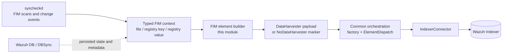
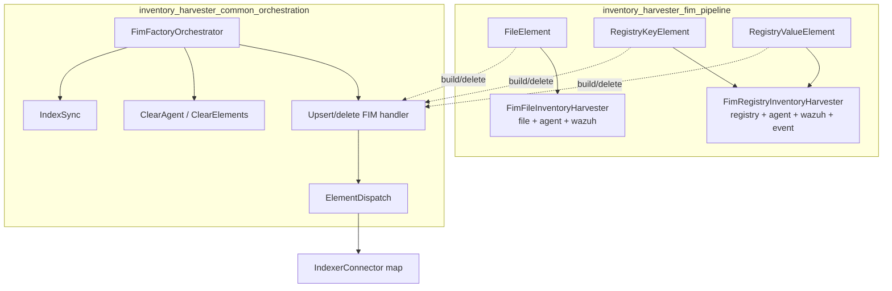
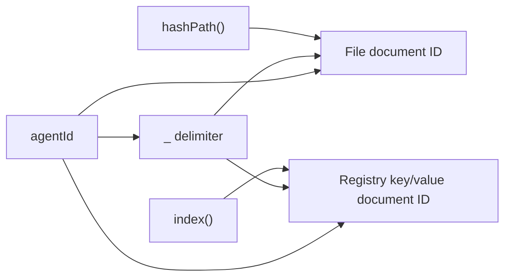
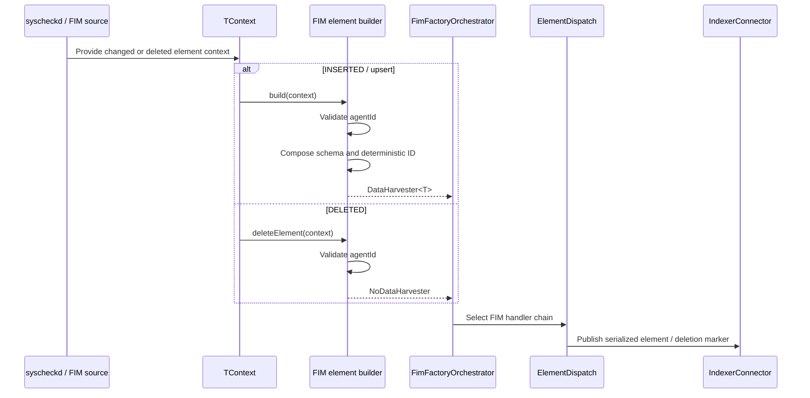
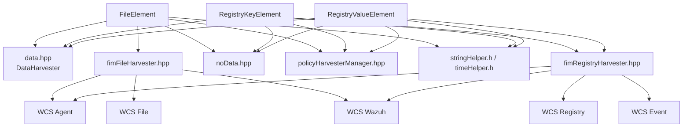
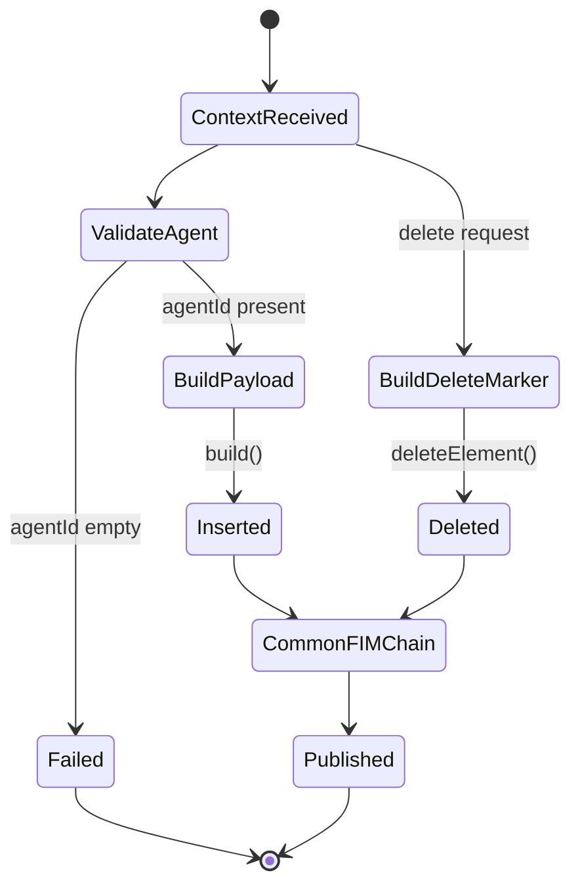

# Inventory Harvester FIM Pipeline

## Introduction

The **Inventory Harvester FIM Pipeline** converts File Integrity Monitoring (FIM) state into inventory records suitable for indexing. It covers three FIM element types:

- regular files;
- Windows Registry keys;
- Windows Registry values.

The pipeline is deliberately small and data-oriented. Its element builders read a typed context, create a `DataHarvester<T>` payload or a `NoDataHarvester` deletion marker, and leave lifecycle, chain construction, connector selection, serialization, and publication to the shared inventory-harvester orchestration layer.

Related documentation:

- [Inventory Harvester Common Orchestration](inventory_harvester_common_orchestration.md) — lifecycle, operation factories, handler chains, connector publication, and index synchronization.
- [Inventory Harvester Data Models](inventory_harvester_data_models.md) — shared `DataHarvester`, `NoDataHarvester`, WCS classes, and reflection-based JSON serialization.
- [Syscheck FIM Daemon](Syscheck___FIM_Daemon_(C_C++).md) — collection, change detection, realtime monitoring, and FIM event generation.
- [Wazuh DB FIM/Syscollector](wazuh_db_fim_syscollector.md) — persistence and database-facing FIM/syscollector records.
- [Syscheckd Registry](syscheckd_registry.md) — Windows Registry key/value scanning and event attributes consumed by this pipeline.
- [Wazuh Modules Native Bridges](wazuh_modules_core_native_bridges.md) — C-to-C++ module integration and host daemon responsibilities.

## Scope and system position

This module is the FIM-specific producer within the broader native inventory harvester. It does not scan the filesystem or Registry and does not directly communicate with the indexer.



The normal runtime path is therefore:

1. FIM produces or restores a context containing agent and element attributes.
2. A type-specific `build` or `deleteElement` function creates the inventory representation.
3. The common FIM factory places the operation in a handler chain.
4. `ElementDispatch` publishes the serialized element through the connector associated with the affected component.

## Architecture



### Components

| Component | Responsibility | Output shape |
|---|---|---|
| `FileElement<TContext>` | Builds and deletes inventory records for a monitored file. | `FimFileInventoryHarvester` or `NoDataHarvester` |
| `RegistryKeyElement<TContext>` | Builds and deletes inventory records for a Registry key. | `FimRegistryInventoryHarvester` or `NoDataHarvester` |
| `RegistryValueElement<TContext>` | Builds and deletes inventory records for a Registry value. | `FimRegistryInventoryHarvester` or `NoDataHarvester` |
| `FimFileInventoryHarvester` | Composes the file schema from `File`, `Agent`, and `Wazuh`. | Reflectable file document |
| `FimRegistryInventoryHarvester` | Composes the Registry schema from `Registry`, `Agent`, `Wazuh`, and `Event`. | Reflectable Registry document |
| `FimFactoryOrchestrator` | Shared operation-to-handler selection. | Handler chain; documented in [common orchestration](inventory_harvester_common_orchestration.md) |

The element classes are templates because the pipeline can accept more than one context implementation, provided that the context exposes the accessors used by the builder. The builders do not own the context and return values by value.

## Data models

### File inventory document

`FimFileInventoryHarvester` contains exactly three top-level fields:

```text
file   -> File
agent  -> Agent
wazuh  -> Wazuh
```

`FileElement::build` fills these areas as follows:

| Area | Fields populated |
|---|---|
| Agent identity | `agent.id`, `agent.name`, `agent.version` |
| Agent host | `agent.host.ip`, only when the context IP is not `"any"` |
| File identity/content | SHA-1, SHA-256, MD5, path, size, inode |
| File ownership | UID, GID, owner, group |
| File time | ISO-8601 modification time |
| Cluster metadata | Wazuh cluster name and, when clustered, node name |

The file schema and field types are defined by the shared WCS classes; see [Inventory Harvester Data Models](inventory_harvester_data_models.md).

### Registry inventory document

`FimRegistryInventoryHarvester` contains four top-level fields:

```text
agent    -> Agent
registry -> Registry
wazuh    -> Wazuh
event    -> Event
```

The key and value builders share the agent, Registry location, architecture, and event metadata. Registry values additionally include the value name, cryptographic hashes, and Registry data type. Registry keys additionally include ownership and timestamps.

| Element | Registry fields populated by the builder |
|---|---|
| Key | hive, key, UID, owner, GID, group, architecture, modification time, path |
| Value | hive, key, architecture, path, value name, MD5/SHA-1/SHA-256, value type |

Both Registry builders set `event.category` from `data->elementType()`. This preserves whether the source event represents a key or value without introducing separate top-level schemas.

## Element identity and operations

The builders use deterministic IDs scoped to an agent:



The resulting formulas are:

```text
file:          <agentId>_<hashPath()>
registry key:  <agentId>_<index()>
registry value:<agentId>_<index()>
```

For insertion/upsert, every builder sets `operation = "INSERTED"`. For deletion, the corresponding `deleteElement` function creates a `NoDataHarvester` with `operation = "DELETED"` and the same deterministic ID. Reusing the same ID is what allows downstream indexing to address the original inventory document.

An empty agent ID is invalid for both paths. Each builder throws `std::runtime_error` rather than creating an unscoped document:

- `"Agent ID is empty, cannot upsert FIM file element."`
- `"Agent ID is empty, cannot delete FIM file element."`
- `"Agent ID is empty, cannot upsert FIM registry key element."`
- `"Agent ID is empty, cannot delete FIM registry key element."`
- `"Agent ID is empty, cannot upsert FIM value element."`
- `"Agent ID is empty, cannot delete FIM value element."`

## Build and publication flow



The builders themselves stop after object construction. Serialization is supplied by the reflective JSON utilities used by the WCS model, and publication is supplied by common orchestration. This separation keeps element mapping testable without requiring an indexer connection.

## Detailed behavior

### `FileElement`

`FileElement::build` obtains the agent identity and file attributes from the context. It converts the numeric inode to a string and obtains the modification time through the context's ISO-8601 accessor. The literal agent IP value `"any"` is treated as an unspecified address and is omitted from the payload; other values are retained.

`FileElement::deleteElement` needs only the agent ID and `hashPath()`. It does not copy file attributes into the deletion marker.

### `RegistryKeyElement`

`RegistryKeyElement::build` identifies the record with `agentId + "_" + index()`. It maps Registry ownership, location, architecture, timestamp, and source path, and records the source category in `event.category`.

`RegistryKeyElement::deleteElement` uses the same ID formula and emits no Registry attributes.

### `RegistryValueElement`

`RegistryValueElement::build` maps the Registry value's name, type, path, architecture, and MD5/SHA-1/SHA-256 hashes. Unlike the key builder, it does not populate key ownership or modification time, which reflects the value-oriented source context.

`RegistryValueElement::deleteElement` also uses the shared `agentId + "_" + index()` identity.

### Cluster metadata

All three builders obtain cluster information from the process-wide `PolicyHarvesterManager`:

1. `wazuh.cluster.name` is always set from `getClusterName()`.
2. `wazuh.cluster.node` is set only when `getClusterStatus()` reports an active cluster.

The policy manager is therefore a shared runtime dependency, not a field supplied by the FIM context. Cluster lifecycle and policy-manager details belong to the surrounding daemon and common infrastructure documentation.

## Dependencies



### Dependency responsibilities

| Dependency | Role in this module |
|---|---|
| `data.hpp` | Supplies the generic typed `DataHarvester` wrapper. |
| `noData.hpp` | Supplies deletion/no-payload records. |
| `fimFileHarvester.hpp` | Defines the file inventory document composition. |
| `fimRegistryHarvester.hpp` | Defines the Registry inventory document composition. |
| WCS classes | Provide the nested schema fields populated by builders. |
| `PolicyHarvesterManager` | Provides cluster name and optional node metadata. |
| shared string/time helpers | Support the surrounding utility model and field conversion contracts. |
| common orchestration | Selects handlers and publishes the resulting record; it is not called directly by the builders. |

## Process and lifecycle boundaries



The module has no independent thread, socket, or daemon lifecycle. Startup and shutdown are handled by the parent Inventory Harvester and its native bridge; see [Inventory Harvester Common Orchestration](inventory_harvester_common_orchestration.md). The pipeline is invoked as part of an operation chain created by `FimFactoryOrchestrator`.

## Failure modes and invariants

- **Missing agent ID:** all six build/delete entry points fail fast with `std::runtime_error`.
- **Stable identity:** insertion and deletion must use the same source identity (`hashPath()` for files and `index()` for Registry elements).
- **IP sentinel:** the exact string `"any"` is omitted; no general IP validation is performed here.
- **Cluster consistency:** every inserted document receives a cluster name; a node is included only in clustered operation.
- **Schema asymmetry:** Registry keys and values intentionally expose different attributes; callers should not assume every Registry document has ownership, timestamp, or hash fields.
- **Publication errors:** connector lookup, serialization, and indexer failures occur downstream in the common orchestration path and are documented there.
- **Context contract:** a context must provide all accessors used by its selected builder. Violating that compile-time/template contract is a build-time integration error.

## Extension guidance

To add a FIM element type:

1. Add a WCS model describing the serialized payload.
2. Add a typed element builder with matching `build` and deletion behavior.
3. Define a deterministic, agent-scoped ID that is identical for upsert and delete.
4. Register the new type and operation in `FimFactoryOrchestrator` and the associated dispatch/component mapping.
5. Add tests for valid mapping, empty-agent rejection, ID stability, optional fields, and deletion markers.

Changes to generic connector routing, clear operations, index synchronization, or lifecycle should be made in [Inventory Harvester Common Orchestration](inventory_harvester_common_orchestration.md), not in these element builders.

## Source inventory

| File | Core component |
|---|---|
| `src/wazuh_modules/inventory_harvester/src/fimInventory/elements/fileElement.hpp` | `FileElement` |
| `src/wazuh_modules/inventory_harvester/src/fimInventory/elements/registryKeyElement.hpp` | `RegistryKeyElement` |
| `src/wazuh_modules/inventory_harvester/src/fimInventory/elements/registryValueElement.hpp` | `RegistryValueElement` |
| `src/wazuh_modules/inventory_harvester/src/wcsModel/fimFileHarvester.hpp` | `FimFileInventoryHarvester` |
| `src/wazuh_modules/inventory_harvester/src/wcsModel/fimRegistryHarvester.hpp` | `FimRegistryInventoryHarvester` |
