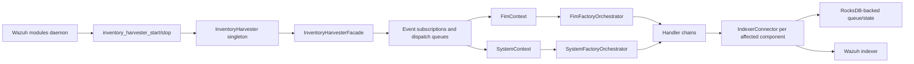
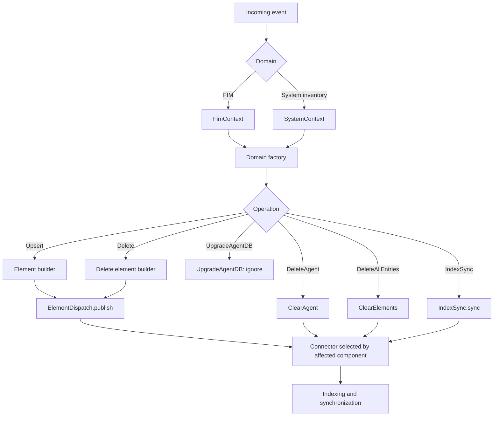
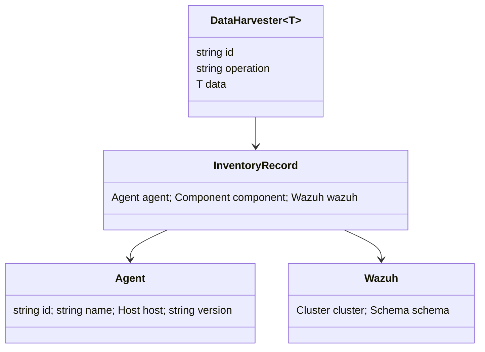
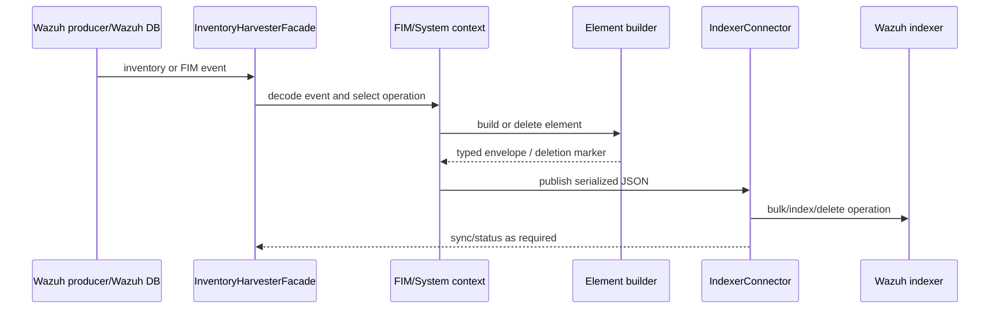

# Inventory Harvester Module

## Purpose

The Inventory Harvester is a native Wazuh module that converts inventory and File Integrity Monitoring (FIM) events into normalized WCS JSON documents for indexing. It consumes events produced by existing Wazuh data-collection and database components; it does not perform host discovery itself.

Its responsibilities are to:

- receive system-inventory and FIM changes through the harvester facade;
- build stable document identifiers and typed payloads;
- route upsert, delete, cleanup, synchronization, and database-upgrade operations;
- publish documents or deletion markers through the appropriate indexer connector.

## Position in the system

The C ABI functions `inventory_harvester_start` and `inventory_harvester_stop` are the integration boundary used by the Wazuh modules daemon. The bridge converts cJSON configuration to `nlohmann::json`, adapts the daemon logging callback, and delegates lifecycle management to the `InventoryHarvester` singleton and its facade.

## Internal architecture

Both FIM and system events follow the same high-level pipeline. An operation-specific factory creates a chain of responsibility. Upsert and delete chains first construct or serialize an element and then dispatch it. Cleanup and synchronization chains act directly on the connector map.

## Operation semantics

| Operation | Behavior |
|---|---|
| `Upsert` | Build an `INSERTED` document, serialize it, and publish it to the connector for the affected component. |
| `Delete` | Build a `DELETED` marker with the same stable identifier and publish it. |
| `DeleteAgent` | Publish `DELETED_BY_QUERY` for the agent to every connector. |
| `DeleteAllEntries` | Publish `DELETED_BY_QUERY` for the agent to the connector associated with the affected component. |
| `IndexSync` | Ask the affected connector to synchronize the agent’s queued/indexed state. |
| `UpgradeAgentDB` | Return `nullptr`; the inventory harvester intentionally ignores this event. |

Invalid operations fail during factory creation. An invalid affected component fails during connector lookup; `IndexSync` reports it explicitly with a runtime error.

## Data and identity contract

Every emitted record uses `DataHarvester<T>`, whose envelope contains `id`, `operation`, and typed `data`. Element builders generally construct IDs as `agentId + "_" + component identity`: a package ID, process ID, group name, OS name, FIM path hash, registry index, or similar key.

Payloads embed the relevant inventory object together with agent metadata and a `wazuh` object. The latter carries schema version `1.0`, cluster name, and—when clustering is enabled—the cluster node. An agent IP equal to `"any"` is omitted. Required identity values such as agent ID and element key are validated before building a document.

## Submodules

The detailed implementation is split into the following pages:

- [Common orchestration and lifecycle](inventory_harvester_common_orchestration.md) — singleton/C ABI lifecycle bridge, reusable handlers, and FIM/system factory routing.
- [FIM pipeline](inventory_harvester_fim_pipeline.md) — file, registry-key, and registry-value builders plus FIM envelopes.
- [System pipeline](inventory_harvester_system_pipeline_elements_and_orchestration_details.md) — system element builders and operation orchestration.
- [Data models](inventory_harvester_data_models_inventory_harvester_data_models.md) — reflective envelopes, inventory records, shared agent/Wazuh metadata, and component value objects.

The generator also produced these complementary system-pipeline views; they cover the same implementation area from different decomposition levels:

- [System pipeline overview](inventory_harvester_system_pipeline.md)
- [System pipeline elements and orchestration](inventory_harvester_system_pipeline_elements_and_orchestration.md)
- [System pipeline generated composite view](inventory_harvester_system_pipeline_inventory_harvester_system_pipeline.md)

## Event flow

## Failure and maintenance considerations

- Missing agent or component identity is rejected before publication.
- Connector selection is keyed by the context’s affected-component enum; adding a new component requires updating connector registration and routing.
- The handler chains retain the connector map by reference, so connector lifetime must exceed the chain lifetime.
- Reflective JSON field names are part of the index contract; changes to WCS model fields can affect downstream mappings and queries.
- Cluster metadata is read from `PolicyHarvesterManager` at build time, so emitted records reflect the current cluster configuration.

## Related implementation areas

The module relies on the shared chain-of-responsibility utilities, indexer connector, reflective JSON support, Wazuh event/database subscriptions, and the native module lifecycle. Those dependencies are intentionally described here only at the integration level; their internal behavior belongs to their respective module documentation.
