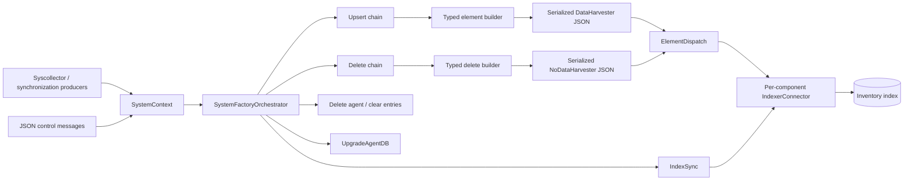
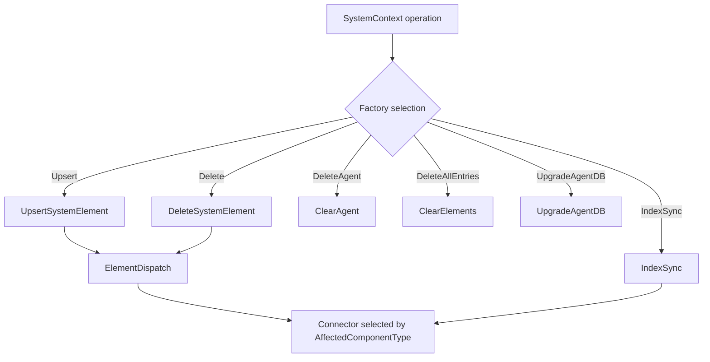
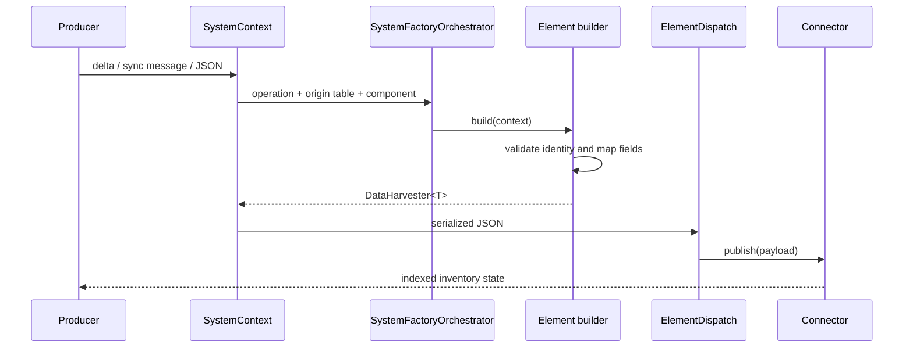

# Inventory Harvester System Pipeline

## Purpose

The system pipeline converts host-inventory changes into normalized, indexable Wazuh inventory records. It handles operating-system, hardware, package, process, user, group, and hotfix data. Each record is emitted as an `INSERTED` or `DELETED` payload and dispatched to the connector for its affected inventory component.

This document is the architectural entry point. Detailed element-builder behavior is documented in [inventory_harvester_system_pipeline_inventory_harvester_system_pipeline.md](inventory_harvester_system_pipeline_inventory_harvester_system_pipeline.md).

## Position in the system

The pipeline is part of the Advanced Security Modules layer. Syscollector and synchronization producers provide changes; the inventory harvester creates the canonical payload; indexer connectors publish or synchronize the result. The vulnerability scanner consumes indexed inventory independently.

## Architecture

`SystemContext` is the boundary object. It accepts one of three source representations—syscollector delta, synchronization message, or JSON—and exposes uniform accessors such as `agentId()`, `originTable()`, and component-specific fields. It also classifies the requested operation and affected component.

`SystemFactoryOrchestrator::create()` selects a handler chain from the operation:

| Operation | Handler path | Result |
| --- | --- | --- |
| `Upsert` | `UpsertSystemElement` → `ElementDispatch` | Builds and publishes a typed inventory record |
| `Delete` | `DeleteSystemElement` → `ElementDispatch` | Builds and publishes a tombstone |
| `DeleteAgent` | `ClearAgent` | Removes all inventory for one agent |
| `DeleteAllEntries` | `ClearElements` | Removes all records for one component |
| `IndexSync` | `IndexSync` | Requests connector-side synchronization for an agent |
| `UpgradeAgentDB` | `UpgradeAgentDB` | Performs agent database migration work |

## Data flow and identity

For upserts, a builder validates required identity fields, copies source fields into the corresponding Wazuh model, adds agent metadata, adds cluster metadata from `PolicyHarvesterManager`, and serializes the result. Most element IDs use the stable form `<agent-id>_<component-key>`:

Delete builders deliberately emit only `id` and `operation = "DELETED"`; this allows the connector to remove the matching document without reconstructing the complete record.

## Component coverage

The detailed documentation covers the following builders and their source files:

- [Detailed system-pipeline documentation](inventory_harvester_system_pipeline_inventory_harvester_system_pipeline.md) — element responsibilities, field mappings, validation, and orchestration.
- [Additional generated element/orchestration details](inventory_harvester_system_pipeline_elements_and_orchestration.md) — complementary handler and data-flow notes.
- [Generated field-level orchestration details](inventory_harvester_system_pipeline_elements_and_orchestration_details.md) — deeper identity and operation details.

The builders share the model layer, especially `DataHarvester<T>`, `NoDataHarvester`, agent metadata, and Wazuh cluster metadata. The broader model definitions are maintained by the inventory harvester data-model module; this pipeline document links to them conceptually rather than duplicating their schemas.

## Error and edge-case behavior

- Missing required identifiers cause `std::runtime_error`; examples include empty agent, package, process, user, group, hotfix, or OS identifiers.
- Optional numeric values are generally copied only when non-negative.
- Sentinel strings such as `"any"` and blank-space values are omitted from optional fields.
- Hardware uses `"unknown"` when board information is unavailable.
- Process IDs are converted with `std::stoull`; malformed numeric process IDs therefore fail during construction.
- Cluster node metadata is included only when clustering is active; cluster name is always requested from the policy manager.
- An unsupported origin table causes the upsert/delete handler to log and return `nullptr`; an unsupported factory operation throws `std::runtime_error`.

## Related modules

- [inventory_harvester_fim_pipeline.md](inventory_harvester_fim_pipeline.md) — file and registry inventory path.
- [inventory_harvester_data_models.md](inventory_harvester_data_models.md) — shared harvester payload models and Wazuh schema types.
- [syscollector_module.md](syscollector_module.md) — upstream system-information collection and persistence.
- [wazuh_db.md](wazuh_db.md) — agent database and inventory persistence services.
- [vulnerability_scanner_module.md](vulnerability_scanner_module.md) — downstream vulnerability analysis of inventory data.

## Source map

Primary sources are under `src/wazuh_modules/inventory_harvester/src/systemInventory/`. The orchestration entry point is `systemFactoryOrchestrator.hpp`; builders are under `systemInventory/elements/`. Shared dispatch and cleanup handlers are under `src/.../common/`.
