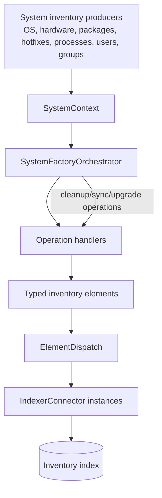
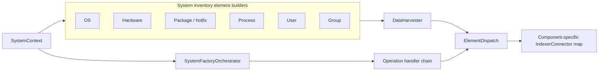

# Inventory Harvester system pipeline: elements and orchestration

## Purpose

The `inventory_harvester_system_pipeline_elements_and_orchestration` module converts system-inventory observations into typed Wazuh inventory records and routes them through operation-specific handler chains. It covers operating systems, hardware, packages, hotfixes, processes, users, and groups, together with deletion, cleanup, index synchronization, and agent-database upgrade operations.

The module is part of the C++ Inventory Harvester under `src/wazuh_modules/inventory_harvester`. Its output is designed for index-backed inventory storage and is enriched with agent and cluster identity.

## Position in the system



The module sits between inventory collection/context construction and the shared indexer layer. It does not perform platform discovery itself; it maps context accessors into the Wazuh Common Schema-oriented model objects and selects the processing path.

## Module components

Detailed responsibilities, field mappings, invariants, and operation flows are documented in [system inventory elements and orchestration details](inventory_harvester_system_pipeline_elements_and_orchestration_details.md).

| Area | Components | Role |
|---|---|---|
| Element builders | `OsElement`, `HwElement`, `PackageElement`, `HotfixElement`, `ProcessElement`, `UserElement`, `GroupElement` | Validate context identity, construct deterministic IDs, populate typed `DataHarvester` records, and create deletion markers |
| Orchestration | `SystemFactoryOrchestrator` | Chooses an operation handler and connects dispatch for upsert/delete |
| Shared handlers | `UpsertSystemElement`, `DeleteSystemElement`, `ElementDispatch`, `ClearAgent`, `ClearElements`, `IndexSync`, `UpgradeAgentDB` | Execute mutations, cleanup, synchronization, and migration workflows |
| Models and context | `SystemContext`, `DataHarvester`, `NoDataHarvester`, inventory-specific harvester models | Define inputs and output envelopes |
| Index integration | `IndexerConnector` | Receives records or deletion operations for the relevant inventory component |

## High-level architecture



## Data and control flow

```mermaid
stateDiagram-v2
    [*] --> ContextReceived
    ContextReceived --> Upsert: Operation::Upsert
    ContextReceived --> Delete: Operation::Delete
    ContextReceived --> AgentCleanup: Operation::DeleteAgent
    ContextReceived --> EntryCleanup: Operation::DeleteAllEntries
    ContextReceived --> Synchronize: Operation::IndexSync
    ContextReceived --> Upgrade: Operation::UpgradeAgentDB
    Upsert --> BuildTypedRecord
    Delete --> BuildDeletionMarker
    BuildTypedRecord --> Dispatch
    BuildDeletionMarker --> Dispatch
    Dispatch --> Indexed
    AgentCleanup --> Indexed
    EntryCleanup --> Indexed
    Synchronize --> Indexed
    Upgrade --> Indexed
    Indexed --> [*]
```

## Related documentation

- [Inventory Harvester common orchestration](inventory_harvester_common_orchestration.md) — shared lifecycle, dispatch, cleanup, and synchronization handlers used by this pipeline.
- [Inventory Harvester FIM pipeline](inventory_harvester_fim_pipeline.md) — file and registry inventory, which reuses the common dispatch and lifecycle concepts.
- [Wazuh modules core native bridges](wazuh_modules_core_native_bridges.md) — daemon-level lifecycle integration for the Inventory Harvester.
- [Shared indexer connector](indexer_connector.md) — connector abstraction used to deliver inventory records to the index layer.

The links above are intended as cross-module navigation; this document keeps the system-pipeline overview and delegates field-level detail to the dedicated submodule document.
