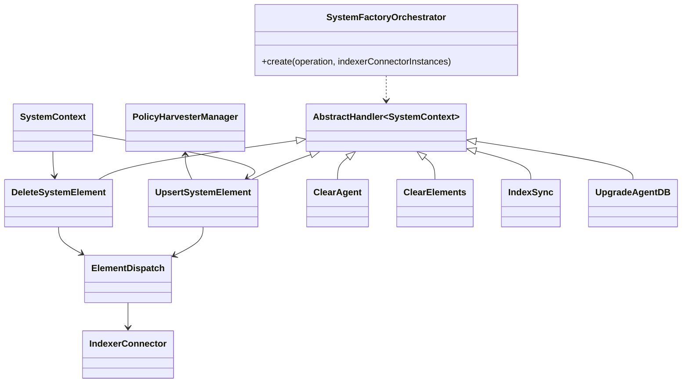
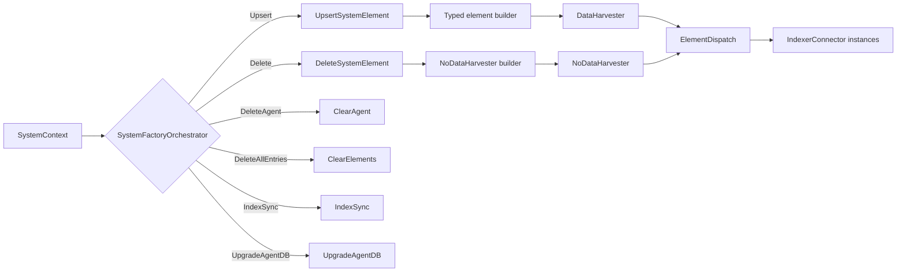
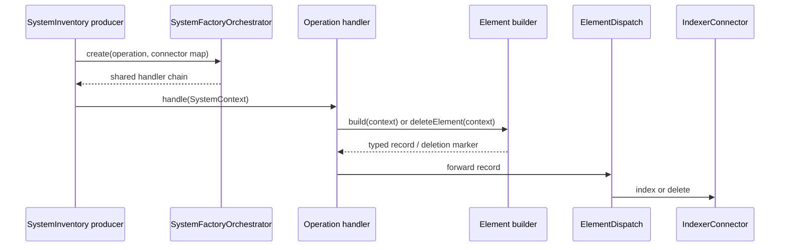

# System inventory elements and orchestration

This document describes the implementation behind the system-inventory branch of the Inventory Harvester. The code is header-only and uses templated element builders plus a factory that assembles operation-specific handler chains.

## Responsibilities

| Component | Responsibility | Input identity | Output |
|---|---|---|---|
| `OsElement<TContext>` | Maps operating-system and kernel data | `agentId + osName` | `DataHarvester<InventorySystemHarvester>` or deletion marker |
| `HwElement<TContext>` | Maps CPU, memory, and board identity | `agentId + boardInfo` (`unknown` fallback) | `DataHarvester<InventoryHardwareHarvester>` or deletion marker |
| `PackageElement<TContext>` | Maps installed software metadata | `agentId + packageItemId` | `DataHarvester<InventoryPackageHarvester>` or deletion marker |
| `HotfixElement<TContext>` | Maps an operating-system hotfix | `agentId + hotfixName` | Package-domain harvester record or deletion marker |
| `ProcessElement<TContext>` | Maps a running process | `agentId + processId` | `DataHarvester<InventoryProcessHarvester>` or deletion marker |
| `UserElement<TContext>` | Maps account, login, group, role, and password-policy data | `agentId + userName` | `DataHarvester<InventoryUserHarvester>` or deletion marker |
| `GroupElement<TContext>` | Maps local account-group membership metadata | `agentId + groupName` | `DataHarvester<InventoryGroupHarvester>` or deletion marker |
| `SystemFactoryOrchestrator` | Selects the operation handler chain | `SystemContext::Operation` | Shared handler chain |

## Common element-builder contract

Every element class exposes two static functions:

```text
build(context)       -> typed DataHarvester<T>
deleteElement(context) -> NoDataHarvester
```

Builders validate the fields required to construct a stable identifier and throw `std::runtime_error` when those fields are absent. Successful upserts use the literal operation `INSERTED`; deletions use `DELETED` and carry only the deterministic identifier.

Most records copy agent identity (`id`, `name`, and `version`) and omit the agent IP when the context reports the sentinel value `any`. They also enrich the record with cluster metadata obtained from the singleton `PolicyHarvesterManager`: the cluster name is always copied, while the node name is copied only when clustering is active.

## Element mappings

### Operating system

`OsElement` produces an `InventorySystemHarvester` record. It captures architecture, hostname, distribution name, version, platform, codename, and kernel release, system name, and version. The ID is agent-scoped by OS name.

### Hardware

`HwElement` produces an `InventoryHardwareHarvester` record. The board identifier is used as both the record suffix and serial number; an empty board value becomes `unknown`. CPU cores, name, and frequency are copied, as are total/free/used memory and usage percentage. Used memory is calculated as `max(total - free, 0)`.

### Packages and hotfixes

`PackageElement` copies package architecture, name, version, vendor, installation time, size, format, description, and installation path. `HotfixElement` uses the package harvester model but populates the hotfix name field. Both use agent-scoped IDs and the package/hotfix context key as the suffix.

### Processes

`ProcessElement` copies arguments, command line, name, start time, and parent PID. It derives `args_count` from the argument vector and converts the process ID string to an unsigned integer with `std::stoull`; malformed numeric IDs therefore surface as conversion exceptions.

### Users and groups

`UserElement` maps a broad account snapshot: login state and TTY/type, user identity, home and shell, creation and last-login timestamps, hidden/remote flags, primary group, memberships, roles, authentication failures, and password status/aging fields. Delimited context values are normalized into arrays (`host IPs` and `roles` by comma; groups by colon). `GroupElement` maps group ID, name, description, UUID, signed-ID state, hidden state, and member names, also splitting members by colon.

## Orchestration operations

`SystemFactoryOrchestrator::create` returns a `std::shared_ptr<AbstractHandler<std::shared_ptr<SystemContext>>>`.

| Operation | Handler selected | Chain behavior |
|---|---|---|
| `Upsert` | `UpsertSystemElement<SystemContext>` | Upsert, then `ElementDispatch` |
| `Delete` | `DeleteSystemElement<SystemContext>` | Delete, then `ElementDispatch` |
| `DeleteAgent` | `ClearAgent<SystemContext>` | Clears all inventory for one agent |
| `DeleteAllEntries` | `ClearElements<SystemContext>` | Clears all entries for the selected inventory component(s) |
| `IndexSync` | `IndexSync<SystemContext>` | Synchronizes index state |
| `UpgradeAgentDB` | `UpgradeAgentDB<SystemContext>` | Performs agent database/schema upgrade handling |

For upsert and delete, `ElementDispatch` is explicitly installed as the final handler and receives the map of component-specific `IndexerConnector` instances. Invalid operations fail immediately with `std::runtime_error`.

## Architecture



## Data flow



## Operational sequence



## Dependencies and invariants

- `data.hpp`, the inventory-specific harvester models, and `noData.hpp` define the record containers consumed by the builders.
- `systemContext.hpp` supplies the context accessors and operation enum; the builders are templated so compatible context implementations can be substituted.
- `PolicyHarvesterManager` is a shared enrichment source for cluster name and, when applicable, cluster node.
- `ElementDispatch`, `ClearAgent`, `ClearElements`, `IndexSync`, and `UpgradeAgentDB` are common orchestration handlers reused by the system and FIM pipelines.
- Identifier construction is deliberately agent-scoped and deterministic. Any change to the suffix source changes the index key and can appear as a delete-plus-insert to downstream consumers.
- Sentinel values such as `any` and single-space strings are treated as “not supplied” in selected fields; numeric values are generally copied only when non-negative.

