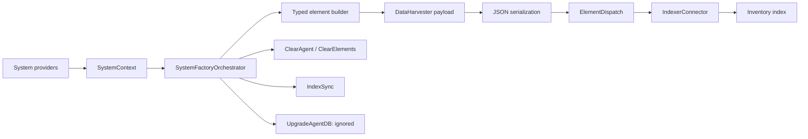
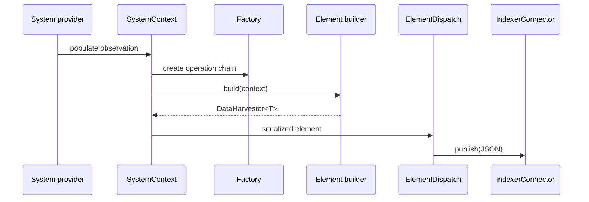
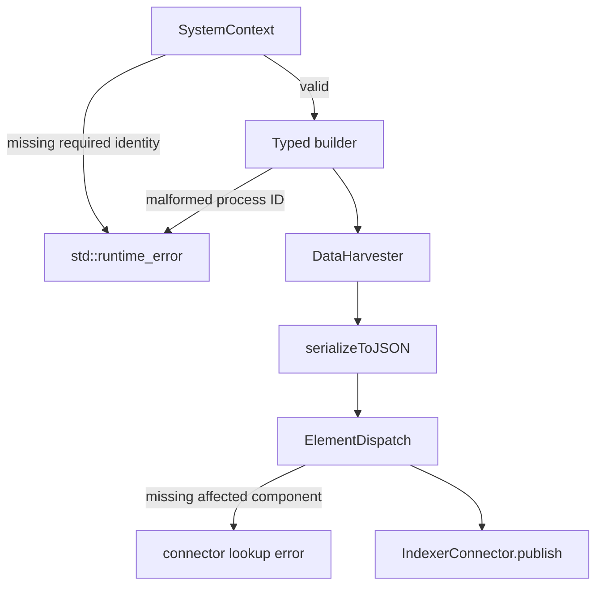

# Inventory Harvester System Pipeline

The `inventory_harvester_system_pipeline` converts system-inventory observations into typed Wazuh inventory records. It covers operating systems, hardware, packages, hotfixes, processes, users, and groups. Each element builder validates identity fields, creates a stable `agentId_componentId` key, fills a WCS model, adds agent/cluster metadata, and emits `INSERTED` or `DELETED` data.

This is a child of the inventory harvester. Related modules are [inventory_harvester_common_orchestration.md](inventory_harvester_common_orchestration.md), [inventory_harvester_data_models.md](inventory_harvester_data_models.md), [inventory_harvester_fim_pipeline.md](inventory_harvester_fim_pipeline.md), and [vulnerability_scanner_module.md](vulnerability_scanner_module.md).

## Architecture



`SystemFactoryOrchestrator::create()` selects the operation handler:

| Operation | Handler | Effect |
|---|---|---|
| `Upsert` | `UpsertSystemElement` → `ElementDispatch` | Build and publish an inserted record. |
| `Delete` | `DeleteSystemElement` → `ElementDispatch` | Build and publish a deleted record. |
| `DeleteAgent` | `ClearAgent` | Publish `DELETED_BY_QUERY` to every connector. |
| `DeleteAllEntries` | `ClearElements` | Clear the selected component index for an agent. |
| `IndexSync` | `IndexSync` | Synchronize the selected connector for an agent. |
| `UpgradeAgentDB` | `UpgradeAgentDB` | Intentionally ignored and returns `nullptr`. |

```mermaid
flowchart TD
    O[SystemContext operation] --> F{Factory}
    F -->|Upsert| U[UpsertSystemElement]
    F -->|Delete| D[DeleteSystemElement]
    U --> E[ElementDispatch]
    D --> E
    E --> P[publish serialized element]
    F -->|DeleteAgent| A[ClearAgent]
    F -->|DeleteAllEntries| C[ClearElements]
    F -->|IndexSync| S[IndexSync]
    A --> PA[publish delete query to all connectors]
    C --> PC[publish delete query to one connector]
    S --> SI[connector.sync(agent ID)]
```

## Element responsibilities

| Builder | Model | Stable identity | Collected data |
|---|---|---|---|
| `OsElement` | `InventorySystemHarvester` | `agentId_osName` | Hostname, architecture, kernel, OS metadata. |
| `HwElement` | `InventoryHardwareHarvester` | `agentId_boardInfo` | CPU, memory, serial number; board defaults to `unknown`. |
| `PackageElement` | `InventoryPackageHarvester` | `agentId_packageItemId` | Package identity, vendor, timestamps, size, format, description, path. |
| `HotfixElement` | `InventoryPackageHarvester` | `agentId_hotfixName` | Hotfix identity and agent metadata. |
| `ProcessElement` | `InventoryProcessHarvester` | `agentId_processId` | PID, command line, arguments, start time, parent PID. |
| `UserElement` | `InventoryUserHarvester` | `agentId_userName` | User, login, host, groups, roles, password state, auth failures. |
| `GroupElement` | `InventoryGroupHarvester` | `agentId_groupName` | Group identity, description, UUID, hidden flag, members. |

Detailed builder and orchestration documentation is in [inventory_harvester_system_pipeline_elements_and_orchestration.md](inventory_harvester_system_pipeline_elements_and_orchestration.md), with field-level details in [inventory_harvester_system_pipeline_elements_and_orchestration_details.md](inventory_harvester_system_pipeline_elements_and_orchestration_details.md).

## Data flow



The common envelope is `DataHarvester<T>`, containing `id`, `operation`, and typed `data`. System, hardware, package, process, user, and group payloads all include agent and Wazuh cluster metadata. The user payload additionally exposes separate host, login, and process sections.

## Validation and normalization

- Every builder requires a non-empty agent ID and component identity.
- Process IDs are parsed as unsigned integers.
- The agent IP value `any` is omitted.
- Blank-string sentinel values are omitted; delimited groups, hosts, and roles become arrays.
- Hardware used memory is calculated as `max(total - free, 0)`.
- Cluster name is always set; cluster node is set only when clustering is active.
- Missing connector mappings are programming/configuration errors; publication uses map lookup and `IndexSync` reports an explicit invalid-component error.



The pipeline collects no host data and does not implement vulnerability matching. Collection belongs to provider layers; indexing belongs to connectors; vulnerability processing is documented in [vulnerability_scanner_module.md](vulnerability_scanner_module.md).
