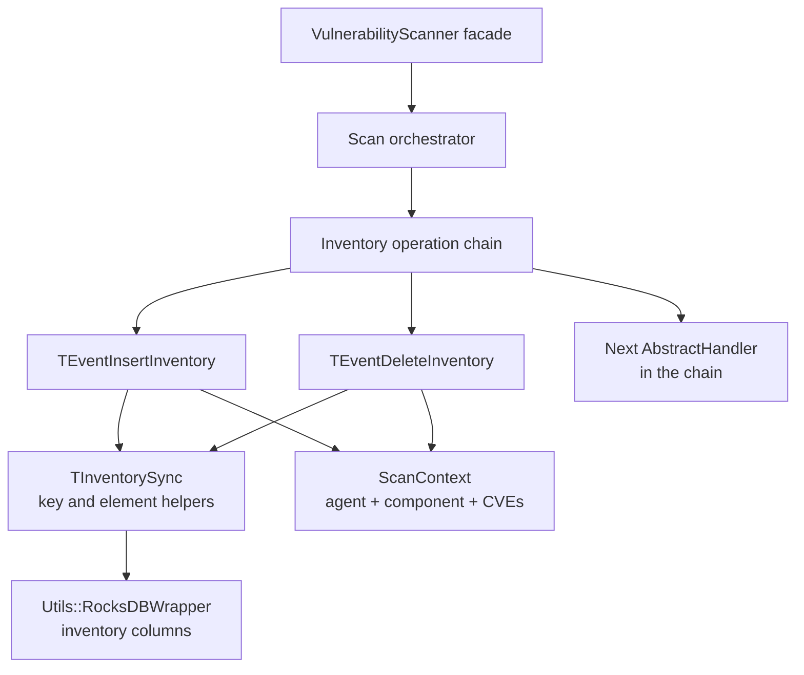
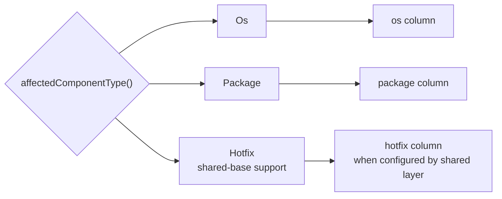
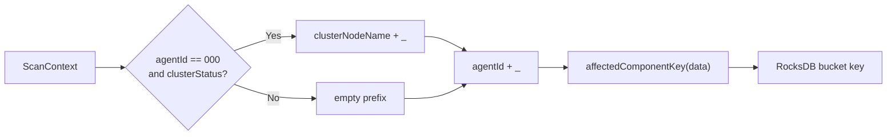
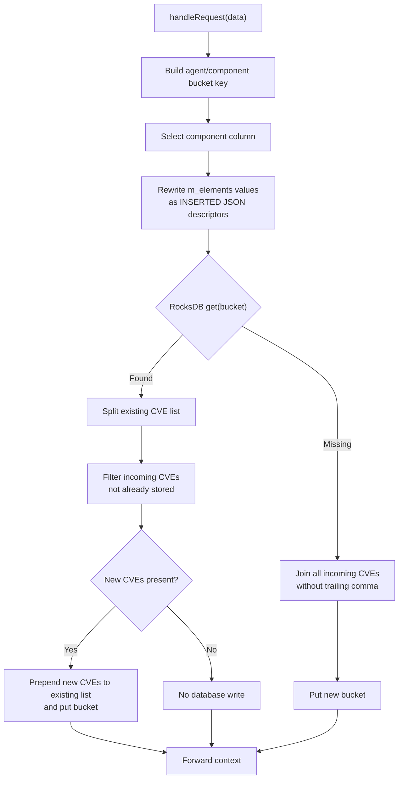
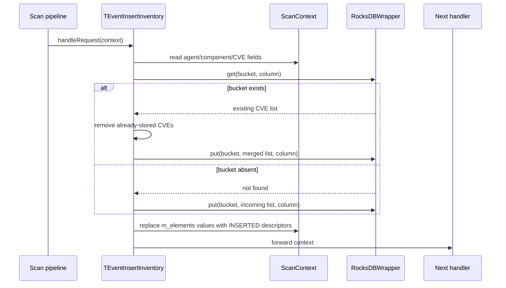
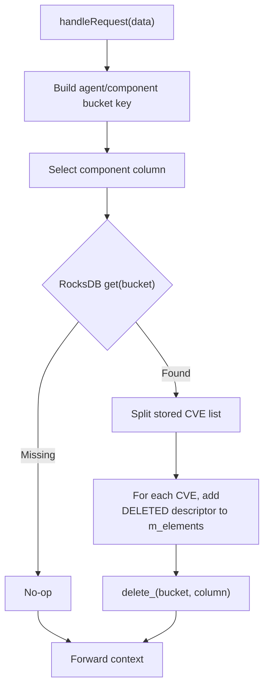
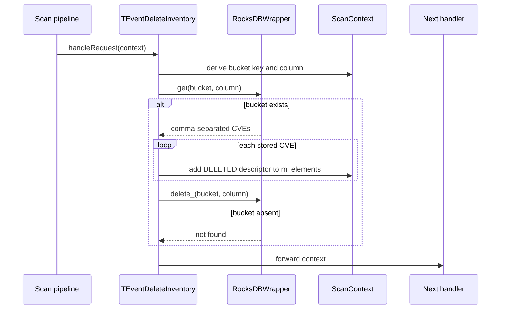
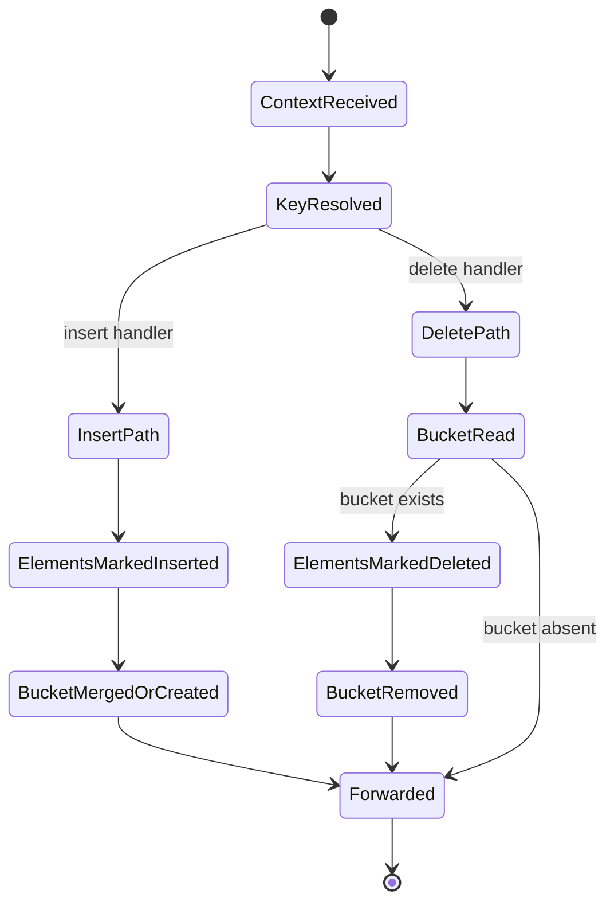
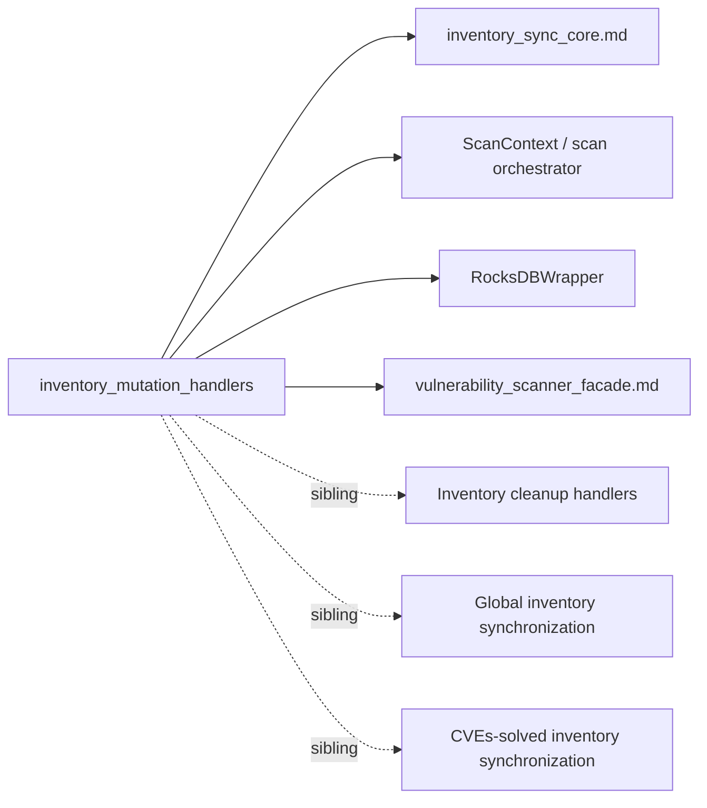

# Inventory Mutation Handlers

## Introduction

`inventory_mutation_handlers` contains the two scan-orchestrator handlers that mutate the vulnerability scanner's per-agent inventory index:

- `TEventInsertInventory`: records newly observed OS or package CVEs and emits `INSERTED` element events.
- `TEventDeleteInventory`: removes the inventory bucket for an OS or package and emits `DELETED` element events for every CVE previously stored in that bucket.

Both are chain-of-responsibility handlers. They consume a shared `ScanContext`, use the key and element conventions supplied by [`inventory_sync_core.md`](inventory_sync_core.md), mutate a `Utils::RocksDBWrapper`, and pass the same context to the next handler. They are part of the vulnerability scanner's scan-orchestrator inventory operations; lifecycle and upstream event wiring are described in [`vulnerability_scanner_facade.md`](vulnerability_scanner_facade.md).

## Module scope and location

| Component | Source file | Role |
| --- | --- | --- |
| `TEventInsertInventory<TScanContext>` | `src/wazuh_modules/vulnerability_scanner/src/scanOrchestrator/eventInsertInventory.hpp` | Inserts or merges CVE identifiers for one agent/component bucket. |
| `TEventDeleteInventory<TScanContext>` | `src/wazuh_modules/vulnerability_scanner/src/scanOrchestrator/eventDeleteInventory.hpp` | Reads and removes one inventory bucket, generating deletion events for its contents. |
| `EventInsertInventory` | Same as insert handler | Production alias for `TEventInsertInventory<ScanContext>`. |
| `EventDeleteInventory` | Same as delete handler | Production alias for `TEventDeleteInventory<ScanContext>`. |

The handlers deliberately do not implement scan matching, CVE feed management, or database schema setup. Those concerns belong to the scan orchestrator, feed/scanner services, and [`TInventorySync`](inventory_sync_core.md).

## Architectural position



The scan orchestrator chooses the appropriate operation based on inventory state or scan events. The handlers are synchronous at their API boundary: each `handleRequest` completes its local RocksDB work before delegating to the next handler.

## Shared contracts

### Handler interface

Each class inherits:

```cpp
AbstractHandler<std::shared_ptr<TScanContext>>
```

The input and output are the same `std::shared_ptr<TScanContext>`. After its operation, the handler calls the base implementation with `std::move(data)`. The base handler therefore controls whether the context is forwarded or returned at the end of the chain.

### Inventory synchronization base

Each handler also inherits `TInventorySync<TScanContext>`. The base class:

- stores the `RocksDBWrapper` reference;
- prepares inventory columns;
- exposes `affectedComponentKey(data)`;
- creates operation JSON through `buildElement(operation, elementKey)`.

The mutation handlers add the agent-specific prefix and the storage operation. Details of column creation, affected-component identity, and JSON operation descriptors belong to [`inventory_sync_core.md`](inventory_sync_core.md).

### Component types and columns

The handlers use `AFFECTED_COMPONENT_COLUMNS.at(data->affectedComponentType())`. Consequently, the context must provide a supported affected component and the mapping must contain it. In the documented vulnerability-scanner inventory path, the relevant component types are `Os` and `Package`; the shared base also defines conventions for `Hotfix`.



## Inventory key construction

Both handlers construct the same bucket key:

```text
<optional cluster-node prefix><agent id>_<affected component key>
```

The implementation first checks for the special manager agent:

```cpp
data->agentId().compare("000") == 0 && data->clusterStatus()
```

When true, the key starts with `<clusterNodeName>_`. It then appends the agent ID, an underscore, and `TInventorySync::affectedComponentKey(data)`. For a package context, the final component key is the package item ID; for an OS context, it is the OS identity defined by the shared synchronization layer.



The bucket key identifies a CVE list, not an individual CVE. Individual event IDs are formed by appending `_<cve>` to that bucket key.

## `TEventInsertInventory`

### Purpose

`TEventInsertInventory` handles an inventory result containing CVEs to add for one agent and affected component. It updates the stored comma-separated CVE list and changes every incoming element in `data->m_elements` into an `INSERTED` operation descriptor.

### Constructor

```cpp
explicit TEventInsertInventory(Utils::RocksDBWrapper& inventoryDatabase)
```

Construction delegates the database reference to `TInventorySync`. Schema preparation and column lifetime are therefore inherited from [`inventory_sync_core.md`](inventory_sync_core.md).

### Processing algorithm

1. Build the agent/component bucket key.
2. Resolve the affected-component column with `AFFECTED_COMPONENT_COLUMNS.at(...)`.
3. For every `(cve, value)` in `data->m_elements`, build an element key `<bucket>_<cve>` and replace `value` with `buildElement("INSERTED", elementKey)`.
4. Read the existing comma-separated CVE list from RocksDB.
5. If the bucket exists, append only CVEs not already present and write the merged list.
6. If the bucket does not exist, concatenate all incoming CVEs, remove the final comma, and create the bucket.
7. Forward the context to the next handler.



### Merge behavior

The existing-list branch uses a linear membership search for each incoming CVE. Duplicates already in the stored list are not re-added. If all incoming CVEs are already stored, `insertListString` remains empty and no `put` occurs.

The storage value is a comma-separated string, while `data->m_elements` carries structured operation JSON. These are separate representations: the string is the bucket index; the JSON values are downstream mutation events.

### Insert data flow



## `TEventDeleteInventory`

### Purpose

`TEventDeleteInventory` removes all CVEs represented by one agent/component bucket. It uses the bucket's current contents as the authoritative deletion set, adds a `DELETED` descriptor for each CVE to `data->m_elements`, deletes the bucket, and forwards the context.

### Processing algorithm

1. Build the same bucket key used by the insert handler.
2. Resolve the affected-component column.
3. Read the bucket value.
4. If present, split its comma-separated CVE list.
5. For every stored CVE, create `<bucket>_<cve>` and insert `buildElement("DELETED", elementKey)` into `data->m_elements`.
6. Delete the bucket from the selected column.
7. If the bucket is absent, perform no mutation and leave `m_elements` unchanged.
8. Forward the context to the next handler.



### Delete data flow



## Component interaction and class structure

```mermaid
classDiagram
    class AbstractHandler~shared_ptr_TScanContext~~ {
        +handleRequest(data) shared_ptr
    }
    class TInventorySync~TScanContext~ {
        #m_inventoryDatabase
        +affectedComponentKey(data)
        +buildElement(operation, key)
    }
    class TEventInsertInventory~TScanContext~ {
        +TEventInsertInventory(inventoryDatabase)
        +handleRequest(data)
    }
    class TEventDeleteInventory~TScanContext~ {
        +TEventDeleteInventory(inventoryDatabase)
        +handleRequest(data)
    }
    class ScanContext {
        +agentId()
        +clusterStatus()
        +clusterNodeName()
        +affectedComponentType()
        +m_elements
    }
    class RocksDBWrapper {
        +get(key, value, column)
        +put(key, value, column)
        +delete_(key, column)
    }

    AbstractHandler <|-- TEventInsertInventory
    AbstractHandler <|-- TEventDeleteInventory
    TInventorySync <|-- TEventInsertInventory
    TInventorySync <|-- TEventDeleteInventory
    TEventInsertInventory --> ScanContext : reads and updates
    TEventDeleteInventory --> ScanContext : reads and updates
    TEventInsertInventory --> RocksDBWrapper : get / put
    TEventDeleteInventory --> RocksDBWrapper : get / delete_
```

## Process flows and invariants

### Insert/delete lifecycle in the operation chain



Important invariants:

- Insert and delete must derive identical keys for the same context; otherwise deletion cannot find inserted inventory.
- The selected column is determined by the affected component, so OS and package buckets are isolated.
- Insert is idempotent with respect to CVE membership: an already-present CVE is not appended again.
- Delete is bucket-oriented: it removes all CVEs currently listed, rather than only CVEs already present in `m_elements`.
- The context remains the carrier for downstream handlers, including the generated operation descriptors.
- Missing buckets are tolerated by both operations; neither handler treats a RocksDB miss as an exception.

## Error and edge-case behavior

- `AFFECTED_COMPONENT_COLUMNS.at(...)` throws if the context contains an unsupported component type.
- Key derivation depends on valid `ScanContext` data and the contracts documented by [`inventory_sync_core.md`](inventory_sync_core.md).
- RocksDB and JSON exceptions are not caught in either handler; they propagate to the owning scan pipeline.
- An empty insert set does not create a bucket because no value is written.
- A present bucket with no new CVEs causes no write in the insert handler.
- A stored value is assumed to be a valid comma-separated CVE list. Empty tokens or malformed storage content are not normalized here.
- The manager/cluster prefix is applied only when the agent ID is `000` and cluster mode is active.
- Logging uses `WM_VULNSCAN_LOGTAG` at debug level 2 and reports the bucket key plus the inserted/updated list or deletion target.

## Dependencies and related modules



For maintainers, read the modules in this order:

1. [`vulnerability_scanner_facade.md`](vulnerability_scanner_facade.md) for scanner lifecycle and event integration.
2. [`inventory_sync_core.md`](inventory_sync_core.md) for storage columns, key helpers, and operation JSON conventions.
3. This document for the insert/delete mutation semantics.
4. The neighboring cleanup and synchronization handlers for workflows that remove stale inventory, synchronize global state, or process solved CVEs.

## Maintenance guidance

Changes to key composition, CVE serialization, or column selection must be evaluated against both handlers together. A change that affects only one key builder can leave orphaned RocksDB buckets or make deletion ineffective. Changes to `m_elements` should also be checked against downstream handlers because these classes replace or add map values with JSON operation descriptors before forwarding the context.

