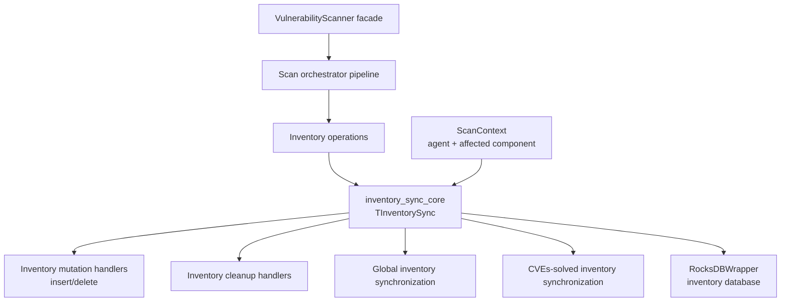
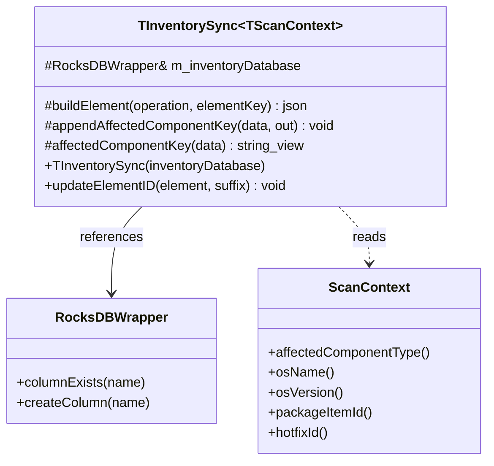
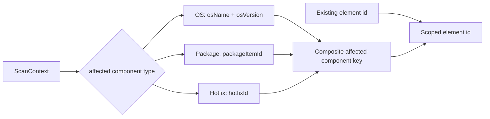
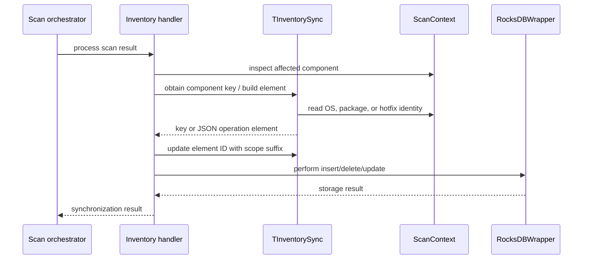
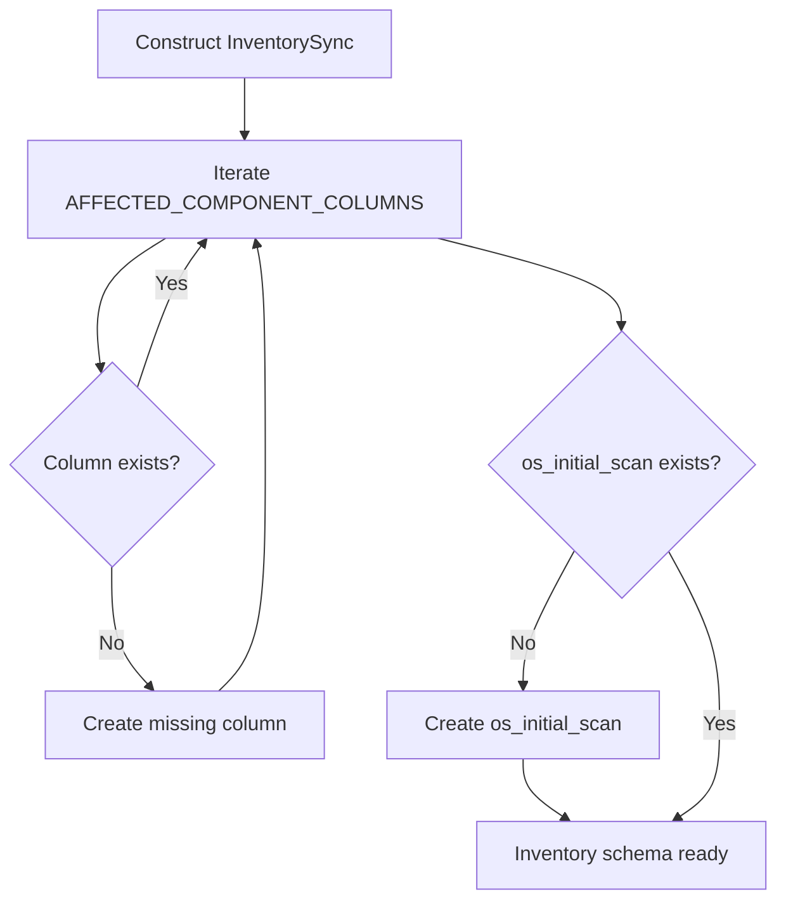
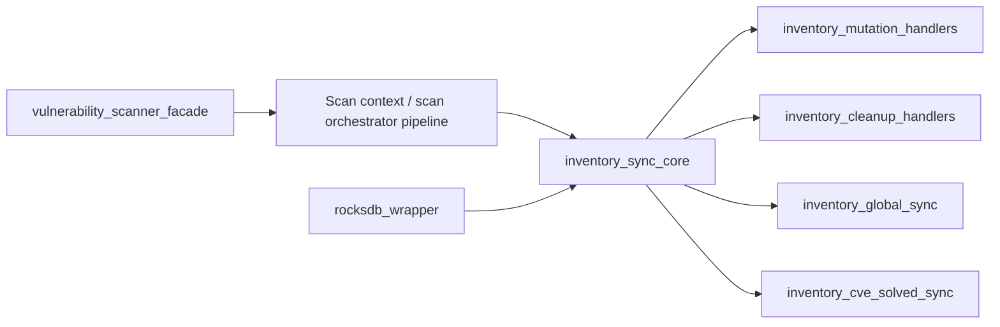

# Inventory Sync Core

`inventory_sync_core` defines the reusable inventory-database primitives used by the vulnerability scanner’s scan orchestrator. Its central type, `TInventorySync`, owns the database handle used by synchronization handlers and establishes the RocksDB column families required for operating-system, package, and initial-OS-scan state.

The component is intentionally small: it does not perform a scan, query vulnerability feeds, or execute insert/delete operations itself. It supplies shared key and element-building conventions to the neighboring inventory-operation handlers. See [database_feed_manager.md](database_feed_manager.md) for vulnerability-feed storage and [vulnerability_scanner_facade.md](vulnerability_scanner_facade.md) for scanner lifecycle integration.

## Position in the vulnerability-scanner architecture



The module is a shared base/core layer below the operation-specific handlers. The handlers are responsible for deciding *what* to synchronize; `TInventorySync` standardizes *where* and *how identifiers are represented*.

## Responsibilities

`TInventorySync` provides four responsibilities:

1. Store a reference to `Utils::RocksDBWrapper`, allowing derived or cooperating handlers to use the inventory database without copying the database object.
2. Ensure the `os`, `package`, and `os_initial_scan` columns exist when the synchronizer is constructed.
3. Build compact JSON operation descriptors containing an `operation` and an element `id`.
4. Derive affected-component keys and append component-specific suffixes to element IDs.

It supports the affected component types `Os`, `Package`, and `Hotfix`. Any unsupported type, or a null scan context where a context is required, is treated as a programming/data-contract error and raises `std::runtime_error`.

## Public API

### `TInventorySync(Utils::RocksDBWrapper& inventoryDatabase)`

The constructor stores the database reference in `m_inventoryDatabase` and performs idempotent schema preparation:

```text
for each {AffectedComponentType, column name}:
    if column does not exist:
        create it

if os_initial_scan does not exist:
    create it
```

The current component-column mapping is:

| Affected component | Column name | Purpose |
| --- | --- | --- |
| `AffectedComponentType::Os` | `os` | OS-related inventory synchronization state |
| `AffectedComponentType::Package` | `package` | Package-related inventory synchronization state |
| Initial OS scan state | `os_initial_scan` | Tracks the special initial OS scan path |

The constructor relies on the RocksDB wrapper’s `columnExists` and `createColumn` behavior. Storage details and lifecycle rules belong to [rocksdb_wrapper.md](rocksdb_wrapper.md).

### `static nlohmann::json buildElement(operation, elementKey)`

Creates the minimal operation payload:

```json
{
  "operation": "<operation>",
  "id": "<elementKey>"
}
```

The method does not validate the operation name or element key. Validation and interpretation are left to the caller/handler.

### `static void updateElementID(element, suffix)`

Mutates an existing JSON element by appending `"_" + suffix` to its `id` field. The method assumes that `element["id"]` exists and is convertible to `std::string`; malformed input therefore fails through the JSON library rather than being silently repaired.

This is used to make a base inventory element ID unique within an affected-component scope.

### `appendAffectedComponentKey(data, out)`

Appends an underscore followed by the component-specific key to `out`:

| Component | Appended form |
| --- | --- |
| OS | `_<os name>_<os version>` |
| Package | `_<package item id>` |
| Hotfix | `_<hotfix id>` |

The method reserves additional string capacity for OS keys before appending the name and version. It rejects null contexts and unsupported component types.

### `affectedComponentKey(data)`

Returns a `std::string_view` over the primary key associated with the context:

| Component | Returned value |
| --- | --- |
| OS | `data->osName()` |
| Package | `data->packageItemId()` |
| Hotfix | `data->hotfixId()` |

The returned view is non-owning. Its validity depends on the lifetime and stability of the referenced `ScanContext` fields.

## Internal structure



`TInventorySync` is a class template so tests or specialized orchestrators can provide a compatible scan-context type. The production alias is:

```cpp
using InventorySync = TInventorySync<TScanContext<>>;
```

## Key and ID conventions

The class exposes two related but distinct concepts:

- `affectedComponentKey` returns the component’s primary lookup value.
- `appendAffectedComponentKey` creates a composite suffix containing the component discriminator and value.

The expected derivation is:



For an OS context, the composite suffix is conceptually `_name_version`; for package and hotfix contexts it is `_item-id` or `_hotfix-id`. The exact final identifier depends on the caller’s initial element ID and whether it uses `updateElementID` directly or builds a key separately.

## Synchronization process

The core class participates in, but does not own, the complete synchronization transaction. A typical handler flow is:



Construction-time schema preparation is separate from per-element processing:



## Error and contract behavior

- A null context passed to `appendAffectedComponentKey` raises `std::runtime_error("Invalid scan context data for inventory key.")`.
- An unsupported affected-component type raises a runtime error in both key-generation paths.
- `affectedComponentKey` dereferences the context without its own null check; callers must establish a non-null context before calling it.
- `updateElementID` expects an existing string-compatible `id` field.
- The class does not catch RocksDB failures or JSON exceptions. Those errors propagate to the owning synchronization handler, which is responsible for transaction/error handling.

## Dependencies and related modules



Use the following module documents for the surrounding implementation:

- [rocksdb_wrapper.md](rocksdb_wrapper.md): database wrapper abstraction and column-family operations.
- [vulnerability_scanner_facade.md](vulnerability_scanner_facade.md): vulnerability scanner module lifecycle and integration boundary.
- [database_feed_manager.md](database_feed_manager.md): vulnerability database/feed management, which is separate from inventory synchronization.
- [inventory_harvester_module.md](inventory_harvester_module.md): upstream inventory collection and harvesting.

## Maintenance guidance

When adding a new affected component:

1. Extend `AffectedComponentType` and the scan-context accessors.
2. Add the component-to-column mapping if it needs independent inventory state.
3. Update both `affectedComponentKey` and `appendAffectedComponentKey`.
4. Decide whether initial-scan handling needs a new dedicated column or can reuse an existing one.
5. Update operation handlers and tests that depend on ID suffixes or column names.

Keep the key format stable: persisted RocksDB keys and derived element IDs can outlive a process instance, so changing separators or component fields may make existing inventory records unreachable or cause duplicate records.

