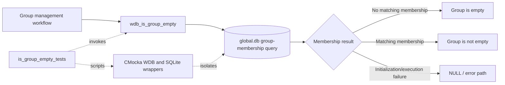
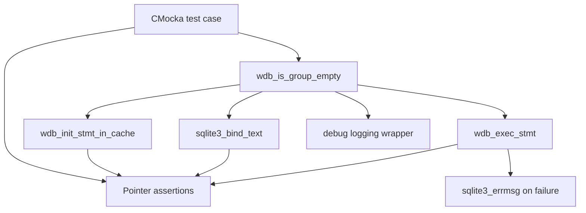
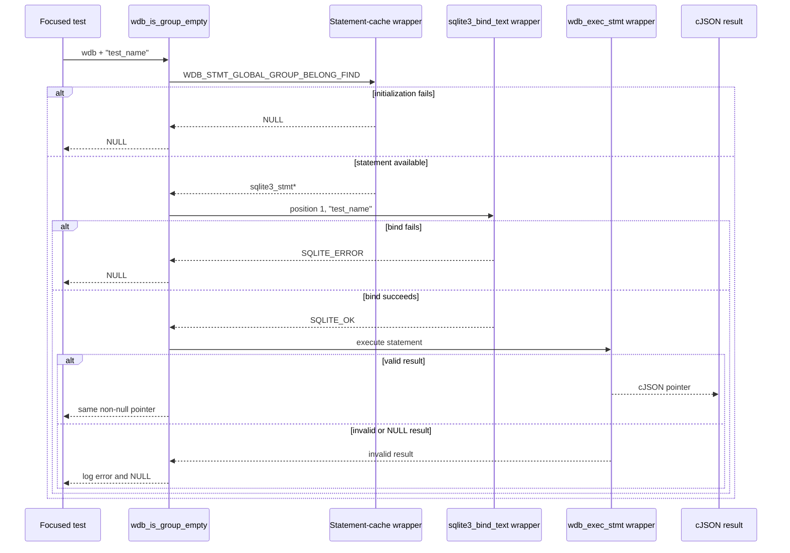
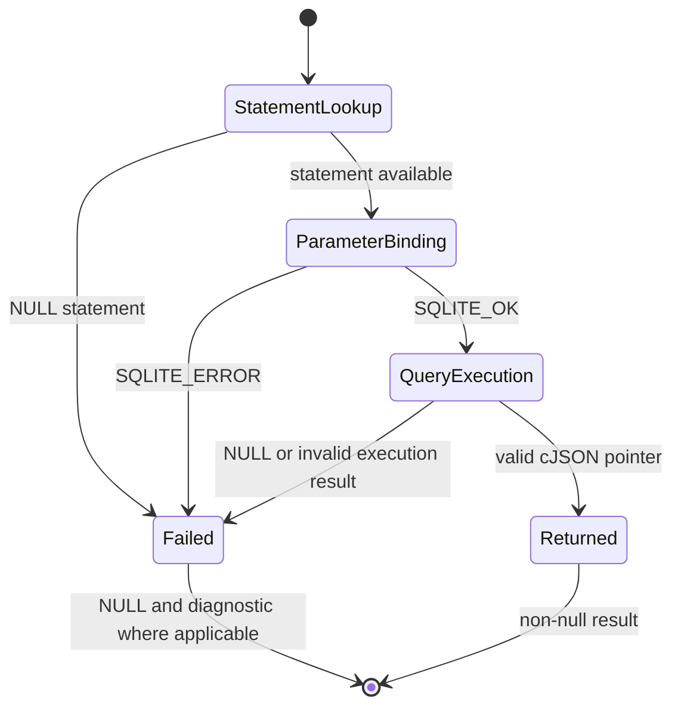

# `is_group_empty_tests`

## Introduction

`is_group_empty_tests` documents the focused CMocka coverage for
`wdb_is_group_empty()`, the Wazuh DB helper that checks whether a named agent
group has membership records in the global database.

The tests are defined in
`src/unit_tests/wazuh_db/test_wdb_global.c`. They isolate statement
initialization, group-name binding, and query execution through linker-wrapped
Wazuh DB and SQLite functions. This module documents only the four selected
test cases; the shared fixture and wrapper conventions are described in
[`test_wdb_global_test_infrastructure.md`](test_wdb_global_test_infrastructure.md).

## System position

The helper belongs to the global-database layer used by `wazuh-db`. Group
deletion and group-management workflows use the result to decide whether a
group can be removed or whether related agent/group state must be processed.
The broader database engine and its statement-cache primitives are documented
in [`wazuh_db_engine.md`](wazuh_db_engine.md). Related membership operations
are covered by [`select_group_belong_tests.md`](select_group_belong_tests.md),
[`test_wdb_global_find_group_tests.md`](test_wdb_global_find_group_tests.md),
and the parent global-database test documentation when available.



## Function contract under test

```c
cJSON *wdb_is_group_empty(wdb_t *wdb, const char *group_name);
```

The selected tests establish this execution contract:

1. Initialize or retrieve the cached statement identified by
   `WDB_STMT_GLOBAL_GROUP_BELONG_FIND`.
2. Bind `group_name` to SQLite parameter position `1`.
3. Execute the statement through `wdb_exec_stmt()`.
4. Return the query result when it is a valid non-null result; otherwise log
   the execution error and return `NULL`.

The implementation owns the SQL text and the exact JSON schema. The tests
verify the control-flow boundary and result propagation without opening a real
SQLite database.

```mermaid
flowchart TD
    Start([wdb_is_group_empty(wdb, group_name)]) --> Init{Statement initialized?}
    Init -- no --> Null1[Return NULL]
    Init -- yes --> Bind{Bind group_name at position 1?}
    Bind -- no --> Null2[Return NULL / SQLite bind error]
    Bind -- yes --> Exec[wdb_exec_stmt]
    Exec --> Result{Execution result}
    Result -- valid cJSON pointer --> Return[Return non-null result]
    Result -- invalid / NULL --> Log[Log wdb_exec_stmt error] --> Null3[Return NULL]
```

## Components and dependencies

| Component | Role |
|---|---|
| `test_wdb_global.c` | Defines, configures, and registers the focused tests. |
| `wdb_is_group_empty()` | Production helper under test. |
| `wdb.h` | Provides the `wdb_t` type, statement identifiers, and API declarations. |
| `wdb_init_stmt_in_cache` wrapper | Controls whether `WDB_STMT_GLOBAL_GROUP_BELONG_FIND` is available. |
| `sqlite3_bind_text` wrapper | Verifies parameter position `1`, the supplied group name, and bind success/failure. |
| `wdb_exec_stmt` wrapper | Supplies a valid result, an invalid result, or an execution-status sentinel. |
| `sqlite3_errmsg` wrapper | Supplies deterministic error text for the execution-failure assertion. |
| Debug/logging wrappers | Verify the expected diagnostic for the invalid-result path. |
| CMocka | Records wrapper expectations and asserts null/non-null outcomes. |
| cJSON | Represents the query result type; the success case uses a sentinel pointer. |



Each case uses the common `test_setup` and `test_teardown` fixture. Setup
creates a minimal `wdb_t` with ID `"global"`, synthetic SQLite-handle storage,
and initialized Wazuh DB configuration. Teardown frees those allocations and
releases the configuration. See
[`test_wdb_global_test_infrastructure.md`](test_wdb_global_test_infrastructure.md)
for the complete lifecycle.

## Test scenarios

| Test case | Stimulated condition | Expected behavior |
|---|---|---|
| `test_wdb_is_group_empty_stmt_init_fail` | Statement initialization returns `NULL`. | Returns `NULL` immediately; no bind or execution is configured. |
| `test_wdb_is_group_empty_stmt_init_group_found` | Statement initializes, binding succeeds, and execution returns `(cJSON *)1`. | Returns a non-null result, proving successful propagation. |
| `test_wdb_is_group_empty_stmt_init_group_not_found` | Statement initializes and binding succeeds, but the execution wrapper returns `SQLITE_OK` as the result value. | Returns `NULL` and expects `wdb_exec_stmt(): ERROR MESSAGE`. Despite its name, this case models an invalid execution result rather than a normal empty-group JSON response. |
| `test_wdb_is_group_empty_stmt_invalid_result` | Statement initializes and binding succeeds, but execution returns `NULL`. | Returns `NULL` and expects the same execution-error diagnostic. |

The tests use `group_name = "test_name"` and verify that it is bound exactly
at position `1`. They do not distinguish an empty JSON array from a populated
membership result because the supplied production boundary returns a generic
`cJSON *`; interpretation of the returned object belongs to the caller.

## Component interaction and data flow



The dependency order is significant. A failure at statement initialization
short-circuits binding and execution. Once initialization succeeds, binding
must occur before execution. The tests encode this ordering through CMocka
expectations: unexpected later wrapper calls fail the test.

## Process flows and assertions



The assertions are intentionally narrow:

- Initialization failure asserts only a null return because no SQLite error
  text is produced by the test setup.
- Successful execution asserts a non-null pointer rather than inspecting JSON
  fields; the wrapper supplies a sentinel pointer.
- Invalid execution paths assert both a null return and the exact formatted
  message `wdb_exec_stmt(): ERROR MESSAGE`.

## Maintenance guidance

- Keep `WDB_STMT_GLOBAL_GROUP_BELONG_FIND` aligned with the production
  statement used by `wdb_is_group_empty()`.
- Preserve the parameter index `1` and the exact group-name binding
  expectation when the SQL statement changes.
- If the helper begins returning a typed empty/non-empty value instead of a
  generic `cJSON *`, update the success and “not found” cases together; the
  current tests only verify pointer-level behavior.
- If execution errors change from `NULL` to a structured status, revise the
  invalid-result cases and their logging assertions.
- Keep broader group deletion and membership semantics in their own module
  documentation; link to them rather than duplicating those workflows here.
