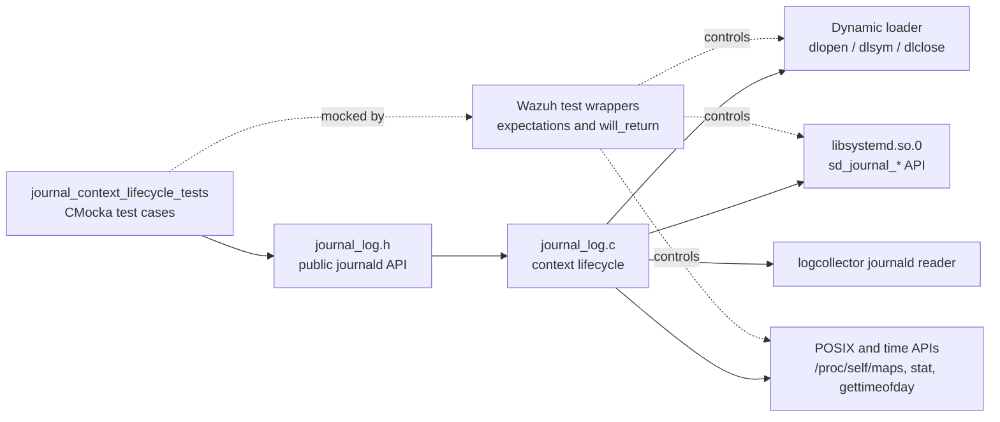
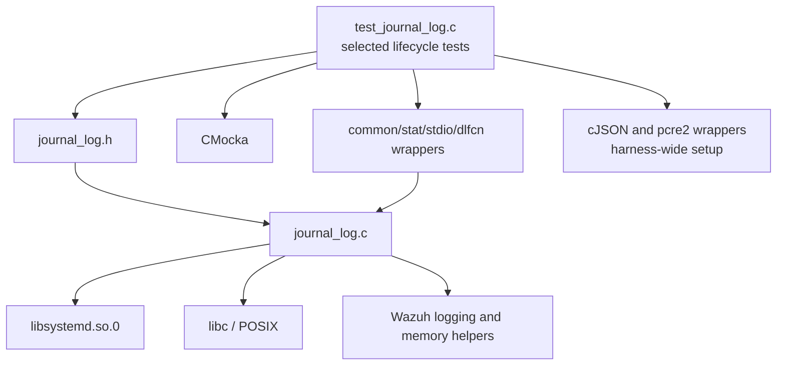
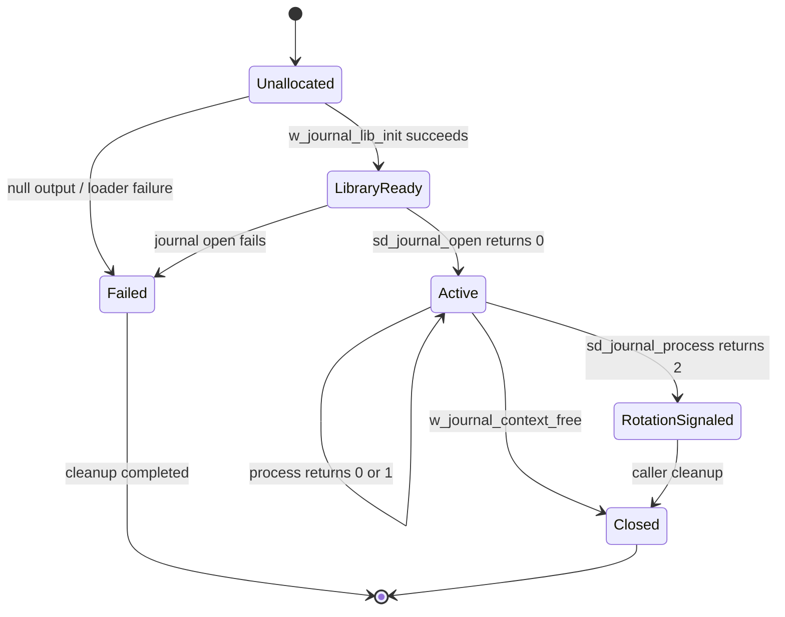
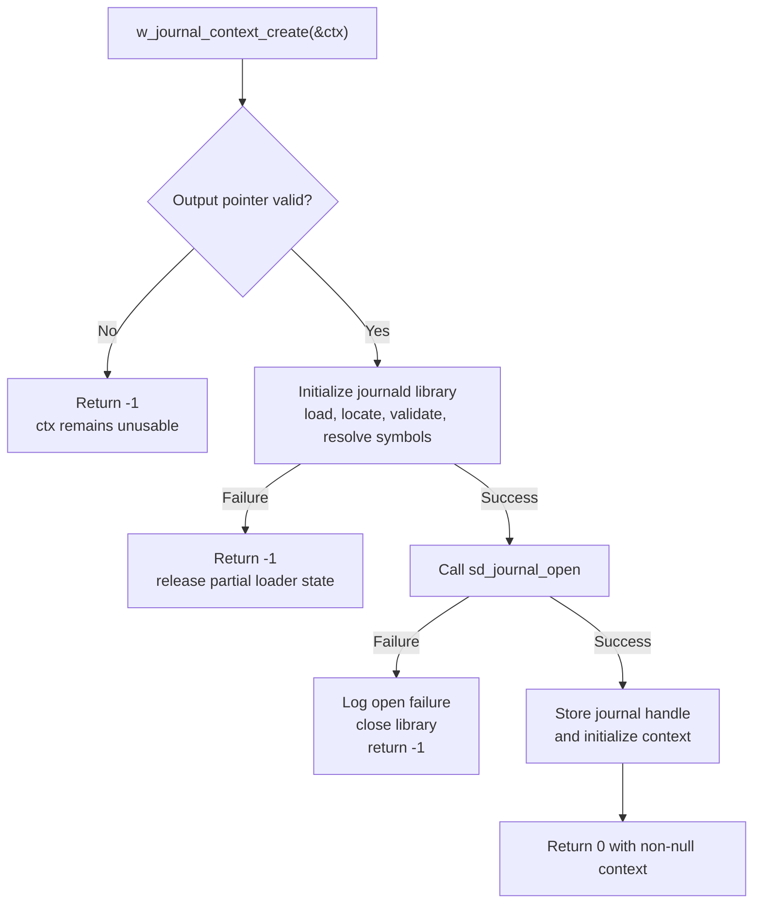
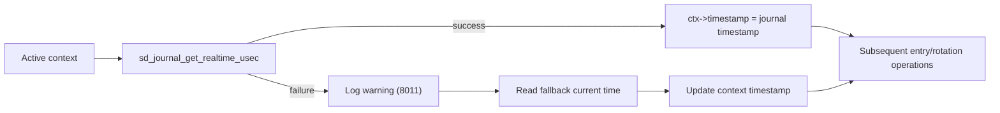
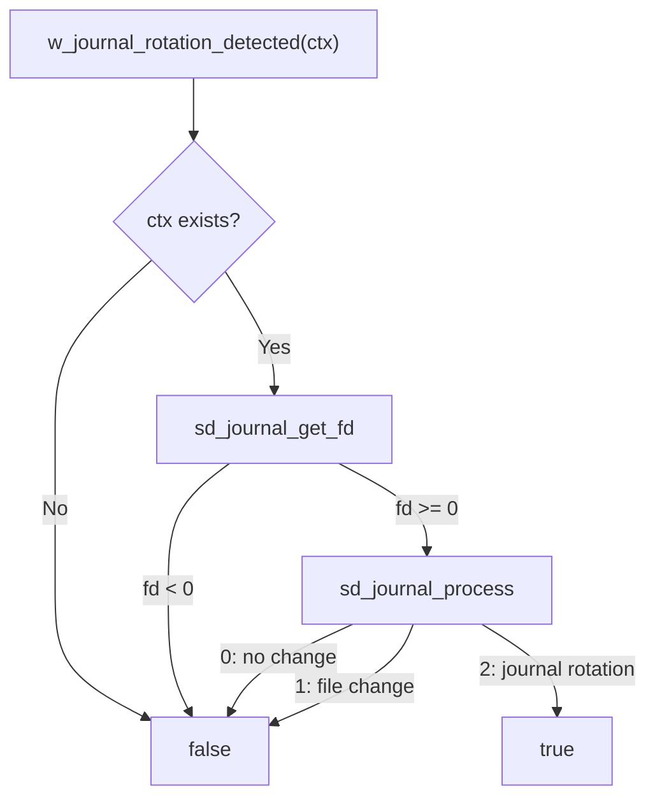

# journal_context_lifecycle_tests

The `journal_context_lifecycle_tests` module is the CMocka test slice for the journald context lifecycle in Wazuh’s logcollector. It verifies that the production journald adapter can load its systemd dependency, create and release a journal context, refresh the current entry timestamp, and detect journal rotation or state changes without leaking resources.

The tests exercise `src/logcollector/journal_log.c` through its public declarations in `src/logcollector/journal_log.h`. They replace dynamic-loader, libc, time, and `sd_journal_*` calls with deterministic wrappers, so the suite validates control flow and cleanup rather than requiring a live systemd journal.

For the broader daemon and journald-reader behavior, see [logcollector.md](logcollector.md). Entry conversion and filtering are separate concerns covered by the neighboring journal test modules.

## Scope

| Concern | Production functions exercised | Main guarantee |
| --- | --- | --- |
| Context creation | `w_journal_context_create` | A valid output pointer and successful journal open produce an initialized context; every failure path returns an error and cleans up. |
| Context destruction | `w_journal_context_free` | Null cleanup is safe; valid cleanup closes the journal and unloads the dynamic library. |
| Timestamp maintenance | `w_journal_context_update_timestamp` | The context timestamp follows `sd_journal_get_realtime_usec`; failures use the fallback time path. |
| Rotation detection | `w_journal_rotation_detected` | Invalid contexts and unavailable descriptors are ignored; systemd process status `2` is recognized as rotation. |
| Harness isolation | CMocka and Wazuh wrapper APIs | External calls, return values, logs, and ownership checks are observable and reproducible. |

## Position in the system

The test module sits below the logcollector integration boundary: it does not test the complete reader loop, message dispatch, or syslog/JSON conversion. It proves that the reader can safely obtain and maintain the low-level context it depends on. Those higher-level responsibilities belong in the related logcollector documentation and sibling test modules.

## Components and dependencies

The lifecycle tests rely on the following wrapper families:

| Wrapper or fixture | Role in these tests |
| --- | --- |
| `dlfcn` wrappers | Simulate loading `libsystemd.so.0`, symbol resolution, and unloading. |
| `stdio` wrappers | Simulate scanning `/proc/self/maps` for the loaded library path. |
| `stat` wrapper | Controls whether the discovered library is owned by root. |
| systemd journal wrappers | Control open/close, timestamp, file descriptor, and process-status results. |
| common/time wrappers | Control fallback time, debug state, and logging observations. |
| CMocka | Records call order, arguments, return values, and expected cleanup. |

Each successful context setup resolves the same required symbol set: `sd_journal_open`, `sd_journal_close`, `sd_journal_previous`, `sd_journal_next`, `sd_journal_seek_tail`, `sd_journal_seek_realtime_usec`, `sd_journal_get_realtime_usec`, `sd_journal_get_data`, `sd_journal_restart_data`, `sd_journal_enumerate_data`, `sd_journal_get_cutoff_realtime_usec`, `sd_journal_process`, and `sd_journal_get_fd`.

## Context lifecycle model

`RotationSignaled` is an observation, not an automatic reinitialization. The production function reports the condition to its caller; the caller decides whether to reopen or reposition the journal.

## Context creation flow

The tests model the library-loading sequence explicitly: `dlopen` is expected first, `/proc/self/maps` is scanned, the path is checked with `stat`, and every required symbol is resolved. This makes the context tests sensitive to changes in the production ABI-loading contract as well as to journal-open behavior.

## Timestamp data flow

The success test verifies the timestamp returned by the systemd wrapper is stored. The failure test verifies that the operation does not leave the context without a usable time value and that the warning path is exercised. Passing a null context is a defensive no-op and must not dereference memory.

## Rotation detection flow

The test suite intentionally distinguishes ordinary file changes (`process == 1`) from rotation (`process == 2`). A missing or invalid journal descriptor is treated as “not detected” rather than as a rotation signal.

## Test inventory

All tests are registered by the `main` function in `src/unit_tests/logcollector/test_journal_log.c` and run through `cmocka_run_group_tests(tests, group_setup, group_teardown)`.

| Test | Scenario and expected result |
| --- | --- |
| `test_w_journal_context_create_journal_open_fail` | Library initialization succeeds, journal open returns an error, and creation returns `-1` after loader cleanup. |
| `test_w_journal_context_create_lib_init_fail` | Dynamic library initialization fails; creation returns `-1` without attempting journal open. |
| `test_w_journal_context_create_null_pointer` | A null output pointer is rejected with `-1`. |
| `test_w_journal_context_create_success` | All loader and journal-open operations succeed; return value is `0` and the context and journal handle are non-null. |
| `test_w_journal_context_free_null` | Freeing `NULL` is safe and performs no external cleanup. |
| `test_w_journal_context_free_valid` | A valid context closes the journal, unloads the library, and releases the context. |
| `test_w_journal_context_update_timestamp_ctx_null` | A null context is handled defensively without a crash. |
| `test_w_journal_context_update_timestamp_fail` | Timestamp retrieval fails; the warning/fallback path is used. |
| `test_w_journal_context_update_timestamp_success` | Timestamp retrieval succeeds and updates the context timestamp. |
| `test_w_journal_rotation_detected_no_context` | Null context returns `false`. |
| `test_w_journal_rotation_detected_no_fd` | Invalid journal descriptor returns `false`. |
| `test_w_journal_rotation_detected_no_changes` | `sd_journal_process == 0` returns `false`. |
| `test_w_journal_rotation_detected_file_changes` | `sd_journal_process == 1` is not treated as rotation and returns `false`. |
| `test_w_journal_rotation_detected_rotation` | `sd_journal_process == 2` is treated as rotation and returns `true`. |

## Harness setup and isolation

The shared group setup enables test mode and disables the pcre2 wrappers; teardown restores those settings. Although pcre2 and cJSON are not central to this lifecycle slice, they are part of the shared `test_journal_log.c` harness and must remain initialized consistently with the other journal tests.

Each test constructs its own mocked loader and journal state. Successful tests explicitly expect both sides of resource ownership:

1. The journal handle is closed through `sd_journal_close`.
2. The dynamic library handle is released through `dlclose`.
3. The context and any test-owned allocations are freed.

This is important because a passing behavior assertion alone would not detect a leak in either the systemd handle or the journal context.

## Failure and cleanup contract

| Failure condition | Observable contract |
| --- | --- |
| Null context output pointer | Return `-1`; do not allocate or open anything. |
| Library load/path/ownership/symbol failure | Return `-1`; release any partially initialized loader state. The detailed loader cases are shared with the neighboring journal-library initialization tests. |
| Journal open failure | Return `-1`; log the open error and unload the library. |
| Timestamp lookup failure | Keep the operation safe, emit the warning path, and use fallback time handling. |
| Null free | No-op. |
| Invalid journal file descriptor | Rotation result is `false`. |

The loader sequence is intentionally duplicated in the test setup because it verifies the lifecycle API against the same security checks used by production. For the lower-level ownership, path discovery, and symbol-resolution cases, refer to [journal_lib_init_tests.md](journal_lib_init_tests.md) when that sibling module documentation is available.

## Maintenance guidance

- When adding a required `sd_journal_*` symbol to the production loader, update the wrapper expectation helper and every successful context setup in this test source.
- Preserve the cleanup expectations on all failure paths; in particular, journal-open failure must not leave the `dlopen` handle live.
- Keep `sd_journal_process` return-value coverage distinct: `1` represents a file change, while `2` is the rotation signal expected by this API.
- If timestamp fallback semantics change, update both the return-value and logging assertions in the timestamp tests.
- Run the repository’s logcollector CMocka/unit-test target after modifying `journal_log.c`, `journal_log.h`, or the wrapper implementations.

## Related documentation

- [logcollector.md](logcollector.md) — logcollector module and journald integration context.
- [journal_lib_init_tests.md](journal_lib_init_tests.md) — dynamic systemd library loading and validation.
- [journal_context_navigation_tests.md](journal_context_navigation_tests.md) — seeking and moving through journal entries.
- [journal_filter_tests.md](journal_filter_tests.md) — journal field filters and filtered iteration.
- [journal_entry_processing_tests.md](journal_entry_processing_tests.md) — JSON/syslog entry conversion and formatting.
