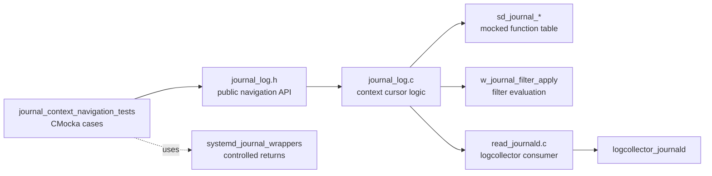
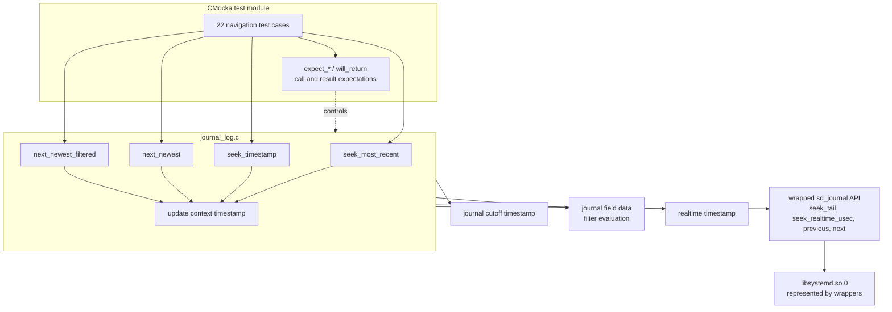
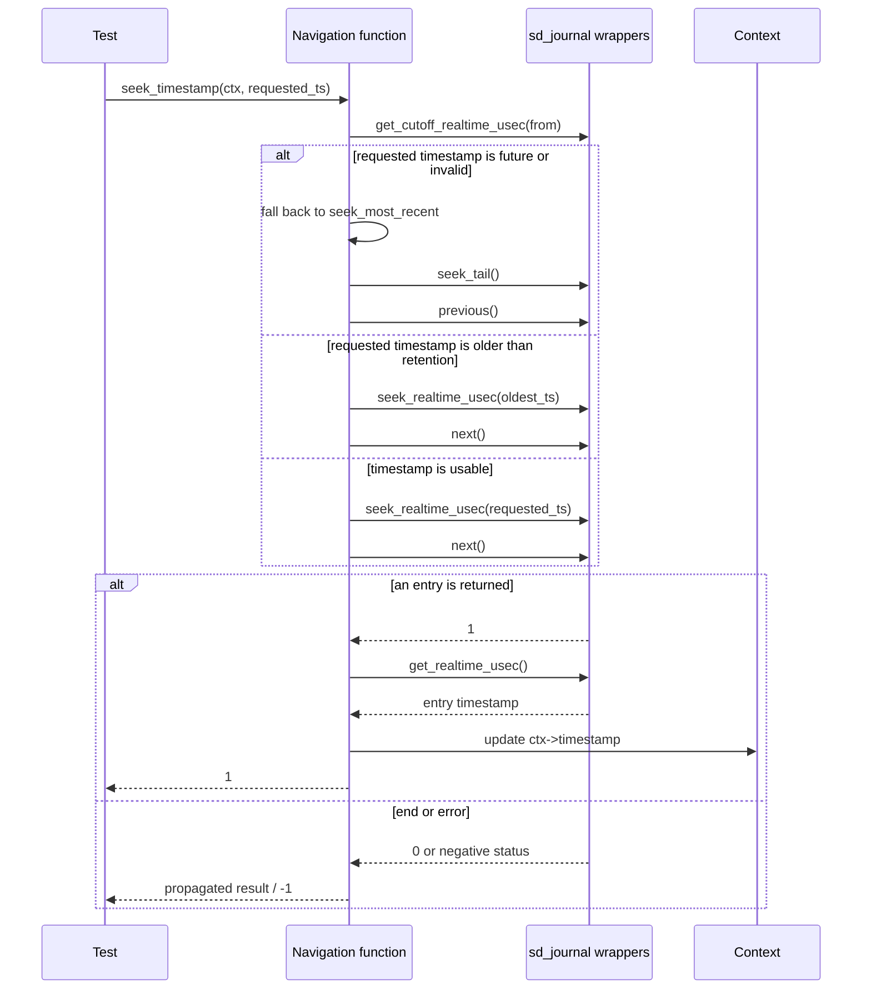
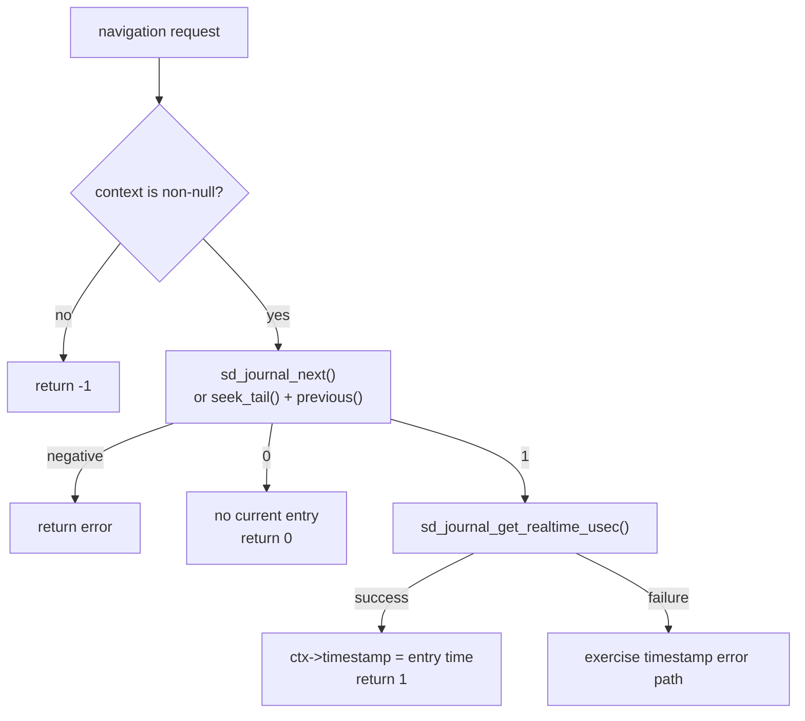
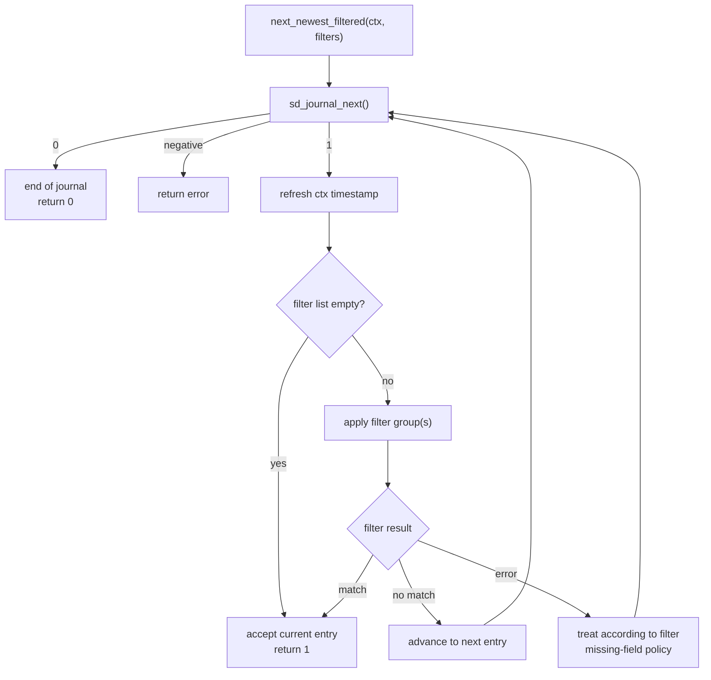
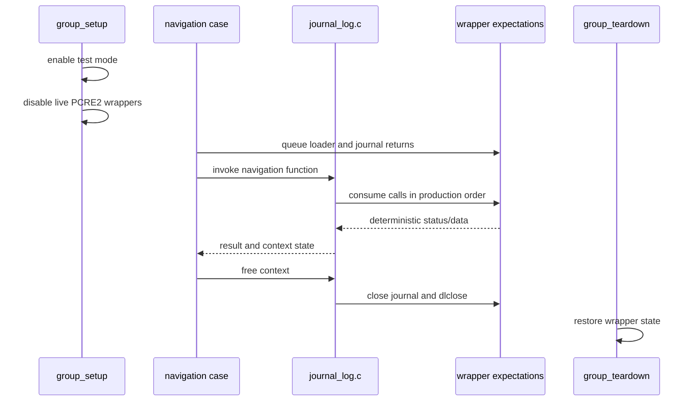

# journal_context_navigation_tests

The `journal_context_navigation_tests` module documents the CMocka tests for cursor movement in Wazuh's journald adapter. These tests verify how a `w_journal_context_t` seeks to the newest entry, seeks by realtime timestamp, advances through entries, and skips entries using configured filters.

The tests exercise `src/logcollector/journal_log.c` through `src/logcollector/journal_log.h`. They use mocked `sd_journal_*` function pointers, so the suite validates navigation decisions and return-value contracts without requiring a live systemd journal. Dynamic library loading and context ownership are shared concerns documented in [journal_lib_init_tests](journal_lib_init_tests.md) and [journal_context_lifecycle_tests](journal_context_lifecycle_tests.md).

## Scope and position

The module is deliberately narrower than the production journald subsystem. It does not document library trust checks, context allocation, entry serialization, or the input-thread loop in detail:

- [journal_lib_init_tests](journal_lib_init_tests.md) covers `dlopen`, path discovery, root ownership, and `dlsym` failures.
- [journal_context_lifecycle_tests](journal_context_lifecycle_tests.md) covers context creation, destruction, timestamp refresh, and rotation detection.
- [systemd_journal_wrappers](systemd_journal_wrappers.md) describes the test doubles used by all journal tests.
- [logcollector_journald](logcollector_journald.md) explains how navigation is consumed by `read_journald.c`.

## Production interfaces under test

| Function | Navigation responsibility | Tested contract |
| --- | --- | --- |
| `w_journal_context_seek_most_recent` | Move to the end of the journal and select the newest available entry. | Rejects a null context; propagates `seek_tail` failure; returns the result of `previous`; refreshes the timestamp when an entry is found. |
| `w_journal_context_seek_timestamp` | Position the cursor at or after a requested realtime timestamp. | Validates parameters, handles future/out-of-range timestamps, seeks by microseconds, advances to an entry, and updates the timestamp. |
| `w_journal_context_next_newest` | Advance from the current cursor. | Returns `0` at end of journal, returns `1` for an entry, and updates the timestamp for a new entry. |
| `w_journal_context_next_newest_filtered` | Advance until an entry matches one of the configured filter groups. | Supports null/empty filters, applies filters after advancing, logs debug checks, and continues after a non-match. |

The context timestamp is the coordination point between these operations. It records the realtime timestamp returned by `sd_journal_get_realtime_usec` for the current entry and is used by later seek, resume, and output logic.

## Architecture and dependencies

Each test creates the same valid mocked context: the systemd library is loaded, its mapped path is found, root ownership is accepted, all required symbols are resolved, and `sd_journal_open` succeeds. The navigation-specific expectation starts only after this common setup. Cleanup closes the journal and unloads the library, as described in [journal_context_lifecycle_tests](journal_context_lifecycle_tests.md).

## Timestamp-seeking behavior

The tests cover these timestamp cases:

| Scenario | Test | Expected behavior |
| --- | --- | --- |
| Null parameters | `test_w_journal_context_seek_timestamp_null_params` | Return `-1` without dereferencing the context. |
| Future timestamp | `test_w_journal_context_seek_timestamp_future_timestamp` | Log the invalid/future condition and use the most-recent positioning path. |
| Cutoff lookup failure | `test_w_journal_context_seek_timestamp_fail_read_old_ts` | Exercise the warning path while continuing with the seek decision. |
| Before retained history | `test_w_journal_context_seek_timestamp_change_ts` | Clamp the requested position to the journal's oldest available timestamp. |
| Seek failure | `test_w_journal_context_seek_timestamp_fail_seek` and `test_w_journal_context_seek_timestamp_seek_timestamp_fail` | Return the failure status and do not claim a new entry. |
| Advance failure/end | `test_w_journal_context_seek_timestamp_next_fail` | Propagate the unsuccessful `next` result. |
| Successful positioning | `test_w_journal_context_seek_timestamp_success` | Seek, advance, refresh the timestamp, and return success. |
| New-entry timestamp update | `test_w_journal_context_seek_timestamp_success_new_entry` | Verify the context timestamp changes to the returned entry timestamp. |

The exact warning identifiers are observable in the source tests, including the branches for an invalid/future timestamp, failure to read the oldest timestamp, and clamping to retained history. They are part of the diagnostic contract, but the test's primary assertion is navigation status and context state.

## Newest-entry navigation

The newest-entry cases verify both status and state, not just the return value:

- `test_w_journal_context_next_newest_ctx_null` checks defensive null handling.
- `test_w_journal_context_next_newest_success` checks an available entry.
- `test_w_journal_context_next_newest_update_timestamp` checks that the timestamp returned by the wrapper is stored in the context.
- `test_w_journal_context_seek_most_recent_ctx_null`, `test_w_journal_context_seek_most_recent_seek_tail_fail`, and `test_w_journal_context_seek_most_recent_success` cover the seek-to-tail variant, including failure before cursor movement.
- `test_w_journal_context_seek_most_recent_update_tamestamp` verifies timestamp refresh after selecting the newest entry.

## Filtered traversal

The filtered tests establish these guarantees:

| Test | Coverage |
| --- | --- |
| `test_w_journal_context_next_newest_filtered_null_filters` | A null filter list behaves like no filter list. |
| `test_w_journal_context_next_newest_filtered_no_filters` | An explicitly empty filter list does not invoke field matching. |
| `test_w_journal_context_next_newest_filtered_one_filter` | A single filter group is applied after a successful cursor advance. |
| `test_w_journal_context_next_newest_filtered_is_debug` | Debug mode emits the filter-check diagnostic, including the current timestamp representation. |
| `test_w_journal_context_next_newest_filtered_is_debug_false` | The same traversal works without debug logging. |
| `test_w_journal_context_next_newest_filtered_filter_apply` | A matching field value returns the current entry. |
| `test_w_journal_context_next_newest_filtered_filter_apply_fail` | A non-matching entry is skipped and traversal continues until the mocked end-of-journal result. |

Filter semantics themselves belong to [logcollector_journald](logcollector_journald.md) and configuration parsing belongs to [Localfile_Config_journald](Localfile_Config_journald.md). This module verifies that navigation invokes the filter seam at the correct point and responds correctly to its result.

## Mocking and test isolation

The wrappers are not a second implementation of journald. They provide only the values needed by each branch: `sd_journal_seek_tail`, `sd_journal_seek_realtime_usec`, `sd_journal_previous`, `sd_journal_next`, `sd_journal_get_realtime_usec`, `sd_journal_get_cutoff_realtime_usec`, and debug/logging hooks. CMocka's queued `will_return` values make call order significant; adding or removing a production call requires updating the expectations in the affected setup.

## Maintenance guidance

When changing cursor behavior:

1. Update the relevant success and failure test together. Navigation functions have distinct contracts for `-1`, `0`, and `1`.
2. Assert `ctx->timestamp` whenever a new entry is selected; stale timestamps can break resume behavior even when navigation returns success.
3. Keep future timestamps, retention cutoffs, seek failures, and end-of-journal behavior as separate cases so diagnostics remain attributable.
4. For filtered traversal, preserve the distinction between no filters, a non-match, an ignored missing field, and a hard filter error.
5. Preserve the explicit cleanup expectations. The test must continue to close `sd_journal` and unload the dynamically loaded library for every successful context setup.

For end-to-end implications, follow the call chain from this module to [logcollector_journald](logcollector_journald.md) and [logcollector_core](logcollector_core.md). For wrapper changes, update [systemd_journal_wrappers](systemd_journal_wrappers.md) alongside the CMocka cases.
