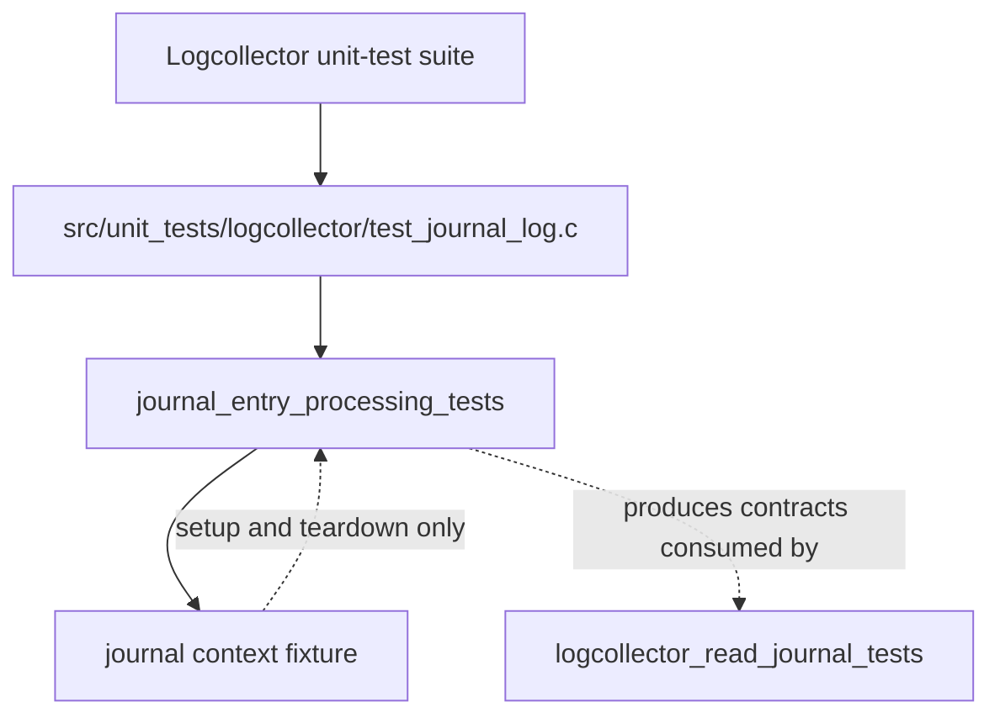
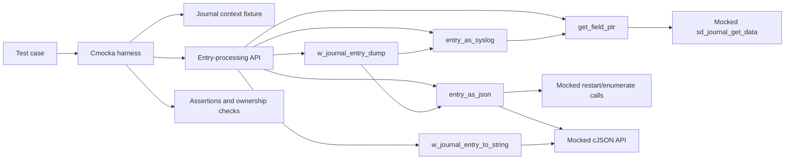
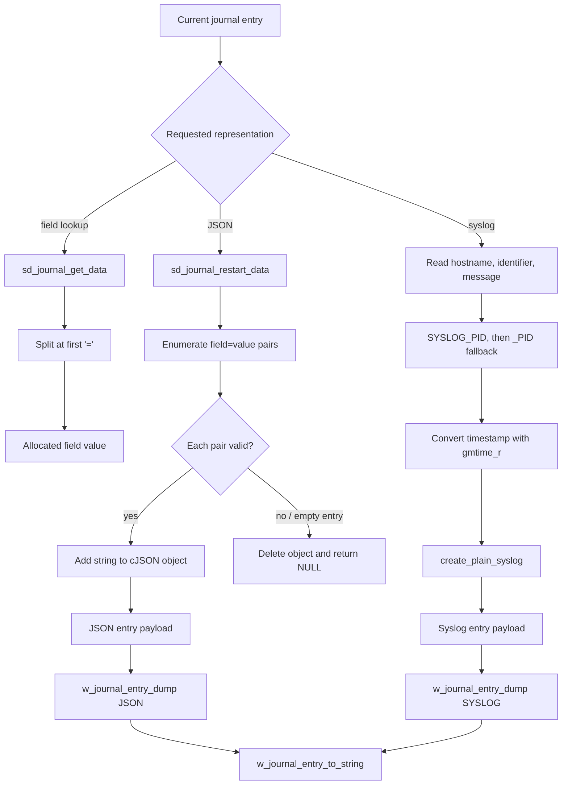

# journal_entry_processing_tests

`journal_entry_processing_tests` is the focused unit-test slice for converting one systemd-journal entry into Wazuh’s supported representations. It verifies field extraction, JSON conversion, syslog conversion, typed entry wrappers, and final string serialization. The tests use Cmocka and mocked journal/cJSON calls, so they validate deterministic processing behavior without requiring a live journal.

## Module placement

The tests are implemented in `src/unit_tests/logcollector/test_journal_log.c`. That source file also contains tests for journal initialization, cursor movement, filters, time conversion, and rotation detection; those concerns are documented separately and are only used here as fixture support.



Related responsibilities are intentionally split across the sibling modules [journal_context_lifecycle_tests](journal_context_lifecycle_tests.md), [journal_context_navigation_tests](journal_context_navigation_tests.md), and [journal_lib_init_tests](journal_lib_init_tests.md). Runtime consumption and reader integration are described in [logcollector_journald](logcollector_journald.md).

## Responsibilities and scope

The module tests the following public or externally visible behavior:

| Area | Functions under test | Contract covered |
|---|---|---|
| Field extraction | `get_field_ptr` | Read `FIELD=value`, return a newly allocated value, preserve empty values, reject unavailable or malformed data. |
| JSON conversion | `entry_as_json` | Enumerate all journal fields into a cJSON object, including empty values; reject empty or malformed entries. |
| Syslog formatting | `create_plain_syslog`, `entry_as_syslog` | Build the traditional syslog line, select PID fallbacks, apply required-field rules, and format the journal timestamp. |
| Typed entries | `w_journal_entry_dump` | Wrap JSON or syslog output with its representation type and source timestamp. |
| Serialization | `w_journal_entry_to_string` | Return the syslog payload directly or print JSON compactly; reject null and invalid entries. |

The module does not test the correctness of systemd itself, dynamic-library discovery, cursor seeking, filter regex semantics, or journal rotation. Its repeated context construction exercises those helpers only to provide a valid `w_journal_context_t`.

## Architecture



The processing layer sits between the journal cursor and logcollector output. Journal APIs provide encoded field strings such as `MESSAGE=text`; processing code parses the separator, normalizes the required fields, and returns either an owned C string, a cJSON object, or a `w_journal_entry_t` wrapper.

## Test fixture and mocked boundaries

Each context-based test follows the same lifecycle:

1. Configure Cmocka expectations for dynamic loading, `/proc/self/maps`, root ownership, symbol lookup, and `sd_journal_open`.
2. Call `w_journal_context_create`.
3. Configure only the journal calls relevant to the behavior under test.
4. Assert the result and, where applicable, the exact output string.
5. Free the result and call `w_journal_context_free`.

The group setup enables test mode and disables the real PCRE2 wrapper; teardown restores the wrapper state. This keeps the tests independent from host libraries while retaining the production parsing path.

| Boundary | Mocked operations | Why it is mocked |
|---|---|---|
| systemd journal | `sd_journal_get_data`, `sd_journal_restart_data`, `sd_journal_enumerate_data` | Supplies controlled fields, missing fields, malformed records, and return codes. |
| Dynamic loading and context setup | `dlopen`, `dlclose`, `dlsym`, `fopen`, `getline`, `fclose`, `stat`, `sd_journal_open`, `sd_journal_close` | Makes context creation repeatable and independent of the installed systemd version. |
| JSON | `cJSON_CreateObject`, `cJSON_AddStringToObject`, `cJSON_Delete`, `cJSON_PrintUnformatted` | Verifies object construction and cleanup without relying on a real allocator tree. |
| Time and diagnostics | `gmtime_r`, debug logging wrappers | Makes timestamp output and error-path logging deterministic. |
| Assertions | Cmocka `expect_*`, `will_return`, `assert_*` | Verifies both return values and call ordering/arguments. |

## Data flow



## Processing behavior

### `get_field_ptr`

The helper asks `sd_journal_get_data` for a field and expects a buffer containing `field=value`. The returned value excludes the field name and separator and is owned by the caller.

- A successful `field=value` record returns `value`.
- `field=` returns an allocated empty string, not `NULL`.
- A journal API failure returns `NULL`.
- A record without `=` returns `NULL`.

The four focused tests are `test_get_field_ptr_success`, `test_get_field_ptr_empty_field`, `test_get_field_ptr_fail_get_data`, and `test_get_field_ptr_fail_parse`.

### `entry_as_json`

The function resets journal enumeration, creates an object, and adds every valid `field=value` pair as a string property. Empty values are retained. An empty enumeration or malformed pair is treated as conversion failure; the temporary cJSON object is deleted before returning `NULL`.

Covered cases are `test_entry_as_json_success`, `test_entry_as_json_empty`, and `test_entry_as_json_fail_parse_field`.

### Syslog conversion

`entry_as_syslog` requires `_HOSTNAME` and `MESSAGE`. `SYSLOG_IDENTIFIER` is optional and becomes `unknown` when unavailable. PID resolution is ordered:

```mermaid
flowchart TD
    A[Read required fields] --> B{Hostname and message available?}
    B -->|no| E[Log debug 9002; return NULL]
    B -->|yes| C[Read SYSLOG_IDENTIFIER]
    C --> D{SYSLOG_PID available?}
    D -->|yes| P[Use SYSLOG_PID]
    D -->|no| F{_PID available?}
    F -->|yes| P2[Use _PID]
    F -->|no| NP[Use no PID suffix]
    P --> T[Convert timestamp]
    P2 --> T
    NP --> T
    T --> U{gmtime_r succeeds?}
    U -->|no| E2[Log debug 9002; return NULL]
    U -->|yes| O[create_plain_syslog]
    C -->|identifier unavailable| UK[Use "unknown"]
    UK --> D
```

`create_plain_syslog` is independently tested with and without a PID. The expected forms are:

```text
<timestamp> hostname tag[pid]: message
<timestamp> hostname tag: message
```

The syslog tests cover complete input, system PID fallback, no PID, missing hostname, missing message, missing identifier, and failed timestamp conversion. The missing-required-field paths assert the debug diagnostic `(9002)` and a `NULL` result.

### Typed entry wrappers and serialization

`w_journal_entry_dump` converts the requested representation and stores the result together with the context timestamp and a type discriminator. Unsupported types, null contexts, and failed conversions return `NULL`. The source tests also register explicit invalid-type guards in the same test executable.

`w_journal_entry_to_string` has representation-specific ownership rules:

- SYSLOG: returns the entry’s allocated syslog string.
- JSON: returns a newly printed compact JSON string from `cJSON_PrintUnformatted`.
- Null or invalid entry: returns `NULL`.

Callers must free strings returned by the serializer and release JSON-backed entries through `w_journal_entry_free` so the cJSON object is deleted.

## Test matrix

| Test family | Positive paths | Negative and boundary paths |
|---|---|---|
| Field lookup | `test_get_field_ptr_success` | `test_get_field_ptr_empty_field`, `test_get_field_ptr_fail_get_data`, `test_get_field_ptr_fail_parse` |
| JSON | `test_entry_as_json_success` | `test_entry_as_json_empty`, `test_entry_as_json_fail_parse_field` |
| Plain syslog | `test_create_plain_syslog_with_pid`, `test_create_plain_syslog_without_pid` | PID omission is validated by the no-PID case |
| Syslog entry | `test_entry_as_syslog_success`, `test_entry_as_syslog_success_system_pid`, `test_entry_as_syslog_success_no_pid` | `test_entry_as_syslog_missing_hostname`, `test_entry_as_syslog_missing_message`, `test_entry_as_syslog_missing_tag`, `test_entry_as_syslog_missing_timestamp` |
| Entry dump | `test_w_journal_entry_dump_json_success`, `test_w_journal_entry_dump_syslog_success` | `test_w_journal_entry_dump_null_params`, `test_w_journal_entry_dump_syslog_fail`, `test_w_journal_entry_dump_syslog_fail_json`, plus invalid-type coverage in the source |
| String conversion | `test_w_journal_entry_to_string_syslog`, `test_w_journal_entry_to_string_json` | `test_w_journal_entry_to_string_null_params` plus invalid-type coverage in the source |

All cases are registered in the file’s Cmocka `tests[]` array and run through the shared `group_setup`/`group_teardown` functions.

## Failure handling and invariants

- Journal retrieval errors must not produce partially parsed output.
- Malformed field records must not be inserted into JSON.
- Required syslog fields are all-or-nothing; optional identifier and PID fields have defined fallbacks.
- Temporary cJSON objects are deleted on conversion failure.
- Entry timestamps are copied from the context into successful typed entries.
- Every context and result allocated by a test is released, making cleanup behavior part of the test contract.

## Relationship to the wider system

The processing functions are consumed by logcollector’s journal reader, which obtains entries and forwards their serialized form into the logcollector pipeline. Context creation and cursor movement are prerequisites, but are not the subject of these assertions. For the broader implementation context, see [logcollector](logcollector.md), [logcollector_journald](logcollector_journald.md), [systemd_journal_wrappers](systemd_journal_wrappers.md), and [test_infrastructure](test_infrastructure.md).

## Execution and maintenance notes

The executable is built and run through the project’s logcollector unit-test target. Since the tests are registered in `main`, adding a new case requires both implementing the Cmocka test and adding it to the `tests[]` array. When changing journal field names or output formatting, update the exact string assertions and the fallback-path expectations together.

The suite is intentionally mock-heavy. It proves parsing, fallback, formatting, dispatch, and cleanup contracts; it does not prove compatibility with a particular systemd journal database. A separate integration test is appropriate for validating real journal permissions, field encodings, or rotation behavior.

## Source reference

- `src/unit_tests/logcollector/test_journal_log.c`
- `src/logcollector/journal_log.h`
