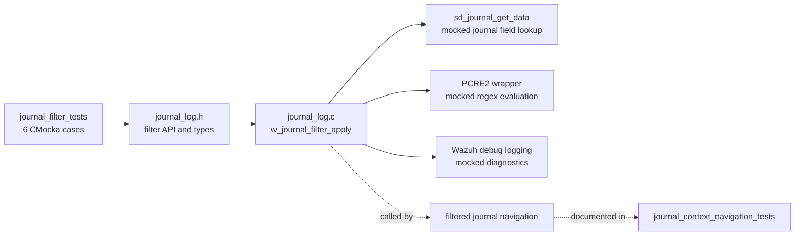
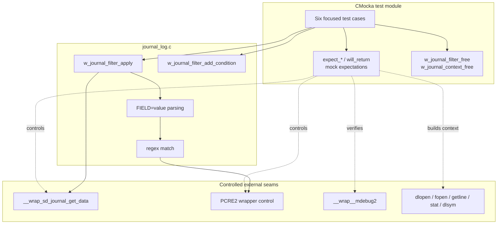
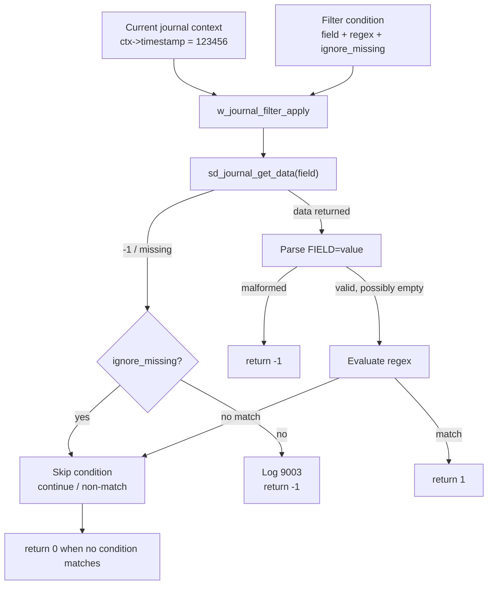
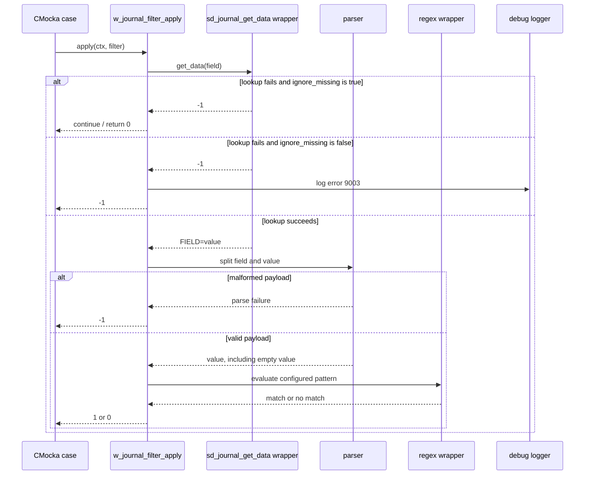
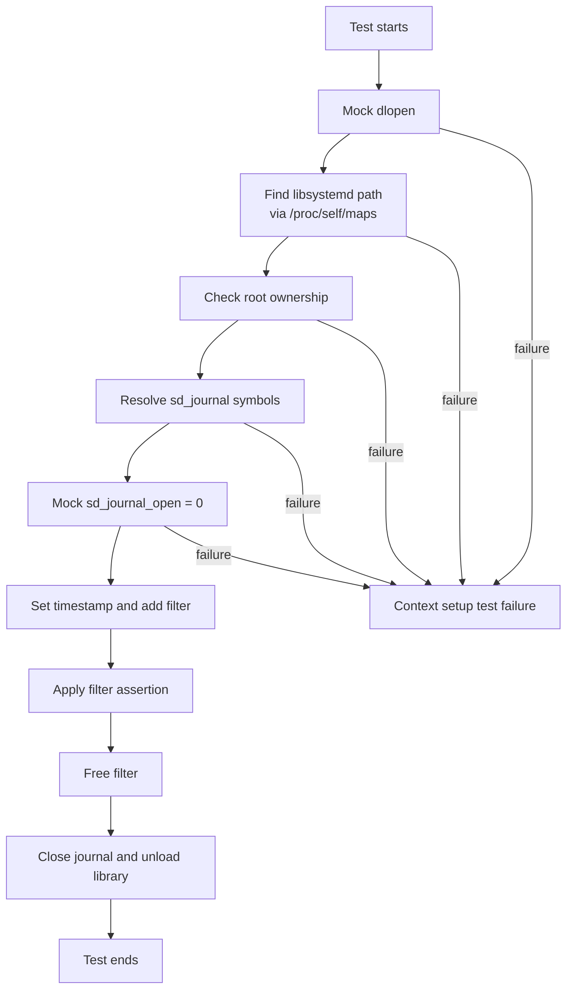
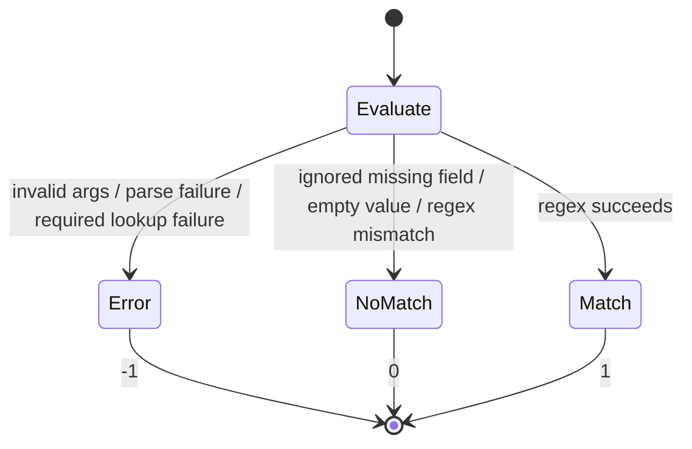

# journal_filter_tests

The `journal_filter_tests` module documents six CMocka tests for the journald field-filtering path in `src/logcollector/journal_log.c`. The tests verify defensive validation, missing-field policy, journal-field parsing, regular-expression matching, and the return values consumed by filtered journal traversal.

These are unit tests, not a live-journal integration suite. Systemd, dynamic loading, logging, and regular-expression seams are mocked so each case can control the journal entry and isolate `w_journal_filter_apply`. The wider harness is described in [test_infrastructure](test_infrastructure.md), while production journald integration is covered by [logcollector_journald](logcollector_journald.md).

## Scope and position

The module intentionally covers only the filter evaluator. Related concerns are separated as follows:

- [journal_context_navigation_tests](journal_context_navigation_tests.md) verifies how filtered traversal advances the cursor and reacts to filter results.
- [journal_context_lifecycle_tests](journal_context_lifecycle_tests.md) covers context creation, cleanup, timestamps, and rotation detection.
- [journal_entry_processing_tests](journal_entry_processing_tests.md) covers JSON and syslog conversion after an entry has been selected.
- [systemd_journal_wrappers](systemd_journal_wrappers.md) describes the mocked `sd_journal_*` function table.
- [Localfile_Config_journald](Localfile_Config_journald.md) documents configuration structures that eventually provide journald filter definitions.

## Production surface under test

The six cases exercise `w_journal_filter_apply(ctx, filters)`. A filter condition contains a journal field name, a regular-expression pattern, and an `ignore_missing` flag. The evaluator obtains the field from the current journal entry, parses the `FIELD=value` representation, and evaluates the value against the configured pattern.

| Input or result | Contract established by the tests |
| --- | --- |
| Null context or filter | Return `-1` without dereferencing either argument. |
| Missing field with `ignore_missing=true` | Ignore the condition and continue evaluating; the test expects an overall non-match (`0`). |
| Missing field with `ignore_missing=false` | Log diagnostic `9003` and return `-1`. |
| Malformed field data | Return `-1`; the supplied data does not contain the requested field/value separator in the expected form. |
| Empty value (`field=`) | Treat the value as valid but unmatched for the pattern used; return `0`. |
| Regex mismatch | Return `0`. |
| Regex match | Return `1`. |

The tests use `.` as an always-match pattern when the input should reach the missing-data branch, and `^\\d` to distinguish numeric values from ordinary text.

## Architecture and dependencies

Every non-null test repeats a valid context fixture before testing filtering. The fixture mocks the security-conscious dynamic-loading sequence: `dlopen("libsystemd.so.0")`, discovery of the mapped library in `/proc/self/maps`, root ownership from `stat`, resolution of the required `sd_journal_*` symbols with `dlsym`, and successful `sd_journal_open`. This setup is infrastructural; the filter-specific behavior begins when `ctx->timestamp` is set to `123456` and the condition is added.

The test group setup enables test mode and disables real PCRE2 wrappers. Group teardown restores the wrapper state. This keeps matching deterministic and prevents the unit suite from requiring a systemd journal or depending on host regex state.

## Test inventory

| Test | Arrangement | Expected result and significance |
| --- | --- | --- |
| `test_w_journal_filter_apply_null_params` | Call with null context, then with null filter list. | `-1` for both calls; validates the API guard clause. |
| `test_w_journal_filter_apply_fail_get_data_ignore_test` | Add `field_to_ignore` with `ignore_missing=true`; lookup fails. Add `field_no_ignore` with `ignore_missing=false`; lookup fails. | The first failure is ignored; the second produces error `9003` and the overall result is `-1`. This case verifies both missing-data policies in one evaluation. |
| `test_w_journal_filter_apply_fail_parse` | Return `f=` for a condition targeting `field`. | `-1`; verifies malformed or non-matching field-name parsing is treated as an evaluator error. |
| `test_w_journal_filter_apply_empty_field` | Return `field=` for pattern `.`. | `0`; an empty value is parsed successfully but does not satisfy the expected match behavior. |
| `test_w_journal_filter_apply_match_fail` | Return `field=test text` for pattern `^\\d`. | `0`; a valid field value that does not match is a normal non-match, not an error. |
| `test_w_journal_filter_apply_match_success` | Return `field=123123` for pattern `^\\d`. | `1`; confirms a matching field accepts the current entry. |

Each condition is created with `w_journal_filter_add_condition`, and the test asserts that construction returns `0`. Non-null cases free both the filter and the context after the assertion, including the error paths.

## Filter evaluation data flow

The mocked journal API returns the field payload as a string such as `field=value`. The tests therefore cover three distinct boundaries: retrieval failure, payload parsing, and value matching. They also distinguish an empty but syntactically valid value from malformed data.

## Component interaction

## Context fixture and cleanup flow

The repeated setup and teardown expectations are important because they prove that filter tests do not leak the dynamically loaded library, journal handle, or filter nodes. They should not be mistaken for additional filter scenarios.

## Error and return-value model

The suite treats the evaluator result as a three-state contract:

Filtered navigation uses this distinction: `1` accepts the current entry, `0` allows traversal to continue, and `-1` represents an evaluation failure. The navigation-level handling is documented in [journal_context_navigation_tests](journal_context_navigation_tests.md).

## Isolation and maintenance guidance

- Keep `sd_journal_get_data` expectations aligned with the exact requested field name. The wrapper validates that argument, so a typo can invalidate the fixture rather than test production behavior.
- Preserve the cleanup expectations when adding cases. A successful assertion does not replace `w_journal_filter_free` or `w_journal_context_free`.
- Add separate cases for retrieval failure, parse failure, and regex mismatch; they have different return contracts even though all can prevent a match.
- When changing the filter representation, update the `FIELD=value` fixtures and the expected handling of empty values and malformed payloads together.
- If regex execution or systemd access changes, update the shared harness documentation in [test_infrastructure](test_infrastructure.md) and [systemd_journal_wrappers](systemd_journal_wrappers.md) rather than duplicating infrastructure details in every test page.

## References

- [test_infrastructure](test_infrastructure.md) — CMocka setup, wrappers, and isolation model.
- [systemd_journal_wrappers](systemd_journal_wrappers.md) — mocked systemd journal operations.
- [journal_context_lifecycle_tests](journal_context_lifecycle_tests.md) — context ownership and lifecycle.
- [journal_context_navigation_tests](journal_context_navigation_tests.md) — cursor movement and filtered iteration.
- [journal_entry_processing_tests](journal_entry_processing_tests.md) — JSON/syslog entry conversion.
- [Localfile_Config_journald](Localfile_Config_journald.md) — journald configuration structures and filter input.
- [logcollector_journald](logcollector_journald.md) — production journald reader integration.
