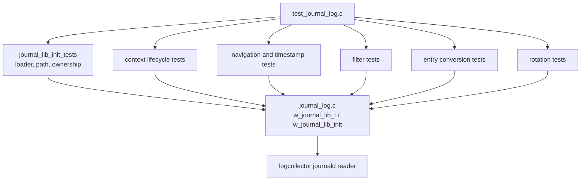
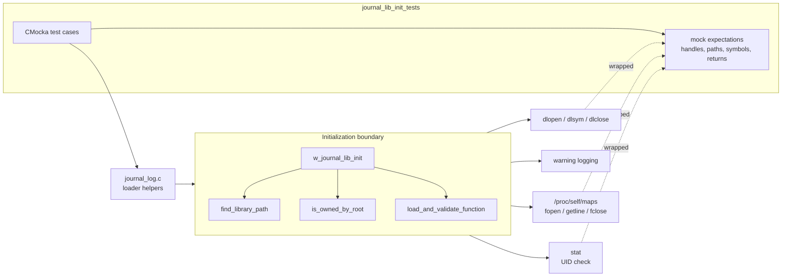
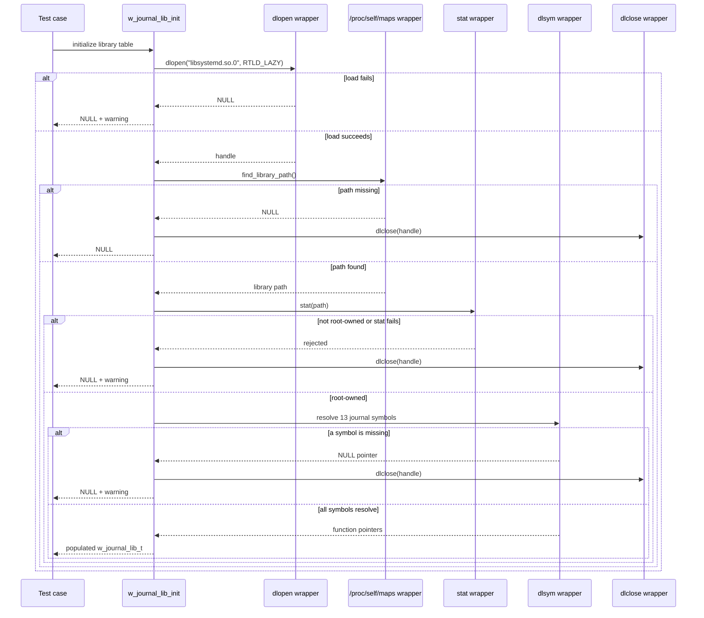
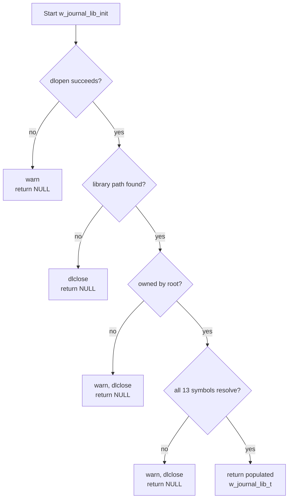
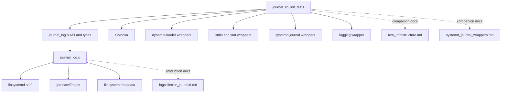

# `journal_lib_init_tests`

`journal_lib_init_tests` documents the tests that validate the dynamic loading and trust checks used by Wazuh's journald support. The tests exercise the initialization seam in `src/unit_tests/logcollector/test_journal_log.c`: locating `libsystemd.so.0`, verifying that the resolved file is owned by `root`, resolving the required `sd_journal_*` symbols, and releasing the loader handle on failure.

This is a focused test module, not the production journald reader. For the surrounding implementation, see [`logcollector_journald`](logcollector_journald.md); for the shared CMocka setup and wrappers, see [`test_infrastructure`](test_infrastructure.md) and [`systemd_journal_wrappers`](systemd_journal_wrappers.md).

## Scope and role

The module covers the trust boundary before a journal context is created:

| Area | What is verified |
|---|---|
| Library path discovery | `/proc/self/maps` is opened and scanned for the loaded systemd library. |
| Ownership validation | The discovered path must be `stat`-able and have UID `0`. |
| Symbol loading | Every required journal API symbol is resolved through `dlsym`. |
| Failure handling | Missing libraries, paths, ownership, or symbols produce a null result and clean up an acquired loader handle. |
| Successful initialization | A populated `w_journal_lib_t` is returned with all 13 function pointers configured. |

Context creation, cursor movement, filtering, entry conversion, and rotation behavior are registered in the same CMocka executable but belong to adjacent test concerns. They are described by the broader [`test_infrastructure`](test_infrastructure.md) page and the production [`logcollector_journald`](logcollector_journald.md) page.

## Position in the journald test hierarchy

The initialization tests are the lower-level prerequisite for the context tests: `w_journal_context_create` consumes the library table produced by `w_journal_lib_init`. The context and reader layers are intentionally linked rather than duplicated here.

## Architecture

The tests invoke the real production control flow while replacing environmental dependencies with wrappers. This keeps branch and cleanup behavior observable without requiring a host systemd journal or the host's actual loader state.

## Components and responsibilities

### `find_library_path`

`find_library_path` opens `/proc/self/maps` and searches each returned line for the requested library name. In the success fixture, a line ending in `/libsystemd.so.0` is returned and the extracted path is used by the ownership check. The failure fixture makes `fopen` fail, so the helper returns `NULL`.

The test is concerned with the lookup contract, not with reproducing Linux procfs parsing in full. The file and line-reading calls are therefore mocked through the neighboring stdio wrappers documented in [`systemd_journal_wrappers`](systemd_journal_wrappers.md).

### `is_owned_by_root`

The helper calls `stat` on the discovered path and accepts it only when the call succeeds and `st_uid == 0`.

| Fixture | Expected result |
|---|---:|
| Root-owned file | `true` |
| Non-root owner | `false` |
| `stat` failure | `false` |

This check prevents the process from trusting a dynamically loaded systemd library whose backing file is not owned by root.

### `load_and_validate_function`

The symbol helper resolves one named function with `dlsym`, checks the result, and writes the function pointer into the supplied destination. The success test confirms a non-null pointer; the failure test supplies a null result and verifies the destination remains null and the loader reports the failure.

The helper is tested independently so that `w_journal_lib_init` can be understood as orchestration rather than as 13 copies of symbol-resolution logic.

### `w_journal_lib_init`

The initializer coordinates the complete sequence:

1. Load `libsystemd.so.0` with `RTLD_LAZY`.
2. Find the library's mapped path.
3. Require root ownership of that path.
4. Resolve all required journal functions.
5. Return a populated function table, or close the handle and return `NULL` on any failure.

The success fixture maps every symbol to its corresponding test wrapper. The failure fixtures inject an error at each major stage: `dlopen`, path discovery, ownership, and symbol validation.

## Required dynamic symbols

The success test explicitly configures and verifies these symbols:

| Group | Symbols |
|---|---|
| Lifecycle | `sd_journal_open`, `sd_journal_close` |
| Cursor movement | `sd_journal_previous`, `sd_journal_next`, `sd_journal_seek_tail`, `sd_journal_seek_realtime_usec` |
| Entry metadata | `sd_journal_get_realtime_usec`, `sd_journal_get_data`, `sd_journal_restart_data`, `sd_journal_enumerate_data` |
| Journal state | `sd_journal_get_cutoff_realtime_usec`, `sd_journal_process`, `sd_journal_get_fd` |

Any new symbol added to the production function table must be added to the initializer, its wrapper or test seam, and the success expectations in this module.

## Initialization data flow

## Process and failure contracts

| Failure point | Test | Contract observed |
|---|---|---|
| `dlopen` | `test_w_journal_lib_init_dlopen_fail` | Initialization fails immediately and returns `NULL`. |
| Path lookup | `test_w_journal_lib_init_find_library_path_fail` | The acquired handle is released before returning `NULL`. |
| Ownership | `test_w_journal_lib_init_is_owned_by_root_fail` | The library is rejected, a warning is emitted, and the handle is released. |
| Symbol validation | `test_w_journal_lib_init_load_and_validate_function_fail` | Partial initialization is rejected and the handle is released. |
| All stages | `test_w_journal_lib_init_success` | A usable function table is returned with every expected symbol resolved. |

The cleanup assertions are important: a failed initialization must not leak the `dlopen` handle, and later context tests must be able to close the successfully initialized library through `w_journal_context_free`.

## Test inventory

| Test | Primary behavior |
|---|---|
| `test_find_library_path_success` | Extracts the mapped systemd library path from a mocked procfs line. |
| `test_find_library_path_failure` | Handles inability to open the maps file. |
| `test_is_owned_by_root_root_owned` | Accepts UID 0. |
| `test_is_owned_by_root_not_root_owned` | Rejects a non-root UID. |
| `test_is_owned_by_root_stat_fails` | Rejects an inaccessible or missing file. |
| `test_load_and_validate_function_success` | Stores a resolved symbol pointer. |
| `test_load_and_validate_function_failure` | Rejects a missing symbol and preserves a null destination. |
| `test_w_journal_lib_init_dlopen_fail` | Covers the first-stage loader failure. |
| `test_w_journal_lib_init_find_library_path_fail` | Covers path discovery failure and cleanup. |
| `test_w_journal_lib_init_is_owned_by_root_fail` | Covers the security rejection and cleanup. |
| `test_w_journal_lib_init_load_and_validate_function_fail` | Covers incomplete symbol tables and cleanup. |
| `test_w_journal_lib_init_success` | Covers the complete 13-symbol initialization path. |

All cases are registered in the `CMUnitTest` array in `main()` and execute through `cmocka_run_group_tests`. The common `group_setup` enables test mode and the teardown restores the wrapper state; those mechanics belong to [`test_infrastructure`](test_infrastructure.md).

## Dependency map

The module's direct test dependencies are mostly seams rather than business modules. The production dependency on systemd is deliberately late-bound: Wazuh can determine availability at runtime instead of requiring a link-time systemd dependency for the entire logcollector binary.

## Maintenance guidance

- Keep the success case synchronized with the `w_journal_lib_t` function-pointer table. A missing expectation can allow an incomplete initializer to pass unnoticed.
- For every new failure branch, assert both the public result and resource cleanup (`dlclose`) where a handle has already been acquired.
- Keep ownership tests independent from symbol tests so a failure can be attributed to the trust check rather than to loader setup.
- Use the existing wrapper layer for external state. These tests should not depend on the host's actual `/proc/self/maps`, installed systemd version, or journal contents.
- Treat warning text and error paths as compatibility-sensitive behavior: the current tests verify loader failures and the root-ownership rejection through the logging seam.

## Boundaries and limitations

These unit tests prove orchestration, validation, return values, and cleanup. They do not prove that the host's real `libsystemd.so.0` exports an ABI-compatible implementation, that procfs formatting is identical across every supported kernel, or that a live journal can be opened. Those concerns belong to integration or platform testing around [`logcollector_journald`](logcollector_journald.md).

