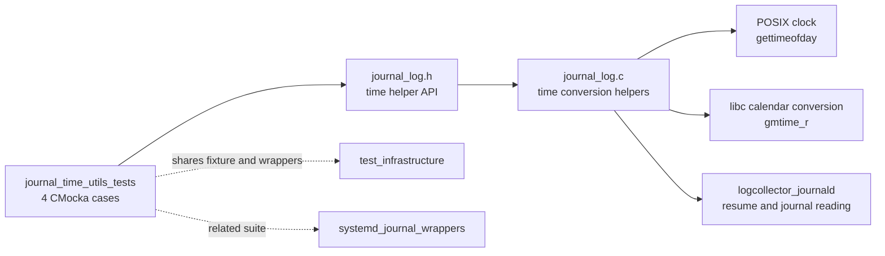
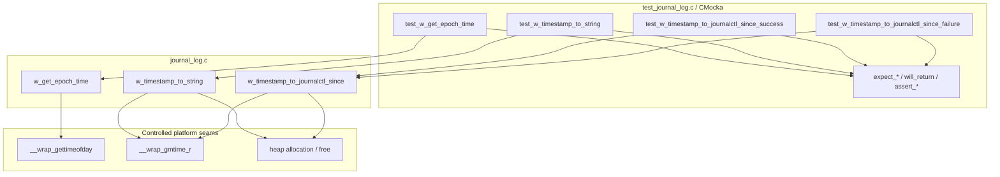
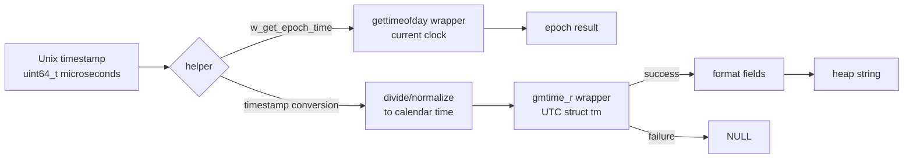
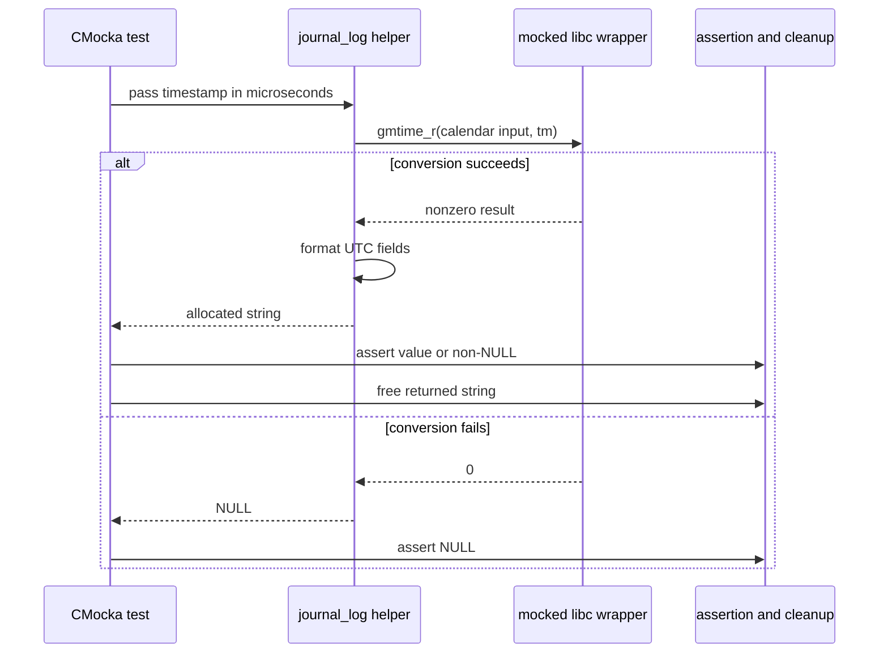
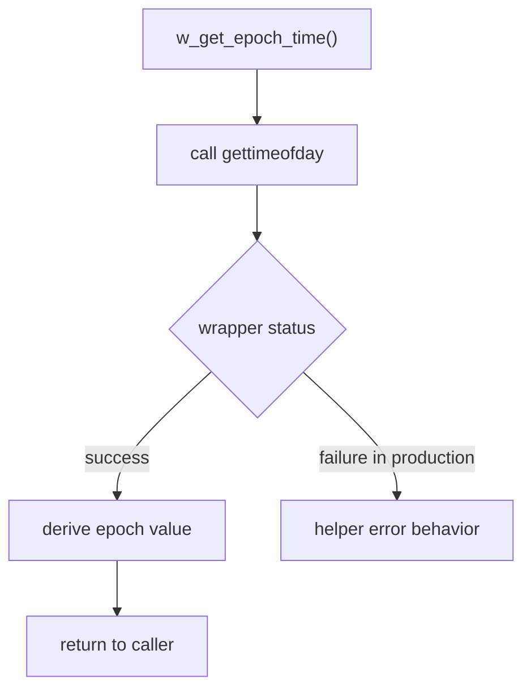
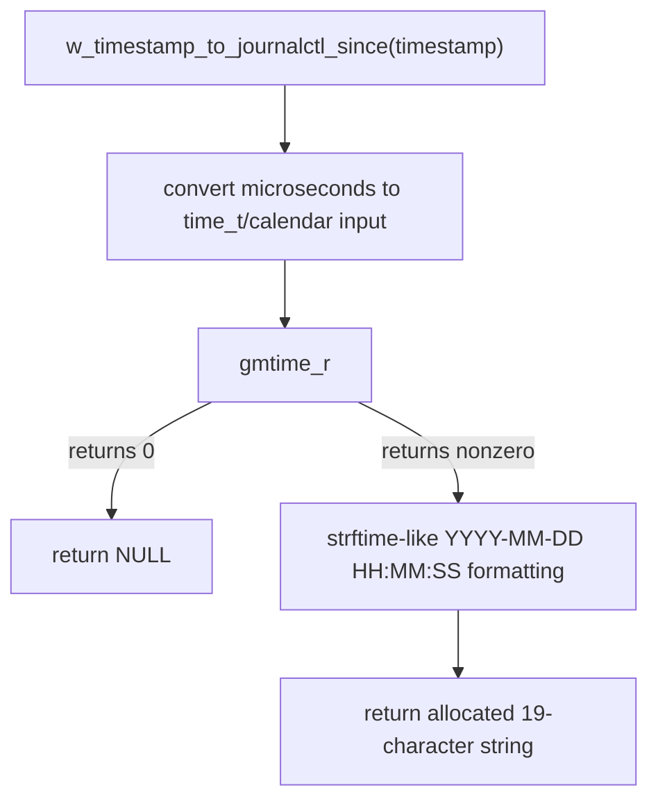

# journal_time_utils_tests

`journal_time_utils_tests` documents the CMocka tests for the timestamp helpers used by Wazuh's journald adapter. The tests validate current-epoch acquisition and conversion of microsecond Unix timestamps into UTC text suitable for journal resume or `journalctl --since`-style use.

The cases are implemented in the shared `src/unit_tests/logcollector/test_journal_log.c` translation unit. They exercise `src/logcollector/journal_log.c` through `src/logcollector/journal_log.h`; they do not open a real systemd journal. The broader production context is described in [logcollector_journald](logcollector_journald.md), while neighboring test concerns are split into [journal_context_lifecycle_tests](journal_context_lifecycle_tests.md), [journal_context_navigation_tests](journal_context_navigation_tests.md), and [journal_entry_processing_tests](journal_entry_processing_tests.md).

## Scope and position



This module is intentionally narrower than the journald subsystem:

- [journal_lib_init_tests](journal_lib_init_tests.md) covers dynamic `libsystemd` loading and symbol validation.
- [journal_context_lifecycle_tests](journal_context_lifecycle_tests.md) covers context ownership, cleanup, and rotation detection.
- [journal_context_navigation_tests](journal_context_navigation_tests.md) covers cursor movement and timestamp-based seeking.
- [journal_entry_processing_tests](journal_entry_processing_tests.md) covers JSON/syslog entry serialization.
- [systemd_journal_wrappers](systemd_journal_wrappers.md) covers the mocked systemd function table used by the wider file.
- [test_infrastructure](test_infrastructure.md) covers common CMocka setup and wrapper conventions.

## Test-to-production mapping

| Test case | Function under test | Arrangement | Expected contract |
| --- | --- | --- | --- |
| `test_w_get_epoch_time` | `w_get_epoch_time()` | Mock `gettimeofday` to return success. | The helper completes through the clock wrapper; the test does not assert the numeric value because the mock does not provide a deterministic `timeval`. |
| `test_w_timestamp_to_string` | `w_timestamp_to_string()` | Use `1618849174000000` microseconds and make `gmtime_r` succeed. | A heap-allocated conversion result is returned and can be released by the caller. The test deliberately does not assert its exact textual representation. |
| `test_w_timestamp_to_journalctl_since_success` | `w_timestamp_to_journalctl_since()` | Convert `1618849174000000` microseconds with successful `gmtime_r`. | Return exactly `2021-04-19 16:19:34`, a 19-character UTC timestamp. |
| `test_w_timestamp_to_journalctl_since_failure` | `w_timestamp_to_journalctl_since()` | Pass timestamp `0` and make `gmtime_r` fail. | Return `NULL` rather than exposing an invalid calendar conversion. |

The shared timestamp fixture represents the boundary between the systemd API and application formatting:

```text
1618849174000000 microseconds
        = 2021-04-19 16:19:34 UTC
        -> "2021-04-19 16:19:34"
```

## Architecture and dependencies



The time tests do not depend on `sd_journal_open`, journal cursor state, or real `libsystemd` symbols. This separation keeps failures attributable to clock acquisition or formatting rather than library loading. The full journald runtime still consumes these helpers as part of [logcollector_journald](logcollector_journald.md), whose state persistence and reader behavior are documented separately.

## Data flow



The tests establish two important data conventions:

1. Input timestamps are expressed in microseconds, matching systemd realtime timestamps.
2. Calendar output is UTC and is owned by the caller when a non-`NULL` string is returned.

## Component interaction



`test_w_get_epoch_time` is the simpler clock-acquisition path: it configures `__wrap_gettimeofday` to succeed and checks that `w_get_epoch_time()` can traverse the seam. Since the wrapper's `timeval` contents are not populated, the test is a smoke/interaction check rather than a value test.

## Process flows

### Current epoch



The registered test covers the success edge only. A future regression test could provide a populated `timeval` and assert seconds/microseconds explicitly; that would make the numeric contract stronger than the current mock arrangement.

### Journalctl-compatible timestamp



The success and failure tests are complementary: one locks down the exact wire-format string, while the other locks down fail-closed behavior when calendar conversion cannot produce a `struct tm`.

## Ownership, errors, and observability

- Successful string helpers return memory that the test releases with `free`; callers must follow the same ownership rule.
- `w_timestamp_to_journalctl_since()` returns `NULL` for a failed `gmtime_r` conversion.
- The tests use wrapper return values rather than sleeping or reading the host clock, so they are deterministic with respect to calendar conversion success/failure.
- No journal handle is required for these four cases; journal navigation and resource cleanup belong to the linked lifecycle/navigation modules.
- The current `w_get_epoch_time` case does not validate an exact value. Maintainers should preserve the mock setup or improve it together with the implementation contract, rather than adding a fragile assertion against wall-clock time.

## Maintenance guidance

When changing timestamp units, timezone behavior, allocation, or formatting:

1. Update the production declaration and implementation in `journal_log.h` / `journal_log.c`.
2. Revisit the shared `test_journal_log.c` fixture and wrapper expectations.
3. Keep the known conversion sample (`1618849174000000` → `2021-04-19 16:19:34`) unless the documented format intentionally changes.
4. Update [journal_context_navigation_tests](journal_context_navigation_tests.md) if seek/resume semantics change, because navigation stores and reuses journal timestamps.
5. Update [logcollector_journald](logcollector_journald.md) if the change affects restart state or the reader's interaction with journal cursors.

The four cases are registered in the test file's `cmocka_run_group_tests` table. They run as part of the broader journal-log test binary, alongside initialization, lifecycle, navigation, filtering, and entry-formatting cases.

## Source references

- Production implementation: `src/logcollector/journal_log.c`
- Public declarations: `src/logcollector/journal_log.h`
- Test translation unit: `src/unit_tests/logcollector/test_journal_log.c`
- Related runtime overview: [logcollector_journald](logcollector_journald.md)
