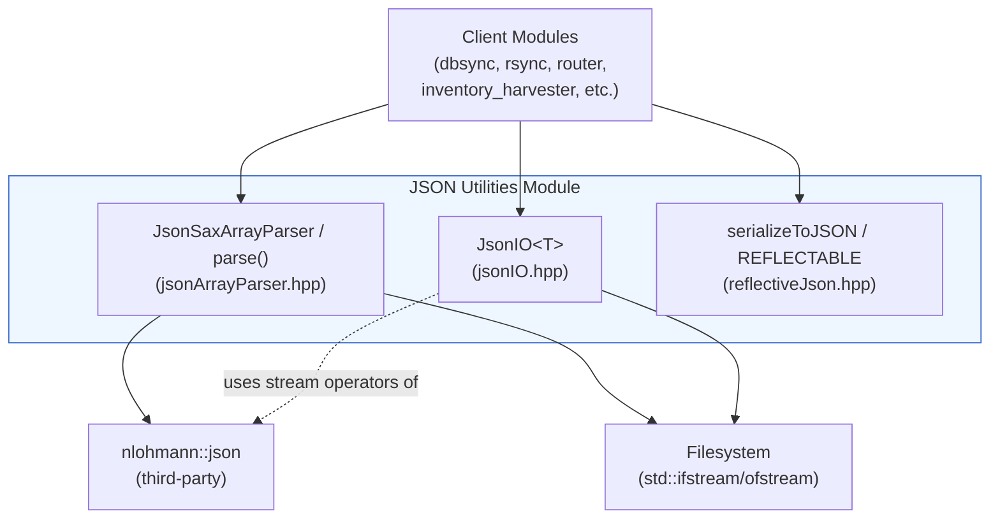
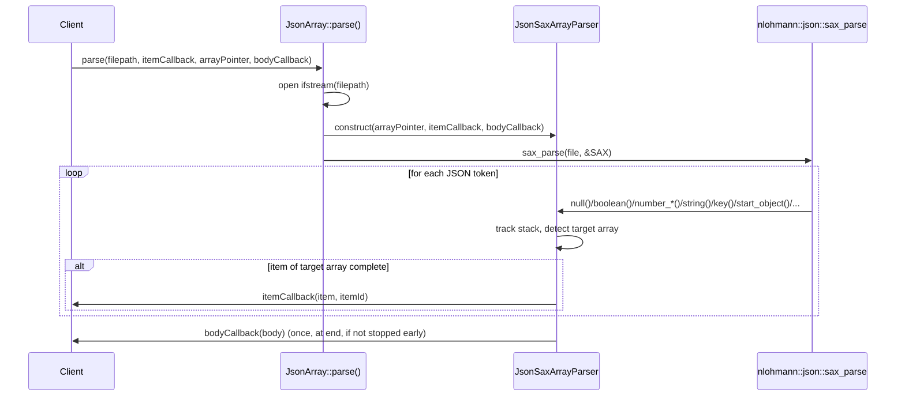
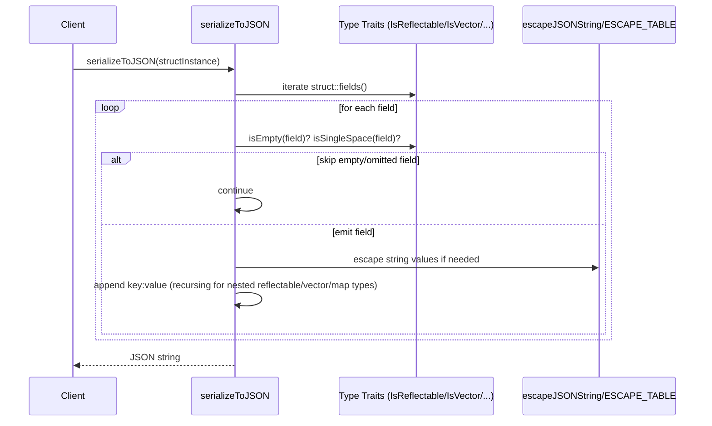

# JSON Utilities

## Introduction

The **JSON Utilities** module is a small, header-only C++ library that lives inside the broader
[Shared Utilities](shared_utils.md) collection of Wazuh's shared modules infrastructure. It
provides three independent, focused capabilities that are used throughout the Wazuh C++ codebase
(agents, managers, and shared modules such as `dbsync`, `rsync`, `router`, and the
inventory/vulnerability modules) whenever JSON data needs to be read, written, streamed, or
produced from plain C++ structs without depending on a full JSON DOM library for serialization:

1. **Streaming JSON array parsing** — parse very large JSON documents item-by-item without loading
   the whole file/array into memory.
2. **Simple JSON file I/O** — a thin, generic helper to read and write a JSON-compatible object
   to/from disk.
3. **Reflective JSON serialization** — a compile-time reflection mechanism that turns annotated C++
   structs into JSON strings without runtime overhead or heavy JSON library dependencies.

Because these three components solve unrelated problems (memory-efficient parsing, file
persistence, and object serialization) but share the common theme of "working with JSON without
building full `nlohmann::json` object-graphs everywhere", they are grouped together under one
module while being documented as independent sub-modules.

## Architecture Overview

All components are self-contained header files with no inter-dependencies among themselves (only
`jsonArrayParser.hpp` depends on the third-party `nlohmann::json` library for its SAX interface).
They are consumed independently by client code depending on the use case.

## Components

| Component | File | Responsibility | Documentation |
|---|---|---|---|
| Streaming JSON Array Parser | `jsonArrayParser.hpp` | SAX-based parsing of a target JSON array inside a (possibly huge) JSON document, invoking a callback per item instead of materializing the whole array in memory | [json_utilities_streaming_parser.md](json_utilities_streaming_parser.md) |
| JSON File I/O | `jsonIO.hpp` | Minimal generic helper (`JsonIO<T>`) to read/write any stream-serializable JSON-like object from/to a file path | [json_utilities_file_io.md](json_utilities_file_io.md) |
| Reflective JSON Serialization | `reflectiveJson.hpp` | Compile-time reflection (`REFLECTABLE` macro + type traits) that serializes plain C++ structs to JSON strings without a DOM, honoring empty-field omission and string escaping | [json_utilities_reflection.md](json_utilities_reflection.md) |

### Streaming JSON Array Parser

Implements `JsonArray::JsonSaxArrayParser`, a SAX handler compatible with `nlohmann::json::sax_parse`,
and the convenience function `JsonArray::parse()`. It is designed for scenarios where a JSON
document contains one large array (identified via a JSON Pointer) whose items must be processed
one at a time — e.g., ingesting large content-manager snapshots or CTI feeds — while still exposing
the "body" of the JSON document (the object with the array stripped out) via a separate callback.
See [json_utilities_streaming_parser.md](json_utilities_streaming_parser.md) for details.

### JSON File I/O

Implements the templated `JsonIO<T>` class with two static methods, `readJson` and `writeJson`,
that wrap `std::ifstream`/`std::ofstream` and the stream (`<<`/`>>`) operators of the target type
`T` (typically `nlohmann::json` or a type that has stream operators overloaded). It centralizes
file-open error handling and is used by configuration/state persistence code across shared
modules. See [json_utilities_file_io.md](json_utilities_file_io.md) for details.

### Reflective JSON Serialization

Implements a lightweight reflection system (`REFLECTABLE` macro, `makeFieldChecked`/`MAKE_FIELD`),
type traits (`IsReflectable`, `IsVector`, `IsList`, `IsMap`), emptiness helpers (`isEmpty`), and the
`serializeToJSON`/`jsonFieldToString` function family that converts annotated structs (and nested
vectors/maps/lists of them) directly into a JSON string using `std::to_chars`/`snprintf` for numeric
formatting and a lookup-table-based escaper for strings — all without building an intermediate DOM.
This is heavily used by data model structs across the codebase (e.g., inventory/vulnerability
harvester models) to produce JSON payloads efficiently. See
[json_utilities_reflection.md](json_utilities_reflection.md) for details.

## Data Flow Examples

### Streaming Array Parsing Flow

### Reflective Serialization Flow

## Usage Context within Wazuh

This module belongs to the `shared_utils` collection documented in
[shared_utils.md](shared_utils.md), alongside sibling utility groups such as
[compression_archive.md](compression_archive.md), [file_os_helpers.md](file_os_helpers.md),
[rocksdb_wrapper.md](rocksdb_wrapper.md), and [sqlite_wrapper.md](sqlite_wrapper.md). Higher-level
components like the [dbsync](dbsync.md), [rsync](rsync.md), and [router](router.md) shared modules,
as well as the [inventory_harvester_module](inventory_harvester_module.md) and
[vulnerability_scanner_module](vulnerability_scanner_module.md), rely on these primitives to
serialize their data models and to persist/load JSON configuration and state efficiently.

## Sub-module Documentation

- [json_utilities_streaming_parser.md](json_utilities_streaming_parser.md) — Streaming SAX-based JSON array parser
- [json_utilities_file_io.md](json_utilities_file_io.md) — Generic JSON file read/write helper
- [json_utilities_reflection.md](json_utilities_reflection.md) — Compile-time reflective JSON serialization
