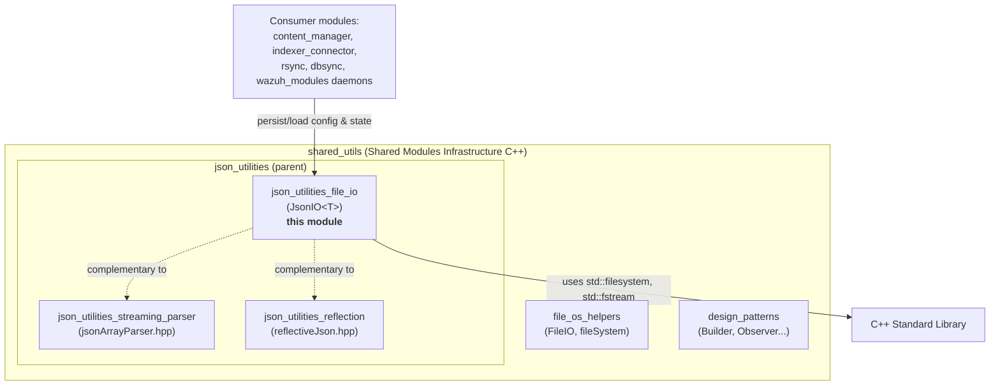
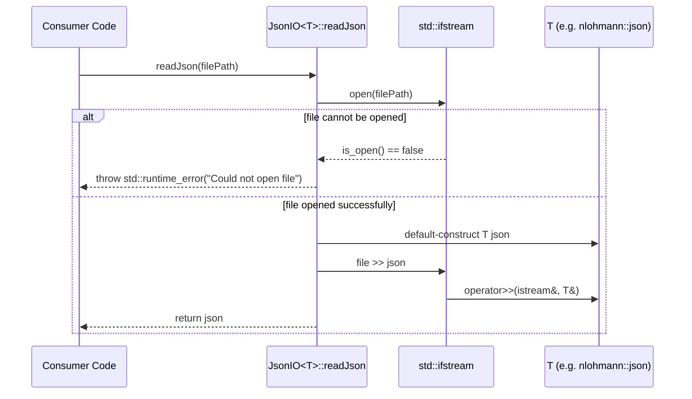
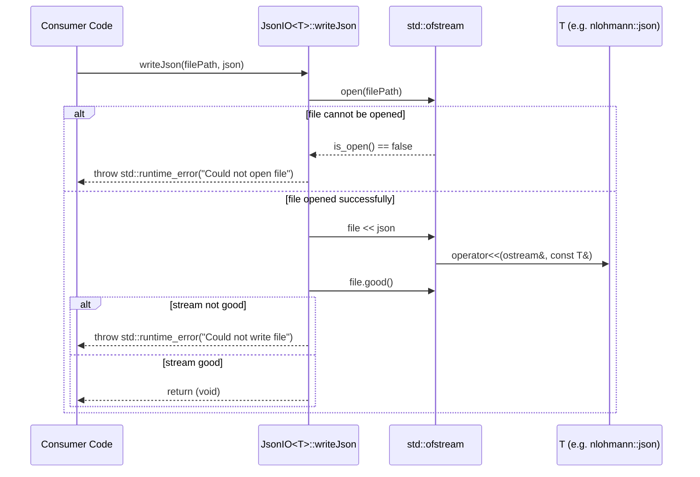

# JSON Utilities — File I/O (`json_utilities_file_io`)

## Introduction

`json_utilities_file_io` is a minimal, header-only C++ utility module that provides a generic, templated interface for **reading and writing JSON-serializable objects to/from disk**. It is implemented entirely in `src/shared_modules/utils/jsonIO.hpp` as the `JsonIO<T>` class template.

This module is one of three sibling utilities under the broader `json_utilities` umbrella in the [Shared Modules Infrastructure (C++)](shared_utils.md) codebase, alongside:

- [`json_utilities_streaming_parser`](json_utilities_streaming_parser.md) — incremental/streaming parsing of JSON arrays (`jsonArrayParser.hpp`)
- [`json_utilities_reflection`](json_utilities_reflection.md) — compile-time reflection-based JSON serialization helpers (`reflectiveJson.hpp`)

`JsonIO<T>` complements these by handling the **persistence boundary**: taking any type `T` that already knows how to stream itself to/from `std::ifstream`/`std::ofstream` (e.g., `nlohmann::json`, or any custom type with `operator>>`/`operator<<` overloads) and providing simple, exception-safe static methods to load it from, or save it to, a file on disk.

Because it is a lightweight, dependency-free header, this utility is widely reusable across any C++ component in the Wazuh codebase that needs to persist configuration, state, or cached data as JSON — including modules such as `content_manager`, `indexer_connector`, `rsync`, `dbsync`, and the various `wazuh_modules` daemons that load JSON configuration snapshots.

---

## 1. Purpose and Core Functionality

The module solves a single, narrow problem: **safe, generic JSON file persistence**.

| Capability | Description |
|---|---|
| Generic read | Deserialize a JSON file at a given filesystem path into an object of type `T` |
| Generic write | Serialize an object of type `T` to a JSON file at a given filesystem path |
| Fail-fast error handling | Throws `std::runtime_error` on file-open failure or write failure, rather than silently producing corrupt/partial state |
| Zero external dependencies | Uses only the C++ standard library (`<filesystem>`, `<fstream>`) |
| Templated / type-agnostic | Works with any type `T` that supports `operator>>(std::istream&, T&)` and `operator<<(std::ostream&, const T&)` — most commonly `nlohmann::json`, but also custom DTOs |

### Design Rationale

- **Static-only API**: `JsonIO<T>` has no instance state; both methods are `static`. This makes it usable as a stateless utility/namespace-like class without requiring instantiation, avoiding unnecessary object lifecycle management.
- **RAII file handling**: `std::ifstream`/`std::ofstream` are used as local (stack) objects, guaranteeing the underlying file descriptor is closed automatically when the function returns or throws.
- **Explicit failure signaling**: Rather than returning error codes or optional/empty results, the class throws exceptions immediately upon I/O failure — a pattern consistent with the "fail fast, fail loud" convention seen in other Wazuh utility helpers (e.g., `FileIO`, `RocksDBWrapper`).

---

## 2. Component Reference

### `JsonIO<T>` (class template)

```cpp
template <typename T>
class JsonIO
{
public:
    static T readJson(const std::filesystem::path& filePath);
    static void writeJson(const std::filesystem::path& filePath, const T& json);
};
```

#### `readJson(filePath) -> T`
- Opens `filePath` for reading via `std::ifstream`.
- Throws `std::runtime_error("Could not open file")` if the file cannot be opened.
- Streams the file contents into a default-constructed `T` using `operator>>`.
- Returns the populated `T` object.

#### `writeJson(filePath, json)`
- Opens `filePath` for writing via `std::ofstream` (truncating any existing content).
- Throws `std::runtime_error("Could not open file")` if the file cannot be opened.
- Streams `json` into the file using `operator<<`.
- After writing, checks the stream's `good()` state; throws `std::runtime_error("Could not write file")` if the write did not fully succeed.

### Preconditions / Constraints

- `T` **must** define stream extraction (`>>`) and insertion (`<<`) operators compatible with the underlying serialization library used (typically `nlohmann::json`, which natively supports both).
- `T` must be default-constructible (required by `readJson`, which default-constructs before populating via `>>`).
- The caller is responsible for ensuring parent directories of `filePath` exist prior to calling `writeJson` (the class does not create directories).

---

## 3. Architecture

### 3.1 Class Structure

```mermaid
classDiagram
    class JsonIO~T~ {
        <<template>>
        +readJson(filePath: path) T$
        +writeJson(filePath: path, json: T)$
    }
    class T {
        <<template parameter>>
        +operator>>(istream, T&)
        +operator<<(ostream, const T&)
    }
    JsonIO~T~ ..> T : produces / consumes
    JsonIO~T~ ..> "std::ifstream" : reads via
    JsonIO~T~ ..> "std::ofstream" : writes via
```

### 3.2 Position within `json_utilities` and Shared Modules Infrastructure



`json_utilities_file_io` has **no compile-time dependency** on its sibling modules (`json_utilities_streaming_parser`, `json_utilities_reflection`) — each is an independent header. They are grouped together conceptually because they all operate on JSON data, but a consumer can include `jsonIO.hpp` alone without pulling in the other two.

---

## 4. Data Flow

### 4.1 Read Path (`readJson`)



### 4.2 Write Path (`writeJson`)



---

## 5. Usage Pattern

Typical usage instantiates the template with `nlohmann::json` (the most common JSON representation across the Wazuh C++ codebase) or a project-specific JSON-like DTO:

```cpp
#include "jsonIO.hpp"
#include <nlohmann/json.hpp>

// Reading configuration
nlohmann::json config = JsonIO<nlohmann::json>::readJson("/var/ossec/etc/config.json");

// Modifying and persisting state
config["last_offset"] = 12345;
JsonIO<nlohmann::json>::writeJson("/var/ossec/queue/state.json", config);
```

Error handling is done via standard C++ exception mechanisms:

```cpp
try
{
    auto data = JsonIO<nlohmann::json>::readJson(path);
}
catch (const std::runtime_error& e)
{
    // Handle missing file / open failure
}
```

### Common Consumer Scenarios (by convention across the codebase)

| Scenario | Likely Consumer |
|---|---|
| Persisting content manager download offsets/state snapshots | `content_manager` |
| Loading/saving indexer connector server pool configuration | `indexer_connector` |
| Loading Wazuh module JSON configuration dumps for testing | `engine-suite` CLI tools |
| Reading/writing cached KVDB or feed metadata | `dbsync`, `rsync` |

*(Note: these are architectural conventions inferred from the module's design and its placement within the shared C++ utilities layer; consult each specific module's documentation for confirmed usage.)*

---

## 6. Error Handling Summary

| Failure Mode | Exception Thrown | Trigger |
|---|---|---|
| Input file does not exist / cannot be opened for reading | `std::runtime_error("Could not open file")` | `readJson` |
| Output path cannot be opened for writing (e.g., permissions, missing parent directory) | `std::runtime_error("Could not open file")` | `writeJson` |
| Write operation leaves the stream in a bad state (e.g., disk full) | `std::runtime_error("Could not write file")` | `writeJson` |
| Malformed JSON content during deserialization | Propagated from `T::operator>>` (e.g., `nlohmann::json::parse_error`) | `readJson` |

No custom exception hierarchy is introduced; callers should be prepared to catch `std::runtime_error` (and, depending on `T`, library-specific parse exceptions) at the call site.

---

## 7. Related Documentation

- [`json_utilities_streaming_parser.md`](json_utilities_streaming_parser.md) — for parsing large/streamed JSON arrays without full in-memory load
- [`json_utilities_reflection.md`](json_utilities_reflection.md) — for compile-time reflective JSON (de)serialization of C++ structs
- [`shared_utils.md`](shared_utils.md) — parent module covering the broader Shared Modules Infrastructure C++ utility library (RAII wrappers, design patterns, file/OS helpers, etc.)
- [`file_os_helpers_file_utilities.md`](file_os_helpers_file_utilities.md) — general-purpose file/filesystem helpers (`FileIO`, `RealFileSystemT`) that complement this module for non-JSON file operations

---

## 8. Summary

`json_utilities_file_io` is intentionally small in scope: it is a thin, safe, and reusable bridge between C++ object state and JSON files on disk. Its templated design decouples it from any specific JSON library, and its exception-based error handling makes failures explicit and impossible to silently ignore. Any component within the Wazuh C++ ecosystem that needs simple "load config/state from JSON file" or "persist object as JSON file" behavior can adopt this utility directly by including `jsonIO.hpp`, without introducing additional build or runtime dependencies.
