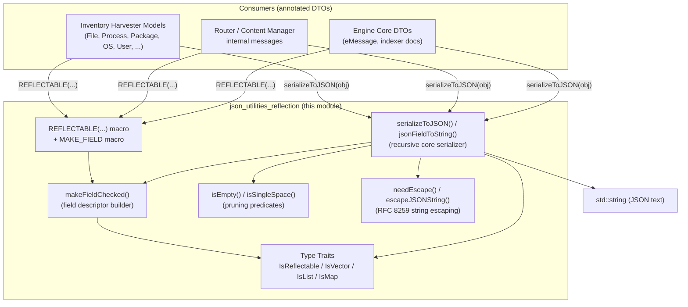
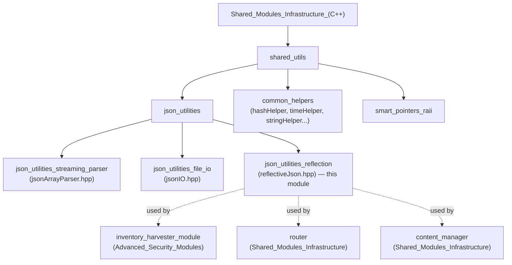
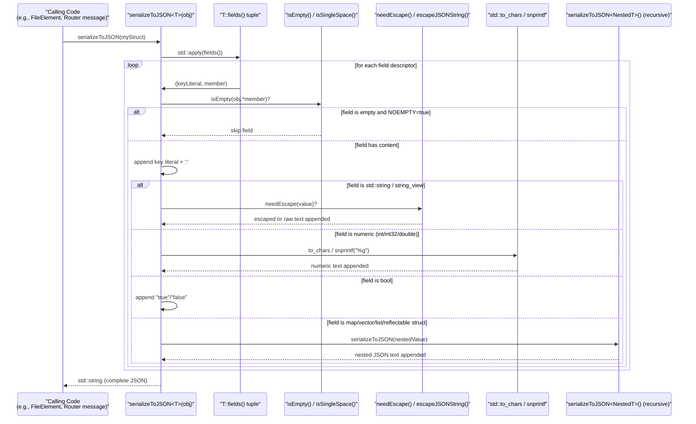
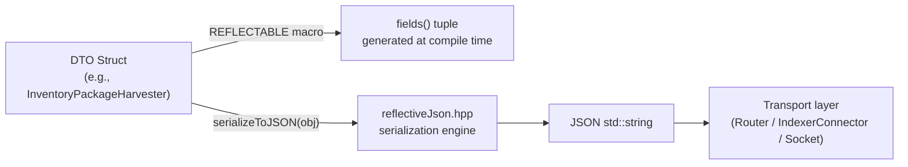
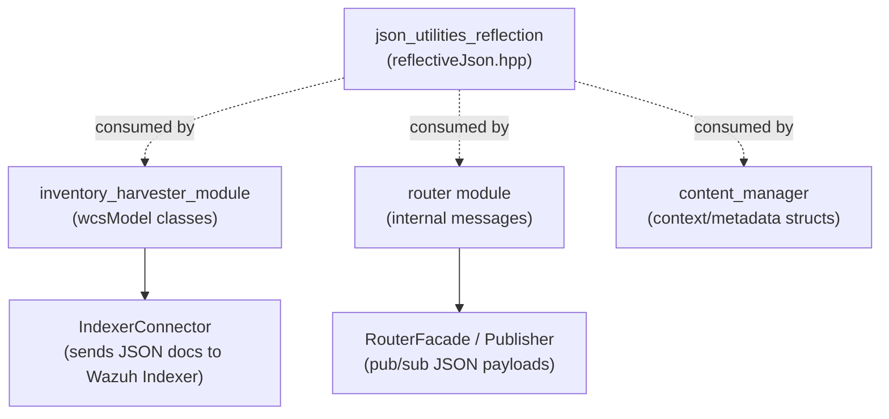

# JSON Utilities — Reflection (`json_utilities_reflection`)

## Introduction

`json_utilities_reflection` is a header-only C++ library (`src/shared_modules/utils/reflectiveJson.hpp`) that provides **zero-boilerplate, compile-time reflection-based JSON serialization** for plain C++ structs. Instead of hand-writing `to_json()` methods or depending on a full-featured (and heavier) JSON library such as `nlohmann::json` or `RapidJSON`, developers annotate a struct with a `REFLECTABLE(...)` macro that declares which members map to which JSON keys. The library then generates highly-optimized serialization code at compile time using C++17 template metaprogramming (`if constexpr`, `std::apply`, fold expressions, and `std::to_chars`).

This component is a leaf utility within the broader [Shared_Modules_Infrastructure_(C++)](Shared_Modules_Infrastructure_(C++).md) tree, specifically nested under the `shared_utils` → `json_utilities` grouping, alongside its siblings:
- [json_utilities_streaming_parser](json_utilities_streaming_parser.md) (`jsonArrayParser.hpp`) — streaming/incremental JSON array parsing.
- [json_utilities_file_io](json_utilities_file_io.md) (`jsonIO.hpp`) — reading/writing JSON documents to/from files.

It is consumed extensively across the codebase wherever C++ modules need to emit JSON payloads efficiently and without external dependencies — most notably in the [Advanced_Security_Modules_(C++_Inventory_&_Vulnerability)](Advanced_Security_Modules_(C++_Inventory_&_Vulnerability).md) data model classes (`inventory_harvester_module`'s `wcsModel` classes), the [Wazuh_Engine_Core_(C++)](Wazuh_Engine_Core_(C++).md) subsystem, and other [Shared_Modules_Infrastructure_(C++)](Shared_Modules_Infrastructure_(C++).md) components such as `router` and `content_manager`.

---

## Purpose and Core Functionality

The library solves a recurring problem in the Wazuh C++ codebase: many internal data-transfer objects (DTOs) — agent inventory records, FIM (File Integrity Monitoring) events, network/process/package harvester models, indexer documents, etc. — need to be serialized to JSON for transmission to Wazuh Indexer, the analysis engine, or other daemons. Writing manual serializers for dozens of these structs is repetitive and error-prone.

`reflectiveJson.hpp` addresses this by providing:

1. **A reflection macro (`REFLECTABLE`)** that lets a struct self-describe its serializable fields as a `constexpr std::tuple` of `(jsonKey, jsonKeyLiteral, memberPointer)` triples, generated via `MAKE_FIELD`/`makeFieldChecked`.
2. **Type-trait detection utilities** (`IsReflectable`, `IsVector`, `IsList`, `IsMap`) used to dispatch serialization logic at compile time for nested reflectable objects, `std::vector`, `std::list`, `std::map`/`std::unordered_map`, and primitive types.
3. **`isEmpty()` overloads** that determine whether a field should be omitted from the output (default "empty-field pruning" behavior controlled by the `NOEMPTY` template flag), supporting sentinel values (`DEFAULT_INT_VALUE`, `DEFAULT_INT32_VALUE`, `DEFAULT_DOUBLE_VALUE`) for numeric types and emptiness checks for strings/containers.
4. **A recursive, allocation-conscious serializer (`serializeToJSON` / `jsonFieldToString`)** that walks the field tuple, escapes strings per RFC 8259 (`escapeJSONString`/`needEscape` using a precomputed `ESCAPE_TABLE`), converts numbers via `std::to_chars` (avoiding locale-dependent `sprintf` overhead except for `double`, which falls back to `snprintf("%g")` for GCC 9.4 compatibility), and emits valid JSON text directly into a `std::string` buffer.
5. **Support for single-space sentinel skipping** (`isSingleSpace`) — an idiom used by some models to represent "explicitly blank" fields that should still be excluded from output.

### Key Design Characteristics
- **Header-only, no runtime reflection**: All type dispatch happens via `if constexpr` at compile time — there is no RTTI or virtual dispatch overhead.
- **No external JSON library dependency**: Self-contained, minimizing binary size and build complexity for daemons/modules that just need to emit JSON.
- **Configurable pruning via non-type template parameters**: `NOEMPTY` and `NOSINGLESPACE` (both default `true`) control whether empty/sentinel fields are omitted — callers can opt out by explicitly instantiating `serializeToJSON<T, false, false>(...)`.
- **Composable**: Reflectable structs can nest other reflectable structs, and can contain `vector`/`list`/`map` of primitives or of other reflectable structs — the serializer recurses correctly through all these compositions.

---

## Architecture

### Component Diagram



### Position in the Shared Modules Hierarchy



---

## Core Components Reference

| Component | Kind | Responsibility |
|---|---|---|
| `REFLECTABLE(...)` | macro | Defines a `static constexpr fields()` method returning a `std::tuple` of field descriptors for a struct. |
| `MAKE_FIELD(keyLiteral, memberPtr)` | macro | Convenience wrapper around `makeFieldChecked` that auto-generates the pre-quoted JSON key literal (`"\"key\":"`). |
| `makeFieldChecked` | function template | Builds a `(std::string_view key, std::string_view keyWithQuotesAndColon, memberPointer)` tuple; statically asserts the member type is reflectable via `IS_REFLECTABLE_MEMBER`. |
| `IsReflectable<T>` | type trait | Detects whether `T` has a `fields()` static method (i.e., is annotated with `REFLECTABLE`). |
| `IsVector<T>` | type trait | Detects `std::vector<...>` specializations. |
| `IsList<T>` | type trait | Detects `std::list<...>` specializations. |
| `IsMap<T>` (internal) | type trait | Detects `std::map`/`std::unordered_map` specializations (used internally by the serializer). |
| `isEmpty(...)` | overload set | Determines if a field's value should be pruned from output (defaults: `INT64_MIN`, `INT32_MIN`, `0.0`, empty string/container; `bool` and reflectable objects have specialized semantics — the latter recursively checks all sub-fields). |
| `isSingleSpace(...)` | function template | Detects the "single space" sentinel convention used to mark fields as intentionally blank/omitted. |
| `needEscape` / `escapeJSONString` | functions | RFC 8259-compliant string escaping using a precomputed 256-entry `ESCAPE_TABLE` (built once via an immediately-invoked lambda at static-init time). |
| `jsonFieldToString(...)` | function template (multiple overloads) | Entry points that serialize a single field/sub-object either into a returned `std::string` or by appending into an existing `std::string&` buffer. Overloaded for `std::unordered_map`, generic reflectable/vector/list types. |
| `serializeToJSON(...)` | function template (multiple overloads) | The main recursive serializer. Overloads exist for: (a) reflectable `T` → `std::string` or append-to-buffer, and (b) `std::vector<T>` → JSON array. Template parameters `NOEMPTY`/`NOSINGLESPACE` (default `true`) toggle pruning behavior. |

---

## Data Flow: Serialization Process



---

## Usage Pattern

A typical consumer struct (e.g., from `inventory_harvester_module`'s `wcsModel` classes, or a router/content_manager internal DTO) looks like this:

```cpp
struct FileElement
{
    std::string path;
    int64_t size = DEFAULT_INT_VALUE;   // sentinel => pruned if unset
    bool isDirectory = false;

    REFLECTABLE(
        MAKE_FIELD("path", &FileElement::path),
        MAKE_FIELD("size", &FileElement::size),
        MAKE_FIELD("is_directory", &FileElement::isDirectory)
    );
};

// Usage:
FileElement fe{"/etc/passwd", 1024, false};
std::string json = serializeToJSON(fe);
// -> {"path":"/etc/passwd","size":1024,"is_directory":false}
```

Because `serializeToJSON` accepts template flags, callers who need to preserve empty fields (e.g., to satisfy a fixed indexer schema) can call `serializeToJSON<FileElement, false, false>(fe)`.

### Component Interaction (Typical Consumer)



---

## Relationship to Sibling & Dependent Modules

- **[json_utilities_streaming_parser](json_utilities_streaming_parser.md)** (`jsonArrayParser.hpp`): Handles the *inverse* direction — parsing large JSON arrays incrementally from a data stream. The two modules are independent (no shared code) but are typically used together in pipelines that both consume and produce JSON (e.g., Content Manager download/ingest flows).
- **[json_utilities_file_io](json_utilities_file_io.md)** (`jsonIO.hpp`): Provides file-based read/write helpers for JSON documents; it may internally build on generic JSON string representations similar to what this module produces, but does not directly depend on `reflectiveJson.hpp`.
- **[Advanced_Security_Modules_(C++_Inventory_&_Vulnerability)](Advanced_Security_Modules_(C++_Inventory_&_Vulnerability).md)**: The `inventory_harvester_module`'s `wcsModel` classes (`File`, `Process`, `Package`, `OS`, `User`, `NetworkInterface`, `Host`, etc.) are prime consumers — they use `REFLECTABLE` to describe the schema of documents sent to the Wazuh Indexer via `IndexerConnector`.
- **[Shared_Modules_Infrastructure_(C++)](Shared_Modules_Infrastructure_(C++).md)** siblings such as `router` (`RouterModule`, `Publisher`) and `content_manager` (`UpdaterContext`) use lightweight reflectable structs for internal control messages and metadata exchange, avoiding the overhead of a full JSON library for simple message shapes.
- **[Wazuh_Engine_Core_(C++)](Wazuh_Engine_Core_(C++).md)**: Various engine components (e.g., `eMessage` utilities, geo/kvdb API responses) may leverage similar reflection-based serialization patterns for lightweight response objects.



---

## Notable Implementation Details

1. **Escape Table Initialization**: `ESCAPE_TABLE` is a `static` 256-entry `std::array<const char*, CHAR_SIZE>` populated once via an immediately-invoked lambda at program startup, mapping control characters (`"`, `\`, `\b`, `\f`, `\n`, `\r`, `\t`, and all `< 0x20` code points) to their JSON escape sequences. This avoids repeated branching costs during serialization.
2. **Numeric Formatting**: Integer types use `std::to_chars` for fast, locale-independent conversion. `double` uses `snprintf("%g", ...)` specifically because GCC 9.4 (a compiler version still supported by the build matrix) lacks `std::to_chars` overloads for floating-point types.
3. **Single-Field Struct Optimization**: `serializeToJSON` special-cases reflectable types with exactly one field — it serializes just that field's *value* (not wrapped in an object), which is useful for "wrapper" DTOs that model a bare JSON value (e.g., top-level arrays or scalars).
4. **Recursive Composition Safety**: `isEmpty` for a reflectable type recursively ANDs the emptiness of all its own fields — meaning a nested object is considered "empty" (and can be pruned) only if *all* of its members are empty, ensuring sparse/optional nested structures don't leave stray `{}` in output.
5. **Compile-Time Safety**: `IS_REFLECTABLE_MEMBER` is a `constexpr bool` combining `std::is_same_v` checks and the trait detectors; `makeFieldChecked` uses `static_assert` on it, so attempting to reflect an unsupported member type (e.g., a raw pointer or unsupported container) fails at compile time rather than producing incorrect JSON at runtime.

---

## When to Use This Module vs. Alternatives

| Scenario | Recommended Approach |
|---|---|
| Serializing a well-known, stable C++ struct to JSON for indexing/transport | Use `REFLECTABLE` + `serializeToJSON` (this module). |
| Parsing arbitrary/untyped JSON input | Use a full parser (e.g., `cJSON`, or [json_utilities_streaming_parser](json_utilities_streaming_parser.md) for arrays). |
| Reading/writing JSON documents from/to disk | Use [json_utilities_file_io](json_utilities_file_io.md). |
| Python-side models (API layer) | See [api_core_infrastructure_models](api_core_infrastructure_models.md) (`WazuhAPIJSONEncoder`, Pydantic-like models) — a conceptually similar but independently-implemented Python mechanism for the REST API layer. |
