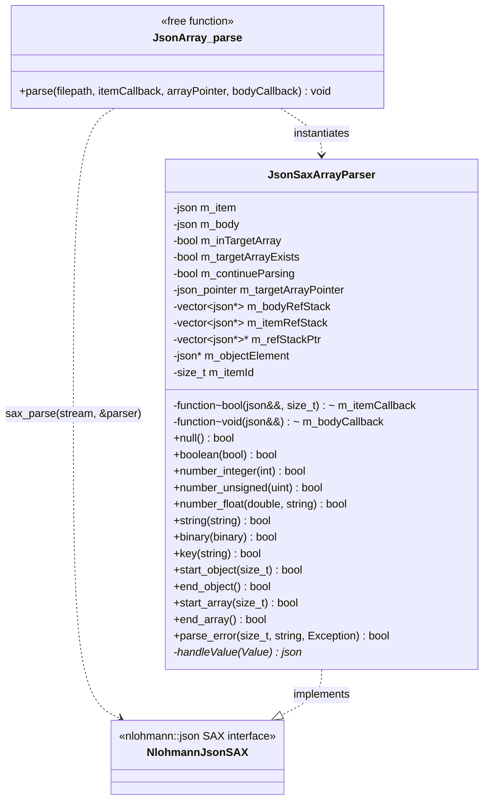
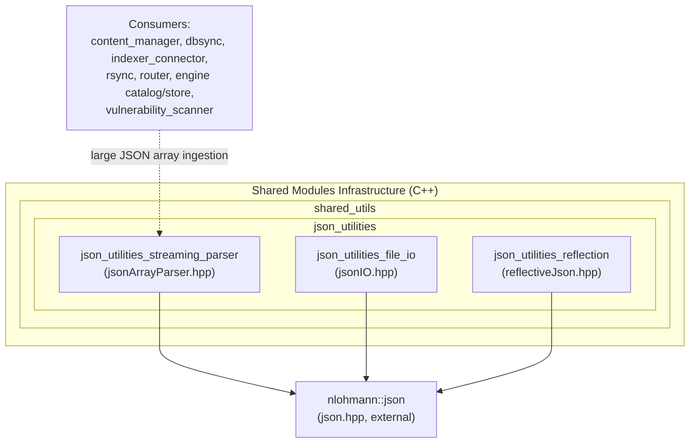
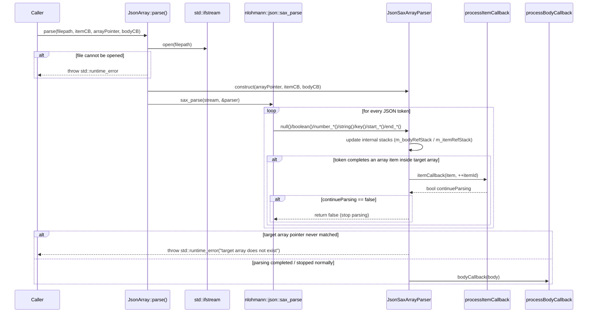
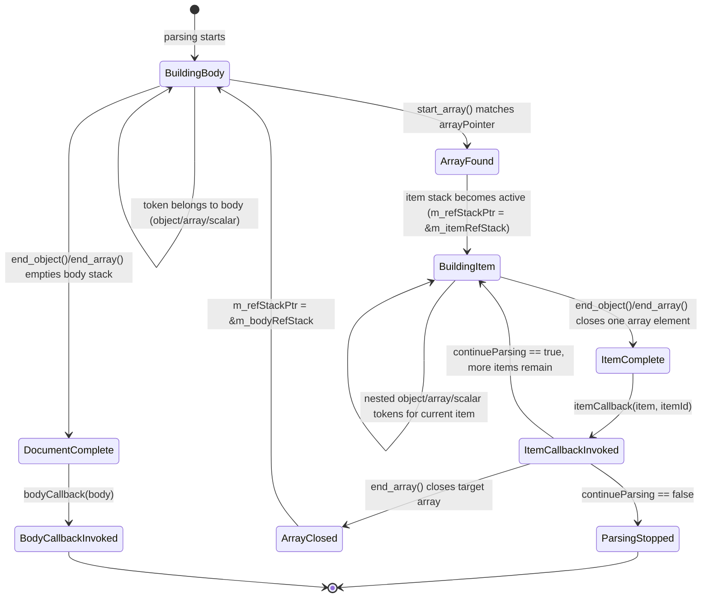
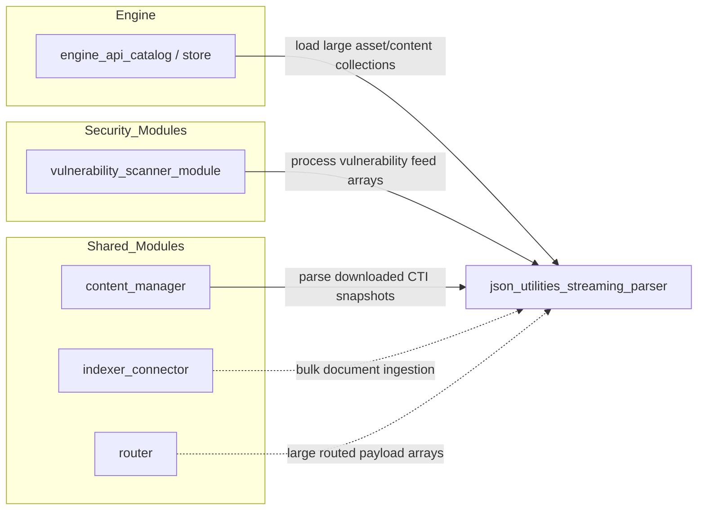

# JSON Utilities – Streaming Array Parser

## Introduction

The **JSON Utilities – Streaming Array Parser** module provides a single, highly-focused C++ header
(`src/shared_modules/utils/jsonArrayParser.hpp`) that allows Wazuh components to parse very large JSON
documents **without loading the entire document into memory**. It is built on top of the
[nlohmann::json](https://json.nlohmann.me/) SAX (event-driven) parsing interface and exposes a small,
callback-based API that yields one JSON array element at a time while reconstructing the surrounding
JSON "body" (the document minus the target array) for later use.

This capability is critical for Wazuh subsystems that periodically ingest or process large payloads —
CTI/vulnerability feeds, catalog snapshots, package inventories, or any bulk JSON array — where reading
the whole file into a `nlohmann::json` DOM object would be prohibitively expensive in memory and CPU.

This module is a leaf component of the broader [`shared_utils`](shared_utils.md) library, part of the
[Shared Modules Infrastructure (C++)](Shared_Modules_Infrastructure_(C%2B%2B).md) subsystem. It is one of
three sibling JSON helpers under the `json_utilities` group:

| Module | Responsibility |
|---|---|
| **json_utilities_streaming_parser** (this document) | Memory-efficient, SAX-based parsing of large JSON arrays |
| [json_utilities_file_io](json_utilities_file_io.md) | Simple file-based JSON read/write helpers (`JsonIO`) |
| [json_utilities_reflection](json_utilities_reflection.md) | Compile-time reflection utilities to (de)serialize C++ structs to/from JSON |

## Purpose and Core Functionality

The module's public surface is a single free function:

```cpp
namespace JsonArray
{
    static void parse(
        const std::filesystem::path& filepath,
        std::function<bool(nlohmann::json&&, const size_t)> processItemCallback,
        const nlohmann::json::json_pointer& arrayPointer = nlohmann::json::json_pointer(),
        std::function<void(nlohmann::json&&)> processBodyCallback = [](nlohmann::json&&) {});
}
```

Internally it relies on a private helper class, `JsonSaxArrayParser`, that implements the nlohmann SAX
event interface (`null`, `boolean`, `number_*`, `string`, `binary`, `key`, `start_object`, `end_object`,
`start_array`, `end_array`, `parse_error`).

Key capabilities:

- **Streaming ("SAX") parsing**: the JSON file is never materialized as a whole DOM tree; only one array
  element and the accumulating "body" (non-array data) are kept in memory at any time.
- **Targetable arrays**: the array to stream can be located anywhere in the document via a
  [JSON Pointer](https://json.nlohmann.me/api/json_pointer/) (`arrayPointer`), not just at the document root.
- **Per-item callback**: `processItemCallback(item, itemIndex)` is invoked once for every element found in
  the target array. Returning `false` stops parsing early (useful for early termination on error, limits, or
  user cancellation).
- **Body callback**: once all array items have been streamed (or if the item callback stops parsing),
  `processBodyCallback(body)` is invoked once with the rest of the JSON document (the original object with
  the target array's contents removed), enabling metadata to be recovered without re-parsing the file.
- **Fail-fast validation**: if the target array pointer does not exist in the document, a
  `std::runtime_error` is thrown after the whole file has been scanned.
- **Exception propagation**: JSON syntax errors detected by the underlying parser are surfaced via the SAX
  `parse_error` hook, which simply re-throws the exception produced by nlohmann::json.

## Architecture

### Class Structure



- `JsonSaxArrayParser` is move-only (copy is disabled) since it owns growing/shrinking stacks of raw
  `nlohmann::json*` pointers into `m_item`/`m_body` that must not be duplicated.
- Two independent stacks (`m_bodyRefStack`, `m_itemRefStack`) model the nested-object/array hierarchy for,
  respectively, the "body" being built and the "current item" being built. `m_refStackPtr` always points at
  whichever stack is currently active, allowing the same SAX callback code to build either structure
  transparently.

### Position in the Shared Utilities Hierarchy



The module has **no internal Wazuh dependencies** beyond the local `json.hpp` wrapper around
nlohmann::json (also used by [json_utilities_file_io](json_utilities_file_io.md) and
[json_utilities_reflection](json_utilities_reflection.md)). This makes it a pure, dependency-light utility
that can be included by virtually any C++ component in the codebase, including modules documented under
[Shared Modules Infrastructure (C++)](Shared_Modules_Infrastructure_(C%2B%2B).md) (e.g. `content_manager`,
`dbsync`, `router`, `rsync`) and [Wazuh Engine Core (C++)](Wazuh_Engine_Core_(C%2B%2B).md) (e.g. the
`store`/`catalog` components that load large asset or content collections).

## Parsing Process (Data Flow)

### High-Level Sequence



### Parser State Machine

The parser tracks whether the current SAX position is inside the target array using the
`m_inTargetArray` flag and swaps the active reference stack (`m_refStackPtr`) accordingly:



Key invariants enforced by the state machine:

1. Only **one** target array is streamed per `parse()` invocation, identified by the `arrayPointer`.
2. If the JSON document never contains an array at `arrayPointer`, `m_targetArrayExists` remains `false`
   and a `std::runtime_error` is thrown once the top-level document closes.
3. Scalars (numbers, strings, booleans, null) that are themselves the target array's items (e.g. a JSON
   array of plain strings) are dispatched to `itemCallback` directly from `handleValue()`, without waiting
   for a matching `end_object`/`end_array`.

## Usage Example

```cpp
#include "jsonArrayParser.hpp"

JsonArray::parse(
    "/var/ossec/queue/vulnerabilities/feed.json",
    [](nlohmann::json&& item, const size_t index) -> bool
    {
        // Process one feed entry at a time; memory stays bounded.
        processVulnerability(item);
        return true; // return false to stop early
    },
    nlohmann::json::json_pointer("/vulnerabilities"), // target array location
    [](nlohmann::json&& body) -> void
    {
        // body now contains the document without "/vulnerabilities",
        // e.g. { "metadata": { "generated": "...", "version": "..." } }
        storeMetadata(body);
    });
```

## Component Interaction and Typical Consumers

Because this header is generic and dependency-free, it is designed to be reused by any component that
needs to ingest large JSON arrays incrementally rather than through a full DOM parse. Typical candidate
consumers within the codebase (based on their functional role) include:



For details on these consuming subsystems, see:
- [Shared Modules Infrastructure (C++)](Shared_Modules_Infrastructure_(C%2B%2B).md) — `content_manager`,
  `indexer_connector`, `router`, `rsync`, `dbsync`.
- [Wazuh Engine Core (C++)](Wazuh_Engine_Core_(C%2B%2B).md) — `engine_api_catalog`, `Store`.
- [Advanced Security Modules (C++ Inventory & Vulnerability)](Advanced_Security_Modules_(C%2B%2B_Inventory_%26_Vulnerability).md)
  — `vulnerability_scanner_module`.

## Error Handling

| Condition | Behavior |
|---|---|
| File cannot be opened | `std::runtime_error("Unable to open input file: <path>")` thrown immediately |
| Malformed JSON encountered mid-stream | The underlying nlohmann exception is re-thrown from `parse_error()` |
| Target array pointer never found in document | `std::runtime_error("The target array does not exist.")` thrown after the whole document is scanned |
| `processItemCallback` returns `false` | Parsing stops immediately; `processBodyCallback` is **not** invoked |
| Excessively large object/array reported by the tokenizer (`len > max_size()`) | `std::runtime_error` with size details (guards against malicious/corrupt input) |

Callers should wrap `JsonArray::parse()` calls in `try/catch` blocks and handle `std::runtime_error`
(file/format errors) as well as any exceptions that may propagate from `nlohmann::json` parsing failures
(e.g. `nlohmann::json::parse_error`).

## Design Rationale

- **Memory efficiency**: Traditional `nlohmann::json::parse()` builds a full DOM tree in memory, which does
  not scale for multi-hundred-megabyte feeds (e.g. vulnerability databases). The SAX-based approach bounds
  memory usage to roughly the size of a single array element plus the non-array "body" content.
- **Composable callbacks**: Separating "item" processing from "body" processing lets callers stream
  processing of bulk data (e.g., write each item to a database) while still recovering document-level
  metadata (e.g., generation timestamp, schema version) without a second file pass.
- **JSON Pointer targeting**: Using `nlohmann::json::json_pointer` instead of a hard-coded top-level array
  assumption allows the same utility to be reused across different JSON schemas without modification.
- **Fail-safe early termination**: The boolean return value from `itemCallback` provides a natural
  mechanism for consumers to abort a long-running parse (e.g., once a search target is found, or a resource
  limit is hit) without needing to throw exceptions for control flow.

## Related Documentation

- [json_utilities_file_io](json_utilities_file_io.md) – simple whole-file JSON read/write helper (`JsonIO`), suited
  for small configuration-sized JSON documents.
- [json_utilities_reflection](json_utilities_reflection.md) – compile-time reflection-based JSON
  (de)serialization for typed C++ structures (`serializeToJSON`, `IsReflectable`, etc.).
- [Shared Modules Infrastructure (C++)](Shared_Modules_Infrastructure_(C%2B%2B).md) – parent subsystem
  documentation covering `content_manager`, `dbsync`, `indexer_connector`, `router`, and `rsync`, several of
  which handle bulk JSON payloads that can benefit from streaming parsing.
- [Wazuh Engine Core (C++)](Wazuh_Engine_Core_(C%2B%2B).md) – documentation for the engine's `Store`/`Catalog`
  components that manage potentially large collections of assets/policies.
