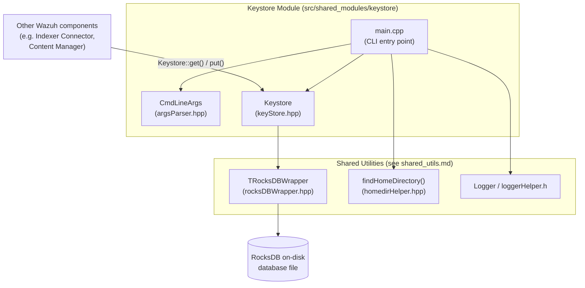
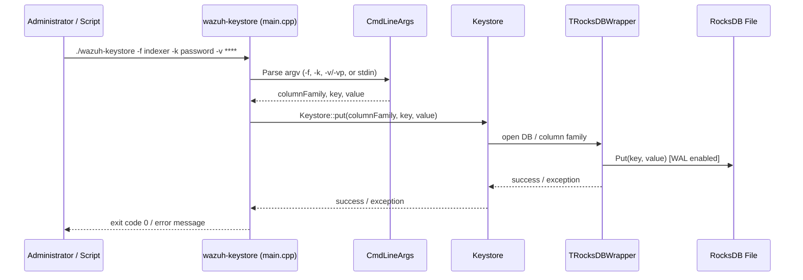
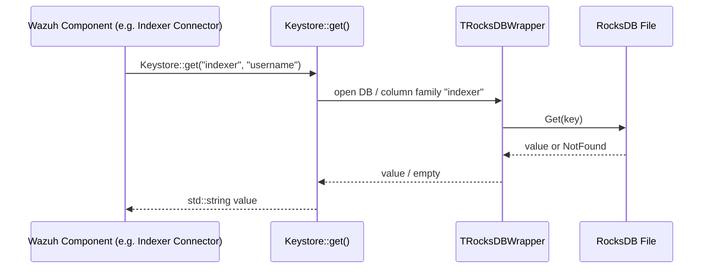

# Keystore Module

## 1. Purpose

The **Keystore** module is a small, self-contained C++ utility that provides **secure, persistent storage of sensitive key-value pairs** (such as credentials, tokens, and passwords) used by other Wazuh components — most notably the Indexer connector, which needs to store the Wazuh-Indexer username/password without keeping them in plaintext configuration files.

It ships as:
1. A **library API** (`Keystore` class) that any C++ component inside the Wazuh codebase can link against to `put`/`get` secrets.
2. A **standalone CLI executable** (`wazuh-keystore`) that administrators (or provisioning scripts) use to insert or update secrets from the command line, a file, or standard input.

Internally, the Keystore does not implement its own storage engine. It is a thin, security-focused façade over the generic **RocksDB key-value wrapper** (`TRocksDBWrapper`) provided by the [Shared Utilities](shared_utils.md) module (see the `rocksdb_wrapper` sub-module), using **RocksDB column families** as logical namespaces (e.g., `indexer`, `agentd`) so that different subsystems can store their secrets independently in the same on-disk database.

## 2. Architecture Overview

### 2.1 Component Diagram



### 2.2 Runtime / Data Flow





## 3. Core Components

| Component | File | Responsibility |
|---|---|---|
| `Keystore` | `include/keyStore.hpp` | Public static API (`put`, `get`) exposing the secret storage operations to any consumer in the codebase. |
| `CmdLineArgs` | `src/argsParser.hpp` | Parses and validates command-line arguments (`-f`, `-k`, `-v`, `-vp`, `-h`) for the CLI tool; throws `CmdLineArgsException` on invalid input and prints usage help. |
| `main` | `src/main.cpp` | Entry point of the `wazuh-keystore` executable; wires argument parsing, input-source resolution (flag value, file path, or stdin), logging setup, and calls into `Keystore::put`. |

### 3.1 `Keystore` (Library API)

Defined in `keyStore.hpp`, `Keystore` is a header-declared, statically-implemented class (implementation compiled separately) with three static methods:

- `static void put(const std::string& columnFamily, const std::string& key, const std::string& value)` — Inserts or updates a key-value pair under the given column family (namespace).
- `static void get(const std::string& columnFamily, const std::string& key, std::string& value)` — Retrieves a value into an output reference parameter.
- `static std::string get(const std::string& columnFamily, const std::string& key)` — Convenience overload that returns the value directly.

Design notes:
- The class has no instance state (`Keystore() = default;` with only static members) — it acts purely as a namespacing façade.
- Column families are used to logically separate secrets belonging to different subsystems (e.g., `indexer`) while sharing a single physical RocksDB database file, which is managed by `TRocksDBWrapper` (part of the [Shared Utilities](shared_utils.md) `rocksdb_wrapper` sub-module).
- Errors from the underlying storage propagate as exceptions (`std::runtime_error`, `std::invalid_argument`) from `TRocksDBWrapper`.

### 3.2 `CmdLineArgs` (CLI Argument Parsing)

Defined in `argsParser.hpp`, this class parses `argc`/`argv` for the CLI tool:

- `-f COLUMN_FAMILY` (required) — target namespace for the secret.
- `-k KEY` (required) — the key name.
- `-v VALUE` (optional) — value supplied directly on the command line.
- `-vp VALUE_PATH` (optional) — path to a file whose first line contains the value.
- `-h` — prints usage help and exits immediately.

If neither `-v` nor `-vp` is provided, `main.cpp` falls back to reading the value from **standard input**, enabling usages such as piping (`echo 'pass' | wazuh-keystore -f indexer -k password`).

Validation behavior:
- Missing required switches (`-f`, `-k`) or empty values throw `CmdLineArgsException`, which is caught in `main` to print the error and usage text, returning exit code `1`.

### 3.3 `main` (CLI Entry Point)

Defined in `main.cpp`, the executable `wazuh-keystore` performs the following steps:

1. Registers a global logging function (`Log::assignLogFunction`) that routes `ERROR`/`CRITICAL`/`WARNING` messages to `stderr` and everything else to `stdout` — using the shared `loggerHelper.h` infrastructure (see [Shared Utilities](shared_utils.md), `common_helpers` sub-module).
2. Resolves the Wazuh home directory via `Utils::findHomeDirectory()` (from `homedirHelper.hpp`, part of the [Shared Utilities](shared_utils.md) `file_os_helpers` sub-module) and sets it as the current working directory — ensuring the RocksDB database is created/opened in a consistent, predictable location regardless of how the tool is invoked.
3. Parses arguments via `CmdLineArgs`.
4. Determines the secret value source, in priority order:
   - Explicit `-v VALUE`.
   - File referenced by `-vp VALUE_PATH` (reads the first line).
   - Standard input (if neither flag is provided).
5. Calls `Keystore::put(family, key, value)` to persist the secret.
6. Catches `CmdLineArgsException` (prints error + help, exit code `1`) and generic `std::exception` (prints error, exit code `1`).

## 4. Dependencies on Other Modules

The Keystore module deliberately contains no storage or logging logic of its own; it depends on generic infrastructure documented in the **Shared Modules Infrastructure (C++)** area:

- **RocksDB Wrapper** (`TRocksDBWrapper`, `RocksDBIterator`, `ColumnFamilyRAII`, etc.) — provides the actual embedded key-value database engine, column-family management, and repair/compaction logic. See [Shared Utilities](shared_utils.md) (`rocksdb_wrapper` sub-module).
- **File/OS Helpers** (`findHomeDirectory`) — resolves the Wazuh installation directory in a cross-platform manner. See [Shared Utilities](shared_utils.md) (`file_os_helpers` sub-module).
- **Logger Helper** (`Logger`, `assignLogFunction`) — lightweight logging abstraction used both by the CLI and, transitively, by `TRocksDBWrapper` (e.g., to log automatic database repairs). See [Shared Utilities](shared_utils.md) (`common_helpers` sub-module).

No other module in the codebase implements Keystore-specific logic; consumers such as the Indexer Connector and Content Manager (siblings under the `Shared_Modules_Infrastructure_(C++)` parent module) call directly into `Keystore::get`/`put` to retrieve credentials at runtime instead of reading them from plaintext configuration.

## 5. Usage Examples

```bash
# Store a value directly
./wazuh-keystore -f indexer -k username -v admin

# Store a value read from a file
./wazuh-keystore -f indexer -k password -vp /path/to/file.txt

# Store a value piped via stdin
echo 'my-secret-password' | ./wazuh-keystore -f indexer -k password

# Show help
./wazuh-keystore -h
```

## 6. Summary

Keystore is intentionally minimal: a 3-file C++ utility (`keyStore.hpp`, `argsParser.hpp`, `main.cpp`) that exposes a tiny, well-defined API for secret storage/retrieval on top of the shared RocksDB wrapper. Given its small size and single clear responsibility, it is documented here as a single unit rather than being split into sub-module pages. For details on the underlying storage engine, logging, and OS-path resolution utilities it relies on, see [Shared Utilities](shared_utils.md).
