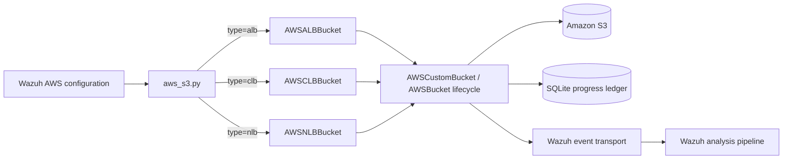
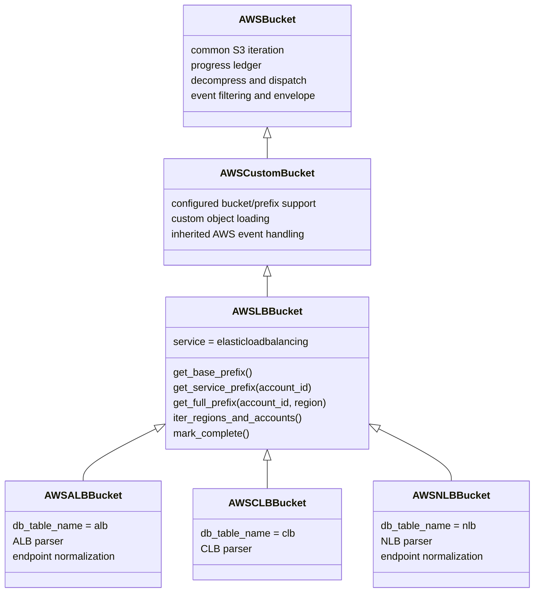
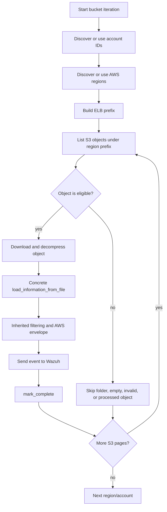
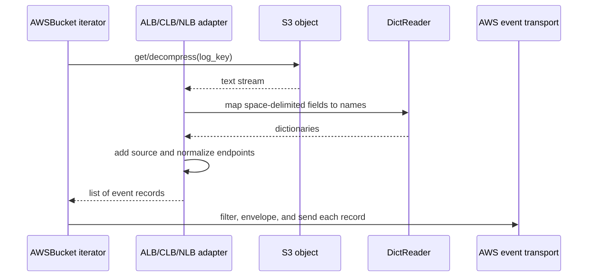
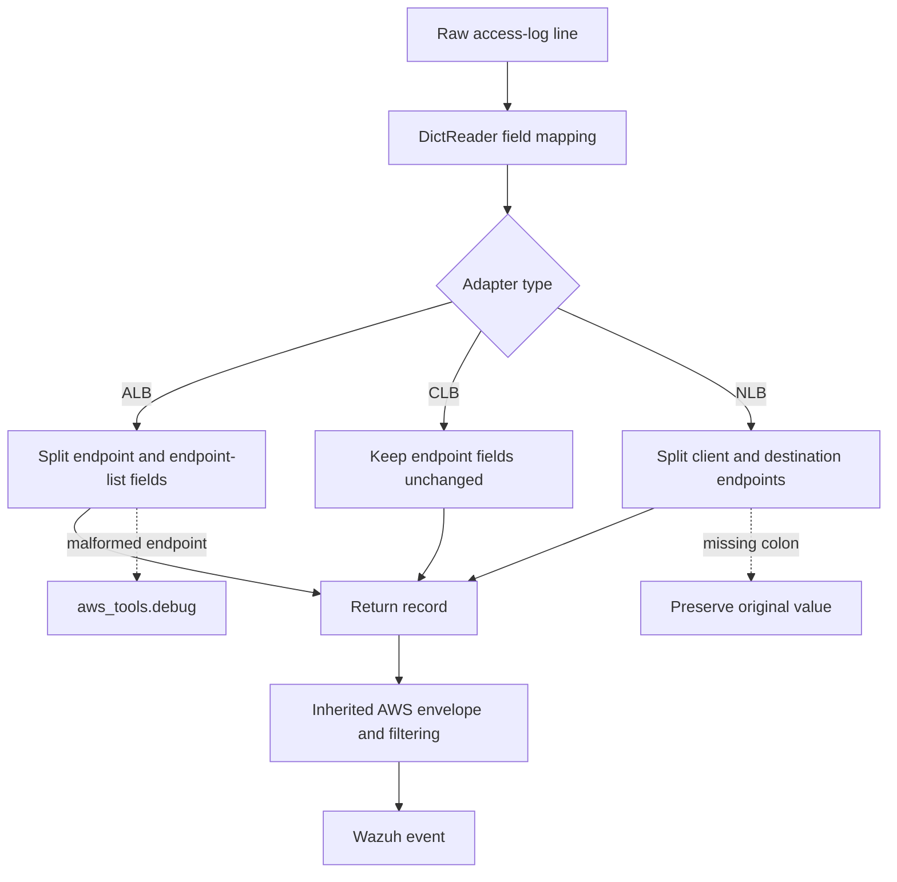

# AWS load balancer bucket adapters

The `load_balancers` module parses AWS Elastic Load Balancing access logs stored in Amazon S3. It provides three adapters—`AWSALBBucket`, `AWSCLBBucket`, and `AWSNLBBucket`—for Application Load Balancers (ALB), Classic Load Balancers (CLB), and Network Load Balancers (NLB).

The module is deliberately narrow: it identifies the standard Elastic Load Balancing S3 layout and converts each space-delimited access-log line into a dictionary. S3 listing, object download/decompression, progress tracking, filtering, Wazuh event wrapping, and delivery are inherited from [`aws_buckets_s3_core.md`](aws_buckets_s3_core.md) and the AWS runtime described in [`aws_core.md`](aws_core.md).

## Position in the AWS ingestion system

The Wazuh AWS entry point selects one of these classes when bucket mode is configured with `alb`, `clb`, or `nlb`. The adapter then participates in the common polling lifecycle.



## Architecture and component relationships

`AWSLBBucket` is the shared load-balancer base. It extends `AWSCustomBucket`, but uses the conventional `AWSLogs/<account>/<service>/<region>/` hierarchy. The concrete classes only select a ledger table and implement their log schema.



### `AWSLBBucket`

The shared base sets `service` to `elasticloadbalancing` and delegates initialization to `AWSCustomBucket`. Its path methods produce:

```text
<prefix>AWSLogs/<suffix><account-id>/elasticloadbalancing/<region>/
```

The exact concatenation of `prefix` and `suffix` is inherited configuration behavior. `iter_regions_and_accounts()` and `mark_complete()` explicitly delegate to `AWSBucket`, preserving the normal account/region discovery and completion semantics. See [`aws_buckets_s3_core.md`](aws_buckets_s3_core.md) for the full lifecycle and ledger rules.

### Concrete adapters

| Adapter | Ledger table | Log format | Additional normalization |
| --- | --- | --- | --- |
| `AWSALBBucket` | `alb` | 29-field ALB access log | Splits client/target endpoint fields into IP and port fields, including endpoint lists. |
| `AWSCLBBucket` | `clb` | 15-field CLB access log | Adds `source: clb`; endpoint fields remain in the source representation. |
| `AWSNLBBucket` | `nlb` | 20-field NLB access log | Splits client and destination endpoint fields into IP and port fields. |

Each parser calls `decompress_file(self.bucket, log_key=log_key)` and reads the returned stream with `csv.DictReader(..., delimiter=' ')`. The delimiter is a literal space because AWS access-log records are space-separated rather than comma-separated CSV.

## Object path and discovery flow

The common iterator supplies the account and region values. `AWSLBBucket` contributes only the prefix construction; it does not list S3 objects itself.



The inherited implementation handles continuation tokens, `only_logs_after`, duplicate suppression, optional object deletion, error policy, and retention. A load-balancer parser should therefore return parsed records and avoid performing transport or ledger operations itself.

## Parsing and data flow



The common inherited envelope adds AWS metadata such as the source object, bucket, account, and region. The adapter’s `source` field identifies the log family inside the payload:

- ALB records use `source: alb`.
- CLB records use `source: clb`.
- NLB records use `source: nlb`.

### ALB parsing

`AWSALBBucket.load_information_from_file()` maps the 29 ALB columns, including request timing, status codes, request metadata, TLS information, target group, trace ID, routing action, redirect URL, and classification fields.

ALB endpoint-bearing fields are normalized through the following mapping:

| Input field | Output transformation |
| --- | --- |
| `client_port` | `client_port` contains port(s); new `client_ip` contains IP address(es). |
| `target_port` | `target_port` contains port(s); new `target_ip` contains IP address(es). |
| `target_port_list` | `target_port_list` contains port(s); new `target_ip_list` contains IP address(es). |

The implementation splits each whitespace-separated `ip:port` item, accumulates IPs and ports independently, and writes space-separated values back to the record. If an item cannot be split, it preserves processing of the remaining records and emits debug messages through `aws_tools.debug()`.

### CLB parsing

`AWSCLBBucket.load_information_from_file()` maps the 15 Classic Load Balancer fields: timestamp, ELB name, client/backend endpoints, processing durations, status codes, byte counts, request, user agent, and TLS metadata. It returns the parsed dictionaries with `source: clb`.

Unlike ALB and NLB, CLB parsing performs no endpoint decomposition. The original `client_port` and `backend_port` values therefore remain available to downstream normalization and indexing.

### NLB parsing

`AWSNLBBucket.load_information_from_file()` maps the 20 Network Load Balancer fields, including record type/version, listener, connection and TLS handshake timings, certificate identifiers, TLS negotiation details, domain name, ALPN data, and client preference list.

NLB endpoint fields are split as follows:

| Input field | New fields |
| --- | --- |
| `client_port` | `client_ip`, `client_port` |
| `destination_port` | `destination_ip`, `destination_port` |

If an endpoint does not contain a colon, the original value is retained in the port field and copied to the corresponding IP field. This fallback keeps malformed or nonstandard records representable instead of discarding the entire object.

## Processing contracts and failure behavior



The parsers use stream context management, so downloaded/decompressed objects are closed when parsing completes. They do not catch decompression or file-read failures; those are handled by the common bucket lifecycle according to `skip_on_error`. ALB endpoint conversion catches `ValueError` and `IndexError` per record, logs diagnostic information, and continues. NLB conversion catches `ValueError` and applies a field-preserving fallback.

## Extension and maintenance guidance

When changing a parser:

1. Keep the field order synchronized with the AWS log specification because `DictReader` receives no header row.
2. Preserve the `source` marker expected by downstream event processing.
3. Keep path construction in `AWSLBBucket`; do not duplicate account, region, or pagination logic in concrete adapters.
4. Treat endpoint normalization as additive where possible so raw information is not lost.
5. Route operational diagnostics through `aws_tools.debug()` and let the common lifecycle apply retry, skip, ledger, and transport policy.

The module is selected by the AWS CLI dispatch table documented in [`aws_core.md`](aws_core.md). The complete S3 adapter family is summarized in [`aws_buckets_s3.md`](aws_buckets_s3.md), while shared S3 behavior belongs in [`aws_buckets_s3_core.md`](aws_buckets_s3_core.md).

## Related documentation

- [`aws_core.md`](aws_core.md) — AWS Wodle entry point and adapter selection.
- [`aws_buckets_s3_core.md`](aws_buckets_s3_core.md) — inherited S3 lifecycle, decompression, event envelopes, idempotency, and error handling.
- [`aws_buckets_s3.md`](aws_buckets_s3.md) — complete S3 adapter hierarchy and processing flow, including sibling server-access and VPC flow-log adapters.
- [`aws_buckets_s3_service_logs.md`](aws_buckets_s3_service_logs.md) — other AWS service-log bucket specializations.
