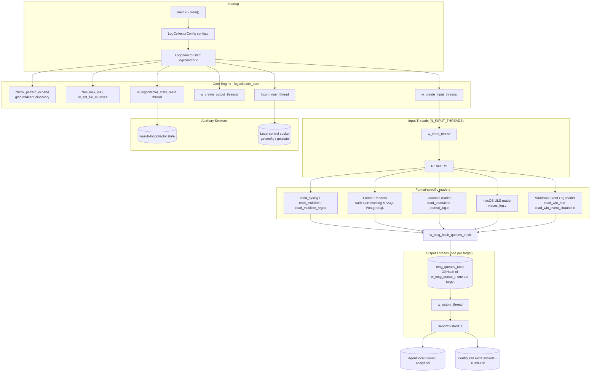
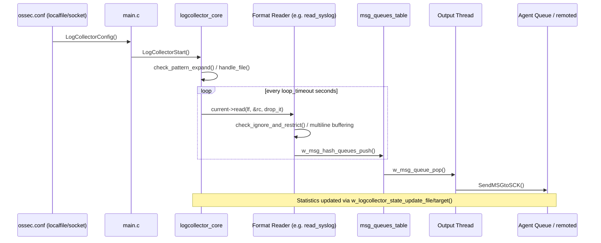

# Logcollector Module

## 1. Purpose and Overview

**Logcollector** is one of the core native daemons of the Wazuh agent/manager (`wazuh-logcollector`). Its responsibility is to **discover, read, parse and forward log data** from a wide variety of sources to the rest of the Wazuh pipeline (local `agent` queue or, on managers, `analysisd`/`remoted`). Sources supported include:

- Plain text files (syslog-style, single or multi-line, with glob/wildcard expansion)
- Structured/semi-structured formats: JSON, Snort full, NMAP grepable, MySQL/MSSQL/PostgreSQL logs, DJB multilog, Audit logs
- Command output (`command` / `full_command`)
- **systemd Journal** (Linux, via `libsystemd` dynamic loading)
- **macOS Unified Logging System** (`log stream` / `log show`)
- **Windows Event Log** (legacy `EventLog` API and modern `EventChannel`/`EvtSubscribe` API)
- External sockets (arbitrary UDP/TCP forwarders configured in `ossec.conf`)

Logcollector is part of the broader **[Agent & Manager Native Daemons (C)](Agent_&_Manager_Native_Daemons_(C).md)** family, sitting alongside `remoted`, `monitord`, `os_auth`, `os_execd` and the shared library (`shared_lib`). It relies heavily on the common C utilities (`OSHash`, `queue_op`, `debug_op`, regex engine) documented in [shared_lib](shared_lib.md) and [os_regex_wrappers](os_regex_wrappers.md) (matching), and forwards its final events through the message-queue primitives described in [shared_lib](shared_lib.md) (`mq_op`) which are also used by `remoted` (see [remoted](remoted.md)) on the receiving side.

## 2. Architecture Overview

Logcollector is a **multi-threaded pipeline**: a pool of *input* threads read from configured sources and push formatted lines into per-target in-memory queues; a pool of *output* threads drain those queues and deliver the messages to the local queue socket or configured secondary sockets.

### Key runtime concepts

| Concept | Description |
|---|---|
| `logreader` / `logreader_glob` | Configuration structures (defined in [Localfile_Config](Localfile_Config.md)) describing each monitored file/command/socket, its target(s), regexes, multiline settings, etc. |
| `files_update_rwlock` | Read/write lock protecting the dynamic list of monitored files while input threads are reading (see `w_input_thread` / periodic file-check loop). |
| `msg_queues_table` | `OSHash` mapping target name → `w_msg_queue_t` (bounded queue). One output thread is spawned per target. |
| `files_status` | `OSHash` persisting per-file read offset + SHA-1 rolling hash, dumped to `queue/logcollector/file_status.json`, so logcollector can resume tailing files after a restart without re-reading or duplicating lines. |
| State snapshot | Global/interval event & byte counters per file/target, exposed via `wazuh-logcollector.state` and the local control socket (see [logcollector_config_state](logcollector_config_state.md)). |

## 3. Sub-modules

Logcollector's code is organized into the following documented sub-modules:

| Sub-module | Documentation | Responsibility |
|---|---|---|
| Core Engine & Threading | [logcollector_core.md](logcollector_core.md) | Daemon entry point, dynamic file discovery (glob expansion), file rotation/inode-change detection, input/output thread pools, per-target message queues, and the file read-offset persistence (`file_status.json`). |
| Configuration & State Reporting | [logcollector_config_state.md](logcollector_config_state.md) | Exposing the active `localfile`/`socket`/internal-options configuration as JSON, and collecting/reporting runtime statistics (events, bytes, drops per file/target) both in memory and on disk (`wazuh-logcollector.state`). |
| Remote/Local Control API | [logcollector_remote_control.md](logcollector_remote_control.md) | Unix-domain socket command dispatcher (`lccom`) used by the `wazuh-control`/API tooling to query current configuration (`getconfig`) and live statistics (`getstate`), including chunking of large JSON payloads (>64 KB). |
| systemd Journal Reader | [logcollector_journald.md](logcollector_journald.md) | Dynamic loading of `libsystemd`, journal cursor/context management, filtering, syslog/JSON entry rendering, rotation detection, and "only future events" bookkeeping for the `journald` log format (Linux only). |
| macOS Unified Logging Reader | [logcollector_macos.md](logcollector_macos.md) | Builds and executes `log stream`/`log show` command lines (predicate/level/type filters), manages the child processes, and persists the last-read timestamp/settings to safely resume log collection (macOS only). |
| Windows Event Log Reader | [logcollector_windows_event_log.md](logcollector_windows_event_log.md) | Legacy `EventLog` polling API (`eventlog` format) and the modern `EvtSubscribe`/bookmark-based `EventChannel` API, including message/description resolution and reconnection logic (Windows only). |
| Structured/Command Format Readers | [logcollector_format_readers.md](logcollector_format_readers.md) | Line-oriented readers for `audit`, DJB `multilog`, MSSQL and PostgreSQL log formats that require multi-line buffering/aggregation before dispatching a single event. |

## 4. End-to-End Data Flow

1. **Configuration parsing** – `LogCollectorConfig()` (in `logcollector_core`) reads `<localfile>`/`<socket>` blocks (structures defined in [Localfile_Config](Localfile_Config.md)) and internal options (`vcheck_files`, `max_lines`, `rlimit_nofile`, etc.).
2. **Discovery & setup** – wildcard entries are expanded (`check_pattern_expand`), sockets/targets are resolved (`set_sockets`), and one queue per target is created (`w_msg_hash_queues_init`/`add_entry`).
3. **Reading** – each `logreader` is assigned a `read` function pointer (syslog, multiline, audit, journald, macOS, Windows EventLog/EventChannel, command, etc.) selected in `set_read()`. Input threads periodically invoke it.
4. **Filtering & framing** – readers apply `ignore`/`restrict` regex lists (`check_ignore_and_restrict`), reassemble multi-line records where required, and hand off the final buffer.
5. **Queueing & delivery** – `w_msg_hash_queues_push()` fan-outs the message to every configured target queue; a dedicated output thread per target performs the actual socket send with automatic queue reconnection.
6. **State & persistence** – every push/send updates the in-memory statistics (`logcollector_config_state`) and, for file-based sources, the SHA-1/offset table used to resume tailing on restart.
7. **Observability** – operators/API can query live configuration and statistics through the local control socket (`logcollector_remote_control`), which also backs the Manager API log-related endpoints (see [manager_module](manager_module.md) `get_log`/`get_log_summary`).

## 5. Relationship to Other Modules

- **[Agent & Manager Native Daemons (C)](Agent_&_Manager_Native_Daemons_(C).md)** — parent module; sibling daemons `remoted` and `monitord` consume/rotate the same message-queue and log infrastructure.
- **[Localfile_Config](Localfile_Config.md)** / **[Global_Config_Core](Global_Config_Core.md)** — define the `logreader`, `logreader_glob`, multiline, macOS and journald filter configuration structures parsed by `LogCollectorConfig()`.
- **[shared_lib](shared_lib.md)** — provides `OSHash`, `w_queue_t`, `debug_op`, `mq_op` (`SendMSGtoSCK`/`StartMQ`) and other primitives used throughout logcollector.
- **[os_regex_wrappers](os_regex_wrappers.md)** / expression utilities — power the `ignore`/`restrict`/multiline regex matching (`w_expression_match`).
- **[os_crypto](Unit_Tests_-_OS_Crypto.md)** SHA-1 routines — used to fingerprint file content for the read-offset persistence.
- **[wazuh_modules_core](wazuh_modules_core.md)** — the parent `wazuh-modulesd` process manages other integrations (e.g. `wm_database`) that share configuration patterns but run independently from logcollector.
- **Manager API** — the `get_log`/`get_log_summary`/`get_configuration` endpoints in [manager_module](manager_module.md) ultimately surface data collected/exposed by `logcollector_remote_control` and `logcollector_config_state`.
