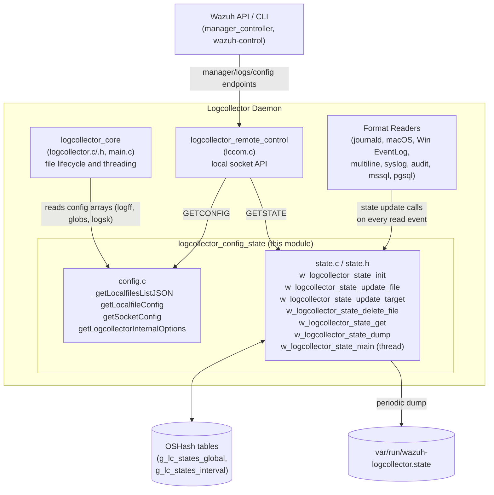
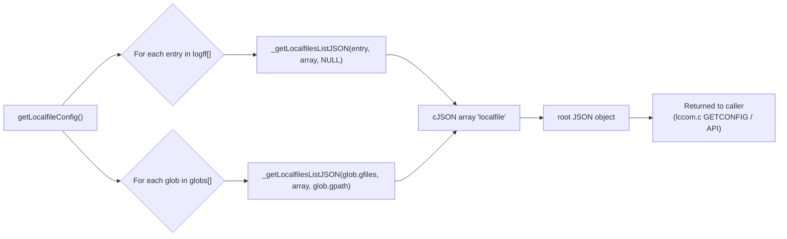
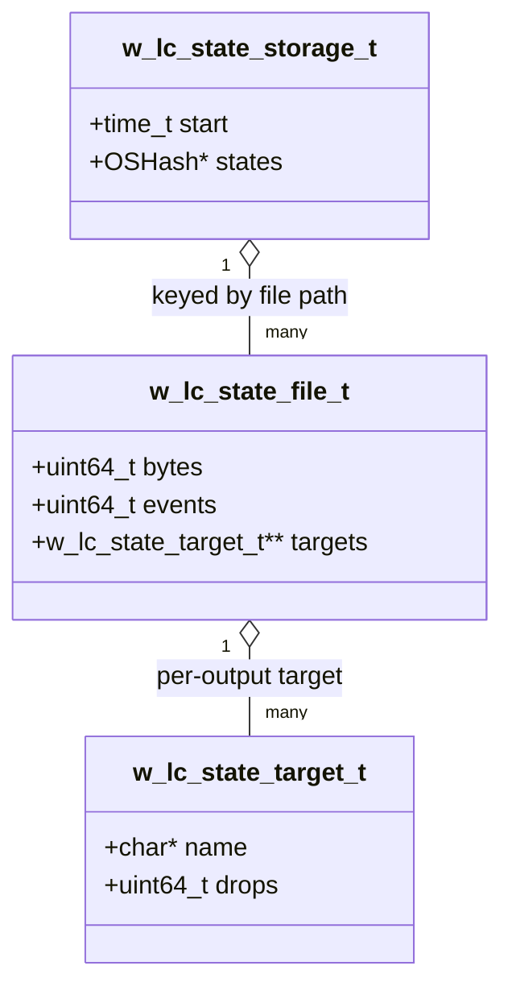
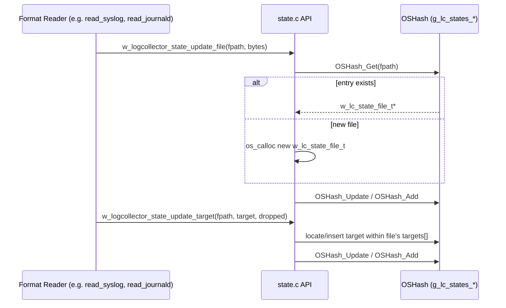
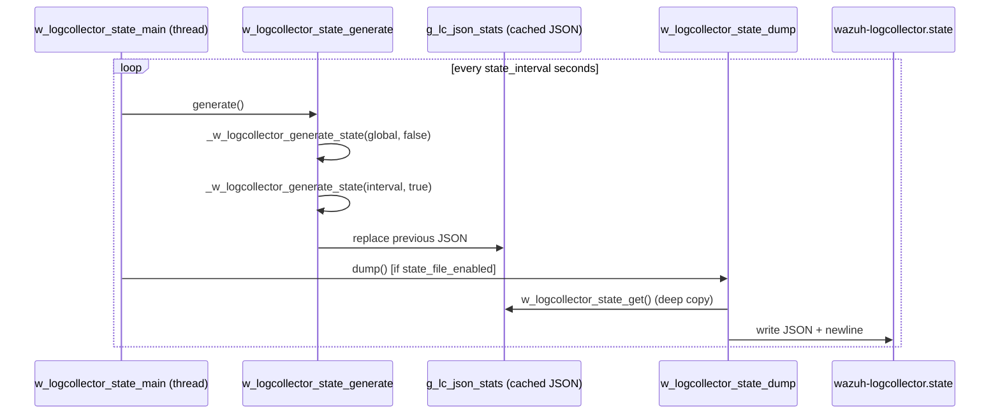
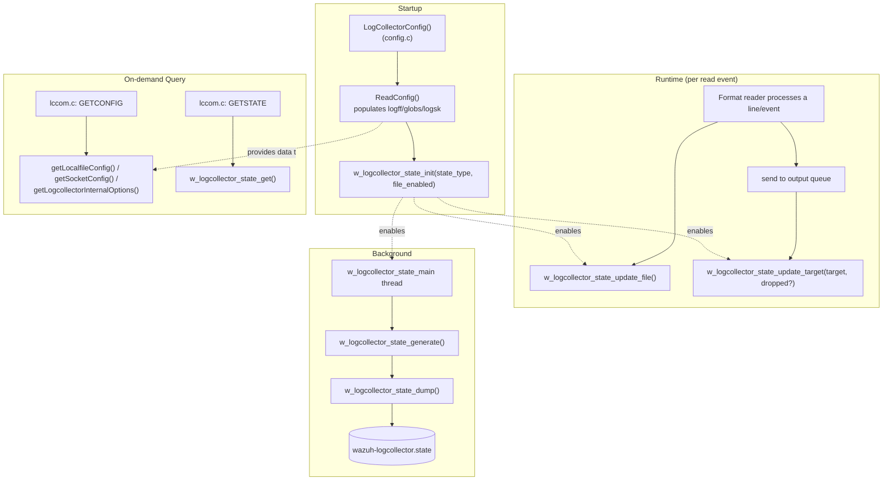

# Logcollector Configuration & State Module

## Introduction

The **`logcollector_config_state`** module is a focused sub-component of the Wazuh **Logcollector** daemon (`src/logcollector/`). It provides two closely related but distinct capabilities that make the Logcollector observable and queryable at runtime:

1. **Configuration serialization** (`config.c`) — converts the in-memory logcollector configuration (parsed `logreader`/`logreader_config` structures) into `cJSON` documents that can be returned by the Wazuh API, the `wazuh-control` CLI, or the local `lccom` socket (`GETCONFIG` command).
2. **Runtime state/statistics tracking** (`state.c`, `state.h`) — maintains live counters (events, bytes, dropped messages) per monitored file/location and per output target, exposes them as JSON (`w_logcollector_state_get`), and periodically persists them to `var/run/wazuh-logcollector.state` for consumption by monitoring/health-check tooling.

Together these components do **not** perform log collection themselves; instead they provide the **introspection layer** on top of the core reading/threading engine, allowing operators and internal tools to answer: *"What is Logcollector configured to monitor?"* and *"How is it performing right now?"*.

This module is a sibling of [logcollector_core](logcollector_core.md) (which owns the actual file-reading engine, thread pool, and daemon lifecycle) and is consumed directly by [logcollector_remote_control](logcollector_remote_control.md) (the `lccom.c` local socket handler that answers `GETCONFIG`/`GETSTATE` requests from other Wazuh components, including the API).

---

## Responsibilities and Scope

| Concern | File(s) | Description |
|---|---|---|
| Configuration → JSON | `config.c` (`_getLocalfilesListJSON`, `getLocalfileConfig`, `getSocketConfig`, `getLogcollectorInternalOptions`) | Walks the global `logff` (localfiles) and `globs` (glob-expanded localfiles) arrays plus the `logsk` (socket outputs) array, producing JSON representations consumed by the API/CLI. |
| Statistics data model | `state.h` (`w_lc_state_file_t`, `w_lc_state_target_t`, `w_lc_state_storage_t`, `w_lc_state_type_t`) | Defines the in-memory structures used to accumulate per-file and per-target counters, backed by an `OSHash` keyed by file path/location. |
| Statistics lifecycle | `state.c` (`w_logcollector_state_init`, `w_logcollector_state_main`, `w_logcollector_state_update_file`, `w_logcollector_state_update_target`, `w_logcollector_state_delete_file`, `w_logcollector_state_get`, `w_logcollector_state_dump`) | Initializes global/interval statistic stores, updates them as events are read, periodically regenerates a JSON snapshot, and optionally dumps it to disk. |

Two independent statistic "modes" are supported simultaneously, controlled by the `w_lc_state_type_t` bitmask:

- **`LC_STATE_GLOBAL`** — cumulative counters since daemon start, never reset, returned directly on demand.
- **`LC_STATE_INTERVAL`** — counters reset every `state_interval` seconds; a background thread (`w_logcollector_state_main`) periodically converts the raw hash-table counters into a cached JSON blob (`g_lc_json_stats`) and optionally writes it to the state file.

---

## Architecture Overview

---

## Component Details

### 1. Configuration Serialization (`config.c`)

The central function is `_getLocalfilesListJSON`, which builds a single JSON object describing one `logreader` entry (a monitored file, command, socket, journal, or Windows-eventchannel source). It is invoked once per entry by `getLocalfileConfig()` for:
- Explicit files (`logff` array), and
- Glob-expanded files (`globs[i].gfiles`, each tagged with its original glob path `gpath`).

Fields serialized include: `file`, `channel`, `logformat`, `command`, `alias`, `query` (macOS `log stream`/`show` predicates), `ignore_binaries`, `age`, `exclude`, `only-future-events` / `max-size`, `target[]`, `out_format[]`, `duplicate`, `labels`, `frequency`, `reconnect_time`, `multiline_regex`, journal `filters`, and regex `ignore`/`restrict` lists.

Two companion functions complete the configuration surface:
- **`getSocketConfig()`** — serializes the `logsk` array (named output sockets with `location`, `mode` tcp/udp, `prefix`).
- **`getLogcollectorInternalOptions()`** — dumps tunable internal options (`remote_commands`, `loop_timeout`, `open_attempts`, `vcheck_files`, `max_lines`, `max_files`, `rlimit_nofile`, `reload_interval`, `state_interval`, etc.) that were parsed via `getDefine_Int` in `LogCollectorConfig` (also in `config.c`, outside the core component list but calling into it).

These JSON builders rely on the `logreader`/`logreader_config`/`logreader_glob` structures defined in [Localfile_Config](Localfile_Config.md) (part of the [Configuration_Data_Structures_(C_Headers)](Configuration_Data_Structures_(C_Headers).md) documentation area), and on regex helper functions and a journal-filter helper from the journald-specific config code.

### 2. Runtime State Tracking (`state.c` / `state.h`)

#### Data Model

Two global instances of `w_lc_state_storage_t` exist:
- `g_lc_states_global` — never reset, active when `LC_STATE_GLOBAL` bit is set.
- `g_lc_states_interval` — reset every generation cycle, active when `LC_STATE_INTERVAL` bit is set.

Both are backed by an `OSHash` (see [shared_lib](Agent_and_Manager_Native_Daemons.md) `hash_op.c`) sized to `LOGCOLLECTOR_STATE_FILES_MAX` (40) buckets, keyed by the monitored file path or `location` value.

#### Update Path

Reader implementations across the daemon (see [logcollector_core](logcollector_core.md) threading code and the various format readers) call two public entry points on every processed line/event:

- `w_logcollector_state_update_file(fpath, bytes)` — increments `events`/`bytes` for the file (macro `w_logcollector_state_add_file(x)` calls this with `bytes = 0` just to register the file).
- `w_logcollector_state_update_target(fpath, target, dropped)` — records (and optionally increments the drop counter for) a specific output target under that file (macro `w_logcollector_state_add_target(x, y)`).
- `w_logcollector_state_delete_file(fpath)` — removes a file's entry entirely (called when a monitored file stops being tracked, e.g. it is rotated away, excluded, or its glob no longer matches).

All raw counter mutations are protected by `g_lc_raw_stats_mutex` and applied to **both** the global and interval stores (if enabled) in the same call, ensuring consistency between the two views.

#### Periodic Generation and Persistence

`w_logcollector_state_main` is spawned as a dedicated thread (started by [logcollector_core](logcollector_core.md)'s daemon lifecycle) with the configured `state_interval` (seconds). On each wake-up it:

1. Calls `w_logcollector_state_generate()`, which locks both mutexes, discards the previous cached JSON (`g_lc_json_stats`), and rebuilds it by calling the internal `_w_logcollector_generate_state()` once per active state type (`global`/`interval`). For the interval state, `restart=true` causes byte/event/drop counters to be reset and the `start` timestamp refreshed after being read.
2. If `g_lc_state_file_enabled`, calls `w_logcollector_state_dump()`, which serializes the *current* combined JSON (via `w_logcollector_state_get()`), appends a trailing newline, and atomically writes it to `LOGCOLLECTOR_STATE` (`var/run/wazuh-logcollector.state` on POSIX, `wazuh-logcollector.state` on Windows).

#### External Read Access

`w_logcollector_state_get()` is the read-only accessor used by external callers (primarily [logcollector_remote_control](logcollector_remote_control.md)'s `lccom.c`, which serves the `GETSTATE` local-socket command consumed by the Wazuh API's manager endpoints). Behavior depends on which state types are enabled:

- If `LC_STATE_INTERVAL` is enabled, it returns a deep copy (`cJSON_Duplicate`) of the cached `g_lc_json_stats` (cheap, avoids recomputation on every query).
- Otherwise, if only `LC_STATE_GLOBAL` is enabled, it computes a fresh snapshot on demand by calling `_w_logcollector_generate_state(g_lc_states_global, false)` directly under the raw-stats mutex.

---

## Data Flow: End-to-End

---

## Relationship to Other Modules

| Related Module | Relationship |
|---|---|
| [logcollector_core](logcollector_core.md) | Owns the daemon lifecycle (`main.c`), the reading/threading engine, and the `logreader`/`os_file_status_t` structures whose contents are serialized by this module and whose read events feed this module's counters. |
| [logcollector_remote_control](logcollector_remote_control.md) | `lccom.c` is the primary consumer: it exposes `GETCONFIG` (calls into `config.c`) and `GETSTATE` (calls into `state.c`) as local Unix-socket commands, which are in turn invoked by the Wazuh API (`manager_controller.py` → `framework/wazuh/manager.py`) and the `wazuh-control`/CLI tooling. |
| [Configuration_Data_Structures_(C_Headers)](Configuration_Data_Structures_(C_Headers).md) → [Localfile_Config](Localfile_Config.md) | Defines the `logreader`, `logreader_config`, `logreader_glob`, `outformat`, `w_journal_log_config_t`, and `w_multiline_config_t` structures consumed by `_getLocalfilesListJSON`. |
| [logcollector_journald](logcollector_journald.md), [logcollector_macos](logcollector_macos.md), [logcollector_windows_event_log](logcollector_windows_event_log.md), [logcollector_format_readers](logcollector_format_readers.md) | These reader implementations are the primary *producers* of state updates via `w_logcollector_state_update_file`/`w_logcollector_state_update_target`, and their journald-specific filter configuration is rendered as JSON by `_getLocalfilesListJSON`. |
| [Agent_and_Manager_Native_Daemons](Agent_and_Manager_Native_Daemons.md) → `shared_lib` | Provides the underlying `OSHash` implementation (`hash_op.c`) used for both state stores, and `cJSON` utilities used throughout. |
| API_and_Management_Framework (`manager_module`) | `framework/wazuh/manager.py::ossec_log`, `get_config`, and related manager-controller endpoints ultimately retrieve logcollector configuration/state data through the `lccom` socket path described above. |

---

## Key Design Notes

- **Dual granularity statistics**: Supporting both a never-reset "global" counter and a periodically-reset "interval" counter in the same code path lets operators query both long-term totals and short-term throughput without running two separate collection systems.
- **Lock discipline**: `g_lc_raw_stats_mutex` protects the raw `OSHash` tables (write path, high frequency, called from every reader thread), while `g_lc_json_stats_mutex` protects only the cached JSON snapshot (read path via `GETSTATE`, low frequency). This separation avoids blocking the hot update path (per-event I/O) on JSON serialization/query.
- **Resilience to hash update failures**: Both `_w_logcollector_state_update_file` and `_w_logcollector_state_update_target` handle the `OSHash_Update`/`OSHash_Add` race pattern (update first, fallback to add) and free the newly-allocated structure with a `merror` log if both fail, preventing memory leaks on the rare failure path.
- **JSON is the universal interchange format**: Both configuration and state expose their data exclusively as `cJSON` trees, matching the JSON-based protocol used across the `lccom.c` socket interface and the Wazuh API layer — no separate serialization format needs to be maintained.
- **Config vs. State separation of concerns**: `config.c` is purely a *reader* of static, already-parsed configuration structures (no mutation), whereas `state.c` owns dynamic, mutable, concurrently-accessed data — the two files intentionally have very different concurrency profiles despite living in the same logical module.
