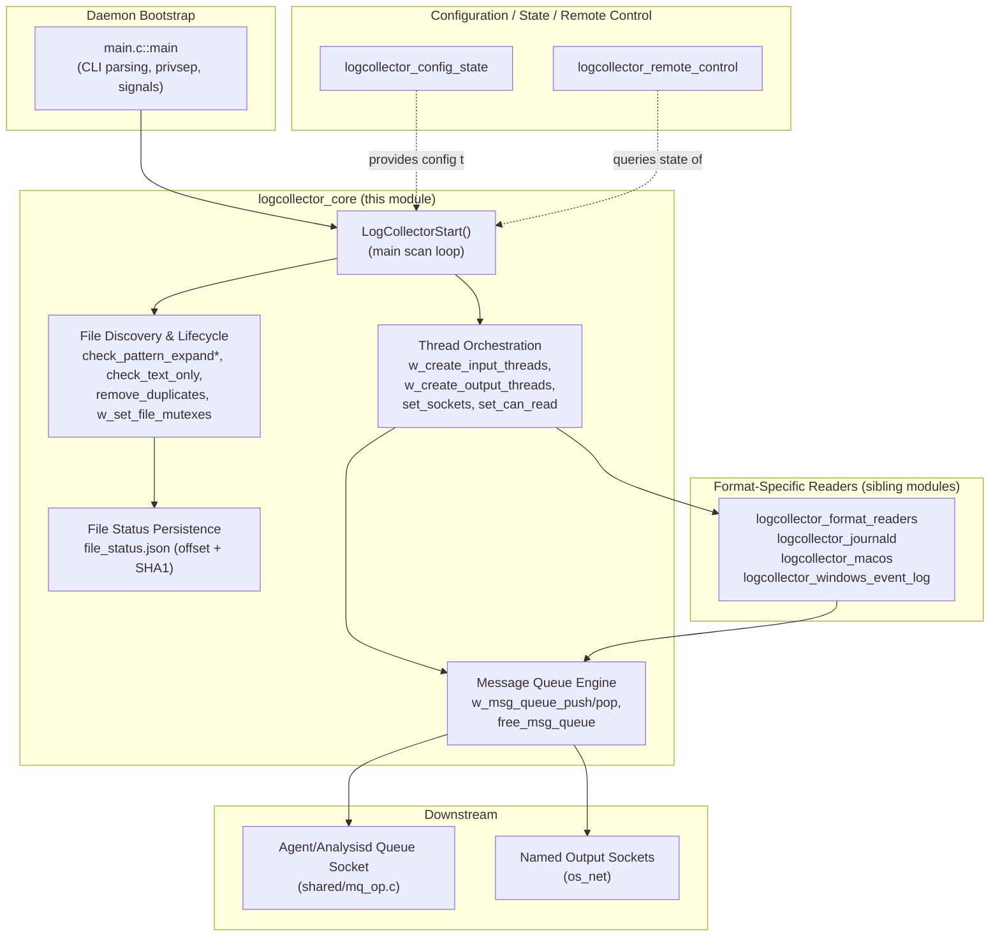
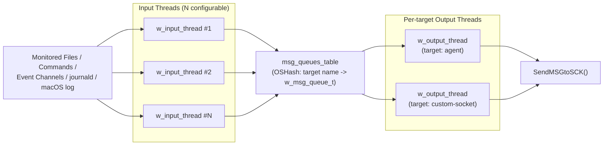
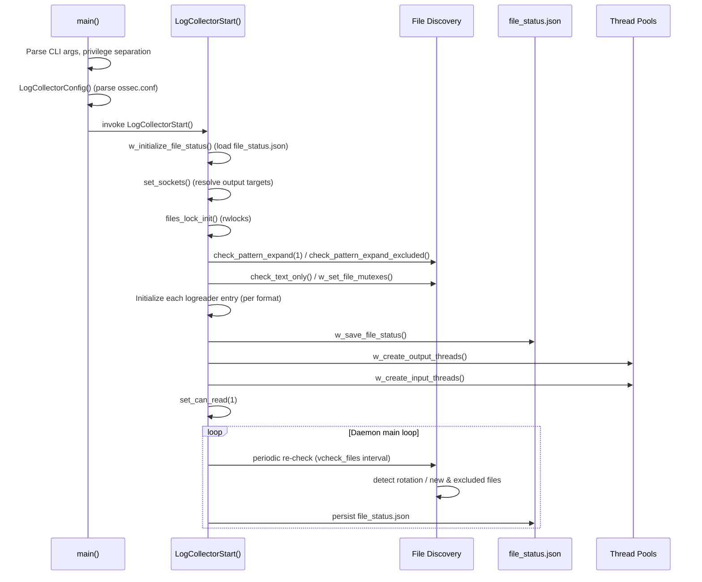

# Logcollector Core Module

## 1. Introduction and Purpose

The **Logcollector Core** module is the heart of the Wazuh **wazuh-logcollector** daemon — the agent/manager
component responsible for continuously monitoring configured log sources (files, commands, Windows Event
Log, journald, macOS Unified Logging System, etc.), reading new log lines/events as they appear, and
forwarding them to the rest of the Wazuh pipeline (`wazuh-analysisd` on a manager, or the agent buffer that
relays to the manager) for further processing.

This specific module (`logcollector_core`) contains the **daemon bootstrap** and the **generic file/thread
orchestration engine** that every other logcollector sub-module (config parsing, remote control, journald
reader, macOS reader, Windows Event Channel reader, format-specific readers) plugs into. It does **not**
implement the parsing logic for any specific log format — that responsibility lives in sibling modules
(see [Related Modules](#5-related-modules) below). Instead, it provides:

- Daemon startup, privilege separation and signal handling (`main.c`).
- The core scan loop that discovers files (including wildcard/glob patterns), opens/reopens them,
  detects rotation/truncation, and dispatches read operations across a configurable pool of worker
  threads.
- The **file status persistence** mechanism (`file_status.json`) that allows logcollector to resume
  reading from the last known position/hash after a restart.
- The **producer/consumer message queue** infrastructure that decouples "reading a log line" from
  "sending it to a destination socket" (agent queue or a named output socket).

## 2. Architecture Overview

### 2.1 High-Level Component Diagram

### 2.2 Runtime Threading Model

### 2.3 Process Flow — Startup Sequence

## 3. Sub-Modules

This module is organized into three internally-cohesive areas, each documented in its own file:

| Sub-module | Responsibility | Documentation |
|---|---|---|
| **Daemon Lifecycle** | CLI parsing, privilege separation, resource limits, signal setup, and delegating to the main collection loop. | [logcollector_core_daemon_lifecycle.md](logcollector_core_daemon_lifecycle.md) |
| **File Discovery & Lifecycle Management** | Glob/wildcard expansion, exclusion handling, binary/text detection, duplicate removal, per-file mutex setup, and the persisted `file_status.json` read-position/hash tracking. | [logcollector_core_file_lifecycle.md](logcollector_core_file_lifecycle.md) |
| **Threading & Message Queue Orchestration** | Creation and management of the input/output thread pools, the `msg_queues_table` hash of per-target queues, and the socket-target resolution logic. | [logcollector_core_threading.md](logcollector_core_threading.md) |

## 4. Key Data Structures (`logcollector.h`)

| Structure | Purpose |
|---|---|
| `os_file_status_t` | Tracks last-read offset and a rolling SHA1 hash context per monitored file, enabling safe resume after restart/rotation. |
| `w_msg_queue_t` | A bounded queue (`w_queue_t`) plus mutex/condvar pair, one instance per output target (e.g., `agent`, or a custom socket name). |
| `w_message_t` | A single in-flight log message carrying its buffer, originating file, size, target socket and queue type flag. |
| `w_input_range_t` | Defines the `[start_i, start_j] .. [end_i, end_j]` range of `logreader`/`logreader_glob` entries assigned to a given input thread. |

These structures are shared across all three sub-modules and are detailed further in
[logcollector_core_file_lifecycle.md](logcollector_core_file_lifecycle.md) and
[logcollector_core_threading.md](logcollector_core_threading.md).

## 5. Related Modules

The `logcollector_core` module depends on and is extended by several sibling modules within the broader
**Agent & Manager Native Daemons (C)** module family:

- [logcollector_config_state.md](logcollector_config_state.md) — configuration parsing (`config.c`) and
  the periodic state-reporting subsystem (`state.c`) consumed by `w_logcollector_state_*` calls used
  throughout this module.
- [logcollector_remote_control.md](logcollector_remote_control.md) — the `lccom` remote-command socket
  handler used to query logcollector's live state and configuration (started from `LogCollectorStart()`
  via `lccom_main`).
- [logcollector_journald.md](logcollector_journald.md) — journald-specific reading logic invoked from the
  generic input thread (`read_journald`) when `logformat` is `journald`.
- [logcollector_macos.md](logcollector_macos.md) — macOS Unified Logging System reading logic
  (`read_macos`), including process lifecycle management released via
  `w_macos_release_log_execution()`.
- [logcollector_windows_event_log.md](logcollector_windows_event_log.md) — legacy Event Log and modern
  Event Channel readers used on Windows builds.
- [logcollector_format_readers.md](logcollector_format_readers.md) — format-specific line readers (Audit,
  DJB multilog, MSSQL, PostgreSQL) invoked via the `logreader.read` function pointer configured in
  `set_read()`.
- [shared_lib.md](shared_lib.md) — shared OS abstraction primitives (`OSHash`, `rwlock_op`, `queue_op`,
  `mq_op`, `file_op`) used pervasively by this module for hashing, locking, queueing and socket I/O.

## 6. Cross-Cutting Concerns

- **Thread-safety**: File-list mutation (adding/removing monitored files due to glob expansion or
  exclusion) is protected by `files_update_rwlock`, taken in write mode whenever the file list changes and
  in read mode by each input thread while scanning. A separate `can_read_rwlock` gates whether input
  threads are currently allowed to read (used to pause readers during file-list maintenance).
- **Resilience**: File rotation, truncation, and deletion are detected each `vcheck_files` interval by
  comparing inode/device and size against previously recorded values, triggering `handle_file()` reopen
  logic and state cleanup (`OSHash_Delete_ex` on `files_status`).
- **State persistence**: `file_status.json` (or platform-appropriate path) is loaded at startup and
  saved both periodically and at process exit (`atexit(w_save_file_status)`), guarding against duplicate
  or lost log lines across restarts.
