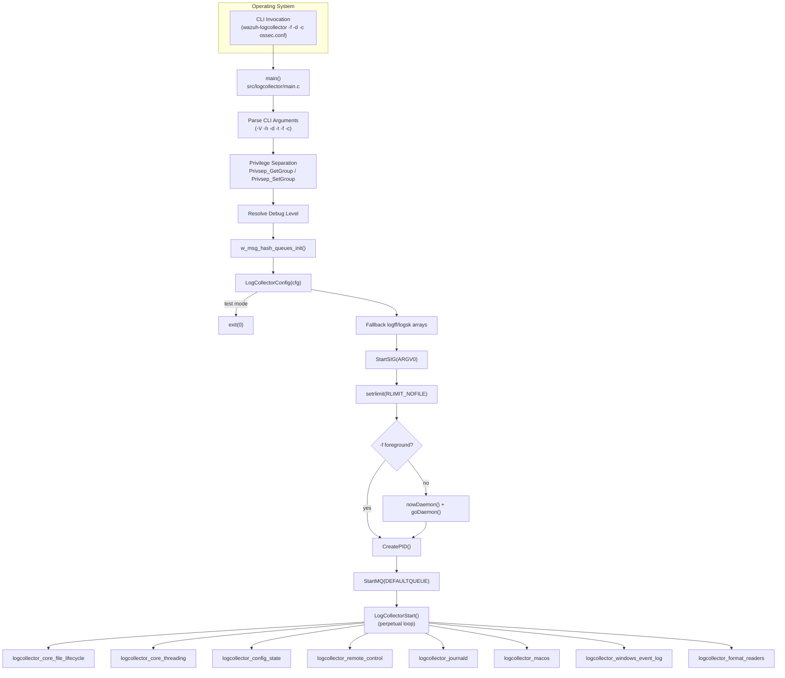
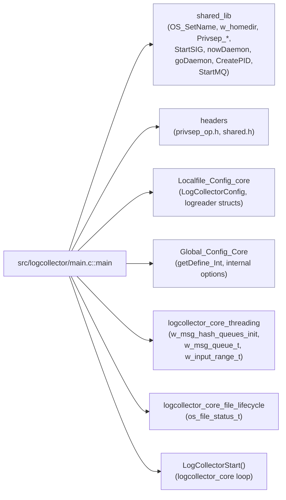
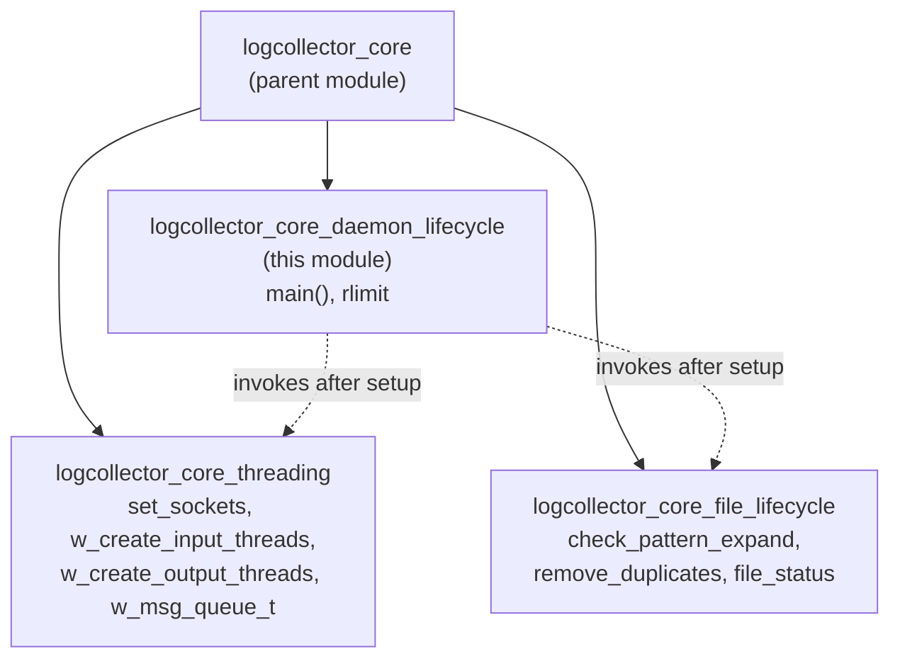
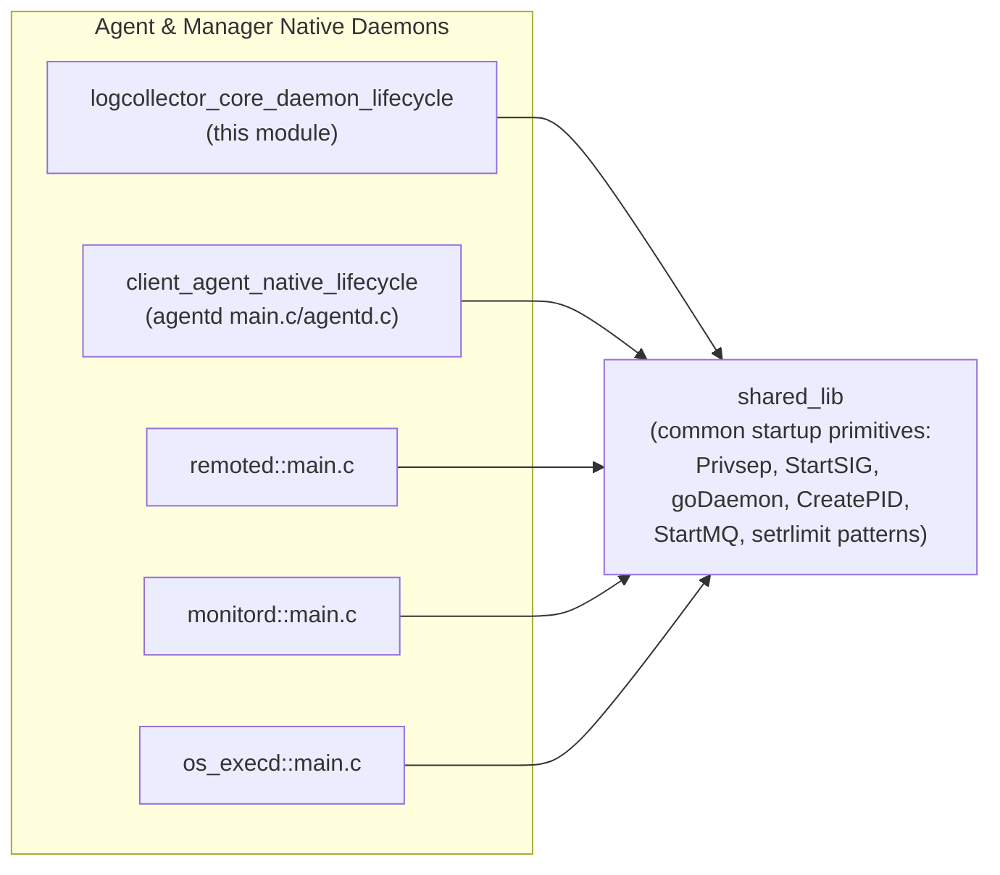

# Logcollector Core – Daemon Lifecycle

## Introduction

The **`logcollector_core_daemon_lifecycle`** module is the entry point of the **Wazuh Logcollector** daemon (`wazuh-logcollector`). It contains the `main()` function found in `src/logcollector/main.c`, which is responsible for bootstrapping the entire log-collection subsystem: parsing command-line arguments, dropping privileges, loading configuration, preparing runtime resources (file descriptor limits, message queues, PID files), forking into the background, and finally handing control over to the long-running `LogCollectorStart()` loop implemented in the [logcollector_core_file_lifecycle](logcollector_core_file_lifecycle.md) and [logcollector_core_threading](logcollector_core_threading.md) modules.

This module is intentionally thin — it does not contain business logic for reading files, parsing logs, or managing worker threads. Instead, it orchestrates the *startup sequence* that every other logcollector component depends on. Understanding this module is the natural starting point for understanding how the logcollector daemon as a whole comes to life, and how it fits into the broader **Agent & Manager Native Daemons (C)** family of processes (`agentd`, `remoted`, `monitord`, `wazuh-modulesd`, etc.), which all follow a very similar daemon-lifecycle pattern.

---

## Purpose and Core Functionality

The core components of this module are:

| Component | File | Responsibility |
|---|---|---|
| `main` | `src/logcollector/main.c` | Daemon entry point: CLI parsing, privilege separation, configuration loading, resource limit setup, daemonization, PID file creation, message queue connection, and delegation to the main collector loop. |
| `rlimit` (usage) | `src/logcollector/main.c` | Local `struct rlimit` instance used to raise/set the maximum number of open file descriptors (`RLIMIT_NOFILE`) before entering the daemon loop, since logcollector may need to keep many log files open simultaneously. |

### Key responsibilities performed by `main()`

1. **Process naming & working directory** — Calls `OS_SetName` and `w_homedir` to establish the Wazuh home directory and `chdir` into it.
2. **Command-line argument parsing** — Supports `-V` (version), `-h` (help), `-d` (debug, repeatable), `-t` (test configuration), `-f` (run in foreground), `-c <config>` (alternate config file).
3. **Privilege separation** — Resolves the `ossec`/`wazuh` group via `Privsep_GetGroup` and drops group privileges with `Privsep_SetGroup`, using the shared privilege-separation primitives common to all native daemons (see [shared_lib](shared_lib.md)).
4. **Debug level resolution** — Merges CLI-specified debug flags with the `logcollector.debug` internal option (`getDefine_Int`), which is backed by the global configuration parsing in [Global_Config_Core](Global_Config_Core.md).
5. **Message queue subsystem initialization** — Calls `w_msg_hash_queues_init()`, which initializes the internal hashed queue infrastructure consumed by the [logcollector_core_threading](logcollector_core_threading.md) module (`w_msg_queue_t`, `w_input_range_t`) used to pass log messages between reader and output threads.
6. **Configuration loading** — Invokes `LogCollectorConfig(cfg)`, which parses `ossec.conf`/`agent.conf` `<localfile>` blocks into the `logreader`/`logreader_config` structures defined in [Localfile_Config_core](Localfile_Config_core.md). If `-t` (test mode) was specified, the daemon exits immediately after a successful parse.
7. **Default fallbacks** — If no files (`logff`) or no output sockets (`logsk`) were configured, minimal placeholder arrays are allocated so that the rest of the codebase can safely assume non-NULL arrays terminated by a NULL/zeroed sentinel entry.
8. **Signal handling setup** — Calls `StartSIG(ARGV0)`, wiring up the shared signal handling routines from `src/shared/sig_op.c` (see [shared_lib](shared_lib.md)) that are common to every Wazuh native daemon.
9. **Resource limits** — Builds a `struct rlimit` from the internal `nofile` option and calls `setrlimit(RLIMIT_NOFILE, ...)` to raise the maximum number of file descriptors the process may open — critical because logcollector may monitor hundreds of files concurrently.
10. **Daemonization** — Unless `-f` (foreground) was given, calls `nowDaemon()` + `goDaemon()` (from `src/shared/file_op.c`, see [shared_lib](shared_lib.md)) to fork into the background.
11. **PID file creation** — Calls `CreatePID(ARGV0, getpid())` so that process-management tools (`wazuh-control`) can track the daemon.
12. **Queue connection** — Connects to the Wazuh internal analysis queue (`DEFAULTQUEUE`) via `StartMQ`, retrying indefinitely (`INFINITE_OPENQ_ATTEMPTS`).
13. **Main loop hand-off** — Finally calls `LogCollectorStart()`, transferring control to the perpetual read/monitor loop implemented in sibling modules ([logcollector_core_file_lifecycle](logcollector_core_file_lifecycle.md), [logcollector_core_threading](logcollector_core_threading.md), [logcollector_config_state](logcollector_config_state.md), [logcollector_remote_control](logcollector_remote_control.md), [logcollector_journald](logcollector_journald.md), [logcollector_macos](logcollector_macos.md), [logcollector_windows_event_log](logcollector_windows_event_log.md), [logcollector_format_readers](logcollector_format_readers.md)).

### Key data structures referenced during startup

While `main()` itself is procedural, it prepares/consumes structures owned by sibling modules:

- **`w_msg_queue_t`** (`logcollector.h`, owned by [logcollector_core_threading](logcollector_core_threading.md)) — a mutex/condition-variable protected queue used by the reader/writer threads; created indirectly by `w_msg_hash_queues_init()`.
- **`w_input_range_t`** (`logcollector.h`) — describes byte ranges consumed by multi-line/threaded readers, part of the threading subsystem initialized at startup.
- **`os_file_status_t` / `file_status`** (`logcollector.h`, owned by [logcollector_core_file_lifecycle](logcollector_core_file_lifecycle.md)) — tracks per-file read offset and SHA1 hash context; populated once `LogCollectorConfig` has parsed the `<localfile>` entries that `main()` loads.

---

## Architecture Overview



---

## Dependency Diagram



---

## Process Flow: Startup Sequence

```mermaid
sequenceDiagram
    participant OS as Operating System
    participant Main as main()
    participant Priv as Privsep
    participant Cfg as LogCollectorConfig
    participant Sig as StartSIG
    participant Daemon as goDaemon
    participant PID as CreatePID
    participant MQ as StartMQ
    participant Loop as LogCollectorStart

    OS->>Main: exec wazuh-logcollector [flags]
    Main->>Main: OS_SetName / w_homedir / chdir
    Main->>Main: getopt parse (-V -h -d -t -f -c)
    Main->>Priv: Privsep_GetGroup(GROUPGLOBAL)
    Priv-->>Main: gid
    Main->>Priv: Privsep_SetGroup(gid)
    Main->>Main: resolve debug level
    Main->>Main: w_msg_hash_queues_init()
    Main->>Cfg: LogCollectorConfig(cfg)
    Cfg-->>Main: logff[] / logsk[] populated
    alt test_config (-t)
        Main->>OS: exit(0)
    else normal execution
        Main->>Sig: StartSIG(ARGV0)
        Main->>Main: setrlimit(RLIMIT_NOFILE)
        alt not foreground (-f absent)
            Main->>Daemon: nowDaemon() + goDaemon()
        end
        Main->>PID: CreatePID(ARGV0, getpid())
        Main->>MQ: StartMQ(DEFAULTQUEUE, WRITE)
        MQ-->>Main: logr_queue fd
        Main->>Loop: LogCollectorStart()
        Note over Loop: Runs indefinitely,<br/>coordinating file monitoring,<br/>threading, and output.
    end
```

---

## Component Interaction within Logcollector

The daemon lifecycle module sits at the top of the `logcollector_core` hierarchy and is a sibling to two other specialized modules that share the same parent (`logcollector_core`):



- **`logcollector_core_daemon_lifecycle`** (this module) performs one-time startup work and then calls `LogCollectorStart()`.
- **`logcollector_core_file_lifecycle`** ([doc](logcollector_core_file_lifecycle.md)) manages the per-file bookkeeping (`os_file_status_t`, pattern expansion, duplicate detection) that is used once the loop is running.
- **`logcollector_core_threading`** ([doc](logcollector_core_threading.md)) manages the input/output thread pools and the `w_msg_queue_t` message queues initialized indirectly by `w_msg_hash_queues_init()` in `main()`.

Other logcollector siblings consumed indirectly through the main loop:

- [logcollector_config_state](logcollector_config_state.md) — configuration parsing (`config.c`) and runtime state reporting (`state.c`).
- [logcollector_remote_control](logcollector_remote_control.md) — remote command dispatch (`lccom.c`) for `wazuh-control`/API queries.
- [logcollector_journald](logcollector_journald.md), [logcollector_macos](logcollector_macos.md), [logcollector_windows_event_log](logcollector_windows_event_log.md), [logcollector_format_readers](logcollector_format_readers.md) — platform/format-specific log readers invoked by the threading subsystem once the daemon is running.

---

## Relationship to the Broader System

Logcollector is one of several native daemons under **Agent & Manager Native Daemons (C)**. All of these daemons (`agentd`/`client_agent_native`, `remoted`, `monitord`, `os_execd`, `os_auth`) follow a nearly identical startup pattern implemented in their own respective `main.c` files:



Because `main()` relies heavily on the common daemon utilities in [shared_lib](shared_lib.md) (privilege separation, signal handling, daemonization, PID management, message queue helpers), any change to those shared primitives can affect the logcollector startup path as well as every other native daemon. Similarly, configuration parsing depends on [Localfile_Config_core](Localfile_Config_core.md) (`logreader`, `logreader_config`) from **Configuration Data Structures (C Headers)**, and the internal options mechanism depends on [Global_Config_Core](Global_Config_Core.md).

At runtime, log events produced by the collector loop are forwarded through the connected message queue (`logr_queue`) toward `wazuh-analysisd`/the engine, conceptually equivalent to the higher-level message-queue abstractions used at the Python framework layer (see [framework_core_communication_queue](framework_core_communication_queue.md)) and in the C++ shared modules layer (see [Queue](Queue.md)) — though logcollector itself operates purely in native C using `src/shared/mq_op.c` (`StartMQ`).

---

## Command-Line Interface Summary

| Flag | Description |
|---|---|
| `-V` | Print version and license information, then exit. |
| `-h` | Print help message, then exit. |
| `-d` | Increase debug verbosity (repeatable). |
| `-t` | Test configuration only; parses `ossec.conf` and exits without starting the daemon loop. |
| `-f` | Run in the foreground instead of daemonizing. |
| `-c <config>` | Use an alternate configuration file instead of the default `OSSECCONF`. |

---

## Error Handling

`main()` uses the shared `merror_exit` / `mlerror_exit` macros (from [shared_lib](shared_lib.md)) to fail fast on unrecoverable conditions:

- Invalid/unavailable home directory (`CHDIR_ERROR`)
- Invalid privilege-separation group (`USER_ERROR`, `SETGID_ERROR`)
- Configuration parse errors (`CONFIG_ERROR`)
- PID file creation failure (`PID_ERROR`)
- Message queue connection failure (`QUEUE_FATAL`)

Non-fatal issues, such as failure to raise the file-descriptor limit via `setrlimit`, are logged as warnings (`merror`) without terminating the process, allowing logcollector to continue operating with the OS-default limit.

---

## Related Documentation

- [logcollector_core_file_lifecycle.md](logcollector_core_file_lifecycle.md) — per-file monitoring state and pattern-matching logic used after startup.
- [logcollector_core_threading.md](logcollector_core_threading.md) — input/output thread pool management and message queues initialized by this module.
- [logcollector_config_state.md](logcollector_config_state.md) — configuration parsing and runtime state reporting.
- [logcollector_remote_control.md](logcollector_remote_control.md) — remote query/command handling via `lccom.c`.
- [logcollector_journald.md](logcollector_journald.md), [logcollector_macos.md](logcollector_macos.md), [logcollector_windows_event_log.md](logcollector_windows_event_log.md), [logcollector_format_readers.md](logcollector_format_readers.md) — platform/format-specific readers driven by the main loop.
- [shared_lib.md](shared_lib.md) — common daemon utilities (privilege separation, signaling, daemonization, PID files, message queues) used by all native daemons.
- [Localfile_Config_core.md](Localfile_Config_core.md) — `<localfile>` configuration data structures parsed by `LogCollectorConfig`.
- [Global_Config_Core.md](Global_Config_Core.md) — internal options (`getDefine_Int`) and global configuration primitives.
- [client_agent_native_lifecycle.md](client_agent_native_lifecycle.md), [remoted.md](remoted.md), [monitord.md](monitord.md) — sibling native daemons with analogous startup lifecycles.
- [framework_core_communication_queue.md](framework_core_communication_queue.md), [Queue.md](Queue.md) — higher-level (Python/C++) analogs of the message-queue mechanism used here.
