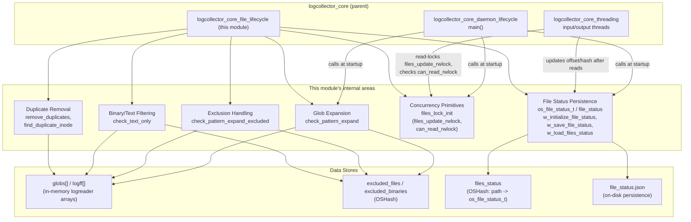
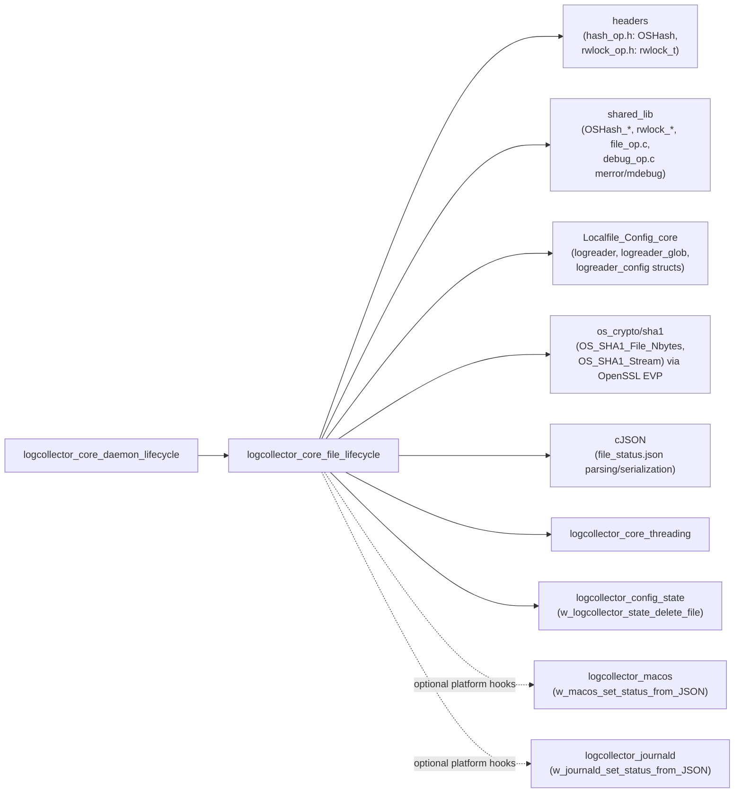
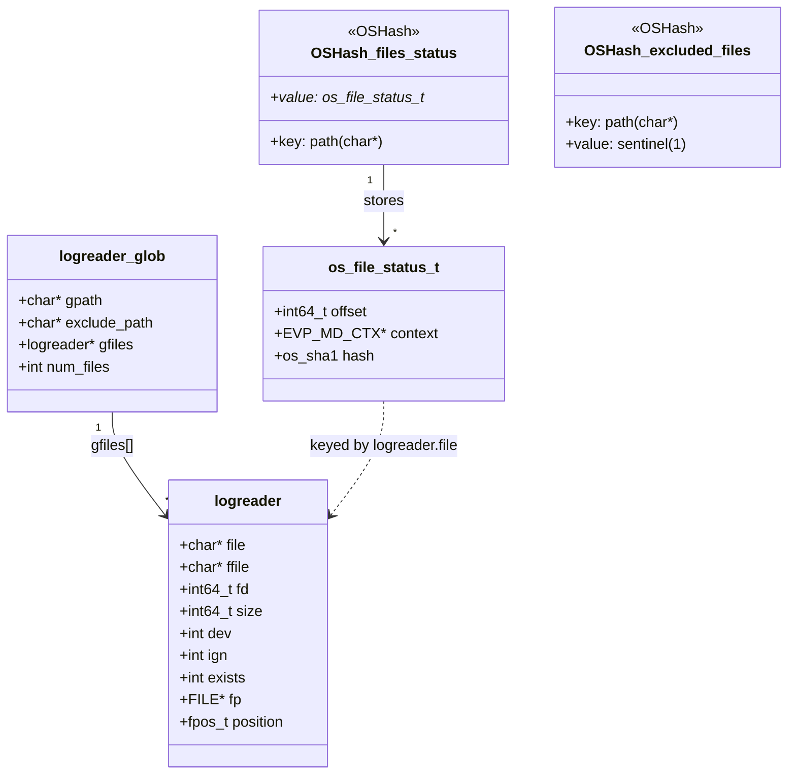
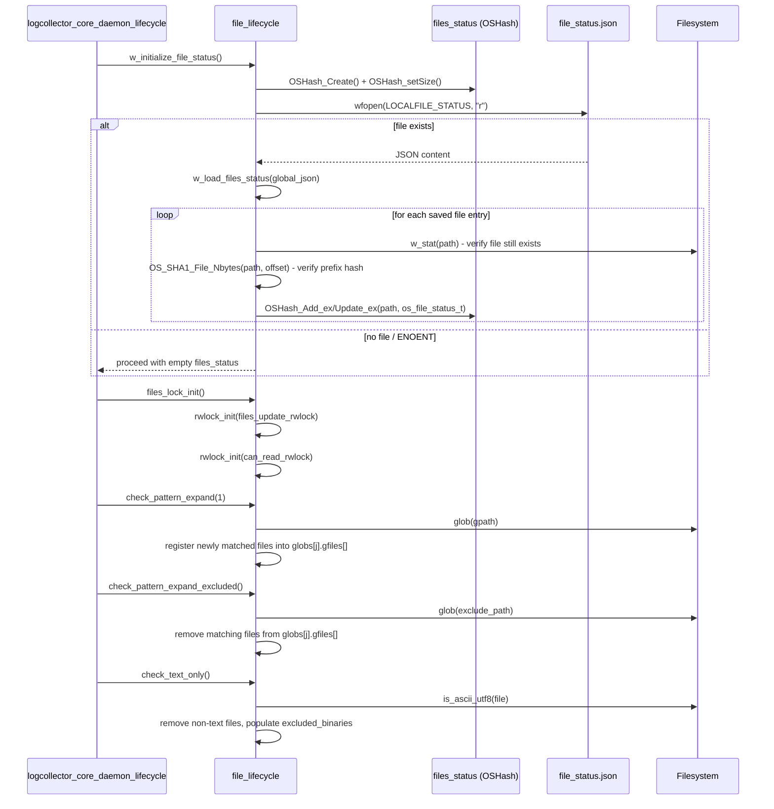
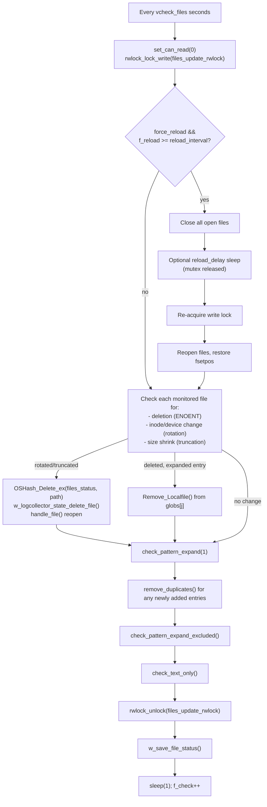
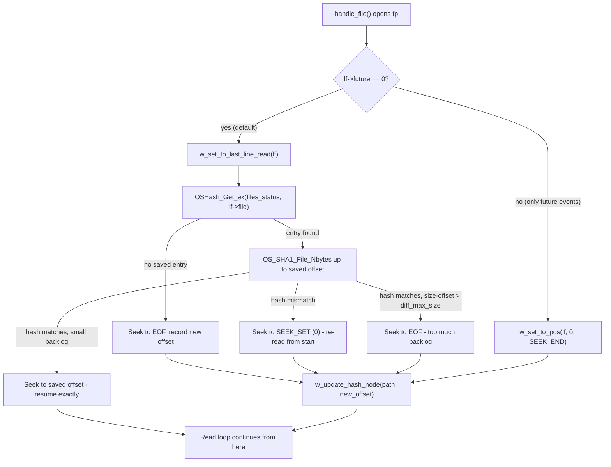
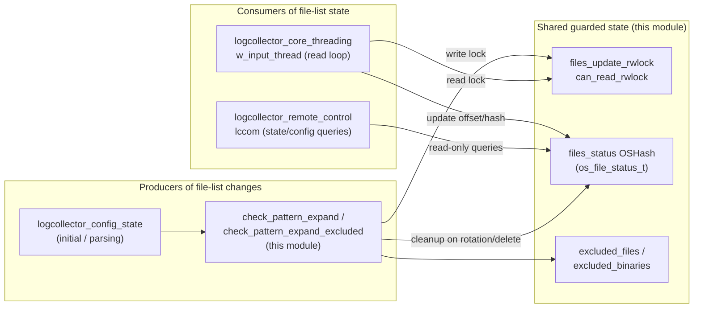

# Logcollector Core – File Discovery & Lifecycle Management

## Introduction

The **`logcollector_core_file_lifecycle`** module implements the logic that keeps the Wazuh
**Logcollector** daemon's view of "which files must be monitored right now" in sync with the state
of the filesystem. It lives inside `src/logcollector/logcollector.c` /
`src/logcollector/logcollector.h` and is a sibling of
[logcollector_core_daemon_lifecycle](logcollector_core_daemon_lifecycle.md) (process bootstrap) and
[logcollector_core_threading](logcollector_core_threading.md) (input/output thread orchestration)
inside the parent [logcollector_core](logcollector_core.md) module.

Concretely, this module is responsible for:

- **Wildcard/glob expansion** of `<location>` patterns configured with wildcards (`check_pattern_expand`),
  discovering new matching files as they appear on disk.
- **Exclusion handling** — removing files that match an `<exclude>` glob pattern from the monitored
  set (`check_pattern_expand_excluded`).
- **Binary vs. text detection** — automatically dropping files that are not ASCII/UTF-8 text from the
  monitored set when `filter_binary` is enabled (`check_text_only`).
- **Duplicate-entry elimination** — ensuring that the same physical file is not monitored twice, whether
  configured explicitly twice or discovered redundantly through glob expansion
  (`remove_duplicates`, `find_duplicate_inode`).
- **Concurrency primitives setup** — initializing the reader/writer locks that protect the shared file
  list and the "can read" gate consumed by every input thread (`files_lock_init`).
- **Persisted read-position tracking** — the `os_file_status_t` structure and the `file_status.json`
  load/save routines that allow Logcollector to resume reading exactly where it left off after a
  restart, rotation, or crash (`w_initialize_file_status`, `w_save_file_status`,
  `w_load_files_status`, `w_update_hash_node`, `w_set_to_last_line_read`).

This module does **not** implement daemon startup (see
[logcollector_core_daemon_lifecycle](logcollector_core_daemon_lifecycle.md)) nor the pool of reader/writer
threads that consume this file list (see [logcollector_core_threading](logcollector_core_threading.md)).
Instead, it is the **stateful bookkeeping layer** that both of those modules depend on: the daemon
lifecycle module calls into it once at startup (`files_lock_init`, `check_pattern_expand`), and the
threading module's input threads continuously rely on the `files_update_rwlock` and `file_status`
hash table it manages while reading files concurrently.

## Purpose and Core Functionality

### Core components covered by this document

| Component | Type | File | Responsibility |
|---|---|---|---|
| `check_pattern_expand` | function | `logcollector.c` | Expands `<location>` glob patterns, discovering new files that match and were not previously known; registers them into `globs[j].gfiles[]`. |
| `check_pattern_expand_excluded` | function | `logcollector.c` | Expands `<exclude>` glob patterns and removes any currently-monitored file whose path matches, moving it into the `excluded_files` hash. |
| `check_text_only` | function | `logcollector.c` | Iterates all monitored files with `filter_binary` set and removes (and remembers in `excluded_binaries`) any file that is not ASCII/UTF-8 text. |
| `remove_duplicates` | function | `logcollector.c` | Scans the full file list for two `logreader`/`logreader_glob` entries pointing at the same path and removes the duplicate. |
| `files_lock_init` | function | `logcollector.c` | Initializes the two `rwlock_t` objects — `files_update_rwlock` (file-list mutation) and `can_read_rwlock` (reader gate) — used throughout the file lifecycle and threading subsystems. |
| `file_status` / `os_file_status_t` | struct | `logcollector.h` | Persisted per-file record: last-read byte offset (`int64_t offset`), a live `EVP_MD_CTX *context` (streaming SHA1 state), and a snapshot `os_sha1 hash` used to validate content on resume. |

### Closely related (same-file) helper functions

These are declared/implemented alongside the core components above and are described here because
they form one cohesive subsystem (file-status persistence); they belong to the same logical unit even
though they were not separately called out as "core" components:

- `w_initialize_file_status` — creates the `files_status` `OSHash`, sets its size, registers the
  free-data callback, and loads `file_status.json` from disk if present.
- `w_save_file_status` / `w_save_files_status_to_cJSON` — serializes the current `files_status` hash
  (plus macOS/journald specific extensions) into `file_status.json`; registered via `atexit()` in
  [logcollector_core_daemon_lifecycle](logcollector_core_daemon_lifecycle.md).
- `w_load_files_status` — parses the previously saved JSON, recomputing a fresh SHA1 up to the saved
  offset to validate that the file has not changed unexpectedly since last shutdown.
- `w_set_to_last_line_read` / `w_set_to_pos` — decide, for a freshly opened file, whether to resume at
  the last saved offset, rewind to the beginning (content changed), or jump to the end (large diff).
- `w_update_hash_node` / `w_update_file_status` — update (or insert) the `files_status` entry for a
  given path after a read operation advances the offset.
- `w_get_hash_context` — lazily builds or clones the `EVP_MD_CTX` SHA1 context needed by the input
  threads (see [logcollector_core_threading](logcollector_core_threading.md)) when computing checksums
  incrementally as new lines are read.
- `find_duplicate_inode` — inode/device-based duplicate detection used by `handle_file()` to catch
  hard-linked or symlinked duplicates that `remove_duplicates` (path-string based) cannot detect.

## Architecture Overview

### Component Diagram

### Dependency Diagram

## Data Model

**Key fields of `os_file_status_t`** (`logcollector.h`):

| Field | Type | Purpose |
|---|---|---|
| `offset` | `int64_t` | Byte offset of the last successfully processed position in the file. Persisted so reading can resume exactly there after a restart. |
| `context` | `EVP_MD_CTX *` | Live OpenSSL EVP digest context holding the incremental SHA1 state computed over the bytes read so far — reused by input threads to avoid re-hashing the whole file on every update. |
| `hash` | `os_sha1` | A snapshot SHA1 digest (as of `offset`) written to `file_status.json`; used at startup to verify the file's leading content hasn't changed before trusting the saved `offset`. |

## Process Flows

### 1. Startup: Locks, Discovery, and Status Load

### 2. Periodic Re-check Loop (inside `LogCollectorStart`)

### 3. Resuming a File on (Re)open

## Component Interaction Diagram

## Key Behavioral Notes

- **Two exclusion hashes, two purposes.** `excluded_files` remembers *any* file that has been
  intentionally removed from monitoring (either via `<exclude>` glob match or the periodic
  "free excluded files" cache-refresh cycle in `LogCollectorStart`), while `excluded_binaries` is a
  finer-grained sub-set specifically tracking files removed because `check_text_only` classified them
  as non-text. This distinction lets `check_pattern_expand` differentiate between "never re-add" and
  "re-add if it was only excluded for being binary but a new glob-matched file with a different content
  profile appears," used when handling `file_excluded_binary` in `check_pattern_expand`.
- **Path-based vs inode-based duplicate detection.** `remove_duplicates` compares `current->file`
  strings across all `logreader`/`logreader_glob` entries — it catches configuration mistakes (the same
  path listed twice) and duplicate glob matches. `find_duplicate_inode`, by contrast, is invoked from
  `handle_file()` after a file is actually opened and compares `(fd, dev)` pairs — catching cases where
  two different configured paths (e.g., a symlink and its target, or two hard links) resolve to the
  same physical file, which the string-based check cannot detect.
- **Windows vs POSIX implementations.** Both `check_pattern_expand` and `check_pattern_expand_excluded`
  have separate implementations guarded by `#ifdef WIN32`: the POSIX version uses `glob(3)`, while the
  Windows version uses `expand_win32_wildcards()` and a hand-rolled directory-scan + regex match against
  `exclude_path`'s trailing wildcard component, since native Windows APIs lack POSIX glob semantics.
- **`files_lock_init` is intentionally minimal.** It exists as a tiny, dedicated function (rather than
  being inlined at the `LogCollectorStart` call site) specifically so that unit tests
  (`test_logcollector.c`) can invoke it in isolation to set up the locking subsystem without pulling in
  the rest of the daemon's startup sequence.
- **`file_status.json` schema extensibility.** `w_save_files_status_to_cJSON` / `w_load_files_status`
  compose the base `files` array (one entry per `os_file_status_t`) with optional top-level keys
  (`OS_LOGCOLLECTOR_JSON_MACOS`, `JOURNALD_LOG`) populated by
  [logcollector_macos](logcollector_macos.md) and [logcollector_journald](logcollector_journald.md)
  respectively, allowing those platform-specific sub-modules to persist their own resume state
  (e.g., last timestamp read) inside the very same file without this module needing any knowledge of
  their internal formats.

## Related Modules

- [logcollector_core.md](logcollector_core.md) — parent module overview and where this sub-module fits
  among its siblings.
- [logcollector_core_daemon_lifecycle.md](logcollector_core_daemon_lifecycle.md) — calls
  `files_lock_init()`, `check_pattern_expand()`, `check_pattern_expand_excluded()`, and
  `w_initialize_file_status()` once during `LogCollectorStart()` setup, before the input/output thread
  pools are created.
- [logcollector_core_threading.md](logcollector_core_threading.md) — the input threads that acquire
  `files_update_rwlock` in read mode and consult `can_read()` (backed by `can_read_rwlock`) before
  reading; also the primary caller of `w_update_file_status()`/`w_get_hash_context()` after each read.
- [logcollector_config_state.md](logcollector_config_state.md) — supplies the initial `logreader`
  entries (parsed from `<localfile>`/`<location>` XML) that this module expands, deduplicates, and
  tracks; also owns `w_logcollector_state_delete_file()`, invoked here whenever a file is forgotten.
- [logcollector_remote_control.md](logcollector_remote_control.md) — the `lccom` socket handler exposes
  read-only introspection into the same `files_status` state for `wazuh-control`/API consumers.
- [logcollector_macos.md](logcollector_macos.md) and [logcollector_journald.md](logcollector_journald.md)
  — platform-specific readers that extend the `file_status.json` schema via
  `w_macos_set_status_from_JSON` / `w_journald_set_status_from_JSON` hooks called from
  `w_load_files_status`.
- [Localfile_Config_core.md](Localfile_Config_core.md) — defines the `logreader`, `logreader_glob`, and
  `logreader_config` structures manipulated throughout this module (`gfiles[]`, `gpath`,
  `exclude_path`, etc.).
- [headers.md](headers.md) — declares the underlying `OSHash` (`hash_op.h`) and `rwlock_t`
  (`rwlock_op.h`) primitives this module builds upon.

## Summary

The `logcollector_core_file_lifecycle` module is the stateful glue between static configuration
(`<localfile>` entries) and the dynamic, ever-changing set of files that actually need to be read on a
running system. By combining glob expansion, exclusion filtering, binary detection, duplicate removal,
and a crash-safe persisted offset/hash cache, it allows Logcollector to safely and efficiently discover
new log sources at runtime while guaranteeing — via `file_status.json` — that no log data is
duplicated or silently skipped across restarts, rotations, or reconfigurations.
