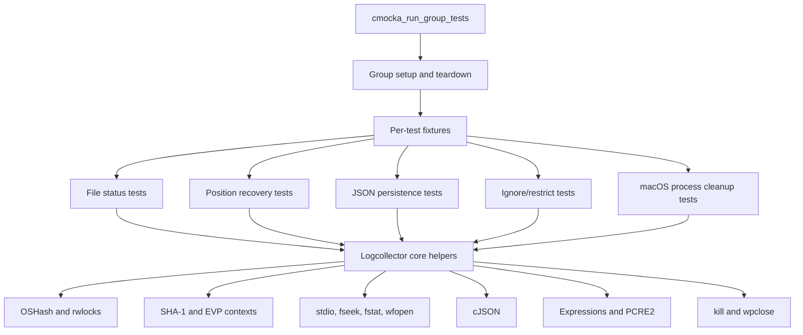
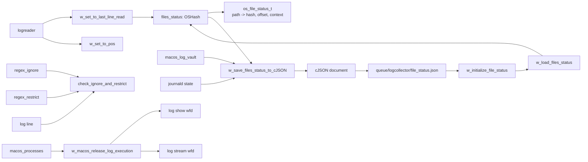
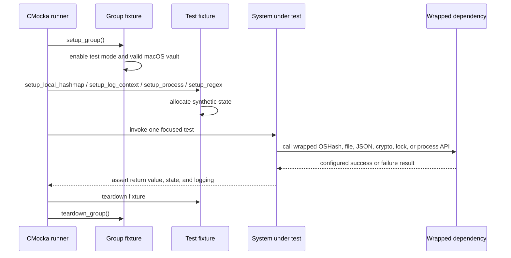
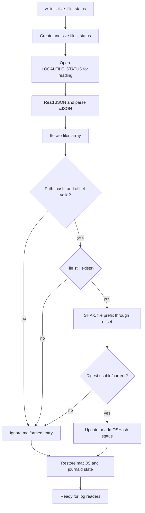
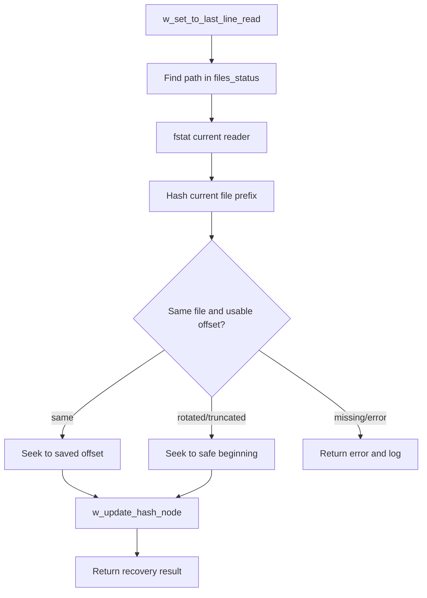
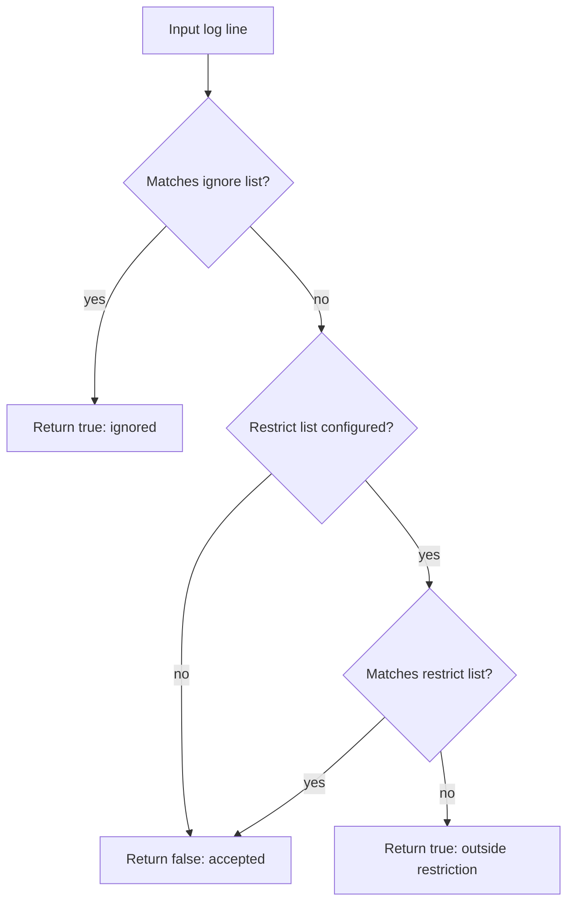
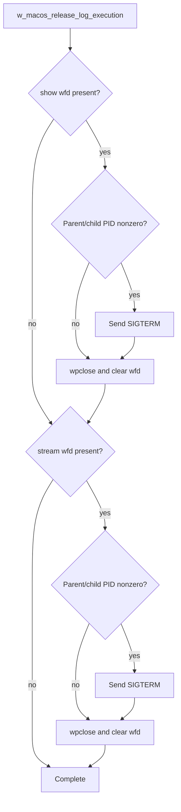

# Logcollector core tests

The `logcollector_core_tests` module is a CMocka unit-test suite for the stateful core helpers of Wazuh Logcollector. It validates file-position recovery, SHA-1 based file identity tracking, persistence of reader state, ignore/restrict filtering, and cleanup of macOS log processes. The suite isolates the production implementation with wrappers, so failures can be injected at filesystem, hash-table, JSON, crypto, locking, and process boundaries without requiring a running Logcollector daemon.

The production responsibilities are described in [Logcollector Core](logcollector_core.md). Configuration and platform-specific behavior are covered by [Logcollector Config & State](logcollector_config_state.md), [Logcollector Journald](logcollector_journald.md), and the adjacent [logcollector localfile configuration tests](logcollector_localfile_config_tests.md).

## Scope and role

The test source is `src/unit_tests/logcollector/test_logcollector.c`. It exercises internal functions declared by `logcollector.h` and uses CMocka setup/teardown callbacks to construct the minimum state required by each test group.

| Area | Functions under test | Main responsibility |
| --- | --- | --- |
| File identity and offsets | `w_get_hash_context`, `w_update_hash_node`, `w_update_file_status` | Associate a monitored path with a SHA-1 digest and byte offset. |
| Reader positioning | `w_set_to_pos`, `w_set_to_last_line_read` | Seek to a saved position and recover safely after truncation, rotation, or replacement. |
| State persistence | `w_initialize_file_status`, `w_load_files_status`, `w_save_files_status_to_cJSON`, `w_save_file_status` | Load and save `queue/logcollector/file_status.json`. |
| Filtering | `check_ignore_and_restrict` | Decide whether a log line is discarded by ignore or restrict expressions. |
| macOS lifecycle | `w_macos_release_log_show`, `w_macos_release_log_stream`, `w_macos_release_log_execution` | Terminate and close `log show`/`log stream` processes and optional children. |

This is a leaf test module. It verifies the Logcollector core contract but does not test daemon startup, real file descriptors, live processes, or end-to-end event delivery. Those concerns belong to the production and neighboring test modules linked above.

## Architecture

The suite’s central production state is the global `files_status` hash table. Each path maps to an `os_file_status_t` record containing at least a digest, offset, and hash context. macOS state is held separately in `macos_log_vault` and `macos_processes`; expression lists are held by a `logreader`.

## Component relationships

The persistence path is intentionally round-trip oriented: initialization creates the hash table, reads the JSON file, validates each record against the current file, and restores only usable state. Saving performs the inverse operation and includes platform state when it is valid.

## Test lifecycle and isolation

Fixtures are deliberately narrow:

- `setup_group` enables `test_mode` and initializes the default macOS vault state for the test group.
- `setup_local_hashmap` installs a mock `OSHash` and registers `free_os_file_status_t_struct`, which releases the EVP context owned by each status record.
- `setup_log_context` adds a synthetic `logreader`, status record, hash node, and EVP context; its dummy `FILE *` is used only with wrapped stdio calls.
- `setup_process` allocates `show` and `stream` `wfd_t` objects. Tests then vary PIDs and child PIDs without launching processes.
- `setup_regex` creates ignore and restrict `OSList` instances whose entries are released through `w_free_expression`.

Teardown verifies resource ownership as well as behavior. The suite expects file handles to be closed, process descriptors to be released, hash entries to use their configured free callback, expression lists to take their lock paths, and allocated EVP contexts to be freed.

## Data and process flows

### File-status persistence

`w_save_files_status_to_cJSON` emits file records with `path`, `hash`, and `offset`. It may also attach macOS vault data such as `timestamp` and settings, and journald timestamp state. `w_save_file_status` prints the compact JSON and writes it to `queue/logcollector/file_status.json`; open and write failures are explicitly tested.

### Reader position recovery

The tests cover null readers, missing hash entries, `fstat` failures, SHA-1 failures, different files, same files, rotation/truncation, seek failures, and hash-table update failures. `w_set_to_pos` separately verifies that a successful seek returns the resulting position and that seek errors close the reader path correctly.

### Ignore and restrict decision

The suite confirms that null configuration is accepted, an ignore match is rejected, an ignore miss is retained, a restrict match is retained, and a restrict miss is rejected. PCRE2 match results and debug messages are injected through wrappers.

### macOS process cleanup

The individual `show` and `stream` tests cover absent descriptors, active parent processes, optional children, and descriptors with no running PID. The combined function must safely release either process independently or both together.

## Dependency and mocking model

| Wrapper family | Injected boundary | Why it matters |
| --- | --- | --- |
| OSHash and pthread wrappers | Hash creation, lookup, iteration, add/update, sizing, and read/write locks | Exercises state transitions and concurrency-sensitive ownership without a real shared table. |
| SHA-1 and EVP wrappers | Hashing file prefixes/streams and context creation | Tests identity checks and crypto failure handling deterministically. |
| stdio and file wrappers | Open, read, write, seek, tell, `stat`, `fstat`, close, and error clearing | Prevents test dependence on the host filesystem while covering I/O errors. |
| cJSON wrappers | Object/array construction, field lookup, printing, and deletion | Validates malformed and partial persistence records. |
| Expression/PCRE2 wrappers | Compilation, matching, and match offsets | Makes filter decisions reproducible and verifies diagnostic paths. |
| Process and logging wrappers | `kill`, `wpclose`, pthread calls, and debug/error output | Confirms cleanup ordering and observable failure handling without launching processes. |

The wrapper expectations also document important invariants: locks surround shared hash/list access, every successful JSON document is deleted after printing, file descriptors are closed on error paths, and status records own their EVP contexts.

## Coverage map

The `main` function registers tests in functional groups rather than as a single integration scenario. The groups cover both normal and failure paths:

1. Hash-context creation and file-status updates.
2. Seeking and restoring the last line read, including rotation and truncation.
3. Serialization, file writing, initialization, and deserialization of persisted state.
4. macOS vault and journald state variants, including absent or invalid fields.
5. macOS `log show` and `log stream` process release behavior.
6. Ignore/restrict expression semantics.

Most groups use a matching fixture and teardown callback through `cmocka_unit_test_setup_teardown`. Group setup and teardown are passed to `cmocka_run_group_tests`, ensuring the global test mode is reset after the suite.

## Maintenance guidance

Changes to the production contract should update this suite when they affect any of the following:

- The `files_status` key, `os_file_status_t` ownership, hash algorithm, or offset semantics.
- The persisted JSON field names or the `queue/logcollector/file_status.json` location.
- Locking around hash-table or expression-list access.
- Handling of file rotation, truncation, replacement, or missing files.
- macOS process parent/child ownership and termination order.
- The precedence of ignore and restrict expressions.

When adding a test, prefer a new focused wrapper expectation and the smallest applicable fixture. Keep production architecture details in [Logcollector Core](logcollector_core.md), journald behavior in [Logcollector Journald](logcollector_journald.md), and shared test-harness conventions in [test infrastructure](test_infrastructure.md) rather than duplicating them here.

